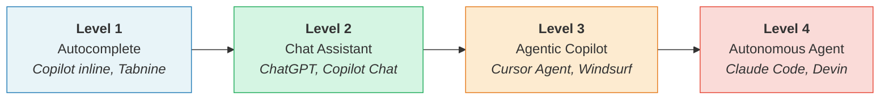
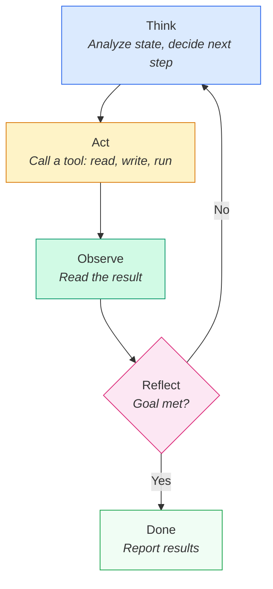

# Chapter 1: What AI Coding Agents Are and How They Differ from Assistants

## Introduction

Most developers have used ChatGPT or GitHub Copilot to generate code snippets, explain errors, or scaffold boilerplate. These tools are useful — but they stop at *suggestion*. You copy the output, paste it into your editor, run it, hit an error, go back to the chat, paste the error, and repeat.

A new category of tools — Claude Code, Cursor Agent, Devin, Windsurf — goes further. They don't just suggest code. They **plan**, **execute**, **observe results**, and **iterate** — all inside your development environment, using real tools like your terminal, file system, and browser.

This chapter explains what makes an agent different from an assistant, and how the agent loop works.

## The Spectrum of AI Coding Tools

AI coding tools exist on a spectrum of autonomy. Not every tool is an "agent" — the label depends on how much the tool can do on its own.

| Level | Type | What It Does | Examples |
|-------|------|-------------|----------|
| 1 | **Autocomplete** | Predicts the next few tokens as you type | GitHub Copilot (inline), Tabnine |
| 2 | **Chat Assistant** | Answers questions, generates snippets on request | ChatGPT, Copilot Chat, Claude.ai |
| 3 | **Agentic Copilot** | Reads your project, edits files, runs commands — with your approval | Cursor Agent, Windsurf, Copilot Agent Mode |
| 4 | **Autonomous Agent** | Takes a goal, works independently, reports back with a PR | Claude Code, Devin, OpenAI Codex |

The key shift happens between Level 2 and Level 3 — that's where the tool gains the ability to **take actions** in your environment, not just talk about code.

## Chat Assistants vs Agents — The Core Difference

### How a Chat Assistant Works

With a chat assistant, **you are the loop**. You describe a problem, receive a suggestion, manually apply it, test it, and come back with the results. Every cycle requires your hands on the keyboard.

A typical workflow looks like this:
1. You paste code into the chat and describe a bug
2. The assistant suggests a fix
3. You copy the fix into your editor
4. You run the code and hit a new error
5. You paste the new error back into the chat
6. Repeat until solved

The assistant has no memory of your file system, no access to your terminal, and no way to verify its own suggestions.

### How an Agent Works

With an agent, **the agent is the loop**. You describe a goal ("fix the failing test in `auth.test.ts`"), and the agent takes over: it reads the test file, reads the source code, identifies the bug, edits the file, runs the test, sees the result, and iterates until the test passes — or asks you for help if it gets stuck.

The agent has **tool access**: it can read and write files, execute shell commands, search codebases, and inspect results — all programmatically.

### Comparison

| Dimension | Chat Assistant | Agent |
|-----------|---------------|-------|
| **Tool access** | None — text in, text out | Files, terminal, browser, APIs |
| **Who runs the code** | You | The agent |
| **Iteration** | Manual (copy/paste loop) | Automatic (observe/retry loop) |
| **Context** | Only what you paste | Reads your full project |
| **Autonomy** | Suggests — you decide and act | Acts — you review and approve |
| **Error handling** | Shows you an error message | Reads the error and tries a fix |

```mermaid
graph TD
    subgraph assistant["Chat Assistant — You Are the Loop"]
        A1[You describe the problem] --> A2[Assistant suggests a fix]
        A2 --> A3[You copy & apply the fix]
        A3 --> A4[You run the code]
        A4 --> A5{Works?}
        A5 -- No --> A6[You paste the error back]
        A6 --> A2
        A5 -- Yes --> A7[Done]
    end

    subgraph agent["Agent — The Agent Is the Loop"]
        B1[You describe the goal] --> B2[Agent reads your codebase]
        B2 --> B3[Agent plans a fix]
        B3 --> B4[Agent edits files]
        B4 --> B5[Agent runs the code]
        B5 --> B6{Works?}
        B6 -- No --> B7[Agent reads the error]
        B7 --> B3
        B6 -- Yes --> B8[Agent reports back]
    end

    style assistant fill:#f0f4ff,stroke:#3366cc
    style agent fill:#f0fff4,stroke:#33cc66
```

## The Agent Loop — Think, Act, Observe, Iterate

At their core, coding agents follow the **ReAct pattern** (Reasoning + Acting). Instead of generating one response, the agent runs a loop:

1. **Think** — Analyze the current state and decide what to do next
2. **Act** — Call a tool (read a file, run a command, edit code)
3. **Observe** — Read the result of that action
4. **Reflect** — Decide if the goal is met or if another iteration is needed

### Concrete Example: Fixing a Broken API Endpoint

Suppose you tell the agent: *"The `GET /api/users` endpoint returns a 500 error. Fix it."*

Here's what the agent loop looks like in practice:

| Step | Phase | What the Agent Does |
|------|-------|-------------------|
| 1 | **Think** | "I need to find the route handler for `/api/users` and understand the error." |
| 2 | **Act** | Searches the codebase for `"/api/users"` — finds `routes/users.ts` |
| 3 | **Observe** | Reads the file, sees a database query calling `db.users.findAll()` |
| 4 | **Think** | "Let me run the endpoint to see the actual error." |
| 5 | **Act** | Runs `curl localhost:3000/api/users` in the terminal |
| 6 | **Observe** | Gets `TypeError: db.users.findAll is not a function` |
| 7 | **Think** | "The ORM method name is wrong. Let me check the docs — it should be `db.users.findMany()`." |
| 8 | **Act** | Edits `routes/users.ts`, replacing `findAll()` with `findMany()` |
| 9 | **Act** | Runs `curl localhost:3000/api/users` again |
| 10 | **Observe** | Gets a `200 OK` with a JSON array of users |
| 11 | **Reflect** | "The endpoint works. Task complete." |

This is the fundamental difference: the agent **closes the feedback loop itself**. It doesn't wait for you to test its suggestion — it tests it, reads the result, and keeps going.

## Conductor Mode vs Orchestrator Mode

As agents mature, two interaction patterns are emerging:

### Conductor Mode (Interactive)

You work **side-by-side** with a single agent in real time — like pair programming. You give an instruction, the agent executes, you review, course-correct, and continue. This is synchronous and hands-on.

**When to use it:** Exploratory work, debugging, learning a new codebase, tasks where you want tight control.

**Examples:** Claude Code in the terminal, Cursor Agent in the IDE.

### Orchestrator Mode (Delegating)

You write a detailed spec or break work into tasks, then **dispatch multiple agents in parallel**. Each agent works independently — potentially on separate branches or worktrees. You review the results asynchronously, like a tech lead reviewing PRs.

**When to use it:** Well-defined tasks, parallel feature work, large refactors, CI/CD-triggered agents.

**Examples:** Claude Code with `--background` flag, GitHub Copilot Coding Agent (creates PRs from issues), Devin.

The trend is clear: as agent reliability improves, developers move from conducting to orchestrating.

## What This Means for Developers

The rise of coding agents shifts the developer's role. Instead of writing every line yourself, you increasingly act as a **specifier** and **reviewer**:

- **Write clear specs** — the agent's output quality depends directly on the clarity of your instructions
- **Invest in tests and linters** — these are the agent's eyes; without them, it's flying blind
- **Review critically** — agents produce plausible code that can be subtly wrong; you're the quality gate
- **Use sandboxing** — agents execute code in your environment; proper isolation is not optional

You're not being replaced. You're being promoted — from typist to architect.

## Resources

- [The Future of Agentic Coding: Conductors to Orchestrators](https://addyosmani.com/blog/future-agentic-coding/) — Addy Osmani on how the developer role evolves from hands-on conductor to strategic orchestrator
- [The Era of Autonomous Coding Agents: Beyond Autocomplete](https://www.sitepoint.com/autonomous-coding-agents-guide-2026/) — SitePoint's practical guide to agent architectures, sandboxing, and making projects agent-ready
- [Best AI Coding Agents for 2026](https://www.faros.ai/blog/best-ai-coding-agents-2026) — Faros AI's comparison of leading coding agents with real-world productivity metrics
- [Claude Code Overview](https://docs.anthropic.com/en/docs/claude-code/overview) — Official Anthropic documentation for Claude Code
- [About GitHub Copilot Coding Agent](https://docs.github.com/en/copilot/concepts/agents/coding-agent/about-coding-agent) — GitHub's documentation on Copilot's autonomous agent mode
- [Testing AI Coding Agents: Cursor vs. Claude, OpenAI, and Gemini](https://render.com/blog/ai-coding-agents-benchmark) — Render's benchmark comparing agents on real production codebases
