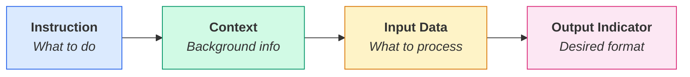
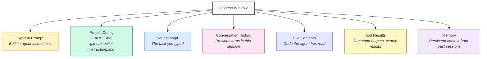

# Chapter 2: Prompt Design and Context Engineering

## The Same Task, Two Very Different Results

Two developers ask a coding agent to fix the same bug. Here's what happens:

**Developer A:**
> "Fix the bug in the login page."

The agent guesses which file to look at. It finds a form component, rewrites the validation logic, and breaks three other things in the process. Developer A spends an hour undoing the damage.

**Developer B:**
> "The login form in `src/components/LoginForm.tsx` submits successfully even when the email field is empty. Add client-side validation using the existing `validateInput` utility from `src/utils/validation.ts`. The form should show an inline error message below the email field — match the style of the password validation that's already there."

The agent reads both files, understands the pattern, adds the validation, and gets it right on the first try.

Same tool. Same model. Wildly different outcomes. The difference is how the developer communicated. This chapter teaches you that skill.

## What Is Prompt Engineering?

Prompt engineering is the practice of crafting instructions that reliably produce the output you want from an AI model.

For chatbots, this means writing a clear question and getting a clear answer. For coding agents, the stakes are higher. Your prompt doesn't just generate text — it triggers a chain of actions. The agent will read files, write code, run commands, and make decisions based on what you told it. A vague prompt doesn't just produce a bad answer — it produces bad *actions*.

This matters because agents and chatbots operate differently:

| Dimension | Chatbot Prompting | Agent Prompting |
|-----------|------------------|-----------------|
| **Output** | Text response | Actions + code changes |
| **Scope** | Single question/answer | Multi-step task execution |
| **Context** | Only what you paste in | Your entire project (files, terminal, history) |
| **Failure mode** | Bad answer you can ignore | Bad code changes you have to undo |
| **Correction** | Ask again | Reset, re-prompt, or debug the mess |
| **Tool use** | None | File I/O, shell commands, search, browser |

When you prompt an agent, think of it less like asking a question and more like briefing a colleague. You wouldn't tell a new team member "fix the bug" and walk away. You'd point them to the right file, explain the expected behavior, and mention any constraints.

## Anatomy of a Good Prompt

Before diving into techniques, it helps to understand the building blocks of a well-structured prompt. Every effective prompt has up to four parts:



| Component | What It Does | Example |
|-----------|-------------|---------|
| **Instruction** | The task or action you want performed | "Refactor this function to use async/await" |
| **Context** | Background information the model needs | "This is a Node.js 20 project using Express and Knex" |
| **Input data** | The specific data or code to work with | "Here's the current callback-based function: ..." |
| **Output indicator** | The format or shape of the desired result | "Return only the refactored function, no explanation" |

Not every prompt needs all four parts. A simple request might only need an instruction and some context. But when results are off, check which component is missing — that's usually where the problem is.

Here's how these four parts come together in practice:

```text
[Context]       "We're using a React 18 app with TypeScript and Zustand
                 for state management."
[Instruction]   "Create a new store slice for managing notifications."
[Input data]    "Here's our existing auth store as a reference:
                 src/stores/authStore.ts"
[Output]        "Follow the same file structure and naming conventions.
                 Include types in a separate notifications.types.ts file."
```

## Prompt Techniques That Work

Here are eight techniques that consistently produce better results with coding agents. Each one includes a bad prompt and a good prompt so you can see the difference.

### 1. Be Specific, Not Vague

Vague prompts force the agent to guess. Specific prompts give it a target.

```text
Bad:  "Make the form better."

Good: "Add email format validation to the signup form in
       src/components/SignupForm.tsx using the existing
       validateInput utility. Show an error message below
       the field when the format is invalid."
```

Name files, functions, and components. Say exactly what "better" means.

### 2. Provide Context Upfront

Tell the agent what it's working with before telling it what to do. Tech stack, constraints, and relevant patterns all belong at the top of your prompt.

```text
Bad:  "Add caching to the API."

Good: "This is an Express.js REST API using PostgreSQL. The
       GET /api/products endpoint is slow (~2s). Add in-memory
       caching with a 5-minute TTL using the node-cache package
       that's already in package.json. Follow the pattern used
       in routes/categories.ts."
```

Front-loading context prevents the agent from making wrong assumptions.

### 3. Use Constraints

Tell the agent what *not* to do. Constraints narrow the solution space and prevent unwanted side effects.

```text
Bad:  "Refactor the user service."

Good: "Refactor UserService to use async/await instead of
       callbacks. Don't change the public API — existing callers
       should work without modification. Don't modify the
       database schema or migration files."
```

Constraints are especially important for refactoring, where the agent might "improve" things you didn't ask it to touch.

### 4. Decompose Complex Tasks

Large tasks overwhelm agents just like they overwhelm developers. Break them into steps. If you're not sure how to break a task down, ask the agent to do it for you.

```text
Bad:  "Build user authentication for the app."

Good: "Let's add user authentication. Start with step 1:
       create a users table migration with email, password_hash,
       and created_at columns using our existing Knex setup.
       Don't implement login or registration yet — just the
       schema."
```

One clear step at a time produces better results than one massive request. After each step, review the output before moving to the next.

### 5. Show Examples (Few-Shot)

When you want output in a specific format or style, show the agent what you mean. An example is worth a hundred words of description.

```text
Bad:  "Write tests for the order service."

Good: "Write tests for OrderService.calculateTotal(). Follow
       the same pattern used in tests/cart.test.ts — use
       describe/it blocks, create fixtures with the
       buildTestOrder helper, and assert with expect().toBe().
       Here's an example of what a test looks like:

       it('applies discount when total exceeds 100', () => {
         const order = buildTestOrder({ items: [{ price: 120 }] });
         expect(OrderService.calculateTotal(order)).toBe(108);
       });"
```

This is the *few-shot* technique — giving the model examples of the desired output. It works because the model mimics the pattern you provide.

### 6. Ask for Reasoning (Chain-of-Thought)

When a task requires judgment or has multiple possible approaches, ask the agent to think before it acts.

```text
Bad:  "Fix the performance issue."

Good: "The /api/dashboard endpoint takes 8 seconds to respond.
       Before making changes, analyze the route handler in
       routes/dashboard.ts and explain what's causing the
       slowdown. List your top 3 hypotheses, then propose a
       fix for the most likely cause."
```

This is the *chain-of-thought* technique. By asking the agent to explain its reasoning, you get better analysis and catch wrong assumptions before they become wrong code.

### 7. Assign a Role

Giving the agent a persona focuses its expertise and changes the lens through which it evaluates your code.

```text
Bad:  "Review this code."

Good: "As a senior backend engineer focused on security,
       review the authentication middleware in
       src/middleware/auth.ts. Look for common vulnerabilities:
       token validation issues, missing rate limiting,
       information leakage in error responses."
```

The role technique works because it primes the model to draw on specific knowledge and apply specific standards. "Review this code" could go anywhere. "Review this as a security engineer" has a clear focus.

### 8. Specify the Output Format

Don't leave the output format to chance. If you want JSON, a table, a code block, or a specific file structure — say so.

```text
Bad:  "Document the API endpoints."

Good: "Document the API endpoints in src/routes/ as a Markdown
       table with columns: Method, Path, Description, Auth
       Required. Group them by resource (users, orders, products)."
```

This is especially useful when you need the agent's output to fit into an existing system — a README, a config file, a test fixture, or a CI pipeline.

---

> **Know when to stop.** If the agent starts inventing file paths that don't exist, referencing APIs you don't use, or generating code that looks confident but makes no sense — stop. Don't try to fix hallucinations by adding more prompts on top. Start a new conversation with a clearer prompt and better context. Pushing through a hallucinating agent wastes more time than starting fresh.

> **Be in control.** Always understand the code an agent generates. If you can't explain what a function does, don't ship it. The agent is a tool — you are still the engineer responsible for the output. Read the diff, trace the logic, and run the tests before accepting changes.

> **Experiment.** There's no single "correct" prompt for any task. Try different phrasings, different levels of detail, different structures. Notice which prompts produce accurate results and which ones lead the agent astray. Over time, you'll develop an intuition for what works with your specific tools and codebase.

## Exercise: Rewrite a Bad Prompt

Here's a poorly structured prompt. Rewrite it using the techniques from the section above.

**The bad prompt:**

```text
"The app is broken on mobile. Fix it and make sure it looks good."
```

Think about: What's missing? What would the agent need to know? What constraints should you add?

<details>
<summary>Suggested rewrite</summary>

```text
"The checkout page (src/pages/Checkout.tsx) overflows horizontally
on screens narrower than 375px. The order summary table doesn't
wrap properly. Fix the responsive layout using the existing Tailwind
breakpoint utilities (sm:, md:) — don't add custom CSS media queries.
Test that it works at 375px and 320px widths. Don't change the
desktop layout."
```

Notice what changed: a specific file, a specific problem, a specific technology, clear constraints, and a way to verify the fix.

</details>

## From Prompts to Context

The techniques above will make you a better prompter. But here's the thing — with coding agents, your prompt is only the beginning.

When you use a chatbot, your prompt *is* the entire input. The model sees your message and nothing else. With an agent, the story is different. Your prompt kicks off a session that might run for dozens of turns. During that session, the agent reads files, runs commands, and accumulates results. Its behavior depends on *everything* in its context window — not just your opening instruction.

Consider what an agent sees during a typical task:

- Your prompt (the instruction you typed)
- System instructions (built-in rules that shape the agent's behavior)
- Project configuration files (CLAUDE.md, .github/copilot-instructions.md, AGENTS.md)
- File contents it has read
- Command outputs from your terminal
- Search results from your codebase
- Conversation history from earlier in the session
- Memory from previous sessions

Your prompt might be 50 words. The agent's total context could be 50,000 words. If any of that surrounding context is wrong, irrelevant, or contradictory, it affects the output — no matter how good your prompt was.

This is why prompt engineering alone isn't enough. You need **context engineering**.



## Prompt Techniques — From Basic to Advanced

The eight techniques above are things you do directly in your prompts. But prompt engineering as a field has developed a broader taxonomy of techniques. Some of these you'll use yourself. Others are built into the agents you work with. Understanding them helps you recognize what's happening under the hood — and know when to apply them deliberately.

### Basic Techniques

| Technique | What It Means | When You'd Use It |
|-----------|--------------|-------------------|
| **Zero-shot** | Give the model a task with no examples — rely on its built-in knowledge | Simple, well-defined tasks: "Convert this function from JavaScript to TypeScript" |
| **Few-shot** | Include examples of the input/output pattern you want | When you need a specific format, style, or convention followed consistently |

Zero-shot is what you do most of the time — you describe what you want and trust the model to figure it out. Few-shot is what you do when zero-shot produces inconsistent results. Adding even one example dramatically improves consistency.

```text
Zero-shot:  "Classify this error as either a build error, runtime
             error, or logic error: 'TypeError: Cannot read
             properties of undefined'"

Few-shot:   "Classify errors using these categories:

             'SyntaxError: Unexpected token' => build error
             'RangeError: Maximum call stack exceeded' => runtime error
             'Function returns wrong total for discounted items' => logic error

             Now classify: 'TypeError: Cannot read properties
             of undefined'"
```

### Advanced Techniques

These techniques are more sophisticated. You don't need to master them, but you should know what they are — especially because coding agents use them internally.

| Technique | How It Works | How Agents Use It |
|-----------|-------------|-------------------|
| **Chain-of-thought (CoT)** | Ask the model to reason step by step before answering | Agents think through problems before writing code — you can trigger this explicitly with "think step by step" or "explain your approach first" |
| **Self-consistency** | Generate multiple reasoning paths and pick the most common answer | Some agents internally sample multiple approaches and choose the best one |
| **Tree-of-thought (ToT)** | Explore multiple branching solution paths, evaluate each, and select the best | Used in complex problem-solving where the first approach isn't always optimal |
| **ReAct** | Alternate between reasoning and acting — think, use a tool, observe, repeat | This *is* the agent loop from Chapter 1. Every coding agent uses this pattern |
| **RAG** | Retrieve relevant documents before generating a response | When an agent searches your codebase or reads docs, it's doing RAG |

**Chain-of-thought** is the one you'll use most directly. When a task involves judgment — debugging a tricky issue, choosing between architectures, optimizing performance — asking the agent to reason before acting produces better results:

```text
"Before changing any code, analyze the three database queries in
getOrderSummary() and explain which one is causing the N+1 problem.
Show your reasoning, then propose a fix."
```

**ReAct and RAG** aren't things you "do" — they're things your agent does automatically. When the agent reads a file, runs a command, and adjusts its approach based on the output, that's ReAct. When it searches your codebase for relevant code before making changes, that's RAG. Your role is to set up the conditions for these mechanisms to work well: good project structure, clear file names, and well-organized code make the agent's retrieval and reasoning more effective.

## What Is Context Engineering?

Context engineering is the discipline of curating what information reaches the model — what to include, what to exclude, when to introduce it, and in what order.

Think of the context window as a stage. You're the director. Every piece of information on that stage competes for the model's attention. Too little context and the agent makes uninformed decisions. Too much context and the signal gets buried in noise. The wrong context sends the agent down the wrong path entirely.

Here's what counts as context and where it comes from:

| Context Type | Source | Persistence |
|-------------|--------|-------------|
| **System prompt** | Built into the agent tool | Every session |
| **Project configuration** | Files like CLAUDE.md, .github/copilot-instructions.md, AGENTS.md | Every session in that project |
| **Your prompt** | What you type | This task |
| **Conversation history** | Previous turns in the current session | This session |
| **File contents** | Code files the agent reads | This session (until context fills up) |
| **Tool outputs** | Terminal results, search results, API responses | This session |
| **Memory** | Auto-saved notes from past sessions | Across sessions |
| **Retrieved documents** | Docs fetched via search or RAG | This task |

Why does this matter? Three reasons:

1. **The window is finite.** Every model has a maximum context length. Once it fills up, older information gets dropped or compressed. You want the important stuff to survive.
2. **Every token costs.** More context means more latency and higher API costs. Loading your entire codebase into context when the agent only needs two files is wasteful.
3. **Irrelevant context degrades quality.** Studies consistently show that models perform worse when their context contains irrelevant information. More is not better — *relevant* is better.

Context engineering is what separates developers who get reliable results from agents and developers who keep saying "AI doesn't work for real code."

## Practical Context Management

Here are six strategies for managing context effectively. These apply regardless of which agent tool you use.

| Strategy | What It Means | Example |
|----------|--------------|---------|
| **Include what matters** | Only reference files and docs relevant to the task | Point the agent to `routes/auth.ts`, not "look at the whole project" |
| **Exclude noise** | Keep irrelevant information out of context | Use `.gitignore` patterns, don't paste entire log files |
| **Front-load key info** | Put the most important context at the beginning | State constraints and tech stack before describing the task |
| **Layer your context** | Combine persistent and session-specific context | CLAUDE.md for project rules + conversation for task details |
| **Compact when needed** | Summarize or reset when context gets bloated | Start a new conversation when the agent loses track |
| **Let the agent gather** | Don't overstuff — let agents explore on their own | Trust the agent to read files and search your codebase |

### Include What Matters

Before starting a task, ask yourself: *What does the agent need to see to do this well?* Point it to specific files, functions, or documentation. The more targeted you are, the better the output.

```text
"Look at src/services/PaymentService.ts and
src/types/payment.ts — I need to add support for
refunds following the same pattern as charges."
```

### Exclude Noise

Large codebases have a lot of files the agent doesn't need. Configure your tools to exclude irrelevant directories (build outputs, node_modules, test fixtures) from context. When pasting error logs, trim them to the relevant section.

### Front-Load Key Info

Models pay more attention to information that appears early in the context. Put your constraints, tech stack, and key decisions before the task description — not after.

### Layer Your Context

Good context management uses multiple layers:

- **Project files** (CLAUDE.md, .github/copilot-instructions.md) — persistent rules that apply to every task
- **Conversation** — task-specific instructions and iterative refinement
- **Memory** — lessons learned from past sessions
- **Retrieved files** — code and docs the agent pulls in during execution

Each layer serves a different purpose. Project files set the baseline. Conversation steers the task. Memory prevents repeated mistakes. Retrieved files provide the details.

### Compact When Needed

Long conversations accumulate context. After 20-30 turns, the agent may have thousands of lines of file contents, command outputs, and conversation history in its window. If the agent starts losing track or repeating mistakes, start a new conversation. Summarize what you've accomplished and what's left to do in your opening prompt.

### Let the Agent Gather

Resist the urge to paste everything the agent might need into your prompt. Agents have tools — they can read files, search codebases, and run commands. Let them gather what they need. Your job is to point them in the right direction, not to pre-load every piece of information.

```text
Instead of pasting 500 lines of code into your prompt:

"Read the PaymentService and its tests, then add
refund support following the existing charge pattern."
```

## Exercise: Map Your Context

Pick a real task you'd give to a coding agent — something you've worked on recently or plan to work on soon. Fill in this template:

**My task:** ______________________________________

| Question | Your Answer |
|----------|------------|
| What files does the agent need to read? | |
| What documentation or specs are relevant? | |
| What constraints should the agent know about? | |
| What context should be *excluded* (large files, irrelevant modules)? | |
| Where does this context live? (project files, conversation, memory, docs) | |
| Is there any persistent context that would help future tasks too? | |

This exercise builds the habit of thinking about context *before* you start prompting. After a few times, it becomes second nature.

## Memory and Skills — A Brief Overview

So far, everything we've discussed happens within a single conversation. But what about knowledge that should persist across sessions? That's where memory and skills come in.

### Memory

Memory lets agents carry information from one session to the next. Without it, every conversation starts from zero — the agent forgets your preferences, your project's conventions, and the decisions you made yesterday.

Different tools handle memory differently, but the approaches fall into a few categories:

| Memory Type | How It Works | Example |
|-------------|-------------|---------|
| **Project files** | Configuration files checked into your repo (CLAUDE.md, .github/copilot-instructions.md, AGENTS.md) | "Always use Prettier for formatting. Run tests with `npm test`." |
| **Auto-memory** | The agent saves notes automatically based on conversation patterns | "User prefers functional components over class components." |
| **Conversation history** | Searchable logs of past sessions | Agent recalls a decision made three sessions ago |
| **Manual notes** | You explicitly tell the agent to remember something | "Remember: the payment API sandbox key is in .env.local" |

Project files are the most reliable form of memory. They're version-controlled, team-shared, and always loaded. Auto-memory is convenient but can be noisy. The best approach is to use project files for stable conventions and auto-memory for personal preferences.

### Skills

Skills are reusable instruction sets that encode a specific workflow or expertise. Instead of re-typing the same detailed prompt every time you want to, say, create a React component or write a migration, you package those instructions into a skill the agent can invoke.

Think of skills as macros for prompting. A skill might say: "When creating a new API endpoint, always include input validation, error handling, a test file, and an OpenAPI spec update." Every time you invoke that skill, the agent follows the same process — consistently.

Skills are a deep topic. Chapter 5 covers how to create and manage them in detail. For now, the key insight is this: **memory and skills are forms of persistent context.** They extend your reach beyond the current conversation, making the agent smarter over time without requiring you to repeat yourself.

## Key Takeaways

- **Your prompt is a briefing, not a question.** Treat it like you're onboarding a capable colleague — give them the file, the context, and the constraints.
- **Be specific.** Name files, functions, technologies, and expected behavior. Vagueness breeds guesswork.
- **Prompt engineering is necessary but not sufficient.** Your prompt is one piece of a much larger context window.
- **Context engineering is the full discipline.** Curate what the model sees — include what matters, exclude what doesn't, and layer your context strategically.
- **Start fresh when context degrades.** Long conversations accumulate noise. A new session with a clear prompt beats pushing through a confused one.
- **Use persistent context.** Project files, memory, and skills make agents smarter across sessions — invest in them early.

## Resources

- [Effective Context Engineering for AI Agents](https://www.anthropic.com/engineering/effective-context-engineering-for-ai-agents) — Anthropic's guide to building reliable agent-driven systems through deliberate context management
- [Building Effective Agents](https://www.anthropic.com/research/building-effective-agents) — Anthropic's research on what makes agent architectures work in practice
- [Prompt Engineering Guide](https://www.promptingguide.ai/) — Comprehensive community resource covering prompting techniques from basic to advanced
- [Context Engineering for AI Agents](https://manus.im/blog/Context-Engineering-for-AI-Agents-Lessons-from-Building-Manus) — Manus team's lessons from building a production agent, focused on context management
- [Skills Explained](https://docs.anthropic.com/en/docs/claude-code/skills) — Anthropic's documentation on creating and using skills in Claude Code
- [Context Engineering Guide](https://docs.llamaindex.ai/en/stable/understanding/context_augmentation/) — LlamaIndex's guide to augmenting LLM context with external data
