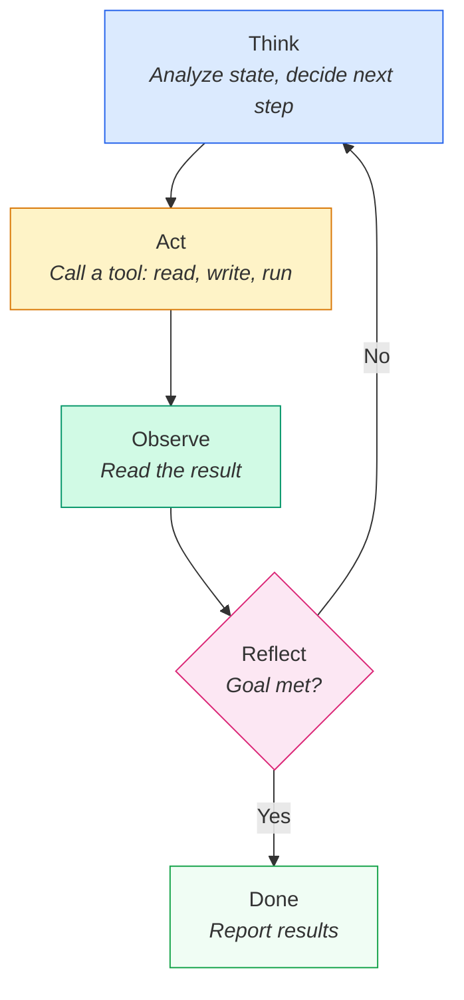
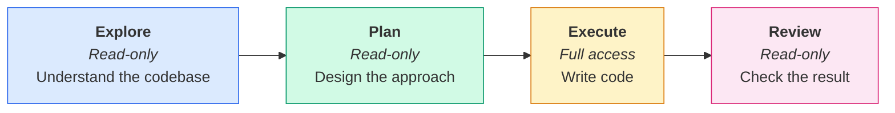
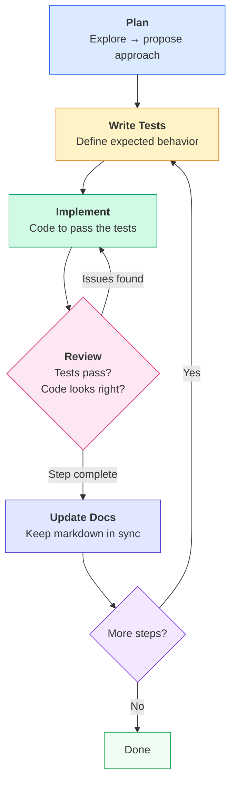

# Chapter 3: Coding with AI Agents

## The Same Task, Two Very Different Approaches

Two developers sit down to build the same feature — a user dashboard that shows recent activity, account stats, and quick actions. Both use a coding agent.

**Developer A:**
> "Build the user dashboard."

The agent guesses the layout, invents component names that don't match the project, picks a data-fetching pattern the team never uses, and produces 400 lines of code that look impressive but don't fit anywhere. Developer A spends the afternoon untangling it.

**Developer B:**
> "I need to add a user dashboard. Before writing code, explore `src/components/` and `src/services/` to understand the project's component patterns and data-fetching approach. Then create a plan for the dashboard — I'll review it before you implement anything."

The agent explores, presents a plan that uses the team's existing patterns, and Developer B approves it. They build it step by step — a test for the stats endpoint first, then the API call, then the component. Each piece reviewed before moving on. The feature ships clean.

Same tool. Same model. Developer B used the agent the way it was designed to work. This chapter teaches you how.

## Two Ways to Work with AI

AI-assisted development covers a lot of ground. To keep things focused, let's split it into two categories:

| Category | What It Covers | Where to Learn |
|----------|---------------|----------------|
| **Code writing** | Features, bug fixes, refactoring, migrations, tests | This chapter |
| **Non-coding tasks** | CI/CD pipelines, code review, documentation, ticket triage, deployments | Later chapter |

This chapter is about the first category — using agents to write and modify code. The workflows, agents, and patterns here apply whether you're building a new feature, fixing a bug, or refactoring a module.

## The Agent Loop — A Quick Refresher

Every coding agent runs the same loop, regardless of the tool you use. As we saw in [Chapter 1](../01_agents-vs-assistants/01_agents-vs-assistants.md), this is the **ReAct pattern** — reasoning and acting in a cycle:

1. **Think** — Analyze the current state and decide what to do next
2. **Act** — Call a tool (read a file, run a command, edit code)
3. **Observe** — Read the result of that action
4. **Reflect** — Decide if the goal is met or if another iteration is needed



Every workflow in this chapter plays out inside this loop. When you ask the agent to explore your codebase, it's running Think → Act (read files) → Observe → Reflect. When it runs your tests and iterates on failures, same loop. Understanding this makes every agent tool predictable.

## Built-in Agents

### What Built-in Agents Are

Modern coding tools don't ship a single, monolithic agent. They ship **specialized agents** — pre-configured modes with specific tool access and constraints. Some are read-only (safe for exploration). Others have full access to edit files and run commands.

This matters because different phases of work need different levels of access. You don't want the agent editing code while you're still exploring the codebase. You don't want a read-only agent when it's time to implement.

### The Same Pattern, Different Names

You'll find plenty of blog posts and marketing pages that frame Claude Code as "the agentic one" and Copilot as "the autocomplete one." That's outdated positioning, not reality. Copilot launched first — it started with inline completions, added chat, then agent mode. Claude Code entered the market later and shipped agentic from day one. Different starting points, same destination. Today, both tools are fully agentic and **ship nearly identical architectures.** The names differ, but the capabilities map one-to-one.

| Capability | Claude Code | GitHub Copilot CLI |
|-----------|------------|-------------------|
| Explore codebase (read-only) | Explore agent | Explore agent |
| Plan implementation (read-only) | Plan agent | Plan agent |
| Execute coding tasks (full access) | General-purpose agent | Task agent |
| Review changes | Via prompting / code-review agent | Code-Review agent |

Both tools arrived at the same design independently. That's not coincidence — it's convergence. Separating **read-only exploration** from **write-capable execution** is a fundamental pattern that works. Learn the pattern once, and you can use any tool that follows it.

The convergence goes deeper than agents. Skills, memory, project instructions — both tools support nearly identical concepts with different file names. We'll cover each one in this chapter.

### Choosing the Right Agent for the Phase

Don't jump straight to coding. Match the agent to the phase of work:



**Explore** first — let the agent read the codebase and understand patterns. **Plan** next — have it propose an approach you can review. **Execute** — implement the approved plan. **Review** — check the result before committing.

You won't always need all four phases. A one-line bug fix can go straight to Execute. A well-understood refactoring might skip Explore. But for anything non-trivial — a new feature, a complex bug, a migration — the Explore → Plan → Execute → Review flow prevents the most common mistake: an agent that writes confident-looking code based on wrong assumptions.

Here's a quick guide:

| Task Type | Start At | Why |
|-----------|----------|-----|
| One-line fix, typo, rename | Execute | You already know exactly what to change |
| Bug in familiar code | Plan → Execute | You know the area but need the agent to reason about the fix |
| New feature or module | Explore → Plan → Execute → Review | The agent needs to understand existing patterns before proposing anything |
| Working in unfamiliar code | Explore → Plan → Execute → Review | Both you and the agent need to understand the codebase first |

## How to Code with Agents — Recommended Workflows

The most common mistake developers make with agents is jumping straight to implementation. "Build the user dashboard" feels productive. It isn't.

Agents introduce a paradigm shift that goes by different names — **intent-driven development**, **spec-driven development** — but the core idea is the same: your job as a developer moves from *writing code* to *defining intent*. A strong plan, a clear specification, a precise description of what you want and why — these become the primary artifacts. The agent writes the code. You write the thinking that drives it.

This is not trivial. Most developers spend 80% of their time coding and 20% thinking. With agents, that ratio inverts. You spend most of your time in "thinking mode" — crafting specs, designing architecture, defining acceptance criteria — and the agent spends its time in "coding mode."

If that sounds easy, consider this: look at the documentation in your current project. The architecture docs, the API specs, the README. Are they clear? Up to date? Could a new team member read them and build the right thing? Most documentation is hard to read, hard to follow, and perpetually out of sync with the code. Now imagine a world where those documents *drive* the code — where the quality of your spec directly determines the quality of the output. That's the world agents create. Writing a good spec is a skill that takes practice, just like writing good code did.

We'll expand on spec-driven development in a later chapter. For now, let's start with the workflows that put this principle into practice.

### Plan First, Then Build

The simplest form of intent-driven development: describe what you want, let the agent propose how to build it, refine the plan together, then execute.

```text
Bad:  "Build the user authentication system."

Good: "I need to add user authentication with email/password login.
       Before writing any code, explore the project structure and
       create a step-by-step implementation plan. I'll review it
       before we start coding."
```

Both Claude Code and Copilot have dedicated **Plan mode** — a read-only agent that proposes an approach without changing anything. Use it.

Here's what the plan-first flow looks like in practice:

```text
You:    "I need to add a password reset flow. Enter plan mode
         and propose an approach."

Agent:  [Explores codebase, reads existing auth code]
        "Here's my plan:
         1. Add a password_reset_tokens table
         2. Create POST /auth/reset-request endpoint
         3. Create POST /auth/reset-confirm endpoint
         4. Add email sending using the existing mailer service
         5. Write tests for both endpoints

         The existing auth module uses bcrypt for hashing and
         Zod for validation — I'll follow the same patterns."

You:    "Good, but skip the email sending — we'll handle that
         separately. Go ahead with steps 1-3 and 5."

Agent:  [Implements the approved plan step by step]
```

You spent two minutes reviewing a plan. You avoided the agent building an email system you didn't want. This is the single most effective habit for working with agents.

### Test-Driven Development with Agents

TDD is naturally suited to agents — and it's the highest-leverage workflow pattern available.

Here's why: in the agent loop, the **Observe** step needs something to observe. Without tests, the agent can only observe whether the code *compiles*. With tests, the agent observes whether the code *works correctly*.

```text
"Write a failing test for the calculateDiscount function: it should
apply a 10% discount when the order total exceeds $100. Don't
implement the function yet — just the test."

[Agent writes the test, runs it, confirms it fails]

"Now implement calculateDiscount to make the test pass."

[Agent writes the function, runs the test, sees it pass]

"Add edge cases: zero total, exactly $100, negative values."

[Agent adds tests, runs them, fixes any failures]
```

The pattern is simple:

1. Write a failing test (the agent sees red)
2. Implement to pass (the agent sees green)
3. Refactor if needed (the agent confirms tests still pass)

Without tests, the agent guesses whether its code works. With tests, the agent *knows*. Tests turn the agent loop from "try and hope" into "try and verify."


### Iterative, Not All-at-Once

Agents accumulate errors over long tasks. The further they go without a checkpoint, the more likely they are to drift off course. Small steps with review points keep things on track.

```text
Instead of:
  "Build the entire checkout flow — cart, payment, confirmation,
   and email receipt."

Do this:
  Step 1: "Add the cart data model and basic CRUD endpoints."
  [Review]
  Step 2: "Add the payment integration using Stripe."
  [Review]
  Step 3: "Add the confirmation page and order status endpoint."
  [Review]
  Step 4: "Add the email receipt using the mailer service."
  [Review]
```

Each step gets a fresh focus. You catch problems early. The agent doesn't try to hold the entire feature in its head at once. This ties back to the "Decompose Complex Tasks" principle from [Chapter 2](../02_prompt-and-context-engineering/02_prompt-and-context-engineering.md) — it works just as well for structuring your workflow as it does for structuring your prompts.

### Putting It Together

The recommended workflow combines all three patterns — plus a step most developers skip: updating documentation. Your markdown files, API docs, and README are part of the codebase. If the agent changes behavior, the docs should reflect it.



Plan → Write Tests → Implement → Review → Update Docs → next step or done. This isn't the only way to work with agents, but it's the most reliable. It prevents the agent from guessing, gives it a feedback loop, keeps your docs current, and gives you checkpoints to course-correct.

#### Worked Example: Adding a Password Reset Endpoint

Let's walk through the full workflow with a concrete task. Notice how each step uses a different agent mode and a specific prompt.

**Step 1 — Plan (Plan mode, read-only)**

```text
You:  "I need to add a POST /auth/reset-password endpoint. Enter plan
       mode. Explore the existing auth module in src/routes/auth.ts and
       src/services/authService.ts, then propose a step-by-step
       implementation plan."
```

The agent reads your auth files, checks the existing patterns (middleware, validation, error handling), and writes a plan. It doesn't change any code — Plan mode is read-only.

Plans are stored locally so you can review them at your own pace:

| Tool | Where the plan lives | Example path |
|------|---------------------|--------------|
| Claude Code | Markdown file on disk, under a `.claude/plans/` directory | `~/.claude/plans/my-feature-plan.md` |
| GitHub Copilot | Markdown file in the session state directory | `~/.copilot/session-state/<session-id>/plan.md` |

**Step 1.1 — Read, Review, and Refine the Plan**

This is the step most people rush past — and it's the one that matters most. Read the plan carefully. Does it match how your project actually works? Are there steps you'd do differently? Anything missing?

```text
You:  "Good plan, but two changes: skip the email sending — we'll
       handle that in a separate PR. And add a step to check for
       an existing unexpired token before creating a new one."
```

The agent updates the plan. You review again. Only when the plan is right do you approve it and move to implementation. A few minutes of back-and-forth here saves hours of rework later — the agent builds exactly what you agreed on, not what it assumed.

**Step 2 — Write Tests (Execute mode, full access)**

```text
You:  "Write failing tests for the reset-password endpoint. Cover:
       valid reset request returns 200, expired token returns 400,
       invalid token returns 404. Follow the pattern in
       tests/routes/auth.test.ts."
```

The agent creates the test file, runs the tests, and confirms they all fail (because the endpoint doesn't exist yet). This is the "red" phase of TDD — you now have a clear definition of what "done" looks like.

Yes, I'm being a purist here — writing tests before code isn't always how it goes. Sometimes you'll sketch out the implementation first and write tests after. That's fine. The point isn't test-first orthodoxy. The point is: **have tests.** With agents, writing tests is easier than ever — you can literally say "write unit tests for the module I just created" and get solid coverage in seconds. Tests are your quality gate. They're how you know the agent built what you asked for, not what it felt like building. An agent without tests is a developer without a compiler — technically possible, practically reckless.

**Step 3 — Implement (Execute mode, full access)**

```text
You:  "Implement the reset-password endpoint to make the tests pass.
       Follow the patterns in the existing auth routes — use Zod for
       validation, the authService for business logic, and the standard
       error response format."
```

The agent writes the route handler, the service method, and the Zod schema. It runs the tests after each change. When all three tests pass, it stops and reports the result.

**Step 4 — Review (you + agent)**

You read the diff. The code looks right, tests pass, patterns match the rest of the codebase. If something's off, you tell the agent to fix it — it reruns the tests to confirm nothing breaks.

**Step 5 — Update Docs (Execute mode, full access)**

```text
You:  "Update the API documentation in docs/api.md to include the new
       POST /auth/reset-password endpoint. Follow the format of the
       existing endpoint entries."
```

The agent reads the existing docs, adds the new endpoint in the same format (method, path, request body, response codes), and you have accurate documentation before the PR is even open.

**Step 6 — Next step or done**

One endpoint shipped — tested, reviewed, documented. Move to the next step in the plan, or commit and push.

## Memory — How Agents Remember

### Project-Level Instructions

The most important form of agent memory is the simplest: a configuration file loaded at the start of every session. This is where you put your project's conventions, tech stack, testing commands, and rules.

| Feature | Claude Code | GitHub Copilot CLI |
|---------|------------|-------------------|
| Main file | `CLAUDE.md` | `.github/copilot-instructions.md` |
| Scoped rules | `.claude/rules/*.md` | `*.instructions.md` (path globs) |
| Loaded | Every session start | Every session start |
| Shared | Yes (version-controlled) | Yes (version-controlled) |

Same concept, different file names. Both tools read these files before you type your first instruction. Treat them like project infrastructure — the same way you treat `.eslintrc`, `tsconfig.json`, or `Makefile`. They belong in version control and they evolve with the project.

A minimal project instructions file covers four things:

```markdown
# Project: my-app

## Tech Stack
React 18, TypeScript, Zustand, Tailwind CSS, Vitest

## Key Conventions
- Functional components only
- Use `src/hooks/` for custom hooks
- All API calls go through `src/services/api.ts`

## Testing
Run tests: `npm test`
Run single file: `npx vitest run src/path/to/file.test.ts`

## Rules
- Never use `any` type — use `unknown` and narrow
- Always validate API responses with Zod schemas
```

This takes five minutes to create and saves hours of repeated instructions. Without it, you'll spend the first minute of every session re-explaining your stack and conventions. With it, the agent already knows before you type your first prompt.

### Auto-Memory

Beyond project files, agents can save notes automatically — things they learn during a session that might be useful later.

| Feature | Claude Code | GitHub Copilot CLI |
|---------|------------|-------------------|
| Storage | `~/.claude/projects/<project>/memory/MEMORY.md` | Repository-scoped memory |
| Loaded | First 200 lines per session | Per session |
| Scope | Machine-local (per developer) | Shared across users |
| Persistence | Until manually deleted | Auto-deletes after 28 days |

Auto-memory captures things like: "User prefers named exports over default exports" or "This project uses pnpm, not npm." It's convenient but secondary — project instructions are more reliable because you control them explicitly.

You can also ask the agent to remember things on purpose: "Remember that we always use UTC timestamps in this project." The agent stores this in its memory file, and it gets loaded into context next session. But remember — you're relying on a text file with a line limit, not a database. For critical rules, put them in the project instructions file where they're guaranteed to load.

### Custom Memory Files

For decisions and context that don't fit in the main instructions file, create separate markdown files. Architecture decisions, API schemas, domain glossaries — anything the agent might need across sessions.

These files can be referenced from your project instructions or loaded on demand when relevant. For example, a `.claude/rules/api-patterns.md` file that gets loaded whenever the agent works on API endpoints.

### The Truth About Memory

Here's the key insight that changes how you think about all of this:

> **There is no real memory. Everything is context.**

Every "memory" feature works by injecting text into the context window at session start. `CLAUDE.md` is not a database — it's text prepended to the conversation. `MEMORY.md` is not long-term storage — it's a file whose first 200 lines become part of the prompt.

Understanding this explains everything:

- **Memory has limits** — because the context window has limits
- **Memory can be "forgotten"** — because the window fills up with other content and older information gets compressed
- **Conflicting instructions cause problems** — the same way conflicting context causes problems
- **The context engineering principles from [Chapter 2](../02_prompt-and-context-engineering/02_prompt-and-context-engineering.md) apply directly** — front-load important rules, keep instructions concise, exclude noise

This isn't a limitation to work around. It's empowering. You already know how to manage context — that's what Chapter 2 was about. Memory management is just context management with persistence. Keep your instruction files focused. Prioritize the most important rules. Review and prune regularly. The same discipline that makes your prompts effective makes your memory effective.

## Key Takeaways

- **Start with a plan, not a prompt.** Use Explore and Plan mode before writing code. Two minutes of planning prevents an hour of cleanup.
- **Use the right agent for the phase.** Explore → Plan → Execute → Review. Don't let a write-capable agent loose before you understand the codebase.
- **Tests are your agent's feedback loop.** TDD is the highest-leverage pattern — it turns "try and hope" into "try and verify."
- **Work in small iterations.** Each step gets a fresh focus. Catch problems early, not after 500 lines of generated code.
- **Skills encode your team's patterns.** If you give the same instructions twice, it should be a skill.
- **Memory is context — manage it deliberately.** Project instruction files are your most reliable memory. Keep them concise, version-controlled, and up to date.
- **Claude Code and Copilot CLI are more alike than different.** Learn the patterns — explore, plan, execute, review — not the product names.

## Exercise: Set Up Your Agent's Memory

Create a project instructions file for a project you're working on. If you use Claude Code, create `CLAUDE.md` at the project root. If you use GitHub Copilot, create `.github/copilot-instructions.md`.

Include these four things:
1. **Tech stack** — languages, frameworks, key libraries
2. **Key conventions** — naming patterns, file organization, preferred approaches
3. **Testing** — how to run tests, which framework you use
4. **One "always/never" rule** — something the agent should always do or never do

Then:
1. Start a new agent session in that project
2. Ask the agent to do something that your instructions cover — does it follow them?
3. Ask the agent to remember a preference (e.g., "always use single quotes"). Check where it stored the note.

<details>
<summary>Example CLAUDE.md to get started</summary>

```markdown
# my-project

## Tech Stack
Node.js 20, Express, PostgreSQL, Knex, Jest

## Conventions
- Use async/await, never callbacks
- Route handlers in `src/routes/`, services in `src/services/`
- All database access goes through service layer — never call Knex directly from routes
- Named exports only — no default exports

## Testing
- Run all tests: `npm test`
- Run single file: `npx jest path/to/file.test.ts`
- Every new endpoint needs integration tests

## Rules
- Never modify migration files after they've been committed
- Always validate request bodies with Zod schemas
```

</details>

## Resources

- [Claude Code Overview](https://docs.anthropic.com/en/docs/claude-code/overview) — Official documentation covering Claude Code's agent architecture, tools, and capabilities
- [Claude Code Skills](https://docs.anthropic.com/en/docs/claude-code/skills) — How to create, manage, and invoke skills in Claude Code
- [Claude Code Memory](https://docs.anthropic.com/en/docs/claude-code/memory) — Documentation on CLAUDE.md, auto-memory, and project-level instructions
- [GitHub Copilot CLI Documentation](https://docs.github.com/en/copilot/github-copilot-in-the-cli) — GitHub's guide to using Copilot in the terminal
- [Customizing Copilot with Instructions](https://docs.github.com/en/copilot/customizing-copilot/adding-repository-custom-instructions) — How to configure repository-level instructions for Copilot
- [GitHub Copilot Agent Mode](https://docs.github.com/en/copilot/using-github-copilot/using-copilot-coding-agent) — Documentation on Copilot's autonomous coding agent and task execution
- [Test-Driven Development with AI Agents](https://www.anthropic.com/engineering/claude-code-best-practices) — Anthropic's best practices for effective agent workflows, including TDD patterns
- [The Future of Agentic Coding](https://addyosmani.com/blog/future-agentic-coding/) — Addy Osmani on how developer workflows are evolving with agents
