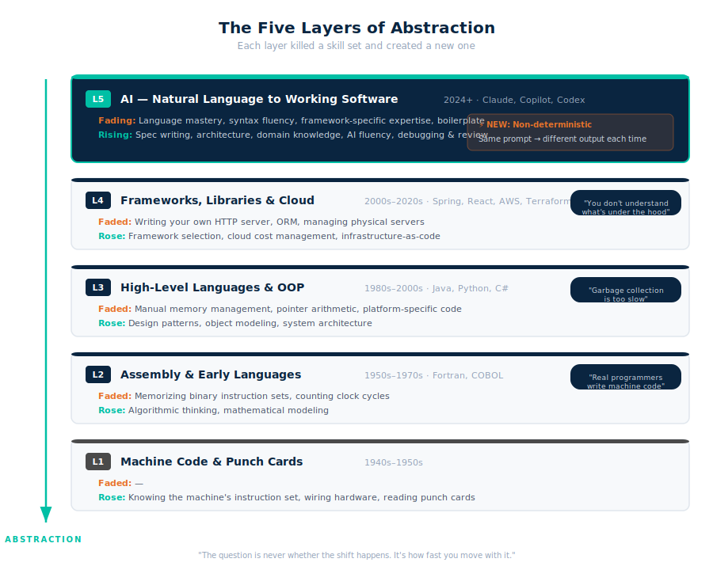
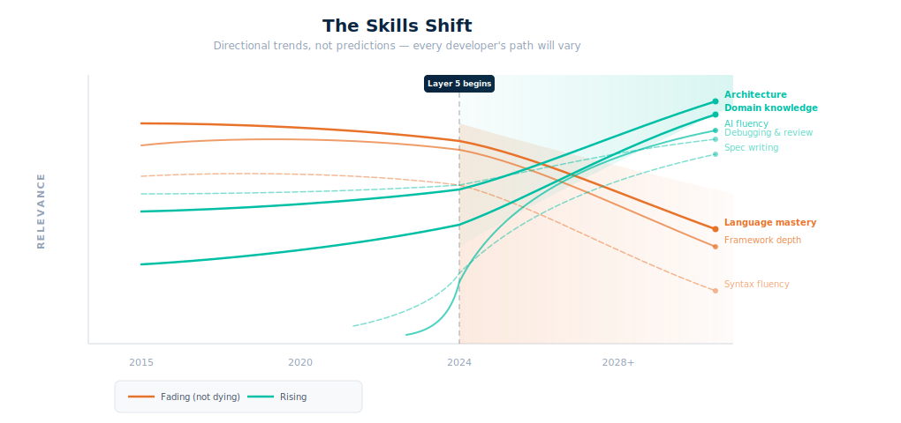

# Layer 5: The Skills of the Future Developer

Every time we added an abstraction layer, a skill set died and a new one was born. Nobody mourned. We just moved up.

Punch cards gave way to assembly. The skill of wiring hardware became a museum exhibit. Assembly gave way to Fortran and C. Memorizing opcodes became a hobby for enthusiasts. C gave way to Java and Python. Manual memory management became a specialty, not a requirement. Then frameworks and cloud arrived. You stopped writing your own HTTP server — Spring Boot and Express did that. You stopped racking servers — `terraform apply` and a Lambda function spun up in seconds.

Each time, the same arguments. "This is a toy." "Real engineers still need to understand what's happening underneath." "You're dumbing down the profession." Each time, the new layer won. Not because the old skills stopped being real — they were — but because the new abstraction let more people build more things faster. And that always wins.

We're now entering **Layer 5**. Natural language to working software. You describe what you want; AI generates the class, the component, the API, the test. And the same pattern is playing out — the same resistance, the same denial, the same inevitable shift.

This article is about what comes next. Not whether the shift happens — that's already decided by history — but what it means for the skills you need, the teams you build, and the people you hire.

**The thesis:** The developer of the future is not a language specialist who types code. They're a domain-expert architect who steers AI. And if that sounds dramatic, remember: every previous layer sounded dramatic too.

---

## The Pattern: Five Layers of Abstraction

This isn't a history lesson. It's a pattern recognition exercise. Once you see the cycle, you can't unsee it — and you'll recognize exactly where we are in it right now.

### Layer 1: Machine Code and Punch Cards (1940s–1950s)

You spoke directly to the hardware. Every instruction was a number. A loop was a physical stack of cards. Debugging meant reading punched holes in cardboard, spotting the one card that was out of order or had a hole in the wrong column.

The skill that mattered: knowing the machine's instruction set by heart. Every register, every opcode, every timing cycle.

There was no abstraction. You were the abstraction.

### Layer 2: Assembly and Early Languages (1950s–1970s)

Assembly replaced raw numbers with human-readable mnemonics. Then Fortran arrived and let scientists write mathematical formulas instead of machine instructions. COBOL let business people (in theory) read the code.

**What faded:** Memorizing binary instruction sets. Counting clock cycles by hand.
**What rose:** Algorithmic thinking. Mathematical modeling. The idea that you could describe a computation without knowing which register it lived in.

**The resistance:** "Real programmers write machine code. Compilers produce bloated, inefficient output. You'll never get the performance you need from a high-level language." NASA engineers hand-coded the Apollo guidance computer in assembly — and they were right to, for that specific machine with 74KB of memory. A decade later, nobody would dream of hand-coding assembly for a payroll system.

The argument wasn't wrong. It was just shrinking. Fewer and fewer problems required that level of control.

### Layer 3: High-Level Languages and OOP (1980s–2000s)

Java, Python, C# — these languages abstracted away memory management, pointers, and hardware-specific details. Object-oriented programming organized complexity into classes and hierarchies. Garbage collectors freed you from tracking every allocation and deallocation.

**What faded:** Manual memory management. Pointer arithmetic. Writing platform-specific code for every operating system.
**What rose:** Design patterns. Object modeling. System architecture. The idea that you could think about *what* the system does rather than *how* the memory works.

**The resistance:** "Garbage collection is slow. You can't build serious systems in managed languages. Real engineers need to understand what the machine is doing." Meanwhile, most of the internet ended up running on Java, Python, and JavaScript. The performance penalty existed — and for 95% of applications, it didn't matter.

You stopped writing your own linked list. The language gave you one. Then you stopped writing your own sort algorithm. Then your own string parser. Each time, the conversation moved up a level.

### Layer 4: Frameworks, Libraries, and Cloud (2000s–2020s)

This layer came in two waves that merged into one.

**Wave 1 — Frameworks and libraries.** Spring, React, Express, Django, Rails. You stopped building the plumbing. Nobody writes an in-house REST framework anymore — you pick Spring Boot or Express and focus on business logic. Nobody writes their own ORM from scratch — Hibernate, SQLAlchemy, or Prisma handle the database mapping. Nobody writes a custom authentication system — you integrate OAuth2 or use a managed identity provider.

The practical impact was massive. In 2005, building a web application meant writing your own HTTP request parsing, your own session management, your own template rendering, your own database connection pooling. By 2015, all of that was a dependency declaration. A single `pom.xml` or `package.json` pulled in more code than your entire team would write in a year.

**Wave 2 — Cloud.** AWS, GCP, Azure abstracted away infrastructure. Terraform replaced rack-and-stack. You stopped buying servers, stopped provisioning racks, stopped worrying about physical capacity. Need a database? `aws_db_instance` in Terraform. Need a function that runs on demand? Lambda. Need storage? S3. The plumbing of infrastructure became a configuration file.

**What faded:** Writing your own HTTP server. Building your own ORM. Managing physical servers. Manual capacity planning. Load balancer configuration by hand.
**What rose:** Framework selection and integration. Cloud cost management. Infrastructure-as-code. The ability to evaluate and compose tools rather than build them.

**The resistance:** "You don't really understand what's happening under the hood. What happens when the framework does something unexpected? You need to know the fundamentals." True — and yet the vast majority of developers spend their careers productively without ever reading the Spring source code or understanding how TCP handshakes work at the packet level. You can drive a car without understanding the combustion engine. For most roads, that's fine.

### Layer 5: AI — Natural Language to Working Software (2024+)

You describe what you want. AI generates the code — the class, the component, the endpoint, the test, the migration. Not always perfectly. Not always right. But fast, and getting better.

**What's fading:** Language-specific mastery. Syntax fluency. The ability to write boilerplate from muscle memory. Framework-specific deep expertise.
**What's rising:** Specification writing. Architecture. Domain expertise. The ability to review and steer AI output. Cost awareness.

**The resistance:** "AI code is buggy. You still need to understand the fundamentals. It hallucinates. You can't trust it for production systems." Sound familiar? It's the same argument, updated for 2025.

But here's what's genuinely different this time — and it's important to acknowledge it.

Martin Fowler put it precisely: *"We're not just moving up the abstraction levels, we're moving sideways into non-determinism at the same time."* Every previous abstraction was deterministic. You compiled the same Fortran code a hundred times and got the same bugs. You deployed the same Terraform config and got the same infrastructure. With AI, the same prompt can produce different code on different runs. This is, as Fowler notes, "unprecedented in the history of our profession."

This doesn't invalidate Layer 5. It means the skills you need around it are different from previous layers. Deterministic tools need people who understand inputs and outputs. Non-deterministic tools need people who understand *intent and judgment* — who can evaluate whether the output is right, not just whether it compiled.

### The Universal Pattern

| What Happens | Every. Single. Time. |
|---|---|
| New abstraction appears | "This is a toy" |
| Early adopters gain leverage | "It's only for simple stuff" |
| The old skill becomes niche | "Real engineers still need to know X" |
| 99% of developers move up | The 1% who stay down become specialists, not the norm |

The question is never *whether* the shift happens. It's how fast you move with it.

---

## The Shift: What's Rising, What's Fading

History tells us the pattern. Now let's get concrete about what it means today. What skills are losing value? What skills are gaining? And how fast is the transition?

### What's Fading

Not dying — fading. Assembly still runs your computer. C still powers your operating system. These skills exist and matter. But fewer people need them every year, and the same is happening now.

**Deep language mastery.** Knowing every quirk of Java generics, the intricacies of Python's GIL, the edge cases of JavaScript's type coercion — this matters less when AI generates idiomatic code in any language. You need enough language fluency to read and review AI output. You don't need enough to write a complex multithreaded application from a blank file.

**Syntax fluency.** The ability to type a for-loop, a class definition, a database query from muscle memory — no longer a differentiator. AI autocompletes it before you finish thinking about it. The developer who types fast and the developer who types slow produce the same output if the slow one writes better specs.

**Framework-specific deep expertise.** "I'm a Spring Boot expert" or "I'm a React specialist" — this is becoming less of a career moat. AI is trained on every framework's documentation, every Stack Overflow answer, every tutorial. It knows the patterns better than most human specialists because it's seen all of them. Your deep knowledge of one framework is competing against AI's broad knowledge of all frameworks.

**Boilerplate production.** CRUD endpoints, data models, configuration files, unit test scaffolding, database migrations. This is where AI is already fastest and most reliable. It's the assembly language of our era — real work that computers now do better.

**Manual deployment knowledge.** The progression: bare metal → virtual machines → containers → serverless → AI-orchestrated infrastructure. Each step removed a skill from the daily requirements. The next step removes more.

The data supports this. JetBrains' 2025 State of Developer Ecosystem survey — 24,534 developers across 194 countries — found that 85% already use AI tools regularly for coding. 62% rely on at least one AI coding assistant. This isn't early adoption anymore. This is the mainstream.

### What's Rising

**Specification writing.** If AI builds what you describe, then the quality of your description becomes the bottleneck. Vague spec = vague code. Precise spec = precise code. The developer who can translate a business need into a clear, unambiguous specification — covering requirements, constraints, edge cases, and acceptance criteria — will outperform the developer who can type code faster. Specification writing is the new typing speed.

> **"Writing" a spec doesn't mean typing a 10-page document.** You explain the requirements to AI. AI drafts the spec. You review it, challenge it, refine it. *"What about this edge case?" "What if the API is down?" "Add GDPR constraints."* The skill is knowing what's missing — not writing the document.

**Architecture and system design.** Which components does the system need? How do they connect? Where does the data flow? What are the failure modes? What happens at scale? AI can generate a microservice, but it can't decide whether you need one. It can implement a caching layer, but it can't evaluate whether caching is the right solution or whether you should redesign the data model instead. Architecture is the bottleneck when implementation is cheap.

**Domain and business knowledge.** This is the sleeper differentiator — and possibly the most important skill on this list. AI is trained on public code, documentation, Stack Overflow answers, and open-source projects. It knows how to build a REST API. It has zero knowledge of how your client calculates insurance premiums, why that suspension component fails at a specific temperature range, what regulatory edge case applies in that specific market, or how the settlement process works for cross-border transactions.

**This is not in the training data.** And it never will be — because it's proprietary, specialized, and changes with every client, industry, and business context. The developer who understands the business domain becomes irreplaceable precisely because AI can't learn it from the internet.

**Asking the right questions.** This one is subtle but critical. AI has vast knowledge — arguably more breadth than any individual developer. But it doesn't volunteer its best solution. It provides the most likely response to your prompt, optimized for directness, not depth. It solves your problem, it doesn't challenge your assumptions. Ask "build me a caching layer" and you'll get a caching layer. Ask "what are the tradeoffs between caching here versus redesigning the data model, and what breaks at 10x our current load?" and you'll get a fundamentally better answer. The developer who treats AI like a brilliant consultant — one who only answers exactly what you ask — and asks probing, skeptical, layered questions will consistently get better output than the one who accepts the first response. This is a skill that compounds: better questions lead to better answers, which teach you to ask even better questions.

**AI fluency — the workflow, not the prompt.** Not "prompt engineering" as a buzzword. This is about knowing the concrete workflow of working with AI effectively:

- **Spec → Plan → Build → Review.** Write a specification first. Have AI generate an implementation plan. Review the plan before any code is written. Then build, then review the output. This discipline is what separates productive AI usage from chaotic prompting. The developers who skip the spec and jump straight to "build me a login page" get code. The developers who write a clear spec with requirements, constraints, and edge cases get the *right* code.
- **Test-driven development with AI.** Write the test expectations first — or have AI write them from your spec — then generate the implementation. TDD with AI is even more powerful than traditional TDD because AI is excellent at generating code that passes tests. The tests become your specification and your safety net in one.
- **Review as a first-class activity.** Not just glancing at the diff. Reading AI-generated code with the same rigor you'd apply to a junior developer's pull request. Checking for the things AI gets wrong confidently: unnecessary complexity, duplicated logic, security gaps, concurrency issues.
- **Reviewing the spec itself.** Before AI writes a line of code, have it (or a colleague) review the spec. Ambiguities in the spec become bugs in the code. Catching them upstream is orders of magnitude cheaper.
- **Maintaining project context.** Keeping instruction files (like CLAUDE.md), memory files, and project documentation up to date so AI has the right context every time. This is the unglamorous but high-leverage work — a well-maintained project context file makes every AI interaction better. A stale one means you're re-explaining the same constraints in every conversation.
- **Context engineering.** Knowing how to structure information for AI, manage context windows, build reusable skills and workflows. Understanding what AI needs to know versus what overloads it.

Knowing the difference between delegating to AI (which degrades your skills) and collaborating with AI (which amplifies them). The Anthropic research team found exactly this: in a randomized controlled trial with 52 junior engineers, *how* someone used AI determined whether they learned or regressed. Blind delegation led to 17% lower skill retention. Critical engagement led to stronger outcomes.

**Code review and debugging.** When AI writes the code, humans review it. The daily activity shifts from writing to reading — auditing AI-generated code for architectural flaws, security vulnerabilities, performance issues, and subtle bugs. The Anthropic study found that debugging showed the *largest performance gap* between AI-assisted and manual groups. This is the canary: if you can't debug code you didn't write, AI makes you less effective, not more.

**Cost awareness.** Cloud bills, AI token costs, build-vs-buy decisions. Architecture choices have direct financial consequences. The developer who can estimate that "this design will cost $3K/month in Lambda invocations at our expected load versus $800 on a container" adds tangible, measurable value. As AI makes implementation cheap, the cost of *running* what you build becomes the constraining factor.

**Cross-system integration.** O'Reilly's analysis puts it well: the career advantage is shifting from "I know this specific tool really well" to "I can solve complex problems across different technologies." AI handles depth — it knows any single technology better than most humans. You provide breadth — the ability to stitch together services, third-party APIs, legacy systems, and data pipelines in ways that make sense for your specific context.

### The Shift at a Glance

| Skill | 2020 Value | 2028 Value | Why |
|---|---|---|---|
| Java/Python deep mastery | High | Medium-Low | AI generates idiomatic code in any language |
| System design | Senior-only | All levels | Someone must architect what AI builds |
| Domain expertise | Nice-to-have | Differentiator | Not in the training data |
| Spec writing | Barely existed | Core skill | Input quality = output quality |
| AI fluency | Didn't exist | Table stakes | Like knowing Git today |
| Asking the right questions | Useful | High | AI answers what you ask, not what you need |
| Debugging & review | Important | Critical | You review more code than you write |
| Framework expertise | Career-defining | Commodity | AI knows every framework |
| Cost awareness | Finance team's job | Developer skill | Architecture = budget |

> **For managers:** Look at your team composition today. Count how many people primarily write boilerplate versus how many primarily make architectural decisions and understand the business domain. That ratio is about to shift dramatically. Start investing in domain knowledge and architectural capability now — those are the skills that compound.

---

## The Learning Path: Skills by Seniority

Here's the practical breakdown. What does a developer actually need to know at each level? What can they safely delegate to AI? And what differentiates someone who thrives in Layer 5 from someone who gets left behind?

### Junior Developer (0–2 years)

The old junior developer profile: knows one language well, can write algorithms, passes LeetCode screens, learns the codebase over time. The new junior developer profile: **understands the system, reads code critically, and steers AI effectively.**

**You must know:**

**How the major components interact.** Not how to build them from scratch — how they fit together. HTTP servers, reverse proxies, load balancers, web application firewalls, databases, caches, message queues, API gateways. You should be able to trace a request from the user's browser to the database and back: "The request hits the CDN, passes through the WAF, reaches the load balancer, gets routed to one of three API instances, the API checks auth against the identity service, queries the database, returns the response through the same chain." This end-to-end understanding of data flow is more valuable than knowing any single component deeply.

This sounds basic. It isn't. This is a gap that shows up at every seniority level — even senior developers who've spent years deep in one part of the stack often can't explain how a request flows through the full system. They know their service inside out but have no idea what happens before the request reaches them or after the response leaves. In the AI era, this gets worse: if you can't see the whole picture, you can't write a spec that accounts for it, and AI will happily generate a component that works in isolation and fails in context. Start building this skill from day one. It never stops being relevant.

**One language well enough to read and review AI-generated code.** Not write it from memory — read it critically. You need to:
- Catch concurrency traps. This is crucial. If a Spring bean is a default singleton (one instance shared across all requests) and the AI just added a `private String currentUser` field to it — do you know what happens? Two requests arrive simultaneously. Both modify that field. One user sees another user's data. The code compiles. It passes a single-threaded unit test. It explodes in production under real traffic. A junior who catches this is worth ten who can write a binary search from memory.
- Understand variable scoping — what's shared across requests, what's local, what lives beyond the current method. This determines whether AI-generated code is safe under concurrent access or a time bomb.
- Spot unnecessary complexity. AI loves adding code. It will generate five separate classes each implementing their own caching logic when one shared service would do. It will create a Strategy pattern with three implementations when a simple `if` statement was enough. It will add layers of abstraction for a feature that has exactly one use case. You need to recognize when the code does more than it should and push back — "extract this into one class" or "we don't need this pattern here." This isn't a new problem — over-engineering happened before AI too — but AI does it faster and more confidently.
- Recognize when design patterns are missing or misapplied. AI might scatter duplicate logic across multiple files instead of extracting a shared component. Or it might use inheritance where composition fits better. You don't need to memorize the Gang of Four — you need to feel when something is repeated that shouldn't be, or coupled that should be separate.
- Recognize an N+1 query hiding inside a loop, or a database call inside a for-each that should be a single batch query.

**Basic design patterns.** Not all 23 Gang of Four patterns — the ones that show up everywhere and that AI uses constantly: dependency injection (how Spring wires things together), observer (how events propagate), factory (how objects get created), strategy (how behavior gets swapped). Enough to recognize them in AI output and understand *why* the AI structured the code that way.

**Container basics.** What Docker does, what a Dockerfile looks like, how to read a `docker-compose.yml`. Not container orchestration at scale — just enough to understand the deployment unit.

**Cloud primitives.** What a Lambda function is, what S3 is, what a VPC is. Enough to read a Terraform file and roughly understand what infrastructure it describes.

**API design.** REST conventions, HTTP methods, status codes, request/response lifecycle. How to read an OpenAPI spec. How to test an endpoint with curl.

**The software development lifecycle.** Understand the full cycle — not just "write code." Requirements gathering, design, implementation, testing, deployment, monitoring, maintenance. Know what a CI/CD pipeline does and why your code goes through it. Know what happens after your code ships: logs, monitoring dashboards, alerting, incident response. Too many developers think their job ends at the pull request. It doesn't — it ends when the feature is running in production and you can prove it's working. This means understanding what logs to write, what metrics matter, how to read a Grafana dashboard, and what a 99th percentile latency spike looks like.

**Version control.** Git workflows, branching, pull requests, code review etiquette.

**The AI workflow basics.** Even as a junior, learn the discipline: write a spec before you prompt. Review the plan before you let AI build. Write tests (or have AI write tests from your spec) before generating implementation — TDD with AI is a force multiplier. Review every line of generated code as if you wrote it. Keep your project's instruction files and memory files up to date. These habits are easier to build early than to retrofit later, and they separate the developers who grow with AI from the ones who stagnate.

**What you can delegate to AI:** Writing boilerplate code, CRUD endpoints, data models, unit test scaffolding, configuration files, Dockerfiles, basic Terraform. The mechanical output.

**What differentiates you:** The junior who understands the data flow end-to-end and can explain *why* the system is shaped the way it is — not just what each piece does. Who catches the singleton bug in code review. Who asks "what happens when two users do this at the same time?" before the code ships. Who doesn't accept AI's first answer but asks "what are the tradeoffs?" and "what would break under load?"

> **For recruiters:** Stop asking "implement a binary search." Start asking: "Here's an architecture diagram. A user reports slow page loads. Walk me through where you'd look and why." Show them AI-generated code with a subtle concurrency bug and ask what happens under load. Test system thinking, not syntax recall.

### Mid-Level Developer (2–5 years)

The jump from junior to mid-level in Layer 5: you go from knowing *what* the components are to understanding their **internals and tradeoffs**. Not just "what Docker is" but how to restrict access, optimize image size, handle secrets securely. Not just "what a Lambda is" but cold start latencies, concurrency limits, dependency packaging, and cost at scale.

**You must know (everything from Junior, plus):**

**The internals and tradeoffs of building blocks.** Docker: multi-stage builds, security scanning, resource limits, non-root users. Lambda: cold starts and warm pools, concurrency reservations, layer management for dependencies, memory-cost tradeoffs (more memory = faster execution but higher cost). Databases: indexing strategies and when they hurt more than they help, query execution plans, replication topologies, the real tradeoffs between SQL and NoSQL (not the blog-post version — the "we chose DynamoDB and regretted it because of this specific access pattern" version).

**Architecture patterns in practice.** Microservices versus monolith — not the theory, the lived experience. When have you seen a monolith that should have stayed a monolith? When has a microservice split created more problems than it solved? Event-driven architecture: when it simplifies and when it makes debugging a nightmare. CQRS: when the read/write split is worth the complexity and when it's over-engineering. Saga patterns for distributed transactions.

**Application-level security.** OWASP Top 10 — not as a memorized list, but as intuition. Authentication flows (OAuth2, OIDC, JWT lifecycle). Authorization patterns (RBAC, ABAC, policy engines). Secrets management (vault integration, rotation, never-in-environment-variables). Input validation. The ability to look at AI-generated code and know *why* it's vulnerable — SQL injection through string concatenation, XSS through unescaped output, IDOR through predictable IDs.

**Resilience engineering.** The gap between "it works" and "it works in production" is mostly this: error handling that doesn't swallow failures silently, retry logic with exponential backoff (not infinite loops that DDoS your own database), circuit breakers that stop cascading failures before they take down the whole system, graceful degradation (the checkout page still works even if the recommendation engine is down), and timeout configuration that accounts for real-world latency. AI will generate the happy path beautifully. It rarely generates the failure path well — because failure modes depend on how your specific system behaves under stress, and that's not something AI can infer from a spec. This is where your operational experience and system knowledge matters.

**Observability and operational maturity.** At this level, you don't just read logs — you design logging strategies. Structured logging with correlation IDs so you can trace a request across five services. Metrics that actually answer business questions ("how many orders per minute?" not just "how much CPU?"). Alerting that pages you for real problems, not noise. Dashboards that tell a story — the kind an oncall engineer can glance at and know if something is wrong. Understanding SLOs, error budgets, and the tradeoff between reliability investment and feature velocity. AI can generate logging code, but it can't decide *what's worth logging* — that requires understanding the system and the failure modes that matter.

**Cost modeling.** Estimating cloud costs for different architectural choices. "If we go serverless at our expected load of 10M requests/month, here's the Lambda + API Gateway cost. If we go containers on ECS, here's the Fargate cost. Here's the crossover point where one becomes cheaper than the other." This is a real skill that directly impacts business decisions.

**Domain knowledge — deep enough to challenge requirements.** By this level, you should understand your industry vertical well enough to push back on specs that don't make sense. "The requirement says real-time settlement, but the downstream system batches nightly. We need to either change the requirement or build an intermediary. Here are the tradeoffs."

**AI workflow mastery.** The spec-plan-build-review cycle should be second nature by now. At this level, you go further: writing specs that anticipate AI's blind spots, reviewing AI-generated plans before any code is written, applying TDD with AI (write the tests from the spec, then generate the implementation), and maintaining project context files that make every AI interaction more effective. Custom instruction files, reusable skills, multi-agent patterns — knowing when to break a task into subtasks for AI and when to tackle it as one. Knowing the difference between a problem AI handles well (CRUD generation, test scaffolding, data transformations) and one it handles poorly (complex state machines, nuanced business logic, performance-critical paths).

**What you can delegate to AI:** Full feature implementation from a well-written spec. Complete test suites (unit, integration, e2e scaffolding). Database migrations and schema designs (with review). Documentation generation. Refactoring within established patterns.

**What differentiates you:** The mid-level developer who can take a business requirement, translate it into a technical spec, hand it to AI, and then *interrogate* the output — not just checking for bugs, but asking "why did you choose this pattern over X?" and "what happens to cost if traffic doubles?" Catching architectural missteps, security gaps, and cost implications through skeptical, layered questioning, and iterating until the result is production-worthy.

> **For recruiters:** Give them a real codebase. Give them an AI tool. Ask them to implement a feature with a deliberate constraint ("must handle 10K concurrent users" or "must comply with GDPR data residency"). Evaluate: Did they ask clarifying questions before starting? Did they architect before generating? Did they catch the AI's mistakes? Can they estimate what this will cost to run?

### Senior Developer / Architect (5+ years)

At this level, you operate almost entirely at the architecture and domain layer. You rarely touch language-level code directly. You define the system shape, the constraints, the quality attributes — and orchestrate AI and teams to fill it in.

**You must know (everything from Mid, plus):**

**System design at scale.** Distributed systems patterns beyond the textbook. Consistency models — not "explain CAP theorem" but "here's why we chose eventual consistency for this service and strong consistency for that one, and here's the user-visible impact of each choice." Observability architecture: structured logging, distributed tracing, metrics pipelines, alerting that actually works. Disaster recovery: RTO/RPO targets that map to business impact, failover strategies, multi-region deployment patterns.

**The business — deeply.** Not just "I understand the requirements." You sit in business conversations. You challenge assumptions. You propose solutions the business didn't think of because you understand both the technology and the domain. You're the one who says "we don't need to build that feature — let me prototype it in two days, we'll show it to users, and then decide if it's worth the full investment." You're the bridge between what the business wants and what's technically and financially sensible.

**Cross-system integration.** How to stitch together services, third-party APIs, legacy systems, data pipelines, and vendor platforms. The breadth that AI can't replicate because it doesn't know your specific system landscape, your specific vendor contracts, your specific compliance requirements.

**Team AI enablement.** Writing the instruction files, the reusable skills, the workflow templates that make your whole team faster. Defining the guardrails — what gets human review, what can be auto-merged, what requires architectural sign-off. Setting up the review processes and quality gates for AI-generated code.

**Risk and cost at the portfolio level.** Not just "this Lambda costs X" but "this architectural decision locks us into this vendor for three years, and here's the switching cost if their pricing changes." Build-versus-buy analysis. Technical debt quantification. The ability to present technology choices as business decisions with dollar signs attached.

**Non-determinism management.** Fowler's point, operationalized. How do you build reliable systems on top of non-deterministic AI? Validation layers. Testing strategies that account for variable output. Human-in-the-loop checkpoints at the right granularity. Knowing which parts of the system can tolerate non-determinism (a marketing page) and which absolutely cannot (a financial calculation).

**What you can delegate to AI:** Almost everything at the implementation level, given a good spec. Spike and prototype generation for architectural evaluation. First-pass code review (AI reviews, then you review AI's review). Documentation, architecture decision records, runbooks.

**What differentiates you:** The senior who can walk into a room with the business, understand the problem, sketch the architecture on a whiteboard, estimate cost and timeline, then orchestrate AI and a team to deliver it — and who knows when the AI's output is wrong before it hits production. Who can prototype something in a day that answers a business question that would have taken a sprint to even frame properly.

> **For recruiters:** System design interview with real constraints. "Design a payment processing system for a marketplace operating in three regulatory environments. Here's the budget. Here are the compliance requirements. You have AI tools available — show me how you'd use them." Evaluate: architectural judgment, cost awareness, regulatory understanding, how they break work down for AI versus humans, how they handle ambiguity.

### The Cross-Cutting Differentiator: Business Knowledge

At every level — junior, mid, senior — domain expertise is the skill that AI cannot replace and that scales with seniority.

A junior understands the basic workflow: "this is how a customer places an order."
A mid-level challenges requirements: "the spec says real-time, but the downstream system batches — let's discuss alternatives."
A senior proposes strategy: "instead of building the full feature, let me prototype it in a day, we show it to five customers, and we'll know by next week whether it's worth the investment."

This scales because the business knowledge compounds over time and **none of it is in AI's training data**. The developer who understands insurance claim adjudication, automotive supply chains, pharmaceutical trial protocols, or financial settlement workflows brings something that no amount of AI training will replicate. It's proprietary. It's experiential. It's the moat.

---

## The Speed Paradox

AI makes development fast. That sounds purely good. It's not. Speed is simultaneously the biggest opportunity and the biggest threat to current business models, and understanding this paradox is essential for anyone planning a team, a project, or a career.

### The Paradox

A developer with AI tools can deliver a working prototype in a day. That means more iterations, tighter feedback loops, and better outcomes. But it also means the six-month project becomes a six-week project. And if the six-month project was generating six months of billable hours, someone's revenue model just broke.

### The Old World

Feature request → backlog grooming → sprint planning → two-week sprint → sprint review → stakeholder feedback → next sprint adjustments. Repeat.

A prototype took weeks. Incorporating feedback took a full sprint cycle. Nobody invested in multiple rounds of refinement because each round cost too much developer time. So stakeholders settled. They accepted 80% of what they wanted because the last 20% meant another sprint, another $30K, another three weeks. The unspoken agreement: "good enough" was good enough because "right" was too expensive.

Communication with the business was batched. Once per sprint review, maybe a mid-sprint check-in if things were going badly. Requirements were written upfront in as much detail as possible because changing them later was expensive.

### The New World

Feature request → AI-generated prototype same day → show the stakeholder → change it tomorrow based on their feedback → show again → iterate. What used to take three sprints happens in three days.

The feedback loop compresses from weeks to hours. Communication shifts from batched to continuous. The developer and the stakeholder are in constant dialogue because rework is cheap. The "accept what you get" problem disappears — if iteration costs almost nothing, stakeholders can actually get what they need.

This fundamentally changes who succeeds as a developer. The one who understands the business domain can have this conversation directly. The one who needs a business analyst to translate requirements into tickets is now a bottleneck in a process that's supposed to be fast.

### What Changes

**The developer-business relationship transforms.** You're no longer a ticket executor who gets requirements thrown over a wall. You're sitting with the business, prototyping live, shaping the solution together. "Let me show you what this would look like" becomes something you can say in a meeting and deliver before the meeting ends. This is why domain knowledge becomes critical — you can't have this conversation if you don't understand the business.

**The value unit shifts.** Companies stop delivering "we built this feature" and start delivering "we solved this problem." The measure of success moves from output (code shipped, stories completed) to outcome (business value delivered, hypotheses validated, problems resolved). A prototype that disproves a bad idea in one day is more valuable than a polished feature that implements it over three months.

**The double edge.** Fast delivery means:
- **For product companies:** Faster experimentation, faster pivots, faster validation. The companies that iterate fastest win. This is unambiguously positive.
- **For service companies:** The billable-hours model is under pressure. If a six-month project compresses to six weeks, you either find more projects, shift to value-based pricing, or watch your revenue shrink. The consulting model must evolve.
- **For individual developers:** You can deliver more. But you can also be expected to deliver more. The speed becomes the baseline, not the advantage.

**The sprint model evolves.** The rigid two-week cadence makes less sense when you can deliver and iterate daily. This doesn't mean sprints die — structure has value. But the ceremonial sprint review where you show two weeks of work to stakeholders who've been waiting in the dark? That's already feeling outdated. Something more like continuous delivery with structured review checkpoints is emerging.

> **For managers:** This section requires the most adaptation from you.

- **Team structure shifts.** Fewer pure coders, more people who can talk to the business directly. The business analyst as an intermediary between stakeholder and developer becomes less necessary when the developer can prototype on the fly in a stakeholder meeting. Invest in developers who understand the domain.
- **Delivery cadence changes.** Move away from rigid sprint ceremonies toward continuous delivery with review checkpoints. The goal isn't to remove structure — it's to match the cadence to the speed of delivery.
- **Performance metrics change.** Lines of code, velocity points, tickets closed — all increasingly meaningless. Measure business outcomes delivered, iteration speed, stakeholder satisfaction, time-to-validation for new ideas.
- **Budget models change.** For service organizations, billable hours erode when projects compress. Value-based pricing — charging for outcomes rather than time — becomes necessary. For product organizations, faster experimentation means smaller bets, faster feedback, and a culture of "let's test it" replacing "let's spec it."

---

## The Non-Expert Developer

Here's a trend that makes many professional developers uncomfortable: the developer pool is widening. Fast.

### Who's Entering

**Business analysts** who can now prototype their own dashboards and internal tools instead of writing tickets for a dev team and waiting three sprints.

**Domain specialists** — the insurance actuary who understands risk models and can now scaffold an application around that knowledge. The mechanical engineer who can build a simulation tool. The doctor who can prototype a patient workflow system. The logistics manager who can automate their own routing optimization. These people have deep expertise in their fields and just enough AI fluency to build working software.

**Entrepreneurs and founders** who go from idea to MVP without a technical co-founder. What used to require $50K and a three-month engagement with a dev shop now requires a weekend with an AI coding tool and someone who knows what they want.

**Operations people** who automate their own workflows instead of submitting IT requests and waiting in a queue.

### What This Means for Professional Developers

This is not a threat. It's a shift in what you're hired for.

The analogy: Excel didn't kill accountants. It killed manual bookkeeping and freed accountants to do analysis, strategy, and advisory work. The accountants who thrived were the ones who embraced the tool and moved up the value chain. The ones who resisted spent their careers getting more and more expensive at something a spreadsheet could do for free.

AI coding tools are doing the same thing. When everyone can build a basic CRUD application, a simple internal tool, or a working prototype, you are no longer hired for that. You're hired for what they *can't* do:

- **Scale it.** The prototype works for 10 users. Making it work for 10,000 users with five-nines uptime is a different problem.
- **Secure it.** The non-expert built something that works. Is it SQL-injectable? Does it store passwords in plaintext? Does it leak data through verbose error messages? Probably.
- **Make it reliable.** Error handling, retry logic, circuit breakers, graceful degradation, monitoring, alerting. The difference between "it works on my machine" and "it works in production under load at 3AM on a Saturday."
- **Integrate it.** Connecting the prototype to existing systems, legacy databases, third-party APIs, compliance layers, audit logging. The real complexity of enterprise software isn't building new things — it's connecting them to everything that already exists.
- **Maintain it.** The non-expert built it. Can they maintain it? Debug it when it breaks at 2AM? Migrate it when the database schema needs to change? Upgrade it when a dependency has a critical security vulnerability?

### The New Collaboration

The emerging model isn't professionals versus non-experts. It's professionals *alongside* non-experts. The domain specialist builds the prototype with AI. The professional developer reviews it, hardens it, integrates it, and sets up the guardrails for the next iteration.

This changes what "developer" means at the team level. You're not just writing code. You're enabling others to build safely. Writing the architecture that non-experts build within. Reviewing the output. Defining the quality gates. Stepping in when the complexity exceeds what AI plus a domain expert can handle.

The data supports this division: AI-generated code is up to 4x faster than manually written code, but research suggests it can be significantly riskier. Someone needs to manage that risk. That someone is a professional developer with security awareness, architectural judgment, and production experience.

> **For managers:** Your team composition is changing. You may need fewer pure coders but more reviewers, architects, and enablers who make the whole organization more capable of building software. The "10x developer" of the future might not write 10x the code — they might enable 10 non-developers to ship safely. And invest in domain knowledge for your developers. Send them to shadow the business. Put them in client meetings. Let them sit with the operations team for a week. The developer who understands the business will outperform the one who only understands the code — and that gap widens every day as AI commoditizes the code part.

---

## The Future Interview

Everything above has implications for how you evaluate talent. If the skills are changing, the interview must change too. This section is for recruiters and hiring managers, but developers should read it too — this is what you'll be evaluated on.

### Let's Be Honest: The Interview Was Already Broken

AI didn't break the technical interview. It was broken for years. AI just made it impossible to pretend otherwise.

A solution architect with 15 years of experience walks into an interview and gets asked about Java's `hashCode` and `equals` contract. A senior engineer who's designed systems handling millions of transactions gets asked to reverse a linked list on a whiteboard. A platform lead who's managed multi-region deployments gets quizzed on Big-O notation for sorting algorithms. This has been happening for decades, and everyone knew it was absurd — but nobody fixed it because "that's how we've always done it."

Now AI can answer every one of those questions instantly. The fig leaf is gone. You *have* to test for something else.

The good news: what interviews *should* have been testing all along is what they now *must* test. Get to know the person. Understand their background, how they think, how they approach problems. Estimate their judgment, not their memorization. You can give the same design problem to a junior, a mid-level, and a senior — the question is the same, but you expect fundamentally different answers. A junior traces the data flow. A mid-level identifies the tradeoffs. A senior challenges the requirements and proposes alternatives the business hadn't considered. That tells you more in 30 minutes than any language trivia quiz ever did.

Language quirks were always a click away. Now they're a prompt away. The interview needs to test what can't be looked up — thinking, judgment, and the ability to ask the right questions.

Companies are hiring fewer engineers, not more. The bar goes up — but it goes up on *different axes*. As Formation.dev notes, "the bar goes up even if the rubric doesn't." And AI widens the gap between strong and weak engineers rather than leveling it — strong engineers get disproportionately more productive.

### Interviewing Juniors

**Stop testing:**
- Syntax recall and language trivia ("what's the difference between `==` and `===`?")
- Algorithm implementation from memory (reverse a linked list, find the shortest path)
- Toy problems with no real-world context

**Start testing:**

**System comprehension.** Show them an architecture diagram of a real system. "A user clicks 'buy.' Walk me through every system this request touches, from the browser to the database and back." They don't need to know every detail — they need to show they understand the flow. A good answer: "The request hits the load balancer, gets routed to one of the API instances. The API validates the auth token against the identity service, then calls the inventory service to reserve the item. If inventory confirms, it writes to the orders database and publishes an event for the payment service to pick up. If any step fails..." They think in systems, not in syntax.

**Code reading with subtle bugs.** Show them AI-generated code that has realistic problems — the Spring singleton with a mutable instance variable, a race condition in a shared resource, an N+1 query hiding in a JPA relationship, an unvalidated user input flowing into a database query. "What's wrong here? What happens under load?" This tests exactly the skill they'll use every day.

**Live AI collaboration.** Give them a small task, give them an AI tool, and watch how they work. Do they write a spec first or just start prompting? Do they review the output critically or accept it? Do they catch the mistake the AI made? Do they re-prompt blindly when something fails, or do they diagnose the problem? This tells you more about their effectiveness than any algorithm question.

**The basics that matter.** HTTP request lifecycle. What a 404 versus a 500 means and why the distinction matters. What happens when you deploy a container. How DNS resolution works at a high level. The plumbing knowledge that lets them debug real problems in real systems.

### Interviewing Mid-Level

**Stop testing:**
- Pure algorithmic complexity (unless genuinely relevant to the role)
- Framework-specific trivia ("what annotation does Spring use for...?")

**Start testing:**

**Architecture under real constraints.** "Design a notification system that handles 50,000 messages per minute. Budget is $2,000/month on AWS. Must comply with GDPR — users in the EU must have data stored in the EU region." Tests: Can they make tradeoffs? Do they think about cost? Do they consider regulatory constraints without being prompted? Do they ask what "notification" means (email? push? SMS? all three?) before designing?

**Debugging under pressure.** A production-like scenario: "This service is returning 500s for 5% of requests. Here are the logs. Here's the code. Here's the infrastructure diagram. Find the problem." Debugging is the skill the Anthropic study identified as most at risk from AI-assisted development — test it explicitly, because it's the skill that matters most when things go wrong.

**Domain reasoning.** Give them a business scenario from your actual domain. "The client says settlement needs to happen T+2 but the downstream system batches nightly. What are the options?" Tests whether they can bridge business requirements and technical constraints.

### Interviewing Seniors and Architects

**Stop testing:**
- Coding exercises (unless it's a live prototype sprint with AI tools)
- Textbook distributed systems questions with textbook answers ("explain CAP theorem")

**Start testing:**

**End-to-end system design with real constraints.** "You're building a marketplace payment system operating in three countries with different regulatory requirements. Here's the expected transaction volume, here's the budget, here are the existing systems you must integrate with. Design it." Evaluate: Do they ask the right questions before designing? Do they consider failure modes, migration paths, vendor lock-in? Do they present options with tradeoffs rather than a single "correct" answer?

**The business-technology bridge.** Put them in a simulated stakeholder meeting. "The business wants to launch a new product line in six weeks. Here's what they described. You have AI tools and a team of three mid-level developers." Do they push back on scope? Do they propose a prototype-first approach? Do they identify risks the business hasn't considered? Do they translate technical constraints into business language?

**Review of AI-generated architecture.** Present them with an AI-generated system design that has subtle flaws — an over-engineered microservice split, a missing security boundary, an eventual consistency issue that the business requirements don't tolerate, a cost structure that will explode at scale. "Review this. What would you change and why?"

### What to Probe at Every Level

Regardless of seniority, every interview should touch these:

| Meta-Skill | What to Look For |
|---|---|
| AI mistake handling | Do they debug, or re-prompt blindly? |
| Communication clarity | Can they explain technical tradeoffs to a non-technical person? |
| Intellectual honesty | Do they say "I don't know" when they don't? |
| Business curiosity | Do they ask *why* the feature is needed, or just *what* to build? |

### The Summary

| Level | Stop Asking | Start Asking |
|---|---|---|
| Junior | Syntax, algorithms, language trivia | System flow, code reading, AI collaboration, debugging AI output |
| Mid | Framework specifics, pure algorithms | Architecture under constraints, AI-augmented implementation, cost estimation, domain reasoning |
| Senior | Coding exercises, textbook system design | Real-constraint design, business-tech bridge, AI orchestration, prototype challenges |

---

## Closing: The Only Constant Is the Climb

Every layer faced the same resistance. Every layer won. Not because the resistance was wrong — assembly programmers *were* right that compilers produced bloated code, and Java skeptics *were* right that garbage collection had overhead, and cloud skeptics *were* right that you lose some control. They were right about the tradeoffs. They were wrong about which tradeoffs mattered.

The developers who thrived at each transition were never the ones who clung to the layer below. They were the ones who climbed — who recognized that the new abstraction, imperfect as it was, let them solve bigger problems. That the title "developer" stayed the same. The job transformed.

Layer 5 is no different.

**If you're a developer:** Invest in architecture, domain knowledge, and AI fluency. Language mastery won't disappear — but it will follow the same curve as assembly. Essential for a shrinking niche, optional for the growing majority. The developers who understand the business, who can architect systems, who can steer AI with judgment and review its output with precision — those developers are not at risk. They're in higher demand than ever.

**If you're a manager:** Restructure around continuous delivery and business-developer collaboration. The sprint-review-feedback cycle is compressing into something faster. Hire for judgment and domain fit, not language proficiency. Build teams where developers sit with the business, not behind a wall of tickets and intermediaries.

**If you're a recruiter:** Redesign your evaluation. The signals that mattered in 2020 — algorithm speed, syntax fluency, framework depth — are fading fast. The new signals: system thinking, business reasoning, AI collaboration, the ability to debug code you didn't write and challenge specs that don't make sense.

Layer 6 will come. It always does. The developers who'll thrive in it are the ones climbing Layer 5 right now.

---

## Resources

### Data and Research

- [JetBrains State of Developer Ecosystem 2025](https://blog.jetbrains.com/research/2025/10/state-of-developer-ecosystem-2025/) — Survey of 24,534 developers across 194 countries on AI tool adoption and developer practices
- [Anthropic: How AI Assistance Impacts Coding Skills](https://www.anthropic.com/research/AI-assistance-coding-skills) — Randomized controlled trial studying how AI assistance affects skill development in junior engineers
- [Stack Overflow: AI vs Gen Z](https://stackoverflow.blog/2025/12/26/ai-vs-gen-z/) — Analysis of junior developer hiring trends and AI's impact on entry-level opportunities

### Essays and Thought Leadership

- [Martin Fowler: LLMs Bring a New Nature of Abstraction](https://martinfowler.com/articles/2025-nature-abstraction.html) — Why AI as an abstraction layer differs from all previous layers (non-determinism)
- [O'Reilly: AI Is Reshaping Developer Career Paths](https://www.oreilly.com/radar/ai-is-reshaping-developer-career-paths/) — How the career advantage shifts from single-tool depth to cross-system problem solving
- [OpenAI: Building an AI-Native Engineering Team](https://developers.openai.com/codex/guides/build-ai-native-engineering-team) — Practical guide to the Delegate/Review/Own framework for AI-assisted development
- [Dat Nguyen: AI — One More Abstraction Layer in SWE Evolution](https://www.datsama.com/2025/09/28/ai-one-more-abstraction-layer-in-swe.html) — Tracing the isolation and intent tracks through software engineering history

### Career and Hiring

- [The Disappearance of the Junior Developer](https://www.denoise.digital/the-disappearance-of-the-junior-developer-how-to-start-a-career-in-2026/) — Career strategies and a 12-month roadmap for entering development in the AI era
- [Formation.dev: What AI Changes in SWE Interviews](https://formation.dev/blog/what-ai-changes-and-doesnt-change-in-swe-interviews/) — How coding interview signal is evolving
- [Karat: Engineering Interview Trends 2026](https://karat.com/engineering-interview-trends-2026/) — Data on how companies are adapting their technical evaluation processes
- [Infobip: AI, Hiring, and the Future of Coding](https://www.infobip.com/developers/blog/ai-hiring-and-the-future-of-coding-what-the-top-2026-predictions-mean-for-developers) — 2026 predictions for developer hiring and AI adoption

### Further Reading

- [The Architectural Revolution (Kevin Mesiab)](https://medium.com/@kmesiab/the-architectural-revolution-how-ai-is-redefining-software-development-from-code-writing-to-da5d6dad825a) — How AI redefines software development from code writing to system design
- [DEV Community: The Junior Developer Crisis of 2026](https://dev.to/rakshath/the-junior-developer-crisis-of-2026-ai-is-creating-developers-who-cant-debug-33od) — The debugging skill gap and its implications
- [Security Boulevard: Claude Code and the Future of Programming](https://securityboulevard.com/2025/08/claude-code-and-the-future-of-programming-a-paradigm-shift-in-how-we-build-software/) — The spec-first paradigm and its implications for programming
