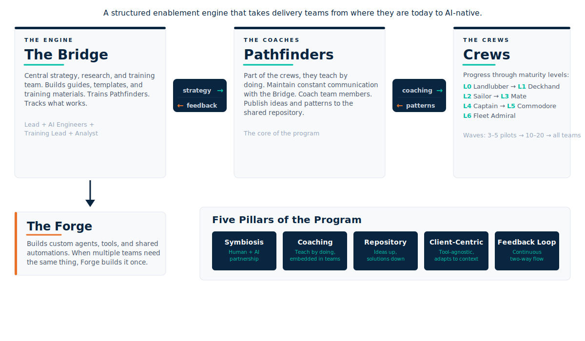
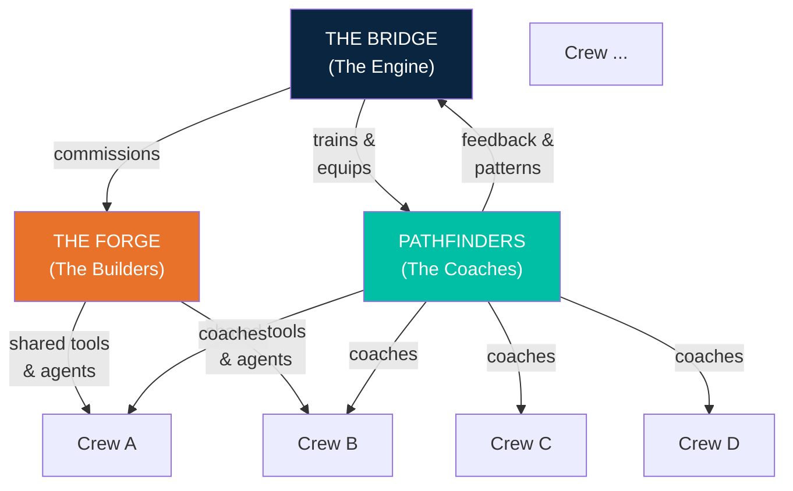
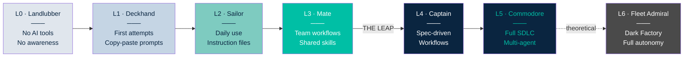
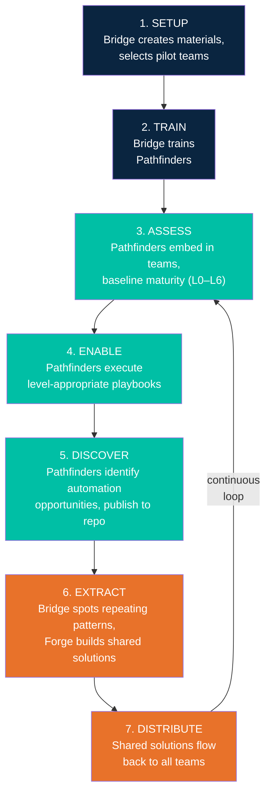

# The Shipped by Agents Process

*A structured enablement engine that takes delivery teams from where they are today to AI-native.*

---

Your developers already have AI tools. Licenses are provisioned, plugins are installed, maybe a few people even use them daily. But adoption stalls. Teams don't know where to start. Early adopters burn out as lone champions. Six months later, usage is scattered and shallow.

Shipped by Agents is a process framework for companies that want to move past this. It gives you a structure — teams, maturity levels, feedback loops — without locking you into specific tools or rigid mandates. It works whether your client uses Copilot or Claude, whether your teams build microservices or maintain legacy monoliths.

The goal is **symbiosis** — humans and AI each doing what they do best. Humans set direction, review, and decide. AI accelerates, executes, and handles the repetitive work. Not replacement. Not full autonomy. Faster, better, more consistent delivery.

---

## The Teams

Four groups with distinct roles. Together they form the enablement engine.

### The Bridge

The central strategy and research team. They design the framework, build training materials, and track what works across all teams. They train the Pathfinders and maintain the shared repository of automation patterns.

**Key responsibilities:**
- Define and evolve the enablement methodology
- Create guides, templates, starter prompts, and playbooks
- Train and certify Pathfinders
- Analyze patterns from the shared repository
- Decide when a pattern is common enough to become a Forge project

**Typical composition:** Lead + AI Engineers + Training Lead + Analyst

### Pathfinders

Pathfinders are part of the crews themselves — they teach by doing, working on real tasks alongside the team. They are the core of the program. They maintain constant communication with the Bridge, coach team members through each maturity level, and publish ideas and patterns to the shared repository.

**Key responsibilities:**
- Assess team maturity (L0–L6) and execute level-appropriate enablement
- Coach team members by pairing on real work using AI tools
- Maintain constant two-way communication with the Bridge
- Identify automation opportunities and publish them to the shared repository
- Gradually reduce involvement as teams become self-sustaining

**Scaling and the Pathfinder lifecycle.** A Pathfinder is a dedicated role within the team — not a visiting consultant. They do real project work alongside the crew while also driving AI enablement. This dual role is what makes the coaching effective: they understand the team's codebase, constraints, and daily reality.

One Pathfinder per team is the baseline. At early levels (L0–L2), the enablement work is lighter, so a Pathfinder may split time across 2 teams if needed — but being embedded in one team is always preferred. For a rollout targeting 20 teams across three waves, expect to need 8–10 Pathfinders.

As Pathfinders accumulate experience, they become a scaling mechanism themselves. A Pathfinder who has guided two or three teams through L0→L3 develops pattern recognition that the Bridge can't get from reports alone. These experienced Pathfinders can train and mentor new Pathfinders — effectively becoming a train-the-trainer layer. This is how the program scales beyond the first wave without the Bridge becoming a bottleneck.

### The Forge

The build team for reusable tools, agents, and automations. When the Bridge recognizes that a pattern appears across multiple teams or projects, the Forge extracts it into a shared solution.

**Key responsibilities:**
- Build custom agents, skills, and workflow automations
- Maintain and version shared solutions (this is critical — unmaintained tools become liabilities)
- Support teams adopting shared solutions
- Evaluate build vs. buy for recurring needs

**Important:** The Forge doesn't build everything. It builds what is **proven reusable** — patterns that have been validated in at least two teams before investment.

### Crews (Delivery Teams)

The teams being enabled. They are not passive consumers of a training program. They actively discover what works, push back what doesn't, and contribute automation ideas that feed the entire system.

Crews progress through the maturity model at their own pace. Some will reach L4 in months. Others may stay at L2 and that's fine — L2 already delivers significant value.

---

## The Maturity Model

Seven levels organized in three phases. The key insight: **L0–L3 is about the developer. L4–L5 is about the process. L6 is the horizon.**

### Developer Phase — L0 through L3

In these levels, the main lever is **context** — teaching developers to fill the agent's context window with the right information. Everything is manually invoked. The developer drives; the AI assists.

| Level | Rank | What it looks like | Key enablers |
|---|---|---|---|
| **L0** | Landlubber | No AI tools. Possibly skeptical or unaware. | Access, first wins, resistance FAQ |
| **L1** | Deckhand | Tools installed. First supervised attempts. Copy-paste prompting. | Guided first session, basic prompt patterns |
| **L2** | Sailor | Daily individual use. Instruction files (CLAUDE.md, .github/copilot-instructions.md). Basic workflows: plan → build → test. | Starter prompt library, project constitution, workflow guides |
| **L3** | Mate | Team-level shared practices. Reusable skills and custom instructions. Automation discovery begins — teams start spotting repetitive work that AI could handle. | Shared context, team habits, automation discovery workshops |

### Process Phase — L4 through L5

The **L3 → L4 leap** is the biggest shift. The developer stops being the one who invokes the AI and becomes the **reviewer** of an AI-driven process. Phase gates enforce quality. Specs become the source of truth.

**What makes this transition hard.** At L3, developers are skilled AI users — but they still drive every interaction manually. L4 requires a fundamentally different mindset: writing specs instead of code, reviewing AI output instead of producing it, and trusting structured workflows to maintain quality. Teams typically need three things before they can cross: (1) a working spec-driven workflow — even a simple one — that the team has practiced on low-risk tasks, (2) at least one opinionated workflow plugin or skill set (e.g., Superpowers, feature-dev) that enforces the plan → implement → review cycle, and (3) a Pathfinder who can model the reviewer role and help the team build confidence that AI-generated output meets their quality bar. The most common blocker is trust — teams that haven't seen the AI handle a full feature end-to-end tend to fall back to L3 habits. Start with small, well-scoped tasks and expand from there.

| Level | Rank | What it looks like | Key enablers |
|---|---|---|---|
| **L4** | Captain | Structured workflows: spec → plan → implement → test → review. Human is PM and reviewer, not implementer. Automation expands beyond code — story creation, integration testing, automatic log extraction and context injection, environment setup. MCPs start bridging external tools (Git, Jira, CI/CD). Teams contribute proven patterns and ideas back to the shared repository. | Opinionated workflow plugins (e.g., Superpowers, feature-dev), MCP integrations, task-specific agents |
| **L5** | Commodore | Full SDLC automated beyond code. Ticket management, test generation, documentation, CI/CD — all AI-assisted with human oversight. Multi-agent orchestration across the lifecycle. Teams actively publish advanced patterns, reusable agents, and workflow innovations to the repository. | Deep MCP integration, role-based agents (analyst, architect, QA), automation registry |

### Theoretical — L6

| Level | Rank | What it looks like | Key enablers |
|---|---|---|---|
| **L6** | Fleet Admiral | Dark Factory — a fully automated pipeline where specs go in and software comes out. No human writes code. AI writes, tests, and ships autonomously. | Full autonomy — aspirational horizon, not a current target |

> **L6 is not a goal.** We include it to complete the model and acknowledge where the field is heading. The realistic targets for most teams are L2–L4, with L5 for high-maturity organizations. Each level transition has specific observable behaviors — see the Maturity Assessment Playbook (forthcoming) for criteria.

---

## Five Pillars

The framework stands on five pillars. They are not phases — they run in parallel and reinforce each other. Each pillar represents both a principle (the bet we're making) and an operational mechanism (how it shows up day-to-day).

| Pillar | The bet | How it shows up |
|---|---|---|
| **Symbiosis** | Symbiosis over autonomy. The target is humans and AI working together — not AI replacing developers. Even at the highest maturity levels, humans set direction, review work, and make judgment calls. | Humans set direction, review, and decide. AI accelerates and executes. Every workflow has a human checkpoint — no fully autonomous pipelines until L6 (theoretical). |
| **Coaching** | Coaching is the delivery mechanism. People learn by pairing with someone who already knows the way — not presentations, not self-study portals. | Pathfinders embed in teams and teach by doing on real tasks. Real pairing on real work is the only enablement method that sticks. |
| **Shared Repository** | Build once, reuse many. When multiple teams need the same automation, extract it as a shared solution rather than solving it N times. | Ideas flow up from teams to the repository. The Bridge spots patterns. The Forge builds shared solutions. Nothing stays siloed. |
| **Client-Centric** | Teach methodology, not mandate tools. We provide options and approaches — teams choose what fits. Hard enforcement only happens when a client requires a specific tool. | Tool-agnostic methodology. Works with Copilot or Claude, Java or Python, Jira or Azure DevOps. No one-size-fits-all mandates. |
| **Feedback Loop** | Bottom-up discovery. Teams on the ground find what works and push findings back to the center. No top-down mandates that ignore project reality. | Teams → Pathfinders → Bridge → Forge → Teams. Every step produces input for the next. The system self-corrects through continuous feedback. |

---

## Standardization vs. Flexibility

In most companies, AI adoption is hard. Developers resist change, managers don't know what to push for, and early experiments die quietly. Top-down mandates ("everyone must use AI") fail because they ignore project reality. Pure bottom-up ("figure it out yourselves") fails because most people never start.

This framework solves it the way Spotify solved team autonomy: **alignment at the center, autonomy at the edges.**

**The Bridge standardizes.** It defines approved paths, validated workflows, recommended tools, and proven patterns. This gives teams a safe starting point — they don't have to figure out everything from scratch. When a company has compliance requirements or client constraints, the Bridge provides the guardrails.

**Pathfinders experiment.** On the ground, embedded in teams, they have the flexibility to try new approaches, adapt workflows to local needs, and discover what the Bridge hasn't seen yet. When something works, they push it back — new practices, new patterns, new ideas flow upward through the shared repository.

**The result:** Teams that want structure get approved flows. Teams that want to innovate have room to experiment. And innovations that prove themselves get standardized for everyone else. The system evolves from both directions at once.

---

## How It Works

The operational cycle in seven steps. This is not a one-time rollout — it's a continuous loop.

**1. Setup.** The Bridge assembles initial materials — training guides, starter prompts, assessment templates. Pilot teams are selected (3–5 teams for the first wave).

**2. Train.** The Bridge trains the first cohort of Pathfinders. They experience the full L0 → L3+ journey themselves (accelerated) before coaching others.

**3. Assess.** Pathfinders embed in their assigned teams and assess current maturity. Most teams start at L0 or L1.

**4. Enable.** Pathfinders execute the playbook for the team's current level. L0 teams get tool setup and first wins. L2 teams get workflow guides and automation discovery workshops. Each level has different needs.

**5. Discover.** Pathfinders identify automation opportunities as they work alongside the teams — repetitive tasks that AI could handle. They capture these and publish them to the shared repository.

**6. Extract.** The Bridge reviews the repository regularly. When the same need appears across multiple teams (e.g., "automate ticket creation from PR descriptions"), they commission the Forge to build a shared solution.

**7. Distribute.** The Forge delivers the solution. It flows back to all teams that need it — not just the one that requested it. The cycle continues.

---

## The Shared Repository

The shared repository is the nervous system of the framework. It's where ideas flow up and solutions flow down.

**What goes in:**
- Automation opportunities discovered by teams (raw ideas, not polished proposals)
- Patterns identified by Pathfinders (e.g., "three teams need the same Jira workflow")
- Reusable prompts, skills, and agent configurations that work well
- Lessons learned — what failed and why

**What comes out:**
- Shared solutions built by the Forge
- Standardized prompts and workflows promoted by the Bridge
- Cross-team pattern reports
- Training materials, guides, and playbooks updated based on real-world findings

**The maintenance challenge:** Every shared solution needs an owner. The Forge builds it, but someone must maintain it as tools evolve, APIs change, and teams find edge cases. Budget for maintenance from day one — an unmaintained agent is worse than no agent.

---

## Why This Works for IT Services

Most AI adoption playbooks are written for product companies — one codebase, one team, stable context. IT services companies face a different reality:

- **Multiple clients** with different tech stacks, tools, and policies
- **Distributed teams** that rarely share context organically
- **Client governance** that may restrict which AI tools are allowed
- **High rotation** — people move between projects

This framework accounts for that:
- **No tool mandates** — methodology is tool-agnostic, adapts to client constraints
- **Pathfinders carry knowledge** across teams, preventing silos
- **The shared repository** captures patterns that would otherwise be lost when people rotate
- **Maturity levels are team-specific** — different projects can be at different levels, and that's expected

---

## Cross-References

This process builds on the technical foundations covered in the training:

| Topic | Reference | Relevant levels |
|---|---|---|
| How AI agents work | [Chapter 1 — Agents vs Assistants](../../technical/01_agents-vs-assistants/01_agents-vs-assistants.md) | L0–L1 |
| Context management and prompts | [Chapter 2 — Prompt and Context Engineering](../../technical/02_prompt-and-context-engineering/02_prompt-and-context-engineering.md) | L1–L3 |
| Hands-on first agent workflow | [Chapter 6 — From Level 0 to Level 1](../../technical/06_hands-on-with-agents/06_hands-on-with-agents.md) | L1–L2 |
| Reusable skills and agents | [Chapter 7 — Skills and Agents](../../technical/07_skills-and-agents/07_skills-and-agents.md) | L2–L3 |
| Agent architecture and MCP | [Chapter 4 — The Big Picture](../../technical/04_the-big-picture/04_the-big-picture.md) | L3–L5 |
| Industry adoption models | [EPAM vs Stripe](../../articles/epam-vs-stripe-agentic-coding.md) | All |

---

## Next Steps

This document defines the high-level process. The following drill-down articles will detail each component:

- **Rollout Playbook** — how to phase the rollout: pilot selection, wave planning, timelines, go/no-go criteria
- **Starter Kit** — initial materials for teams: prompt libraries, instruction file templates (CLAUDE.md, copilot-instructions), project constitution templates
- **The Pathfinder Role** — profile, responsibilities by level, operating rhythm, evaluation criteria, career track
- **The Pathfinder Training Program** — training materials, selection criteria, certification process, train-the-trainer scaling
- **The Forge Model** — when to build vs. buy, maintenance strategy, how patterns become products
- **Maturity Assessment Playbook** — how to evaluate a team's current level, assessment checklists, individual vs. team scoring
- **Level-by-Level Enablement Guide** — concrete playbooks for each transition (L0→L1, L1→L2, etc.)
- **Automation Discovery Workshops** — structured workshop format, templates and checklists, opportunity scoring matrix, from idea to Forge request
- **Shared Repository Guide** — repo structure, contribution guidelines, pattern recognition process, governance
- **Metrics & Measurement Guide** — what to measure, ROI calculation, dashboard templates, reporting cadence
- **Client Governance Playbook** — adapting to client tool restrictions, compliance templates, data handling policies
- **The AI-Native Developer Role** — how AI-assisted work reshapes the developer role: updated competency frameworks, new skills to hire for (spec writing, AI review, prompt design), training program adjustments, career ladder implications, and what this means for recruitment profiles
