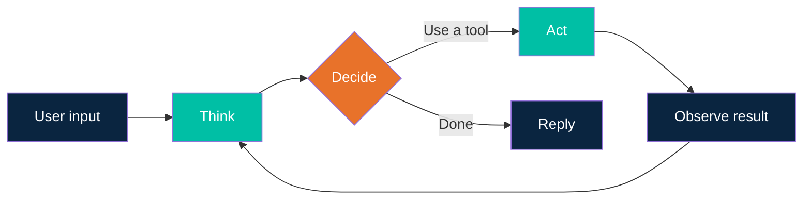
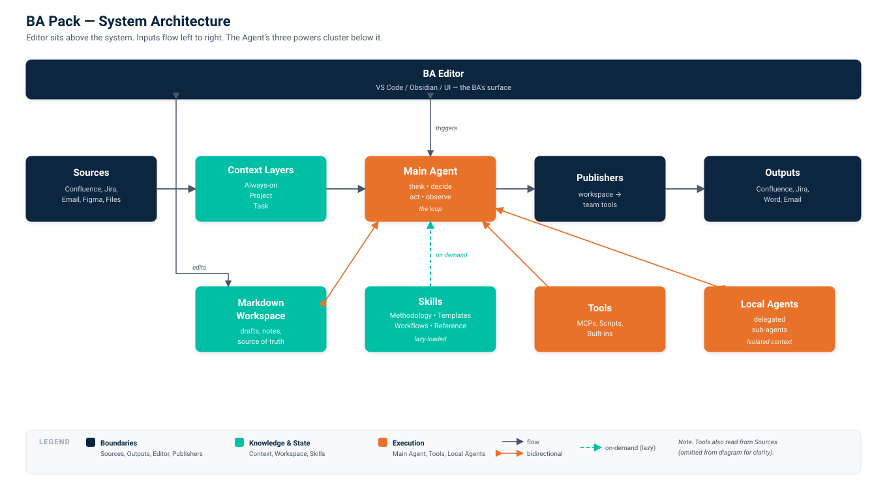

# BA Pack

An agentic toolkit for Business Analysts. Built around BABOK deliverables.

## Chapter 1 — Intro & need

Business Analysts sit between business and engineering. They turn fuzzy business goals into clear, testable work for delivery teams.

The output is a lot: user stories, epics, process maps, business requirements, stakeholder maps, acceptance criteria, traceability matrices, gap analyses, business cases. BABOK (the IIBA's *Business Analysis Body of Knowledge*) catalogues 50+ techniques across six knowledge areas.

Most of this work is text-heavy, repetitive, template-driven. Exactly where an AI agent saves hours. But the agentic tooling that helps developers — Claude Code, MCP servers, hand-written skills — isn't packaged for someone who lives in Jira, Confluence, and Word.

This pack closes that gap. It gives a BA a ready-made agentic toolkit, with skills and prompts mapped to actual BABOK deliverables, so they can:

- Draft user stories and epics from a 5-line brief
- Turn meeting notes into structured requirements
- Generate process maps and acceptance criteria
- Run gap analyses across documents
- Keep traceability between epics, stories, and tests

The aim is to keep the setup light: minimal configs, sensible defaults, and integrations with the tools BAs already use (Jira, Confluence, Word).

## Chapter 2 — How agentic working works

This chapter is the same in every role pack. If you've already read it, skip ahead.

### The agentic loop

A coding assistant answers a question. An agent *does something*. The difference is a loop.



Each turn the agent **thinks**, picks a **tool**, runs it, **observes** the output, and decides whether it's done or needs another step. That's it.

"Tools" can be: read a file, run a Jira search, write a doc, query a database, post a Confluence page, send an email.

For a BA: *"draft user stories from this brief"* might unroll into — read the brief (tool), look up the parent epic (tool), check existing stories so we don't duplicate (tool), draft the new ones, post to Jira (tool), report back.

You give the goal. The agent figures out the loop.

### Context engineering

Here's the part that surprises people:

**The agent has no memory.**

Every conversation starts blank. What looks like "remembering" is actually one of:

- Files the agent reads at the start (instructions, project context)
- Files the agent reads during the loop (your data)
- The visible conversation history
- Output from tools it just ran

All of it lives in the **context window** — a fixed amount of text the model can see at once. That's all it knows. Close the conversation, open a new one — gone.

So the job isn't *teaching* the agent. The job is **putting the right information in the context** at the right time. This is **context engineering**. Three things matter:

| Concern | What it means | Why it matters |
|---|---|---|
| **Fit** | Relevant info must fit in the window | Big projects don't all fit — you select what matters |
| **Relevance** | Only project + current task info, no noise | Irrelevant context dilutes the signal and confuses the agent |
| **Consistency** | No contradictions between sources | If the brief says A and Jira says B, the agent picks one — maybe the wrong one |

A pack helps with all three: it bundles the right files, the right prompts, and the right tool integrations so you don't assemble context by hand every time.

### What this means for you

- A new conversation is a clean slate. Don't expect last week's context to carry over unless you put it back in.
- Short, sharp instructions beat long ones.
- A well-organized workspace (clear briefs, tidy Jira, current Confluence) makes the agent dramatically better — because the context is cleaner.
- Agents read and write plain text best. Markdown is the format they handle natively; richer formats (Confluence wiki markup, Word, PDF) lose information in conversion. The pack uses Markdown internally and converts at the edges.
- The pack does the heavy lifting. But garbage in, garbage out still applies.

## Chapter 3 — What a BA produces

Anchor on BABOK. The IIBA groups BA work into six knowledge areas:

| BABOK area | What it means | Typical output |
|---|---|---|
| Planning & Monitoring | Plan the BA work itself | BA plan, stakeholder engagement plan |
| Elicitation & Collaboration | Get info out of stakeholders | Meeting notes, interview summaries, workshop outputs |
| Requirements Life Cycle Management | Track requirements from idea to release | Traceability matrix, requirements baseline |
| Strategy Analysis | Understand the business need | Business case, current/future state, gap analysis |
| Requirements Analysis & Design Definition | Turn elicitation into structured artifacts | Epics, user stories, use cases, process maps, acceptance criteria |
| Solution Evaluation | Check the solution solved the problem | KPIs, post-implementation reviews |

**Day-to-day, a BA mostly produces:**

- User stories & acceptance criteria — the bread and butter
- Epics & feature briefs — the parent of stories
- Business process maps — current state, future state
- Meeting/workshop notes turned into requirements
- Gap analyses — what's missing between today and the goal
- Stakeholder maps — who cares about what

**Less often, but important:**

- Business cases
- Formal use cases
- Data dictionaries
- Traceability matrices

The pack covers the daily work first, then layers in skills for the less frequent deliverables.

## Chapter 4 — Inputs, sources, and outputs

A BA produces work, but only because they consume a *lot* of information from a lot of places. Before the pack can help, it needs to know **what to read** and **where to write**.

### Inputs — what the BA consumes

The kinds of information that feed BA work:

| Input type | What it is |
|---|---|
| Existing workflows | Current process diagrams, "as-is" maps, runbooks |
| Project documentation | Briefs, specs, requirements, decision logs |
| Meeting & workshop notes | Transcripts, minutes, raw scribbles |
| Architecture constraints | Tech stack, integration limits, NFRs from architects |
| Designs & mocks | Figma frames, sketches, HTML prototypes, screenshots |
| Stakeholder communication | Emails, chat threads, ticket comments |
| Existing backlog | Epics, stories, bugs already in Jira |
| Reference material | Regulations, standards, internal policies |

Not every task needs all of them. A user-story drafting task might pull from a brief + the parent epic + a Figma frame. A gap analysis pulls from current state docs + future state vision. The pack's job is to make picking the right inputs cheap.

### Sources — where those inputs live

The same input can come from many places. Here's where BAs typically find them:

| Source | Common content |
|---|---|
| Confluence | Project docs, specs, decision logs, current/future state pages |
| Jira | Epics, stories, bugs, comments, sprints |
| Email (Outlook) | Stakeholder threads, sign-offs, asks |
| Teams / Slack | Chat threads, channels, quick decisions |
| Meeting tools (Teams, Zoom) | Recordings, transcripts, generated summaries |
| Figma | Designs, mocks, prototypes, design comments |
| Word / PDF | Formal specs, contracts, vendor docs |
| Miro / whiteboard | Workshop boards, journey maps |
| File shares (SharePoint, OneDrive) | Anything that didn't land in Confluence |

How the pack actually connects to each source — MCP servers, plugins, manual exports — is something we'll work out later. For now, just listing where the information lives.

### Outputs — where the BA's work lands

Most BA output lives in two or three places. The pack defaults to those:

| Output | Default location |
|---|---|
| User stories, epics, acceptance criteria | Jira |
| Process maps, requirements docs, gap analyses | Confluence |
| Meeting summaries, decision logs | Confluence (or email for sign-off) |
| Stakeholder maps, traceability matrices | Confluence |
| Formal specs, business cases | Word / PDF in SharePoint |
| Quick comms (asks, updates) | Email or Teams |

You can override defaults per task. But out of the box, the pack writes where the team already looks.

### Why this matters

The agent only knows what it can read, and only writes where it has access. So the first job — before any drafting or analysis — is mapping these three lists for your team: which inputs matter, which sources to pull from, and where the outputs should land. That map shapes everything the pack does next.

## Chapter 5 — A high-level system design

We've covered who the BA is, what they produce, and where their information lives. Now let's sketch the system itself — conceptually, not yet *how* to build it.

There are eight parts:

1. **Inputs** — classified by kind
2. **Context layers** — how info reaches the agent
3. **Workspace** — where the BA and the agent work together
4. **Tools** — what the agent can *do* (MCPs, scripts, integrations)
5. **Skills** — what the agent *knows how to do* (procedures + reference content)
6. **Local agents** — specialized sub-agents the main agent can delegate to
7. **Publishers** — push from the workspace out to the team's tools
8. **Editor** — the BA's interface to the system

### 1. Inputs, classified

Chapter 4 listed *where* information lives. Here we classify it by *kind* — because different kinds need different handling.

| Class | Examples | Notes |
|---|---|---|
| **Structured business docs** | Workflows, decisions, domain models, policies | The backbone — relatively stable, high signal |
| **Unstructured working material** | Meeting notes, workshop scribbles, chat threads | High volume, noisy, often the freshest signal |
| **External customer artifacts** | PDFs, vendor specs, regulator docs | Opaque formats, need extraction first |
| **Architecture references** | ADRs, key arch diagrams, NFRs | Selective — not *all* arch is BA-relevant |
| **Source code** *(optional)* | Repo files, READMEs | Useful for technical BAs or impact analysis |
| **Designs & mocks** | Figma frames, prototypes, sketches | Visual context for stories and acceptance criteria |
| **Communications** | Emails, ticket comments, sign-offs | Decisions and asks often live here, not in docs |
| **Backlog state** | Existing epics, stories, bugs | Avoids duplication, supports traceability |

Different classes need different handling. Structured docs sit close to the agent. Meeting notes get summarized before use. PDFs need extraction. Source code is opt-in.

### 2. Context layers

Inputs don't all enter the agent the same way. We use **progressive disclosure** — start with the minimum, load more only when the task asks for it. That maps to three layers based on *when* information reaches the context:

| Layer | When it loads | What goes here | Example |
|---|---|---|---|
| **Always-on** | Every conversation | Stable, always-relevant facts | Main business flows, glossary, team conventions |
| **Project / topic** | When a conversation starts on a topic | Current scope, recent decisions, parent epic | "We're working on Onboarding Q3 — here's what's in flight" |
| **Task / on-demand** | Pulled mid-conversation as needed | The specific brief, transcript, mock, ticket | "Read story CYD-128 and its parent" |

Layer 1 is the equivalent of `CLAUDE.md` — instructions and facts the agent always sees. Layers 2 and 3 are loaded progressively: project context when the topic comes into focus, task context only when the agent reaches for it. The aim is to keep the window lean — only what's needed, only when it's needed.

Get this split wrong and the agent either drowns in noise (everything always on) or works blind (everything on-demand and forgotten).

### 3. The workspace

The agent and the BA need a shared place to work. **It's a folder of Markdown files** — not Confluence, not Word, not Jira.

Why Markdown:

- Agents read and write it natively, no format conversion loss
- Plain text — diffable, version-controllable, portable
- Tool-agnostic — not all BAs use Confluence; some use Notion, SharePoint, or Word

The workspace is the source of truth *while work is in progress*. Drafts, notes, intermediate analyses, scratch reasoning — all here, all in `.md`. When the work is done, **publishers** push it out to wherever the team actually reads.

### 4. Tools

Tools are the things the agent can *call* to interact with the world. They have execution logic but no methodology — they just do.

| Kind | What it is | Examples |
|---|---|---|
| **MCP servers** | Standardized connectors to external systems | Confluence MCP, Jira MCP, Outlook MCP, Figma MCP |
| **Local scripts** | Bash / Python utilities run on the BA's machine | PDF text extraction, file conversion, screenshot OCR |
| **Built-in tools** | What the host (Claude Code, Copilot, etc.) provides | File read/write, web fetch, search |

Tools are the agent's hands. They're how it reads from sources, writes to outputs, and runs anything beyond text generation.

### 5. Skills

Skills are packaged know-how. Each skill bundles two things:

- **Procedure** — how to do something (e.g. the steps of a fishbone analysis)
- **Reference content** — the relevant business or methodology context the agent needs to do it well

A skill activates only when the task calls for it, so its content reaches the context lazily — fitting the progressive-disclosure model from Section 2.

| Kind | What it provides | Examples |
|---|---|---|
| **Methodology skills** | A BABOK or analysis procedure plus the theory behind it | Fishbone, gap analysis, root cause, MoSCoW, stakeholder analysis |
| **Template skills** | A canonical output format and how to fill it | User story from brief, acceptance criteria, epic outline, meeting summary |
| **Workflow skills** | Multi-step procedures that combine tools and templates | "Draft stories end-to-end" (read brief → check epic → draft → publish) |
| **Reference skills** | Loaded for context, not procedure | Domain glossary, regulatory cheat-sheet, internal policies, team conventions |

Skills are the verbs *and* the reference shelf of the pack. They don't replace tools — they tell the agent *when* and *how* to use them.

### 6. Local agents

Sometimes the main agent needs help. A **local agent** is a specialized sub-agent the main one can spawn and delegate to. Each one has its own focus and — most importantly — its own **isolated context window**.

Why that matters:

- **Context isolation** — the sub-agent reads, searches, and reasons in *its own* window. Only its final result comes back to the main conversation. Your main context stays clean.
- **Background work** — long, noisy tasks (read a 50-page PDF, search every story in an epic, transcribe a 2-hour meeting) don't pollute the main flow.
- **Personality and focus** — each sub-agent can have a tight role: a "story drafter," a "gap analyst," a "stakeholder mapper," a "meeting summariser."

Examples for a BA:

| Sub-agent | Job | Why isolate it |
|---|---|---|
| Meeting digester | Reads transcripts, returns clean summary + decisions | Transcripts are huge and noisy |
| Backlog scanner | Searches existing stories/epics, flags duplicates | Lots of search noise |
| Doc extractor | Pulls relevant sections from PDFs/regulator docs | Source format is messy |
| Gap analyst | Compares current vs future state docs | Heavy reading, narrow output |

Rule of thumb: if a task involves *a lot* of reading, searching, or trial-and-error to produce a small answer — give it to a local agent.

### 7. Publishers

Publishers convert workspace markdown into the formats the team consumes:

- Confluence pages
- Jira epics and stories with proper fields
- Word documents
- Email summaries
- PDF exports

One workspace, many publishing targets. The BA writes once; the publisher handles formatting, field mapping, and posting. Under the hood, publishers use **tools** (the relevant MCPs) to push content out — but the workflow logic of "what to publish where" lives in the publisher.

### 8. The editor

The BA's interface to the system. Could be VS Code, Obsidian, or a purpose-built UI — to be decided. Whatever it is, it must:

- Show the workspace (the markdown files)
- Run the agent on a selection or on the whole workspace
- Trigger skills
- Trigger publishers

### Putting it together



That's the conceptual system. Next chapter: the *how* — what each part is in practice, and how to build a working version yourself.

## Chapter 6 — Build it yourself

You've read the system. You want to use it. Where do you start?

The honest answer: **our reference implementation is TBD.** Until it lands — good news. None of this is hard. You can stand up a working version of the pack with off-the-shelf tools in an afternoon. This chapter is the recipe.

### Before you build — check what already exists

Before going DIY, see if a vendor already covers your case. The closest match for a BA living in Atlassian is **Atlassian Rovo** — AI agents and search built directly into Confluence and Jira. It can summarise pages, draft tickets, search across spaces, and run pre-packaged agents on your content.

Strengths and limits:

- **Strengths**: zero setup if you're already on Atlassian Cloud, deep native access to Confluence/Jira, no MCP wiring, sanctioned by your admin
- **Limits**: requires a paid plan (separate from your normal Atlassian licensing), tied to the Atlassian ecosystem, less flexible than a workspace you control, agents are mostly Atlassian-built

Worth looking at first. If it covers 80% of what you need, the build-it-yourself path may not be worth the effort. If it doesn't — or your work spans tools beyond Atlassian — read on.

### Step 1 — Set up the working environment

Markdown files, in a folder, opened in a real code editor. That's the foundation.

Pick the tools developers already use, because the agentic ecosystem is built around them:

- **Editor**: VS Code — universal, free, great markdown support
- **Agent host**: Claude Code, GitHub Copilot, or OpenCode — all agentic, all work. Pick the one your team already uses or has access to.
- **Version control**: Git — your workspace is text, treat it like code

Why VS Code over Word or Confluence? You get a file tree, fast search across all your docs, side-by-side editing, markdown preview, git history — and most importantly, your agent runs *next to* the files it's reading and writing. No copy-paste between tools.

A starter folder structure, organized around how source material flows in and how BA work flows out:

```
ba-workspace/
├── .claude/
│   ├── skills/                       ← custom skills (Claude Code convention)
│   └── agents/                       ← local agents
├── CLAUDE.md                         ← always-on context (Layer 1 from Chapter 5)
├── INDEX.md                          ← top-level project index
│
│   # Source pipeline (read-only material from outside)
├── raw/                              ← raw fetched content (PDFs, HTML, transcripts)
├── transformed/                      ← cleaned markdown versions of raw/
├── indexes/                          ← per-source catalogs of what's in transformed/
│
│   # Active BA work, organized by BABOK knowledge area
└── business/
    ├── 01-planning-monitoring/       ← BA plan, stakeholder maps
    ├── 02-elicitation-collaboration/ ← meeting notes, interviews, workshops
    ├── 03-requirements-lifecycle/    ← traceability, baselines
    ├── 04-strategy-analysis/         ← current/future state, gap analyses, business cases
    ├── 05-requirements-analysis-design/ ← epics, stories, use cases, process maps
    └── 06-solution-evaluation/       ← KPIs, post-implementation reviews
```

Two clear halves: the **source pipeline** (left side of the system in Chapter 5 — inputs → transformed → indexed) and the **business work** (organized to mirror the BABOK knowledge areas BAs already think in).

### Step 2 — Identify and connect your sources

Pick two sources to start. For most BAs:

- **Business Confluence space** — current state, processes, decisions
- **Architecture Confluence space** — ADRs, system docs, NFRs

Don't wire up everything at once. Two sources working well beats ten sources half-broken.

**Install the Confluence MCP server.** Claude Code and Copilot both support MCP. Atlassian publishes an official MCP for cloud Confluence — configure it once in your agent host's settings.

If you've never set up an MCP server, see [Chapter 15.2 — MCP Overview](../../../technical/15_power-ups/02_mcp-overview.md) for the full walkthrough.

Verify it works by asking the agent: *"List the top-level pages in the Business space."* If you get a real list back, you're connected.

### Step 3 — Set up the source pipeline

The MCP gives the agent the ability to *reach* Confluence. The pipeline gives it a way to *consume* Confluence content efficiently — fetch once, transform once, reuse forever.

The flow has three folders:

1. **`raw/`** — bytes pulled from external sources, untouched. Confluence HTML, PDFs, meeting transcripts, exported docs.
2. **`transformed/`** — the same content, cleaned and converted to markdown. This is what the agent actually reads.
3. **`indexes/`** — one file per source, cataloging what's been pulled and where to find the markdown copy.

Example — `indexes/business.md`:

```markdown
# Business Confluence — Index

Space key: BUS
Last updated: 2026-05-02

| Doc | Source URL | Local copy | Last fetched |
|---|---|---|---|
| Onboarding flow | https://confluence/.../onboarding | transformed/business/onboarding.md | 2026-04-30 |
| Payment flow | https://confluence/.../payments | transformed/business/payments.md | 2026-04-30 |
| Refund process | https://confluence/.../refunds | transformed/business/refunds.md | 2026-05-01 |
| Customer model | https://confluence/.../customer | transformed/business/customer.md | 2026-04-28 |
```

A second index — `indexes/architecture.md` — does the same for ADRs and architecture pages.

At the project root, an `INDEX.md` ties everything together — what sources exist, what work is in flight, what's recently shipped:

```markdown
# Project Index

## Sources
- [Business Confluence](indexes/business.md)
- [Architecture Confluence](indexes/architecture.md)

## Active work
- [Onboarding Q3 epic](business/05-requirements-analysis-design/epics/onboarding-q3.md)
- [KYC gap analysis](business/04-strategy-analysis/kyc-gap-2026-04.md)

## Recently shipped
- [Payment refunds redesign](business/05-requirements-analysis-design/epics/payment-refunds.md) — published 2026-04-15
```

The agent reads the indexes to know what's available locally, reads `transformed/` for content, and falls back to the MCP only when something new is needed.

### Step 4 — Create a load-and-cache skill

Fetching pages over MCP every conversation is slow and burns context. Wrap the pipeline in a skill — the agent calls the skill, the skill handles fetch/transform/index transparently.

Skills live in `.claude/skills/` (Claude Code's convention). Example — `.claude/skills/load-business-context.md`:

```markdown
---
name: load-business-context
description: Load business processes and domain knowledge from indexed Confluence content
---

When the user asks about business processes, customer flows, or domain concepts:

1. Read `indexes/business.md` to see what's already available locally
2. Read the relevant entries from `transformed/business/` based on the question
3. If the user asks about a topic NOT in the index:
   a. Fetch the page via the Confluence MCP, save raw bytes to `raw/business/`
   b. Convert to markdown, save to `transformed/business/`
   c. Add a row to `indexes/business.md`

Default to the cached transformed copy. Only re-fetch when:
- The cached entry is older than 7 days, OR
- The user explicitly asks for fresh content
```

A second skill (`load-arch-context`) does the same for architecture.

This is context engineering in practice: the skill knows *what* to load, *when* to load it, and *where* to put it so the agent finds it again next time. Same idea applies to local agents — a "doc digester" agent in `.claude/agents/` can run a heavy transformation in isolation and just hand back the result.

### Step 5 — Organize the business folders by BABOK

The `business/` folder is where you and the agent actually work. Organizing it by BABOK knowledge area means the structure matches how BAs already think — and gives skills a stable place to drop their output.

```
business/
├── 01-planning-monitoring/
│   ├── ba-plan.md
│   └── stakeholder-map.md
├── 02-elicitation-collaboration/
│   ├── meetings/
│   │   └── 2026-04-30-onboarding-workshop.md
│   └── interviews/
├── 03-requirements-lifecycle/
│   └── traceability.md
├── 04-strategy-analysis/
│   ├── kyc-gap-2026-04.md
│   ├── business-cases/
│   └── current-future-state/
├── 05-requirements-analysis-design/
│   ├── epics/
│   │   └── _template.md
│   ├── stories/
│   │   └── _template.md
│   ├── use-cases/
│   ├── process-maps/
│   └── acceptance-criteria/
└── 06-solution-evaluation/
    └── kpis.md
```

Each area gets templates so output stays consistent. Example — `business/05-requirements-analysis-design/epics/_template.md`:

```markdown
# Epic: <name>

**Status**: draft | in-progress | done
**Owner**: <BA name>
**Confluence**: <URL once published>
**Jira**: <epic key once created>

## Problem
<what business problem this solves>

## Scope
<what's in, what's out>

## Stakeholders
<who cares>

## Stories
<list of child stories — links once they exist>

## Decisions
<key decisions made along the way>
```

Same pattern for story, analysis, and meeting templates inside their respective BABOK areas. Templates are how the agent produces consistent output.

Not every team uses every BABOK area heavily — you can start with two or three folders and add the rest only when you actually have work that lives there.

### Step 6 — Wire it all together in CLAUDE.md

`CLAUDE.md` is the always-on context — Layer 1 from Chapter 5. Put the things the agent needs *every* conversation.

Example:

```markdown
# BA Workspace — Onboarding Domain

## Who I am
I'm Anna, BA on the Onboarding squad at AcmeCo.

## What I work on
- New customer onboarding flow
- KYC integration
- Document collection

## Core business context (always loaded)
The agent should keep these facts in mind for every conversation:

- **Customer types**: Individual, SMB, Enterprise. KYC requirements differ by type.
- **Onboarding stages**: Sign-up → Identity check → Document upload → Approval → Activation
- **Critical SLAs**: Identity check < 24h, full activation < 5 business days
- **Regulators**: We operate under EU AML directives; KYC must be auditable.
- **Glossary**: see `transformed/business/glossary.md` (load via `load-business-context` skill on demand for full detail)

## Workspace structure
- Source material (read-only): `transformed/`, cataloged in `indexes/`
- Active work, organized by BABOK area: `business/`
  - Strategy, gap analyses, business cases → `business/04-strategy-analysis/`
  - Epics, stories, process maps, acceptance criteria → `business/05-requirements-analysis-design/`
  - Meeting notes, workshop outputs → `business/02-elicitation-collaboration/`
  - Traceability → `business/03-requirements-lifecycle/`
- Top-level project index: `INDEX.md`

## How to find information
Always start from the indexes — they are the table of contents for the workspace.

1. Check `INDEX.md` for the overall project map (active work, sources, recent output)
2. For source content: check `indexes/business.md` and `indexes/architecture.md` to find the relevant topic, then read the linked file under `transformed/`
3. Only fetch from external sources via MCP if the topic isn't already in an index
4. For active work: scan `business/<area>/` for the relevant BABOK area

Never grep across the whole workspace blindly. Indexes first, content second.

## Conventions
- Stories use `business/05-requirements-analysis-design/stories/_template.md`
- Epics use `business/05-requirements-analysis-design/epics/_template.md`
- Meeting notes go to `business/02-elicitation-collaboration/meetings/YYYY-MM-DD-<topic>.md`
- Never edit files in `raw/` or `transformed/` by hand — they're regenerated from sources

## When to use which skill
- Questions about business processes → `.claude/skills/load-business-context`
- Questions about system architecture → `.claude/skills/load-arch-context`
- Drafting a story → use the story template + business context

## Sources
- Business Confluence: `indexes/business.md`
- Architecture Confluence: `indexes/architecture.md`

## Outputs
- Stories → Jira project ONBOARD
- Documents → Confluence space ONB
- Sign-offs → email the squad lead
```

The agent now knows your role, your tools, your conventions, your sources, and your outputs. Every conversation starts grounded.

### What you've built

- A markdown workspace organized by BABOK knowledge area
- A source pipeline: `raw/` → `transformed/` → `indexes/`
- An MCP connection that reads from Confluence on demand
- Skills (in `.claude/skills/`) that load and cache content efficiently
- Templates per BABOK area for consistent output
- A `CLAUDE.md` that ties it all together

That's the BA pack — built by hand, in an afternoon, with tools that already exist.

When the reference implementation lands, it'll automate most of this and add the publishers and editor sketched in Chapter 5. Until then, this works.
