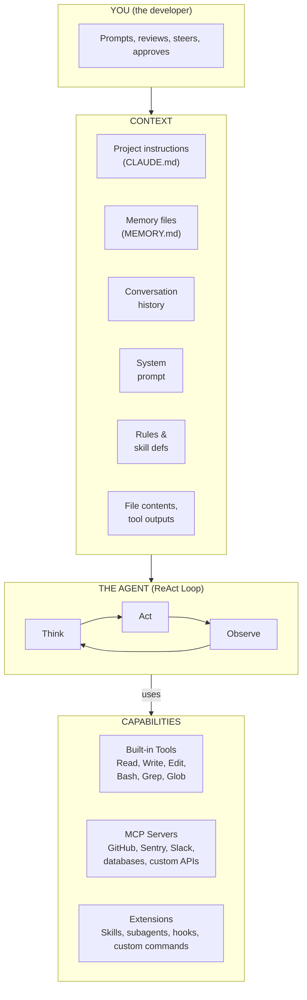
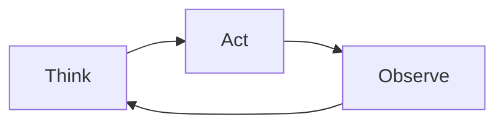
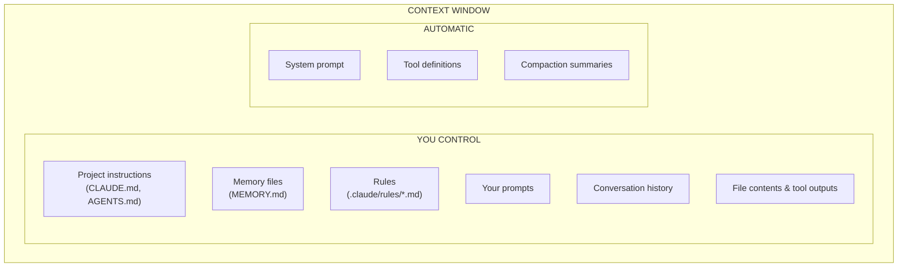
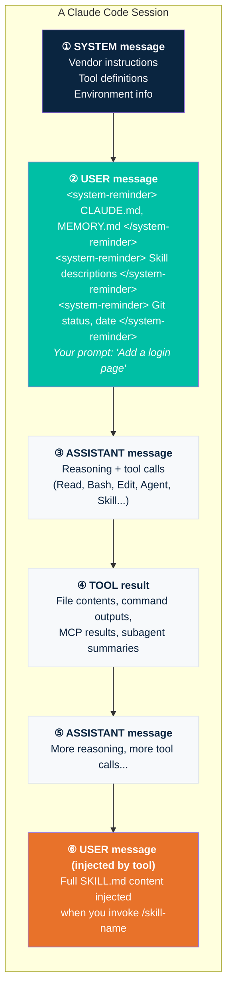
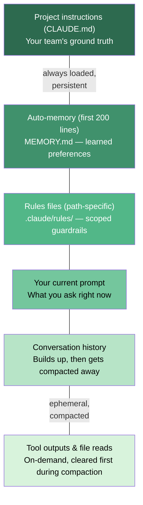
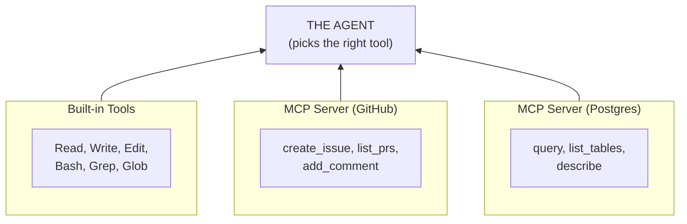
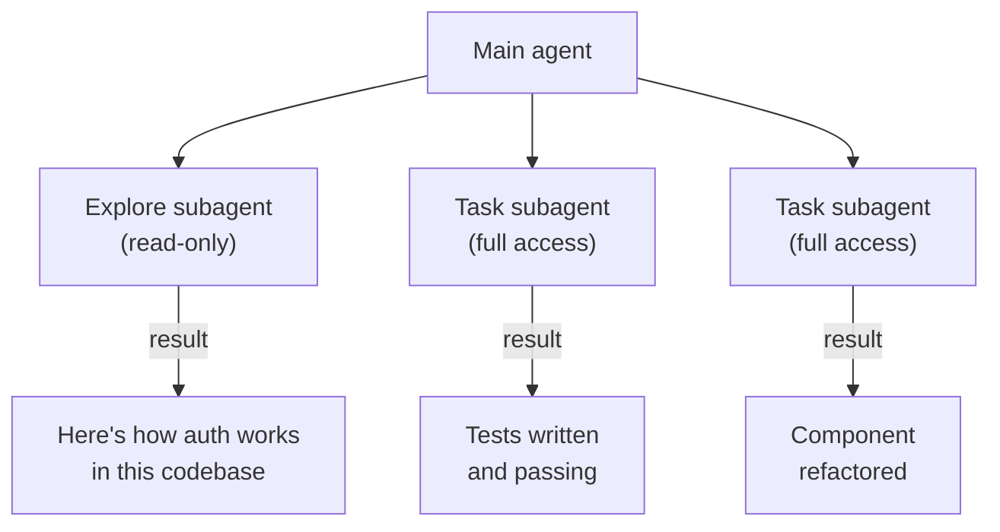
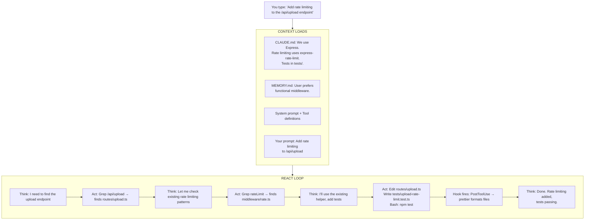
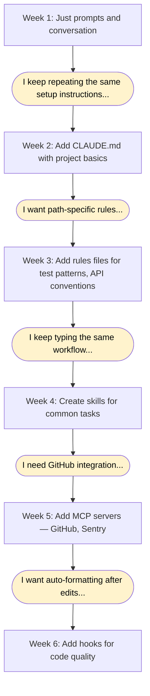

# Chapter 4 — The Big Picture

**Time:** 45 min

In the previous chapters you zoomed in: what agents are, how to prompt them, how to code with them. Now step back. Look at the whole machine.

This chapter gives you a mental model of how an AI coding agent actually works — not the marketing version, but the architecture. Once you see the full picture, you stop guessing and start controlling.

---

## The Architecture at a Glance

Every AI coding agent — Claude Code, GitHub Copilot, Cursor — follows the same basic architecture. Four layers, one loop.



Four layers:

1. **You** — the developer who provides intent and judgment
2. **Context** — everything the agent knows when it starts thinking
3. **The Agent** — the ReAct loop that reasons and acts
4. **Capabilities** — the tools and extensions the agent can use

The agent sits in the middle. Context flows down into it. It reaches out to capabilities to act. You sit on top, steering. Understanding these layers — and which parts you control — is the key to working effectively with agents.

---

## The Agent: The ReAct Loop

At the center of everything is a loop. Not code you write. Not a plugin you install. A reasoning pattern called **ReAct** (Reason + Act).



When you give an agent a task, it doesn't execute a script. It **reasons** about what to do, **acts** using a tool, **observes** the result, and then **reasons** again about what to do next. This cycle repeats until the task is done or the agent decides it needs your input.

A simple example — "fix the failing test in auth.test.ts":

| Step | Phase | What happens |
|------|-------|-------------|
| 1 | Think | "I need to read the test file to understand the failure" |
| 2 | Act | Reads `auth.test.ts` |
| 3 | Observe | Sees the test expects a 200 but gets a 401 |
| 4 | Think | "The auth middleware might be blocking. Let me check." |
| 5 | Act | Reads `middleware/auth.ts` |
| 6 | Observe | Finds a missing token validation path |
| 7 | Think | "I need to add a check for expired tokens" |
| 8 | Act | Edits `middleware/auth.ts` |
| 9 | Observe | File saved |
| 10 | Think | "Let me verify the fix by running the test" |
| 11 | Act | Runs `npm test auth.test.ts` |
| 12 | Observe | Test passes |
| 13 | Think | "Done. The fix handles expired tokens correctly." |

This loop is what makes agents different from chat assistants. A chat assistant would stop at step 3 and say "here's what you could try." The agent keeps going.

**You don't control the loop itself.** You control what goes into it (context) and what it can do (capabilities). That's where your leverage is.

---

## Context: The Most Important Layer

Here's the truth about AI coding agents: **the agent has no memory**. Every time you start a new session, it knows nothing about your project. Nothing about your preferences. Nothing about what you did yesterday.

Everything the agent knows comes from **context** — the information loaded into its context window at the start of a session and accumulated during the conversation. Context is your primary lever for making agents reliable.

### What Makes Up the Context



### The Control Matrix

| Context source | What it is | Who writes it | When it loads | Persists across sessions |
|---|---|---|---|---|
| System prompt | Vendor's core behavior rules, tone, and safety guardrails — invisible to you, not editable | Tool vendor | Session start | Always |
| Tool definitions | Schemas for every tool the agent can call (Read, Bash, Edit, MCP tools, etc.) | Built-in + MCP config | Session start | Always |
| Project instructions (CLAUDE.md) | Your team's ground truth — conventions, stack, workflow rules. Lives in the repo root. | You | Session start | Yes |
| User instructions (~/.claude/CLAUDE.md) | Personal preferences that apply to all your projects (e.g., "always use dark mode in examples") | You | Session start | Yes |
| Rules (.claude/rules/) | Scoped guardrails that activate only when the agent touches matching file paths (e.g., "*.test.ts" rules) | You | On demand (path-scoped) | Yes |
| Auto-memory (MEMORY.md) | Agent-maintained notes about your preferences and project context. First 200 lines are loaded. | Agent (you can edit) | Session start (200 lines) | Yes |
| Skill descriptions | One-line summaries from each skill's frontmatter — the agent's routing table for `/commands` | You | Session start | Yes |
| Your prompt | What you type right now — the most direct but least persistent form of context | You | When you type | No (session only) |
| Conversation history | Every message exchanged during the session — builds up, then gets compacted | You + agent | Accumulated | No (session only) |
| File contents | Code the agent reads from your codebase on demand — ephemeral, first to be compacted | Codebase | On demand (agent reads) | No (session only) |
| Tool outputs | Results from running commands, searches, MCP calls — ephemeral | Tools | On demand (agent runs) | No (session only) |
| Compaction summaries | Automatic summaries the agent creates when context fills up — you don't control what's kept | Agent | When context fills | No |

Here's what each of these looks like in practice:

**System prompt** — The vendor's built-in instructions. You never see the full text, but it tells the agent things like "you are Claude Code, an AI coding assistant" and defines its core behavior. You can't edit it.

**Tool definitions** — Each tool the agent can use has a description: what it does, what parameters it takes. The agent reads these to decide which tool fits. When you add MCP servers, their tool definitions get added here too — which is why many MCP servers means more context consumed.

**Project instructions (CLAUDE.md)** — Your team's ground truth. Lives in the repo root. Every session starts by reading this file. This is where you put tech stack, conventions, and guardrails.

```markdown
# CLAUDE.md
- We use TypeScript strict mode with Vitest for testing
- API routes go in src/routes/, one file per resource
- Never use `any` — use `unknown` and narrow
- Run `npm run lint` before committing
```

**In GitHub Copilot:** the equivalent is `.github/copilot-instructions.md` — a single markdown file auto-included in every chat and agent session. Copilot also reads `CLAUDE.md` for cross-tool compatibility, so a team can maintain one file that works with both agents.

**User instructions (~/.claude/CLAUDE.md)** — Like project instructions, but personal. Applies to all your projects. Good for editor preferences, commit style, or tools you always want available.

**Rules (.claude/rules/)** — Scoped instructions that load only when the agent touches matching files. This is the least-known but most powerful targeting mechanism. Each rule file has a `globs` frontmatter that controls when it activates.

```markdown
# .claude/rules/api-routes.md
---
globs: src/routes/**/*.ts
---
- Every route must validate input with zod
- Return standard error format: { error: string, code: number }
- Always add rate limiting middleware
```

Rules are invisible until the agent reads or edits a file matching the glob. Then they inject into context automatically. Think of them as "if the agent touches this area, remind it of these constraints."

**In GitHub Copilot:** the equivalent is `.github/instructions/*.instructions.md`. Same idea — scoped markdown files with YAML frontmatter — but the key is `applyTo` instead of `globs`:

```markdown
# .github/instructions/api-routes.instructions.md
---
applyTo: "src/routes/**/*.ts"
---
- Every route must validate input with zod
- Return standard error format: { error: string, code: number }
```

VS Code agent mode also reads `.claude/rules/` for cross-tool compatibility.

**Auto-memory (MEMORY.md)** — The agent writes this file to remember things across sessions: your preferences, patterns it learned, corrections you made. The first 200 lines load automatically. You can edit it directly — it's just a markdown file.

**In GitHub Copilot:** Copilot Memory (agentic memory) serves a similar purpose but works differently. Instead of a file you edit, Copilot autonomously discovers and stores repository-level facts — conventions, architecture, dependencies — with citations back to the code. Memories auto-expire after 28 days but renew if validated. You can't edit the memory directly; the system manages it. The Claude Code approach (a plain markdown file) gives you more control; the Copilot approach is more hands-off.

**Skill descriptions** — When you define skills (`.claude/skills/`), their names and descriptions load at session start so the agent knows what's available. The full skill content only loads when invoked.

**Your prompt** — What you type. The most direct but least persistent form of context.

**Conversation history** — Every message you and the agent exchange. Builds up during a session but gets summarized (compacted) when the context window fills up. Important details can be lost during compaction.

**File contents & tool outputs** — What the agent reads from your codebase or gets back from running commands. These are ephemeral — first to be compacted away in long sessions.

**Compaction summaries** — When context fills up, the agent summarizes older messages to free space. You don't control what gets kept or dropped. This is why persistent context (CLAUDE.md, rules) matters more than things you said 50 messages ago.

### How Context Maps to the Message Model

Under the hood, every LLM conversation is a sequence of **messages** with roles. Understanding where each context type lands helps you design better instructions and debug problems when the agent doesn't behave as expected.

#### The four message roles

Every message in the conversation has one of four roles:

| Role | What it carries | Who creates it |
|---|---|---|
| **system** | Vendor instructions, tool definitions, environment info | The tool (invisible to you) |
| **user** | Your prompts + injected annotations | You (and the tool on your behalf) |
| **assistant** | Agent reasoning, tool calls, text responses | The model |
| **tool** | Results from Read, Bash, Grep, MCP calls, subagent results | The tool execution environment |

The **system message** is the first message in every conversation. It contains the vendor's core instructions — behavior rules, tool usage protocols, tone guidelines, environment details (OS, shell, working directory), and the full definitions of every available tool. It does **not** contain your project files, your CLAUDE.md, or your memory.

So where does your project context go?

#### Discovering where CLAUDE.md actually lands

The official documentation says CLAUDE.md is "loaded into context." But what does that mean exactly? Which message does it end up in?

You can find out by asking the agent to introspect. Try prompting: *"Describe how you received my CLAUDE.md content. What message role is it in? What tags wrap it?"*

When you do this, you discover something surprising: **your CLAUDE.md is not in the system message.** Instead, it's injected as a `<system-reminder>` annotation inside a user message. Here's what the agent actually sees (simplified):

```
SYSTEM MESSAGE:
  "You are Claude Code, Anthropic's official CLI..."
  [tool definitions]
  [environment info]

USER MESSAGE:
  <system-reminder>
  Contents of /your-project/CLAUDE.md:
  [your project instructions]

  Contents of ~/.claude/projects/.../memory/MEMORY.md:
  [your auto-memory]
  </system-reminder>

  <system-reminder>
  Available skills:
  - commit: Use when the user asks to commit...
  - review-pr: Use when reviewing pull requests...
  </system-reminder>

  "Please add a login page"     ← your actual prompt
```

The `<system-reminder>` tags are part of the user message text, not separate messages. The agent's system prompt tells it to treat these tags as authoritative instructions — so they carry high priority despite not being in the actual system message.

> **Why does it work this way?** The system message is controlled by the vendor (Anthropic, GitHub, etc.). Your project context rides alongside your prompts in user messages, where it's easy to inject, update, and re-inject. The trade-off: unlike the system message (which is never compacted), `<system-reminder>` content on user messages *can* be compacted in very long sessions. In practice, Claude Code re-injects key annotations periodically to compensate.

#### The full message flow

Here's how a complete conversation looks, from session start through skill invocation and subagent execution:



#### Where each config file lands — the complete map

| What you define | Where it lands | When loaded | Context isolation |
|---|---|---|---|
| CLAUDE.md, MEMORY.md | `<system-reminder>` annotation on user messages | Session start, re-injected periodically | Shared — in your main conversation |
| Rules (`.claude/rules/`) | `<system-reminder>` annotation on user messages | When glob pattern matches touched files | Shared |
| Skill name + description | `<system-reminder>` annotation on user messages | Session start, re-injected periodically | Shared |
| Skill full content | New **user message** in the conversation | Only when you invoke `/skill-name` | Shared — skill sees your full conversation history |
| Skill with `context: fork` | **Subagent's prompt** (isolated context) | Only when invoked | **Isolated** — no conversation history, result returns as tool result |
| Subagent (Agent tool) | Subagent's own system + user messages | When the agent spawns it | **Isolated** — separate context window |
| Subagent result | **Tool result** in main conversation | After the subagent finishes | Shared (just the summary) |
| Custom agent (Copilot `.agent.md`) | That agent's **system message** | When you invoke `@agent-name` | **Isolated** — separate context window |

#### Skills: shared context vs. isolated context

By default, a skill shares your session context. When you type `/my-skill`, the full SKILL.md content is injected as a new user message in your existing conversation. The agent can see everything — your prior messages, files it read, decisions you made. The skill builds on your current session.

But sometimes you want a skill to run in isolation — like a subagent. Add `context: fork` to the skill's frontmatter:

```yaml
---
name: deep-research
description: Research a topic thoroughly
context: fork
agent: Explore
---

Research $ARGUMENTS thoroughly:
1. Find relevant files using Glob and Grep
2. Read and analyze the code
3. Summarize findings with specific file references
```

With `context: fork`:
1. A new, isolated context is created (no conversation history)
2. The skill content becomes the subagent's prompt
3. The `agent` field picks the execution environment (model, tools, permissions)
4. The result is summarized and returned to your main conversation as a **tool result**

This is the bridge between skills and agents: **a forked skill is functionally a subagent** — it just uses the simpler skill file format.

| | Default skill | Skill with `context: fork` |
|---|---|---|
| **Sees conversation history?** | Yes | No |
| **Where content lands** | User message in main conversation | Subagent's prompt (isolated) |
| **Result delivery** | Agent continues in same conversation | Summary returned as tool result |
| **Use when** | Skill needs session context (prior decisions, files read) | Skill is self-contained and shouldn't pollute main context |

#### Auto-triggering and how to control it

Skills can be invoked in two ways:

1. **Manual** — you type `/skill-name`
2. **Auto-triggered** — the agent reads the skill description and decides it's relevant to your request

Auto-triggering is controlled entirely by the **description field** in the skill's frontmatter. The description is the agent's routing table. A description like *"Use when creating REST API integration tests"* tells the agent exactly when to activate — if you ask it to write API tests, it will invoke the skill automatically.

To prevent auto-triggering, write the description so it doesn't match common requests. For example:
- `"Use when the user explicitly asks to run the deployment checklist"` — the word "explicitly" signals manual-only intent
- Keep the description narrow and specific rather than broad

There is no `auto_invoke: false` frontmatter field. The description text is the only mechanism.

#### Parallel execution

When the agent needs to do multiple independent things, it can make **multiple tool calls in a single assistant message**. This includes spawning multiple subagents at once:

```
ASSISTANT message:
  Tool call 1: Agent("Research authentication patterns")
  Tool call 2: Agent("Find all API endpoints")
  Tool call 3: Agent("Check test coverage")
```

All three subagents run in parallel, each in its own isolated context. Their results come back as three separate tool results. The main agent then synthesizes them.

This works because subagents are just tool calls — and the runtime can execute independent tool calls concurrently. The same applies to any combination of tools: the agent can read a file, run a command, and spawn a subagent all in one message.

Skills with `context: fork` also run as subagents, so they can be parallelized the same way. Default skills (without `context: fork`) cannot run in parallel — they inject content into the main conversation sequentially.

#### Practical implications

**Skill descriptions are always in context** — 20 skills with one-line descriptions cost almost nothing. But invoking a skill with a 500-line playbook adds all 500 lines to your conversation. Design skill content to be as concise as it needs to be, no more.

**The conversation alternates:** system message sets vendor behavior → `<system-reminder>` annotations deliver your project context alongside your first prompt → you send prompts (user) → the agent reasons and calls tools (assistant) → tools return results → the agent reasons again → and so on. Compaction summarizes older messages, but the system message stays intact and key annotations are re-injected. This is why CLAUDE.md outlasts anything you say in conversation.

**Subagents protect your main context.** Heavy research tasks (reading dozens of files, searching broadly) are better delegated to subagents. They do the work in their own context and return only a summary. Your main conversation stays lean.

### The Hierarchy of Context

Not all context is equal. Here's the priority, from most to least reliable:



**The takeaway:** If something matters, put it in CLAUDE.md or a rules file. Don't rely on saying it once in conversation — it will get compacted away in long sessions.

### Why Context Is Everything

The agent starts every session blank. It doesn't remember your last conversation. It doesn't know your project uses Tailwind or that you prefer functional components. It doesn't know your test runner is Vitest, not Jest.

Context is how you teach it — every single time. The good news: you can automate most of that teaching.

```
Session 1:  "We use TypeScript with strict mode."
Session 2:  "We use TypeScript with strict mode."   ← you again
Session 3:  "We use TypeScript with strict mode."   ← still you

  vs.

CLAUDE.md:  "We use TypeScript with strict mode."   ← once, always loaded
```

This is the most important lesson in this chapter: **invest in your persistent context files**. A well-crafted CLAUDE.md is worth more than perfect prompting.

---

## Capabilities: What the Agent Can Do

The agent reasons. But reasoning alone doesn't ship code. It needs **tools** — the hands that turn thoughts into actions.

### Built-in Tools

Every agent ships with a core set of tools. These are always available, no configuration needed.

| Tool | What it does | Category |
|------|-------------|----------|
| **Read** | Read file contents | File operations |
| **Write** | Create new files | File operations |
| **Edit** | Modify existing files (line-level diffs) | File operations |
| **Glob** | Find files by name pattern (`**/*.ts`) | Search |
| **Grep** | Search file contents with regex | Search |
| **Bash** | Run any shell command (tests, builds, git) | Execution |
| **Agent** | Spawn subagents for parallel/isolated work | Orchestration |
| **WebFetch** | Fetch URLs, convert to markdown | Web |
| **WebSearch** | Search the web | Web |

These tools map directly to the ReAct loop. The agent **thinks** about what to do, then **acts** using one of these tools, then **observes** the result.

**In GitHub Copilot:** agent mode has a similar set — file read/edit, terminal execution, text and file search, web fetch — plus a few extras like `usages` (find references via LSP) and `rename` (LSP-powered refactoring across files). The Copilot coding agent on GitHub.com adds CodeQL security analysis and secret scanning. The tool names differ but the categories are the same.

You don't choose which tool the agent uses — it decides based on context. But you influence the choice. "Search the codebase for usages of `getUserById`" nudges it toward Grep. "Create a new component" nudges it toward Write.

**Permissions** are how you control tool access:

| Mode | What the agent can do |
|------|----------------------|
| **Plan mode** | Read-only. Agent can think and search but not change anything. |
| **Default** | Agent asks before risky actions (Bash commands, file writes). |
| **Auto-accept edits** | File edits go through without asking. Bash still asks. |
| **Full auto** | Everything goes through. Use with caution. |

You cycle between modes with `Shift+Tab` during a session. Start with plan mode to explore, then switch to default for implementation.

**In GitHub Copilot:** similar tiers exist. VS Code offers Default Approvals (confirm each tool), Bypass Approvals (auto-approve all), and Autopilot (auto-approve + continue autonomously). Copilot CLI has Interactive (default), Plan mode (`Shift+Tab`), and Autopilot (`Shift+Tab` again). The coding agent on GitHub.com always requires a human-reviewed PR — there's no fully autonomous mode for merged code.

### MCP Servers: Extending the Toolbox

Built-in tools cover files, search, and shell commands. But what about GitHub issues? Slack messages? Database queries? Sentry errors?

That's what **MCP** (Model Context Protocol) does. It's an open standard that lets you plug external services into your agent as new tools.



After configuration, MCP tools look just like built-in tools to the agent. It can call `create_issue` as naturally as it calls `Read`.

**Configuration scopes:**

| Scope | File | Shared with team | Use case |
|-------|------|-----------------|----------|
| Project | `.mcp.json` (repo root) | Yes (via git) | Team tools: shared database, project Sentry |
| User | `~/.claude.json` | No | Personal tools: your Slack, your GitHub |
| Local | `~/.claude.json` (project path) | No | Local dev: your database, your API keys |

**The trade-off:** Each MCP server adds tool definitions to your context window. More servers = less room for everything else. Claude Code handles this with **Tool Search** — when MCP tools exceed ~10% of context, it loads tool descriptions on demand instead of all at once.

**In GitHub Copilot:** MCP configuration lives in `.vscode/mcp.json` (workspace-level, shareable via git) or your user-profile `mcp.json`. Both stdio and SSE transports are supported. Enterprise admins can configure MCP registries with allowlists to control which servers teams can use.

---

## Extensions: Customizing the Agent

Tools let the agent act. Extensions let you shape **how** it acts.

### Skills: Reusable Instructions

A skill is a markdown file that teaches the agent a workflow. Think of it as a macro — instead of typing the same instructions every session, you save them as a skill.

```markdown
# .claude/skills/api-endpoint/SKILL.md
---
name: api-endpoint
description: Create a new REST API endpoint following project conventions
allowed-tools: Read, Write, Edit, Bash, Grep
---

When creating a new API endpoint:

1. Check existing endpoints in src/routes/ for patterns
2. Create route file in src/routes/
3. Add request/response types in src/types/
4. Write tests in tests/routes/
5. Update the route index in src/routes/index.ts
6. Run tests to verify
```

Now you type `/api-endpoint POST /users/reset-password` and the agent follows your workflow, not its own improvisation.

**Where skills live:**

| Location | Scope | Shared |
|----------|-------|--------|
| `.claude/skills/` | Project | Yes, via git |
| `~/.claude/skills/` | User (all projects) | No |

**In GitHub Copilot:** two mechanisms cover this. **Agent skills** use `SKILL.md` files in `.github/skills/` or `.agents/skills/` — same concept, similar frontmatter (`name`, `description`, `argument-hint`), invoked via `/skill-name`. **Prompt files** (`.prompt.md`) are a lighter alternative — markdown files you invoke via `/prompt-name` in chat. Copilot also reads `.claude/skills/` for cross-tool compatibility.

### Subagents: Delegation

When a task is complex, the agent can spawn **subagents** — isolated instances that handle a subtask and return a summary.



Built-in subagent types:

| Type | Access | Best for |
|------|--------|----------|
| **Explore** | Read-only | Codebase research, finding patterns |
| **Plan** | Read-only | Designing implementation approach |
| **General-purpose** | Full | Complex multi-step tasks |

You can also create custom subagents with restricted tools, specific models, and tailored instructions — useful for enforcing patterns across a team.

**In GitHub Copilot:** the coding agent uses built-in specialized subagents — Explore (codebase analysis), Task (builds/tests), Code Review, and Plan. Beyond that, Copilot supports **custom agents** defined as `.agent.md` files with YAML frontmatter (`name`, `description`, `tools`, `mcp-servers`). You invoke them via `@agent-name` — for example, `@docs-agent` or `@security-agent`. This goes further than Claude Code's subagent model by letting you define named personas with restricted toolsets.

### Hooks: Automation at Lifecycle Points

Hooks are shell commands or scripts that fire at specific moments in the agent's lifecycle.

| Hook | Fires when | Example use |
|------|-----------|-------------|
| `PreToolUse` | Before the agent uses a tool | Block edits to protected files |
| `PostToolUse` | After a tool succeeds | Auto-format code after edits |
| `Stop` | Agent finishes responding | Run linter on changed files |
| `SessionStart` | Session begins | Inject dynamic context |
| `UserPromptSubmit` | Before processing your prompt | Validate or enrich prompts |

Hooks give you **guardrails and automation** without changing how the agent reasons. The agent doesn't know about your hooks — they run around it, not through it.

**In GitHub Copilot:** hooks live in `.github/hooks/*.json` and support eight lifecycle events: `sessionStart`, `sessionEnd`, `userPromptSubmitted`, `preToolUse`, `postToolUse`, `agentStop`, `subagentStop`, and `errorOccurred`. Each hook specifies a shell command, receives JSON input about the agent action, and can approve or deny tool executions. The concept is the same — guardrails that run around the agent, not through it.

---

## Putting It All Together

Now you see the full picture. Here's how the layers interact in a real workflow:



Notice what happened:

- **CLAUDE.md** told the agent the tech stack and test location — you didn't need to say it
- **MEMORY.md** shaped the style — functional middleware, not a class
- **Built-in tools** (Grep, Edit, Write, Bash) did the actual work
- **A hook** (prettier) auto-formatted without the agent knowing
- **Your prompt** was 8 words — the context did the rest

---

## What This Means for You

Understanding the big picture changes how you work with agents. Here are the practical implications:

### 1. Invest in persistent context, not perfect prompts

Your prompt is maybe 50 words. Your CLAUDE.md is loaded every session and can be thousands of words. One hour spent writing a good CLAUDE.md pays off across hundreds of sessions.

| Investment | Impact | Persistence |
|-----------|--------|------------|
| Better prompt | This task | Gone next session |
| Better CLAUDE.md | Every task | Permanent (version-controlled) |
| Better rules files | Specific file patterns | Permanent |
| Better skills | Specific workflows | Permanent |

### 2. Understand what you control

| You control fully | You influence | You don't control |
|---|---|---|
| CLAUDE.md | Tool selection | System prompt |
| Rules files | Subagent delegation | Compaction strategy |
| Skills | Auto-memory content | ReAct reasoning |
| MCP configuration | Conversation flow | Tool definitions |
| Hooks | | |
| Permission modes | | |
| Your prompts | | |

Don't fight the things you can't control. Work with them. If the agent picks the wrong tool, adjust your prompt context. If compaction loses important instructions, put them in CLAUDE.md instead.

### 3. Build your system incrementally

You don't need to configure everything on day one. Start simple and layer up as you hit friction:



Each layer solves a real friction you've experienced. Don't pre-optimize.

### 4. The agent learns your project through context, not experience

Unlike a human teammate, the agent won't gradually "get" your codebase. It starts fresh every time. But unlike a human teammate, it reads your entire CLAUDE.md in under a second and follows it perfectly.

This is the mental shift: stop thinking of the agent as a junior developer who learns over time. Think of it as an expert who arrives each morning with amnesia — but reads your briefing document cover to cover before starting work.

Your job is to make that briefing document excellent.

---

## Cross-Tool Reference

The architecture is the same across agents. The file names differ.

| Feature | Claude Code | GitHub Copilot |
|---|---|---|
| Project instructions | `CLAUDE.md` | `.github/copilot-instructions.md` (also reads `CLAUDE.md`) |
| Scoped rules | `.claude/rules/*.md` (`globs:`) | `.github/instructions/*.instructions.md` (`applyTo:`) |
| Memory | `MEMORY.md` (editable file) | Copilot Memory (auto-managed, 28-day expiry) |
| Skills | `.claude/skills/SKILL.md` | `.github/skills/SKILL.md` + `.prompt.md` files |
| MCP config | `.mcp.json` / `~/.claude.json` | `.vscode/mcp.json` / user `mcp.json` |
| Hooks | `.claude/settings.json` (`hooks`) | `.github/hooks/*.json` |
| Subagents | `Agent` tool (Explore, Plan, General) | Built-in (Explore, Task, Review, Plan) + custom `.agent.md` |
| Custom agents | Skills + subagent tool | `.agent.md` files, invoked via `@agent-name` |
| Permission modes | Plan → Default → Auto-accept → Full auto | Interactive → Plan → Autopilot |

The concepts transfer. If you learn to write good rules in Claude Code, those same rules work in Copilot (and vice versa). Invest in the skill, not the syntax.

---

## Where to Focus Your Effort

This chapter covered the architecture. But the real question is: **now that you see the machine, where should you spend your time?**

Not all layers give you equal return. Here's the priority, ranked by impact per hour invested:

| Priority | Area | Why it matters | Time to set up |
|---|---|---|---|
| 1 | **Project instructions** (CLAUDE.md) | Loaded every session, shapes every task. One hour here saves hundreds of repeated prompts. | 30–60 min |
| 2 | **Scoped rules** | Prevent entire categories of mistakes automatically. The agent doesn't forget rules like it forgets conversation. | 15 min per rule |
| 3 | **Skills for repeated workflows** | If you type the same workflow more than twice, it should be a skill. Consistency compounds. | 20 min per skill |
| 4 | **MCP servers for your stack** | Connecting GitHub, your database, or your error tracker turns the agent from "code helper" to "team member." | 30 min per server |
| 5 | **Hooks for quality gates** | Auto-formatting, linting, and validation after every edit. Set once, never think about it again. | 15 min per hook |
| 6 | **Better prompts** | Still matters — but only after the persistent layers are solid. A great prompt on a weak context is wasted effort. | Ongoing |

The pattern: **invest in the things that persist first.** A prompt helps once. A CLAUDE.md helps forever. A rule prevents bugs before they happen. A skill encodes your team's best workflow so nobody has to reinvent it.

Most developers start with prompts and stay there. The ones who get the most from agents invest early in the layers above the prompt — the context, the rules, the skills. That's where the leverage is.

---

## Key Takeaways

1. **Four layers:** You → Context → Agent (ReAct) → Capabilities. Understanding these layers is understanding the machine.

2. **Context is your primary lever.** The agent has no memory. Everything it knows comes from context. Invest in persistent context (CLAUDE.md, rules, skills) over session context (prompts, conversation).

3. **The ReAct loop is the engine.** You don't control how it reasons. You control what it knows (context) and what it can do (tools).

4. **Tools are extensible.** Built-in tools handle files and shell. MCP extends to any external service. Skills and hooks customize behavior.

5. **The architecture is portable.** Claude Code, Copilot, Cursor — same layers, different file names. Learn the concepts, not just the syntax.

6. **Focus on what persists.** Project instructions, rules, and skills give you the highest return on time. Better prompts come last, not first.

---

## Resources

- [Claude Code documentation — Context](https://docs.anthropic.com/en/docs/claude-code/context) — How context loading works in Claude Code
- [Claude Code documentation — Memory](https://docs.anthropic.com/en/docs/claude-code/memory) — Memory and persistent context files
- [Claude Code documentation — MCP](https://docs.anthropic.com/en/docs/claude-code/mcp) — Configuring MCP servers
- [Claude Code documentation — Skills](https://docs.anthropic.com/en/docs/claude-code/skills) — Creating and using skills
- [Claude Code documentation — Hooks](https://docs.anthropic.com/en/docs/claude-code/hooks) — Lifecycle hooks
- [GitHub Copilot — Custom instructions](https://docs.github.com/en/copilot/customizing-copilot/adding-custom-instructions-for-github-copilot) — Project instructions and scoped rules
- [GitHub Copilot — Agent skills](https://docs.github.com/en/copilot/how-tos/use-copilot-agents/coding-agent/create-skills) — Creating reusable skills
- [GitHub Copilot — Hooks](https://docs.github.com/en/copilot/how-tos/use-copilot-agents/coding-agent/use-hooks) — Lifecycle hooks for the coding agent
- [GitHub Copilot — Custom agents](https://docs.github.com/en/copilot/concepts/agents/coding-agent/about-custom-agents) — Defining named agent personas
- [How to write a great AGENTS.md](https://github.blog/ai-and-ml/github-copilot/how-to-write-a-great-agents-md-lessons-from-over-2500-repositories/) — Lessons from 2,500+ repositories
- [Model Context Protocol](https://modelcontextprotocol.io/) — The MCP specification
- [ReAct: Synergizing Reasoning and Acting in Language Models](https://arxiv.org/abs/2210.03629) — The original ReAct paper
