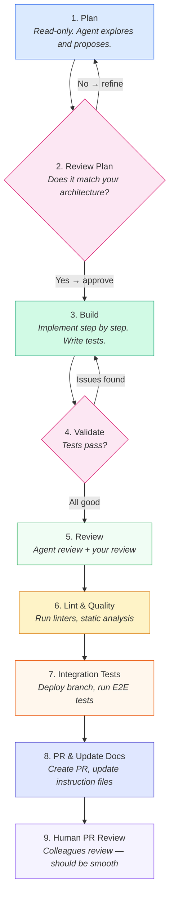

# Chapter 6: A Development Workflow

## Where Are You Right Now?

Most developers start the same way. You open ChatGPT, describe your problem, copy the answer, paste it into your editor, tweak it until it works. It gets the job done — sometimes. But you're doing all the integration work yourself. The AI never sees your codebase, never learns your patterns, never runs your tests.

This chapter changes that. We define five maturity levels for working with AI coding tools, and then walk you through — step by step — from Level 0 to Level 1.

| Level | Name | How You Work |
|-------|------|-------------|
| 0 | **Copy-Paste** | Chat with AI in a browser, copy snippets into your editor. The AI has no project context. |
| 1 | **Agent-Assisted** | Use a CLI agent inside your project. It reads your code, follows your rules, plans before building, and runs your tests. |
| 2 | **Agent-Customized** | Custom skills, scoped rules, hooks, tailored review agents. The agent works *your* way. *(Later chapters.)* |
| 3 | **Agent-Native** | Spec-driven development, multi-agent workflows. You write the *what*, agents figure out the *how*. *(Later chapters.)* |
| 4 | **Agent-Orchestrated** | CI/CD integration, autonomous pipelines, agent teams working in parallel. *(Later chapters.)* |

**Level 0** is not wrong — it's a starting point. **Level 1** is where the real productivity gains begin. Each level after that compounds — and this guide will take you through all of them, one chapter at a time. This chapter is your concrete guide to Level 1.

By the end, you'll have:
- A working CLI agent installed and configured
- Instruction files that teach the agent your project's rules
- Three workflows practiced: complex features, bug fixes, and simple tasks
- A habit of reviewing, validating, and updating your setup after every task

---

## Step 1: Set Up Your Tools

You need a CLI agent — not a browser chat, not an IDE sidebar. The CLI runs inside your project directory. It can read your files, run your commands, and edit your code directly. That's what makes it an agent instead of a chatbot.

### Option A: Claude Code CLI

**Install:**

| Platform | Command |
|----------|---------|
| macOS / Linux | `curl -fsSL https://claude.ai/install.sh \| bash` |
| Windows (PowerShell) | `irm https://claude.ai/install.ps1 \| iex` |
| npm (all platforms) | `npm install -g @anthropic-ai/claude-code` |

**Verify:** `claude --version`

**Authenticate:** Run `claude` and follow the browser prompts. You need a Pro, Max, Teams, or Enterprise account.

**Troubleshoot:** Run `claude doctor` to diagnose issues.

> **Docs:** [code.claude.com/docs/en/setup](https://code.claude.com/docs/en/setup)

### Option B: GitHub Copilot CLI

**Install:**

| Platform | Command |
|----------|---------|
| npm (all platforms) | `npm install -g @github/copilot` (requires Node.js 22+) |
| Windows (WinGet) | `winget install GitHub.Copilot` |
| macOS / Linux (Homebrew) | `brew install copilot-cli` |
| macOS / Linux (script) | `curl -fsSL https://gh.io/copilot-install \| bash` |

**Verify:** `copilot --version`

**Authenticate:** Run `/login` on first use, or set `COPILOT_GITHUB_TOKEN` with a fine-grained PAT that has "Copilot Requests" permission.

> **Docs:** [docs.github.com/en/copilot/github-copilot-in-the-cli](https://docs.github.com/en/copilot/github-copilot-in-the-cli)

### Windows Tips

If you're on Windows, do these before installing:

1. **Install PowerShell 7+** — The old Windows PowerShell (5.1) causes issues. Get the modern version from [learn.microsoft.com](https://learn.microsoft.com/en-us/powershell/scripting/install/installing-powershell-on-windows) or run `winget install Microsoft.PowerShell`.
2. **Install Git for Windows** — Claude Code requires it. Get it from [git-scm.com](https://git-scm.com/) or run `winget install Git.Git`.
3. **Install Node.js (LTS)** — Required for npm packages (many agents and tools install via npm). Get it from [nodejs.org](https://nodejs.org/) or run `winget install OpenJS.NodeJS.LTS`.
4. **Install Python 3.12+** — Useful for running scripts, data processing, and many development tools. Get it from [python.org](https://www.python.org/) or run `winget install Python.Python.3.12`.
5. **Install uv** — A fast Python package manager that replaces pip and virtualenv. Many MCP servers and tools install via `uvx`. Get it from [docs.astral.sh/uv](https://docs.astral.sh/uv/) or run `winget install astral-sh.uv`.
6. **Install Docker Desktop** — Needed for containerized workflows, local databases, and reproducible environments. Get it from [docker.com](https://www.docker.com/products/docker-desktop/) or run `winget install Docker.DockerDesktop`.
7. **Use Windows Terminal** — Much better than the default cmd.exe. Install from the Microsoft Store if you don't have it.
7. **Run as administrator** for the initial install, then use a normal terminal after that.

### Why the CLI, Not the IDE Chat?

You might be thinking: "I already have Copilot in VS Code / IntelliJ. Why install a CLI?"

| IDE Chat | CLI Agent |
|----------|-----------|
| Sees the file you have open | Sees your entire project |
| Suggests code inline | Plans, writes, tests, and commits |
| You paste and adapt | It edits files directly |
| No plan mode | Full plan mode with read-only exploration |
| Limited tool access | Runs commands, reads files, calls APIs |

The IDE chat is Level 0 with better integration. The CLI is Level 1. Use both — but the CLI is where the agent workflows live.

---

## Step 2: Create Your Instruction Files

This is the single most important step. Without instruction files, the agent starts every session knowing nothing about your project. With them, it already knows your tech stack, your conventions, your rules, and how to run your tests.

### Generate a Starter File

**Claude Code:**
```bash
cd /path/to/your/project
claude
> /init
```

The `/init` command scans your project — package files, config files, folder structure — and generates a `CLAUDE.md` file at the project root.

**GitHub Copilot:**

There is no `/init` equivalent. Create the file manually:
```bash
mkdir -p .github
touch .github/copilot-instructions.md
```

### What Your Instruction File Must Cover

Treat `/init` output as a starting point, not a finished product. A good instruction file covers these areas:

#### 1. Tech Stack and Dependencies

```markdown
## Tech Stack
Python 3.12, FastAPI, PostgreSQL, SQLAlchemy 2.0, Alembic, Pytest
Frontend: React 18, TypeScript, Vite, Tailwind CSS
```

The agent needs to know what you use so it picks the right patterns. Without this, it might suggest Flask when you use FastAPI, or npm when you use pnpm.

#### 2. Project Structure

```markdown
## Project Structure
- `src/api/` — FastAPI route handlers
- `src/services/` — Business logic (one service per domain)
- `src/models/` — SQLAlchemy models
- `src/schemas/` — Pydantic request/response schemas
- `tests/` — Mirrors src/ structure (tests/api/, tests/services/)
```

#### 3. Build and Run Commands

```markdown
## Commands
- Install: `pip install -e ".[dev]"`
- Run: `uvicorn src.main:app --reload`
- Test: `pytest`
- Test single file: `pytest tests/path/to/test_file.py -v`
- Lint: `ruff check . && ruff format --check .`
- Type check: `mypy src/`
```

This is critical. The agent needs exact commands. Don't assume it can guess.

#### 4. Coding Conventions

```markdown
## Conventions
- All API endpoints return Pydantic response models — never return raw dicts
- Use dependency injection for database sessions (see src/api/deps.py)
- Services never import from api/ — dependencies flow one way: api → services → models
- All database queries go through the service layer
- Use async/await for all I/O operations
```

#### 5. Key Business Flows

```markdown
## Business Flows
- User registration: signup → email verification → profile creation → welcome notification
- Order processing: cart → checkout → payment (Stripe) → inventory update → confirmation email
- Authentication: login → JWT issued → refresh token stored → token refresh via /auth/refresh
- Content moderation: user submits → auto-filter (src/services/moderation.py) → manual review queue if flagged
```

The agent doesn't know your domain. Without business flows, it makes assumptions — it might skip the email verification step during signup, or forget that orders need inventory checks before payment. Write down the happy path for every critical flow. When the agent builds a feature that touches one of these flows, it knows which steps are mandatory and in what order.

> **Tip:** You don't need to document every flow — just the ones where skipping a step would cause a bug or a business rule violation. If a new developer would get it wrong without being told, write it down.

#### 6. Architecture Rules

```markdown
## Architecture
- Layered architecture: API → Service → Repository → Database
- No direct database access from route handlers
- All cross-service communication goes through events (src/events/)
- Authentication middleware in src/api/middleware/auth.py — all new routes must use it
```

#### 7. Logging and Error Handling

```markdown
## Logging
- Use `structlog` — never use print() or the stdlib logging module directly
- Log at service layer, not at API layer
- Include request_id in all log entries (injected by middleware)

## Error Handling
- Raise domain exceptions from services (src/exceptions.py)
- API layer catches and maps to HTTP status codes
- Never return stack traces in production responses
```

#### 8. Security Rules

```markdown
## Security
- Never hardcode secrets — use environment variables via src/config.py
- All user input validated through Pydantic schemas
- SQL queries through SQLAlchemy ORM only — no raw SQL
- CORS allowed origins configured in src/config.py — never use wildcard in production
```

### Where the Files Live

| Feature | Claude Code | GitHub Copilot |
|---------|------------|----------------|
| Main file | `CLAUDE.md` (project root) | `.github/copilot-instructions.md` |
| Scoped rules | `.claude/rules/*.md` | `.github/instructions/*.instructions.md` |
| Loaded | Every session start | Every session start |
| Version controlled | Yes | Yes |

### Who Validates These Files

The instruction file is project infrastructure — like your CI config or linter rules. It should be:

- **Written** by the developer who knows the project best
- **Reviewed** by the tech lead or architect
- **Approved** via pull request, just like code
- **Maintained** — updated every time conventions change

> **Tip:** If the agent keeps making the same mistake, the fix is almost always in the instruction file, not in your prompt. Add a rule. Be specific. Use emphasis for critical rules: "IMPORTANT: Never modify migration files after they've been committed."

> **Tip:** Keep it short. For every line, ask: "Would removing this cause the agent to make mistakes?" If not, cut it. A bloated instruction file gets ignored — just like bloated documentation.

> **Tip:** Run `/init` periodically on mature projects. Compare the output with your current `CLAUDE.md`. You might discover gaps.

### Audit Your Instruction Files with a Plugin

Running `/init` tells you what the agent *would* generate from scratch. But it doesn't tell you what's *wrong* with your existing file — stale commands, missing sections, outdated architecture descriptions.

Both Claude Code and Copilot CLI have plugins that help with this — though they work differently.

**Claude Code — CLAUDE.md Improver:**

```bash
# Install it once
/plugin claude-md-management

# Reload to activate
/reload-plugins

# Run the audit
/claude-md-improver
```

The plugin scans every `CLAUDE.md` file in your repo, scores each one against a quality rubric, and outputs a report:

| Criterion | What it checks |
|-----------|---------------|
| **Commands/workflows** | Are build, test, and deploy commands documented? |
| **Architecture clarity** | Can the agent understand your codebase structure? |
| **Non-obvious patterns** | Are gotchas and quirks captured? |
| **Conciseness** | Is it dense and useful, not verbose and obvious? |
| **Currency** | Does it reflect the current state of the code? |
| **Actionability** | Are instructions copy-paste ready? |

Each file gets a letter grade (A through F) with specific issues and recommended fixes. You review the suggestions, approve what makes sense, and the plugin applies the changes.

**Copilot CLI — awesome-copilot plugin:**

```bash
# Install it
copilot plugin install awesome-copilot@awesome-copilot

# Suggest missing instructions for your repo
/awesome-copilot:suggest-awesome-github-copilot-instructions
```

This plugin takes a different approach. Instead of scoring your existing file, it analyzes your repo and suggests instruction files from a curated community library. It also flags instructions you already have that may be outdated. It won't give you a quality score — but it will surface gaps you didn't know about.

> **Note:** The Copilot ecosystem doesn't yet have a structured auditor that scores instruction file quality the way the CLAUDE.md Improver does. If you want a deeper review, you can prompt Copilot directly: `@workspace Review and suggest improvements for our copilot-instructions.md` — but that's an ad-hoc check, not a repeatable audit.

**When to run these:**
- After a major feature lands — new patterns and conventions may need documenting
- When onboarding a new team member — gaps become obvious when fresh eyes hit the project
- Quarterly, as a hygiene check — instruction files drift just like documentation

This is not a replacement for the habit of updating your instruction file after every task. It's a periodic deep clean — like running a linter on your project context instead of your code.

> **Note:** This section covered what goes *inside* a single instruction file. As your project grows, one file won't be enough. You'll need scoped rule files that load only when the agent works on specific parts of the codebase, multiple markdown files for different domains, and strategies for keeping them organized. We cover structuring and scaling your instruction files in a later chapter.

---

## Step 3: The Plan-Build-Validate Cycle

This is the core workflow for Level 1. Every complex task follows this cycle:



Let's walk through each phase with a concrete example.

---

## Scenario 1: Complex Feature

**The task:** Add a user notifications system — users receive notifications when someone comments on their post. Notifications are stored in the database, shown via API, and marked as read.

### Phase 1: Plan

Enter plan mode. The agent can read your codebase but cannot change anything.

**Claude Code:** Press `Shift+Tab` twice (or type `/plan`).
**Copilot CLI:** Press `Shift+Tab` to toggle plan mode.

```text
You:  "I need to add a user notification system. When someone comments
      on a post, the post author gets a notification. Notifications are
      stored in the database, served via REST API, and can be marked
      as read.

      Explore the existing code — especially the models, services,
      and API routes — and create a step-by-step implementation plan."
```

The agent reads your files, understands your patterns, and produces a plan:

```text
Agent: "Here's my implementation plan:

  1. Create Notification model in src/models/notification.py
     - Fields: id, user_id, type, message, is_read, created_at
     - Foreign key to User model

  2. Create Alembic migration for notifications table

  3. Create NotificationService in src/services/notification_service.py
     - create_notification(user_id, type, message)
     - get_user_notifications(user_id, unread_only=False)
     - mark_as_read(notification_id, user_id)

  4. Add notification trigger in CommentService.create_comment()
     - After saving comment, call NotificationService.create_notification()

  5. Create API routes in src/api/routes/notifications.py
     - GET /notifications — list current user's notifications
     - PATCH /notifications/{id}/read — mark as read

  6. Write tests for service and API layers

  I'll follow the existing patterns: SQLAlchemy model with Pydantic
  schemas, async service methods, dependency injection for DB sessions."
```

#### Where Is the Plan Stored?

| Tool | Location |
|------|----------|
| Claude Code | In the conversation context. Press `Ctrl+G` to open it in your text editor for direct editing. |
| Copilot CLI | In the conversation context, displayed in the terminal. |

The plan is not automatically saved to a file. If you want to keep it, ask: "Save this plan to `docs/plans/notifications-plan.md`."

### Phase 2: Review and Refine the Plan

Read the plan carefully. Check it against your architecture:

- Does it follow your layered architecture? *(API → Service → Model)*
- Does it use existing patterns? *(dependency injection, Pydantic schemas)*
- Is anything missing? *(validation, error handling, auth)*
- Is anything unnecessary? *(features you didn't ask for)*

```text
You:  "Good plan. Three changes:
      1. Add Pydantic schemas for request/response — you missed those
      2. The notification trigger should go through the event system
         in src/events/, not a direct call from CommentService
      3. Add pagination to GET /notifications — use the same pattern
         as GET /posts"
```

The agent updates the plan. Review again. Only approve when the plan matches your architecture.

> **This is the step that separates Level 0 from Level 1.** A Level 0 developer would say "build a notification system" and hope for the best. A Level 1 developer reviews the plan, catches the missing event system integration, and prevents an architectural shortcut before a single line of code is written.

### Phase 3: Build

Exit plan mode. Now the agent can edit files and run commands.

**Claude Code:** Press `Shift+Tab` to return to normal mode.
**Copilot CLI:** Press `Shift+Tab` to toggle back.

Work through the plan step by step. Don't say "implement the whole plan." Instead:

```text
You:  "Let's start with step 1. Create the Notification model and
      Pydantic schemas. Follow the patterns in src/models/user.py
      and src/schemas/user.py."
```

The agent creates the files. Review them before moving on.

```text
You:  "Good. Now step 2 — create the Alembic migration."
```

```text
You:  "Step 3 — create NotificationService with tests. Write the
      tests first, then implement the service to make them pass."
```

**Write tests at every step.** This is non-negotiable at Level 1. Tests are how the agent verifies its own work. Without tests, it can only check that the code compiles — not that it works.

```text
You:  "Write tests for NotificationService:
      - Creating a notification stores it in the database
      - Getting notifications returns only the target user's notifications
      - Marking as read updates the is_read flag
      - Marking someone else's notification returns 403

      Write the tests first. Run them — they should fail. Then
      implement the service to make them pass."
```

The agent writes tests, runs them (red), writes the implementation, runs them again (green). This is TDD driven by the agent — you just need to ask for it.

> **Tip on test coverage:** With agents, there's no excuse for low test coverage. Generating tests is fast. After the feature is done, ask: "Check test coverage for the notifications module and add tests for any uncovered paths." The agent runs the coverage tool and fills the gaps.

### Phase 4: Validate

After all steps are implemented:

```text
You:  "Run the full test suite. Fix any failures."
```

Make sure all unit tests pass — both the new ones and the existing suite. If anything fails, fix it before moving on. Don't skip this step. Don't assume the tests that passed earlier still pass after subsequent changes.

### Phase 5: Review

This is a two-part review: first the agent reviews its own work, then you review the agent's work.

**Part 1 — Agent review.** Both Claude Code and Copilot have built-in review commands. Use them. A fresh review context catches things the implementation context missed.

**Claude Code:**
```text
You:  "/review"
```

Or be specific about what to review:
```text
You:  "Review the changes in the notifications module. Check for
      security issues, missing error handling, and anything that
      doesn't follow the patterns in our existing code."
```

**Copilot CLI:**
```text
You:  "/review"
```

The review agent reads the diff, compares it against your instruction files and existing code patterns, and flags issues. It's not perfect — but it catches things you'll miss when you're deep in implementation mode.

> **Tip:** The review agent works best with a fresh context. If you've been going back and forth with the agent for a long time, the context is polluted with failed attempts and corrections. Consider starting a new session just for the review — it gives the agent a clean perspective on the final code.

**Part 2 — Your review.** The agent's review is a first pass, not a replacement for your eyes. Read the diff yourself. Check for:

| Check | What to look for |
|-------|-----------------|
| **Architecture** | Does it follow your layered structure? No shortcuts? |
| **Patterns** | Does it match existing code style? Same naming, same structure? |
| **Bloat** | Did the agent add things you didn't ask for? Extra endpoints, utility functions, unnecessary abstractions? |
| **Best practices** | Error handling, input validation, proper HTTP status codes, async/await usage? |
| **Security** | Auth checks on all endpoints? Input sanitized? No raw SQL? |
| **Hardcoded values** | Magic strings, hardcoded URLs, inline config that should be in environment variables? |

> **Common issue:** The agent generates too much code. It adds helper functions "just in case," creates abstractions for things that are used once, or adds features beyond your spec. If you see this, delete the extras and add a rule to your instruction file: "Do not add features, utilities, or abstractions beyond what is explicitly requested."

### Phase 6: Lint and Quality Gates

Run your linters and static analysis tools before creating the PR.

**Python projects:**

```text
You:  "Run ruff check and ruff format on the notifications module.
      Then run mypy. Fix any issues."
```

| Tool | What it catches | Install |
|------|----------------|---------|
| **Ruff** | Style issues, unused imports, complexity, formatting (replaces Flake8 + Black + isort) | `pip install ruff` |
| **mypy** | Type errors, missing annotations, wrong return types | `pip install mypy` |
| **SonarQube/SonarLint** | Security vulnerabilities, code smells, duplications | IDE plugin or server |

**JavaScript/TypeScript projects:**

```text
You:  "Run eslint and tsc --noEmit on the changed files. Fix any issues."
```

> **Tip:** Add your lint commands to the instruction file so the agent knows to run them. Better yet, add them as pre-commit hooks so they run automatically.

> **Tip:** SonarQube now has an AI Code Assurance feature that specifically inspects AI-generated code. If your team uses SonarQube, enable it — it catches issues that agents commonly introduce.

### Phase 7: Integration Tests

Unit tests verify that individual pieces work. Integration tests verify that everything works together — your code, the database, external services, the full request/response cycle.

For now, this is a manual step. Deploy your branch to a test environment and run the integration tests yourself.

```text
# Push your branch
git push origin feature/notifications

# Deploy to your test/staging environment (your process will vary)
# Then run integration tests against the deployed branch
```

What to check:

| Test | What it verifies |
|------|-----------------|
| **API end-to-end** | Hit the new endpoints with real HTTP requests. Do they return the right status codes and data? |
| **Database integration** | Do records actually persist? Do foreign keys and constraints work? |
| **Cross-service flows** | Does creating a comment actually trigger a notification? Does the full flow work? |
| **Existing functionality** | Did your changes break anything else? Run the full integration suite, not just your new tests. |

```text
You:  "What's the command to run integration tests in this project?"
```

If your project doesn't have integration tests for the area you changed, write them:

```text
You:  "Write integration tests for the notifications API. Test the full
      HTTP request/response cycle: create a notification via the comment
      flow, retrieve it via GET /notifications, and mark it as read via
      PATCH. Use the test client pattern from tests/integration/."
```

> **Note:** Right now this is manual — you deploy, you run, you check. In future chapters we'll cover how to automate integration testing as part of your CI/CD pipeline, including having the agent trigger deployments and validate results automatically.

### Phase 8: Create the PR

```text
You:  "Create a pull request for the notification system. Include a
      summary of what was added and how to test it."
```

The agent stages the changes, writes a PR description, and creates the PR using `gh pr create`.

**Before you finish — update your instruction files:**

```text
You:  "Update CLAUDE.md to include the notification system:
      - Add NotificationService to the project structure section
      - Add the event pattern we used for notification triggers
      - Note that all notifications go through src/events/"
```

This is how your instruction files stay alive. Every feature adds context. Every task ends with an update.

### Phase 9: Human PR Review

The last step is the one that hasn't changed: your colleagues review the PR.

This is still essential. No agent replaces a second pair of human eyes — especially for domain knowledge, business logic edge cases, and team-specific context that isn't captured in your instruction files.

But here's the thing: **if you followed phases 1 through 8, the PR review should be smooth.** The plan was reviewed before implementation. The code follows existing patterns. Tests cover the new behavior. Linters passed. Integration tests ran. The agent already did a review pass.

Your reviewer shouldn't be finding basic issues like wrong naming, missing error handling, or architectural violations. Those were caught earlier. The review can focus on what humans are best at: "Does this make sense? Did we think about this edge case? Is there a simpler way?"

If the PR review turns up a lot of issues, that's a signal. Either:
- Your instruction file is missing rules the reviewer knows but the agent doesn't — add them
- You skipped a phase (usually the plan review or the agent review) — don't skip it next time
- The task was too large for a single PR — break it up next time

### Pause — This Is Level 1

Take a step back and look at what you just did. Nine phases. Plan review, agent-assisted code review, linters, integration tests, human PR review. A structured, repeatable workflow that catches problems early and produces clean, tested code.

And all of it uses **built-in features**. No custom agents. No custom skills. No CI/CD automation. No spec-driven pipelines. Just the default tools — plan mode, `/review`, your linter, and `gh pr create`. That's it.

This is Level 1 — and it's already a massive improvement over copy-pasting from a chat window.

Now imagine what Level 2 looks like: custom review agents tailored to your architecture. Skills that encode your team's exact workflow. Automated pipelines that run the full plan-build-validate cycle without you babysitting every step. Spec-driven development where you write the *what* and the agent figures out the *how* across multiple files, tests, and documentation — automatically.

If Level 1 feels this productive, wait until we get there.

---

## Scenario 2: Bug Fix

**The task:** Users report that the "unread notifications" count shows the wrong number. It includes notifications that were already marked as read.

The bug fix cycle is shorter, but follows the same principle: understand first, then fix.

```mermaid
graph LR
    D["1. Diagnose<br/><i>Share the error, explore</i>"] --> P["2. Plan Fix<br/><i>Identify root cause</i>"]
    P --> F["3. Fix + Test<br/><i>Write failing test, then fix</i>"]
    F --> V["4. Verify<br/><i>Run full suite, lint</i>"]
    V --> IT["5. Integration Test<br/><i>Deploy, run E2E</i>"]
    IT --> PR["6. PR<br/><i>Commit and update docs</i>"]

    style D fill:#dbeafe,stroke:#2563eb
    style P fill:#d1fae5,stroke:#059669
    style F fill:#fef3c7,stroke:#d97706
    style V fill:#fce7f3,stroke:#db2777
    style IT fill:#fff7ed,stroke:#ea580c
    style PR fill:#e0e7ff,stroke:#4338ca
```



### Step 1: Diagnose

You don't need plan mode for most bugs — but you do need to give the agent context. The more context you provide upfront, the faster the agent finds the root cause.

**Feed the agent everything you have:**

| What you have | How to share it |
|---------------|----------------|
| **Error message or stack trace** | Copy-paste directly into the prompt |
| **Relevant log lines** | Copy the interesting parts — don't dump 500 lines, pick the ones around the error |
| **Screenshot of the bug** | Drag and drop into the terminal, or copy the image and press `Ctrl+V` (not Cmd+V on Mac) |
| **Browser console errors** | Copy-paste the error output |
| **Steps to reproduce** | Describe them — "login as admin, go to /notifications, count shows 5 instead of 3" |

```text
You:  "There's a bug in the notifications system. The unread count
      returned by GET /notifications?unread_only=true includes
      notifications that are already marked as read.

      Here are the relevant logs from the test environment:

      [2026-03-10 14:22:01] GET /notifications?unread_only=true
      [2026-03-10 14:22:01] NotificationService.get_user_notifications
          user_id=42, unread_only=True, result_count=5
      [2026-03-10 14:22:01] DB query: SELECT * FROM notifications
          WHERE user_id=42 AND is_read=true

      That query looks wrong — it's filtering for is_read=true instead
      of false. Look at NotificationService.get_user_notifications()
      and the corresponding API route. Find the root cause."
```

The agent reads the service, the model, and the query. With the logs you provided, it zeros in immediately:

```text
Agent: "Found it. In NotificationService.get_user_notifications(),
       the unread_only filter checks `Notification.is_read == True`
       instead of `Notification.is_read == False`. The condition
       is inverted. Your logs confirm this — the DB query filters
       for is_read=true when it should filter for is_read=false."
```

> **Tip:** Images are underrated for debugging. A screenshot of a broken UI, a diagram of the expected flow, a photo of a whiteboard sketch — the agent can read all of these. Don't describe what you see when you can show it.

> **Tip:** If the bug only happens at runtime and not in tests, say so. "This works fine in unit tests but fails in production with this error" tells the agent to look at environment differences, configuration, async timing, or real database behavior — not just the logic.

### Step 2: Reproduce with a Test

Before fixing anything, capture the bug in a test. This does two things: it confirms you understand the problem, and it creates a regression test that prevents it from coming back.

```text
You:  "Before fixing it, write a failing test that reproduces this
      bug. The test should:
      1. Create 3 notifications for a user
      2. Mark 1 as read
      3. Call get_user_notifications(unread_only=True)
      4. Assert that only 2 notifications are returned"
```

If the bug can't be reproduced in a unit test — it only happens with real database queries, or under specific timing conditions — say that explicitly:

```text
You:  "This bug might be a race condition — it only happens under load.
      Write an integration test that creates notifications concurrently
      and checks the count. Use the async test pattern from
      tests/integration/."
```

Not every bug can be captured in a unit test. Some need integration tests, some need manual reproduction steps documented in the PR. But always try the unit test first — it's the fastest feedback loop.

### Step 3: Fix and Test

```text
You:  "Run the test — it should fail. Then fix the filter condition
      and run the test again."
```

The agent runs the test (red), fixes the inverted condition, runs again (green). The bug is confirmed fixed with a regression test that will catch it if it ever comes back.

### Step 4: Verify

```text
You:  "Run the full test suite to make sure nothing else broke."
```

### Step 5: PR and Update

```text
You:  "Create a PR for this fix. Then check if this bug points to
      a gap in our instruction file — should we add a rule about
      testing filter conditions?"
```

> **Key insight:** Every bug is feedback about your instruction files. If the agent (or a previous AI session) introduced this bug, ask yourself: what rule in the instruction file would have prevented it? Add that rule. Over time, your instruction file becomes a catalogue of lessons learned.

---

## Scenario 3: Simple Task

**The task:** Add a `last_login` timestamp field to the User model.

Simple tasks don't need plan mode. Go straight to execution.

```text
You:  "Add a last_login field to the User model. It should be a
      nullable DateTime, updated on every successful login.

      Create the Alembic migration, update the model, update the
      login service to set it, and add a test."
```

That's it. One prompt. The agent knows your patterns from the instruction file, creates the migration, updates the model, modifies the login service, and writes a test.

Review the diff. If it looks right, commit.

### When to Skip Plan Mode

| Task | Plan mode? |
|------|-----------|
| Add a field to a model | No |
| Rename a variable across files | No |
| Update a config value | No |
| Fix a typo in the UI | No |
| Add a new endpoint following existing patterns | Maybe — depends on complexity |
| Build a new feature from scratch | Yes |
| Refactor a module | Yes |
| Fix a complex bug | Yes — at least use the diagnosis step |

The rule of thumb: if you can describe the complete diff in one sentence, skip plan mode.

---

## Common Issues and How to Fix Them

### "The agent generated way too much code"

**Symptom:** You asked for one endpoint, got three endpoints, a utility module, a custom exception hierarchy, and a migration you didn't request.

**Cause:** Your prompt was too open-ended, or your instruction file doesn't set boundaries.

**Fix:** Add to your instruction file:
```markdown
## Rules
- Only implement what is explicitly requested. Do not add extra features,
  utilities, or abstractions.
- One task at a time. Do not anticipate future needs.
```

### "The agent ignored my project's patterns"

**Symptom:** The agent used raw SQL when you use an ORM. It created a class where you use functions. It put files in the wrong directory.

**Cause:** Your instruction file is missing conventions, or the agent didn't read enough context before coding.

**Fix:**
1. Add the missing convention to your instruction file
2. In your prompts, always reference existing files: "Follow the pattern in `src/services/user_service.py`"
3. For new features, always start with plan mode — it forces the agent to read your code first

### "The agent keeps breaking existing functionality"

**Symptom:** New code works, but existing tests fail.

**Cause:** The agent modified shared code without understanding its full usage.

**Fix:**
1. Always run the full test suite, not just the tests for the new feature
2. Add to your instruction file: "Before modifying any existing function, check all callers using grep or references."
3. Use plan mode for anything that touches shared code

### "The agent's code doesn't match our architecture"

**Symptom:** Routes call the database directly instead of going through the service layer. Services import from API modules.

**Cause:** Your architecture rules aren't in the instruction file, or they're not specific enough.

**Fix:** Be explicit about dependency direction:
```markdown
## Architecture
- Dependency flow: API → Service → Repository → Database
- API layer NEVER imports from models directly
- Services NEVER import from API layer
- All database access goes through repository functions
```

### "The instruction file is getting too long"

**Symptom:** Your `CLAUDE.md` is 200+ lines and the agent seems to ignore rules at the bottom.

**Fix:** Split into scoped rule files:

**Claude Code:**
```
.claude/
  rules/
    api-patterns.md      # Loaded when working on API files
    testing.md           # Loaded when working on test files
    database.md          # Loaded when working on models/migrations
```

**Copilot:**
```
.github/
  instructions/
    api.instructions.md        # applyTo: "src/api/**"
    testing.instructions.md    # applyTo: "tests/**"
    database.instructions.md   # applyTo: "src/models/**"
```

Keep the main instruction file for global rules (tech stack, build commands, universal conventions). Move domain-specific rules to scoped files.

### "I don't know what I want"

This is the hardest case — and the most common one for complex problems. You know *something* needs to be done, but you don't know what the right approach is. The plan-build-validate cycle assumes you can evaluate the plan. What happens when you can't?

**Real example:** A penetration test report says your WebSocket endpoint is vulnerable to message flooding attacks. You need to fix it. But:

- Should you handle it at the WAF level? WAFs don't work well with WebSocket connections — they're designed for HTTP request/response, not persistent connections.
- Should you add rate limiting inside the WebSocket handler? Maybe — but if you limit too aggressively, a legitimate user can be locked out. Now you've turned a security vulnerability into a denial-of-service vector against your own users.
- Should you add per-connection message throttling? Per-IP limits? Token bucket? Sliding window? Each has trade-offs you're not sure about.
- What about connection limits per user? What about unauthenticated connections?

You don't know the right answer. And if *you* don't know, the agent definitely doesn't — it will confidently pick one approach and build it, and you won't know if it's the right one until production breaks.

**What to do instead:**

**Step 1 — Use the agent for research, not implementation.**

```text
You:  "I need to protect a WebSocket endpoint against message flooding
      attacks. Don't implement anything yet. Research the options:

      1. WAF-level protection — does it work for WebSocket?
      2. Application-level rate limiting — what patterns exist?
      3. Connection-level throttling — token bucket vs sliding window
      4. Per-user vs per-IP vs per-connection limits

      For each option, explain the trade-offs. What does it protect
      against? What can go wrong? What are the edge cases?"
```

The agent researches and presents options. You now understand the landscape.

**Step 2 — Talk to someone who knows.**

This is the step developers skip. The agent gave you a research summary — good. But for security decisions, compliance requirements, infrastructure changes, or anything where "wrong" means "incident," talk to a human expert. Show them the agent's research. Let them poke holes in it.

**Step 3 — Now plan with clarity.**

Once you understand the approach, you're back in familiar territory:

```text
You:  "We're going with per-connection message throttling using a
      token bucket algorithm, plus a hard connection limit of 5
      per authenticated user. Enter plan mode and propose an
      implementation plan."
```

**The pattern for "I don't know" tasks:**

1. **Research** — Use the agent to explore options and trade-offs. Don't implement yet.
2. **Consult** — Bring the research to someone with domain expertise. Architect, security lead, senior dev.
3. **Decide** — Pick an approach with full understanding of the trade-offs.
4. **Then** run the normal plan-build-validate cycle.

The mistake is jumping to "fix the vulnerability" and letting the agent pick the approach. The agent is great at *implementing* decisions. It's not great at *making* decisions that require domain expertise, risk assessment, or organizational context.

> **Tip:** If you find yourself unable to evaluate the agent's plan, that's a signal. Stop. Research first, decide second, implement third. And if the decision is outside your expertise — security, infrastructure, performance at scale — this might be a job for your architect. Bring them the research, let them make the call.

---

## The Task Always Ends with an Update

Make this a habit: **every task ends by updating your instruction files.**

After a complex feature:
```text
You:  "We just added the notification system. Update CLAUDE.md with
      any new patterns, conventions, or architectural decisions we
      made during this implementation."
```

After a bug fix:
```text
You:  "This bug was caused by an inverted filter condition. Should we
      add a rule to our instruction file about testing all filter/query
      conditions? If yes, add it."
```

After a simple task:
```text
You:  "Does this change affect anything in our instruction file? If so,
      update it."
```

Your instruction file is a living document. It gets better with every task. Six months from now, a new team member (or a new AI session) will benefit from every rule you added.

---

## Don't Be Afraid to Start Over

Here's a mindset shift that takes time to internalize: **code is cheap now.**

In the old world, rewriting a feature meant days of work. You'd patch, workaround, and compromise to avoid throwing code away. That instinct made sense when every line was hand-typed.

With agents, a feature that took an afternoon can be rebuilt in an hour — often better the second time, because now you know what went wrong. The bottleneck was never the typing. It was the thinking. And the thinking carries over.

So when you build something and it doesn't feel right — the architecture is off, the approach is wrong, the code grew in the wrong direction — don't keep patching. Stop. Ask yourself:

1. **What did I learn?** What's wrong with the current approach?
2. **Update your instruction files.** Add the rules and conventions that would have prevented the issue.
3. **Update your prompt.** Be more specific about the approach you want.
4. **Start fresh.** Let the agent rebuild it with better guidance.

The second attempt is almost always faster and cleaner. Your instruction file is better. Your prompt is sharper. The agent has better context. You're not debugging the old mess — you're building the right thing from scratch.

This applies at every scale:
- **Single function** doesn't work right? Delete it, rewrite the prompt, regenerate.
- **Whole module** went in the wrong direction? Revert the branch, update your plan, rebuild.
- **Feature prototype** taught you what you actually need? Throw it away. The prototype's value was the learning, not the code.

The developers who get the most out of agents are the ones who treat code as disposable and instruction files as permanent. The code can always be regenerated. The knowledge you captured in your rules, conventions, and prompts — that's what compounds over time.

---

## What's Next

This chapter got you from Level 0 to Level 1 — using agents with instruction files, plan-build-validate cycles, and iterative workflows. There's more ahead:

- **Custom skills and reusable prompts** — Encode team patterns into skills that run consistently every time *(Chapter 7)*
- **Advanced instruction file techniques** — Scoped rules, imports, hooks that auto-run linters after every edit *(Chapter 7)*
- **Spec-driven development** — Drive entire features from specifications, not prompts *(Chapter 9)*
- **LSP server integration** — Give the agent precise "go to definition" and "find references" navigation for deeper code understanding *(Chapter 10)*
- **The skillset you need** — What developers need to learn (and unlearn) to work effectively with agents *(Chapter 5)*

The pattern you learned here — plan, build, validate, update — scales. It works for a one-line fix and for a multi-sprint feature. Master it, and you're ready for Level 2.

---

## Resources

- [Claude Code Setup](https://code.claude.com/docs/en/setup) — Official installation and configuration guide
- [Claude Code Common Workflows](https://code.claude.com/docs/en/common-workflows) — Step-by-step guides for everyday tasks
- [Claude Code Best Practices](https://code.claude.com/docs/en/best-practices) — Patterns for getting the most out of Claude Code
- [GitHub Copilot CLI Documentation](https://docs.github.com/en/copilot/github-copilot-in-the-cli) — GitHub's guide to using Copilot in the terminal
- [Customizing Copilot with Instructions](https://docs.github.com/en/copilot/customizing-copilot/adding-repository-custom-instructions) — How to configure repository-level instructions
- [GitHub Copilot Agent Mode](https://docs.github.com/en/copilot/using-github-copilot/using-copilot-coding-agent) — Documentation on Copilot's autonomous coding agent
- [Ruff — Python Linter](https://docs.astral.sh/ruff/) — Fast Python linter that replaces Flake8, Black, and isort
- [SonarQube AI Code Assurance](https://www.sonarsource.com/solutions/ai-code/) — Quality gates for AI-generated code
- [Anthropic Best Practices for Claude Code](https://www.anthropic.com/engineering/claude-code-best-practices) — Anthropic's engineering blog on effective agent workflows
