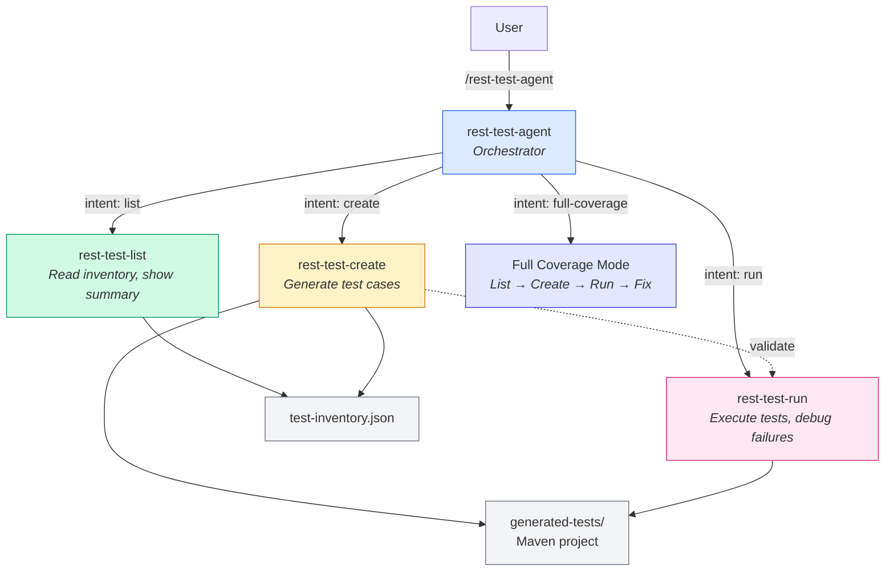

# Chapter 7: Creating Reusable Skills and Simple Agents

## From Level 1 to Level 2

In Chapter 6, you learned Level 1 — plan-build-validate with built-in tools. Every task used the same workflow: enter plan mode, review the plan, build step by step, validate with tests, commit. Your development process is already much faster. And even when it isn't faster, your quality is much better. You have time to play with your ideas, experiment with two or three approaches before committing to one. You're not afraid to throw away a first attempt and rebuild — because rebuilding is cheap now.

The next step is to extend your reach beyond writing code. In this chapter, you'll learn how to create **custom skills** — reusable instruction sets that encode your team's patterns — and **custom agents** — orchestrators that combine multiple skills into a single workflow.

To make it concrete, we'll build a REST Assured test agent that generates, manages, and runs API integration tests through natural language.

Here's where we are on the maturity ladder from Chapter 6:

| Level | Name | How You Work |
|-------|------|-------------|
| 0 | **Copy-Paste** | Chat with AI in a browser. No project context. |
| 1 | **Agent-Assisted** | CLI agent inside your project. Plan mode, instruction files, test validation. |
| **2** | **Agent-Customized** | **Custom skills, agents, hooks. The agent works *your* way.** |
| 3 | **Agent-Native** | Spec-driven development, multi-agent workflows. |
| 4 | **Agent-Orchestrated** | CI/CD integration, autonomous pipelines. |

This chapter takes you from Level 1 to Level 2. By the end, you'll have built three skills and one orchestrator agent — all working, all reusable, all shareable with your team.

---

## Skills and Agents — A Quick Reference

Chapters 3 and 4 covered the theory behind skills and agents. This section is the practical reference card you'll use while building.

### Skills

A skill is a set of instructions the agent follows within your conversation. You invoke it, the agent reads the instructions, and it executes them step by step — using your existing session context.

| Feature | Claude Code | Copilot |
|---------|------------|---------|
| Skill location | `.claude/skills/<name>/SKILL.md` | `.github/skills/<name>/SKILL.md` |
| Invocation | `/skill-name` or `/skill-name <args>` | `/skill-name` or `/skill-name <args>` |
| Frontmatter | `name`, `description`, `argument-hint` | `name`, `description`, `argument-hint` |
| Scope | Project (via git) or user (`~/.claude/skills/`) | Project (via git) |
| Auto-loaded | Description only (at session start) | Description only (at session start) |
| Full content loaded | When invoked | When invoked |

The key design: **descriptions load at session start, but the full content only loads when you invoke the skill.** This keeps the agent's context lean. Ten skills with one-line descriptions cost almost nothing. Ten skills with their full instructions loaded at all times would eat your context window.

### Agents

An agent is a separate persona with its own context, tools, and system prompt. It goes beyond a skill — it doesn't just follow instructions, it interprets intent and routes to the right behavior.

| Feature | Claude Code | Copilot |
|---------|------------|---------|
| Agent mechanism | Skill that orchestrates other skills | `.agent.md` file with dedicated persona |
| Agent file | `.claude/skills/<name>/SKILL.md` | `.github/agents/<name>.agent.md` |
| Invocation | `/agent-name <prompt>` | `@agent-name <prompt>` |
| Tool restrictions | Not natively supported | `tools:` field in frontmatter |
| Own context | Via subagent dispatch | Yes, gets isolated context |

The key difference: **a skill is a recipe the agent follows. An agent is a persona that decides which recipes to use.** A skill says "do these steps." An agent says "understand what the user wants, then pick the right steps."

### Hooks

There's a third extensibility mechanism: **hooks**. Hooks are shell commands that fire at lifecycle points — before a tool runs, after a tool runs, at session start, etc. They're useful for auto-formatting after edits, running linters after file changes, or logging tool usage.

We won't build hooks in this chapter, but know they exist. Skills, agents, and hooks are the three ways you customize an AI coding agent.

### Anatomy of a SKILL.md

Every skill file follows this structure:

```markdown
---
name: my-skill
description: One-line summary shown at session start
argument-hint: What the user should pass as an argument
---

# my-skill

Instructions the agent follows when this skill is invoked.
Step-by-step, imperative, specific.
```

The frontmatter is YAML. The body is Markdown. Write the body as if you're giving instructions to a capable but literal junior developer: step by step, no ambiguity, no assumptions.

---

## What We're Building

We're building a **REST Assured test agent** — an orchestrator that manages API test cases through natural language. It has three skills and one agent that ties them together.



### The Three Modes

| Mode | What it does | When you use it |
|------|-------------|----------------|
| **List** | Reads `test-inventory.json` and shows all existing tests, grouped by class | Before creating tests — to see what's already covered |
| **Create** | Generates REST Assured test methods from a natural language description | When you need new test cases for an endpoint |
| **Run** | Executes tests, reports results, diagnoses failures, offers to fix | After creating tests — to verify they work |

The orchestrator agent combines all three. You say "I need full test coverage for the JSONPlaceholder API" and it lists what exists, identifies gaps, creates missing tests, runs them, and fixes failures — all in one flow.

### The Target API

All tests run against [JSONPlaceholder](https://jsonplaceholder.typicode.com) — a free fake REST API with six resources: `/posts`, `/comments`, `/albums`, `/photos`, `/todos`, and `/users`. It returns realistic JSON, supports GET/POST/PUT/DELETE, and never goes down. Perfect for testing.

### The File Structure

```
code/
├── generated-tests/
│   ├── pom.xml
│   ├── test-inventory.json
│   ├── src/test/java/tests/
│   │   ├── PostsApiTest.java
│   │   ├── CommentsApiTest.java
│   │   ├── UsersApiTest.java
│   │   └── TodosApiTest.java
│   └── src/test/resources/
│       └── test-config.properties
├── .claude/skills/
│   ├── rest-test-list/SKILL.md
│   ├── rest-test-create/SKILL.md
│   ├── rest-test-run/SKILL.md
│   └── rest-test-agent/SKILL.md
└── .github/
    ├── skills/
    │   ├── rest-test-list/SKILL.md
    │   ├── rest-test-create/SKILL.md
    │   └── rest-test-run/SKILL.md
    └── agents/
        └── rest-test-agent.agent.md
```

The `generated-tests/` folder is a standard Maven project. The `.claude/` and `.github/` folders contain the skill and agent files for Claude Code and Copilot respectively. The test inventory tracks every test in a JSON file so skills can read it without parsing Java source every time.

---

## Building the Skills — Step by Step

### Skill 1: rest-test-list

**What it does:** Reads the test inventory and presents a grouped summary of all existing tests.

**Why it exists:** Before creating new tests, you need to know what's already covered. Without this skill, you'd ask the agent to scan Java files every time — slow, inconsistent, and verbose. The list skill gives you a clean, instant overview.

**The full SKILL.md (Claude Code):**

```markdown
---
name: rest-test-list
description: List all existing REST Assured test cases from the inventory
---

# rest-test-list

List all existing REST Assured tests in this project, grouped by test class.

## Steps

### 1. Read the inventory

Read the file `generated-tests/test-inventory.json`.

- If the file exists and contains a non-empty `tests` array, proceed to **Step 3**.
- If the file is missing, empty, or the `tests` array is empty, proceed to **Step 2**.

### 2. Rebuild the inventory from source

Scan all files matching `generated-tests/src/test/java/tests/*Test.java`.

For each file, extract:
- The class name (from the filename or `class` declaration)
- Every `@Test` method: method name, `@DisplayName` value, `@Tag` value(s)
- The `@Tag` annotation at class level (this is the resource tag)

Build a JSON structure matching this format and write it to
`generated-tests/test-inventory.json`:

{
  "lastUpdated": "<current ISO timestamp>",
  "tests": [
    {
      "class": "PostsApiTest",
      "method": "should_returnAllPosts_whenGetPosts",
      "displayName": "GET /posts returns all posts with status 200",
      "tag": "posts",
      "endpoint": "GET /posts",
      "created": "<date found in file or today>"
    }
  ]
}

Infer the `endpoint` field from the `@DisplayName` text where possible
(it usually starts with the HTTP method and path). If you cannot infer it,
leave it as an empty string.

### 3. Present the summary table

Group the tests by `class`. For each class, show:

PostsApiTest (5 tests)  [tag: posts]
  - GET /posts returns all posts with status 200
  - GET /posts/{id} returns a single post
  - POST /posts creates a new post and returns 201
  - PUT /posts/{id} updates an existing post
  - DELETE /posts/{id} returns 200

CommentsApiTest (2 tests)  [tag: comments]
  - GET /posts/{id}/comments returns comments for a post
  - GET /comments?postId={id} returns filtered comments

After the list, print a one-line summary:

Total: <N> tests across <M> test classes.

## Notes

- Use the `displayName` field for the indented list items, not the method name.
- Sort classes alphabetically.
- If a class has no `@DisplayName` on its test methods, fall back to the method name.
- Do not run any tests — this skill is read-only.
```

**Key design decisions:**

1. **The inventory pattern.** Instead of scanning Java source files every time, the skill reads a JSON file. Fast reads, consistent format, and other skills can update it. The JSON becomes the single source of truth. Step 2 is a fallback — it rebuilds the inventory from source if the file is missing or empty. This means the skill never dead-ends.

2. **Read-only.** The list skill never modifies tests. It only reads. This makes it safe to run anytime — you can't break anything.

3. **Grouped output.** Tests are grouped by class, with counts and tags. This is scannable — you see coverage at a glance instead of scrolling through a flat list.

> The Copilot version follows the same logic. You'll find it in `.github/skills/rest-test-list/SKILL.md` in the companion code.

---

### Skill 2: rest-test-create

**What it does:** Generates REST Assured test methods from a natural language description and adds them to the appropriate test class.

**Why it exists:** Writing REST Assured tests is repetitive. The structure is always the same: setup, `given/when/then`, assertions. The details change (endpoint, method, body, assertions), but the pattern doesn't. This skill encodes the pattern so the agent generates consistent, convention-following tests every time.

**The full SKILL.md (Claude Code):**

```markdown
---
name: rest-test-create
description: Generate REST Assured test cases from a natural language description
argument-hint: Describe the endpoint or tests you want to create
---

# rest-test-create

Generate new REST Assured test methods based on a description of the endpoint
or scenario you want to test.

## Step 1: Discover the API

Work through these three options in order. Stop at the first one that yields
results.

**Option A — OpenAPI/Swagger spec**

Search for spec files in the project:
- Files matching `*.yaml` or `*.json` that contain the key `openapi` or
  `swagger` at the top level
- Check `generated-tests/src/test/resources/` and the project root first

If found, extract endpoint definitions (method, path, request body schema,
response schema) from the spec.

**Option B — Scan source for controllers/routes**

Search for route or controller definitions in `generated-tests/src/`:
- Java: classes annotated with `@RestController`, `@Controller`, `@Path`,
  or methods with `@GetMapping`, `@PostMapping`, `@RequestMapping`, etc.
- Extract HTTP method and path from each annotation.

**Option C — Ask the user**

If neither A nor B produced results, ask the user to provide:
- HTTP method (GET, POST, PUT, DELETE, PATCH)
- Path (e.g. `/albums/{id}`)
- Expected request body (if any)
- Expected response shape (fields and types)
- Expected status codes

Do not proceed until you have this information.

## Step 2: Understand what the user wants

Parse the argument the user passed to this skill. They may have said
something like:
- `"test the /albums endpoint"` → create tests for all standard CRUD
  operations on `/albums`
- `"add a test for creating a comment"` → create a POST test for `/comments`
- `"test that GET /users/{id} returns 404 for a missing user"` → create a
  single targeted test

If the argument is vague, infer reasonable tests based on the HTTP method:
- GET (collection) → returns 200, returns list, validates at least one field
- GET (by ID) → returns 200 with correct ID, returns 404 for unknown ID
- POST → returns 201, response contains the created resource with an ID
- PUT → returns 200, response reflects updated values
- DELETE → returns 200

## Step 3: Read existing tests to match patterns

Before writing any code, read the existing test files in
`generated-tests/src/test/java/tests/`.

Use `PostsApiTest.java` as the canonical template. Observe:
- How `@BeforeAll` loads `test-config.properties` and sets
  `RestAssured.baseURI`
- How `given/when/then` blocks are structured and indented
- How request bodies are written using Java text blocks (`"""..."""`)
- How assertions use Hamcrest matchers (`equalTo`, `notNullValue`,
  `hasSize`, etc.)

**Check for duplicates:** Read `generated-tests/test-inventory.json`. If a
test for the same endpoint and HTTP method already exists in the same class,
skip it and inform the user.

## Step 4: Determine the target class

- Identify the resource name from the endpoint path (e.g. `/albums` →
  resource is `albums`).
- Look for an existing class named `<Resource>ApiTest`
  (e.g. `AlbumsApiTest.java`).
- If it exists, add the new test method(s) to that class.
- If it does not exist, create a new class file using `PostsApiTest.java`
  as a template. Replace:
  - The class-level `@Tag` value with the resource name
  - The `@DisplayName` on the class with `"<Resource> API Tests"`
  - The `@BeforeAll` class reference (`PostsApiTest.class` →
    `AlbumsApiTest.class`)

## Step 5: Apply naming and annotation conventions

Every test method you generate must follow these conventions:

| Convention | Rule |
|---|---|
| Method name | `should_<result>_when<Condition>` — camelCase, descriptive |
| `@Test` | Always present |
| `@DisplayName` | Human-readable sentence, start with `<METHOD> <path>` |
| `@Tag` | Same tag as the class-level `@Tag` (the resource name) |
| REST Assured style | `given()` → `.contentType(ContentType.JSON)` → `when()` → `.get/post/put/delete(path)` → `then()` → assertions |
| Base URL | Never hardcode — always loaded from `test-config.properties` via `RestAssured.baseURI` |
| Request body | Use Java text blocks (`"""..."""`) for readability |

## Step 6: Write the code

Insert the new test method(s) into the target class file. Place new methods
at the end of the class, before the closing `}`.

If creating a new class file, write the full file including the package
declaration, imports, and class scaffolding.

## Step 7: Verify compilation

Run the Maven test-compile goal to check for syntax errors:

mvn test-compile -f generated-tests/pom.xml

- If compilation succeeds, proceed to Step 8.
- If compilation fails, read the error output, fix the issues in the
  generated code, and re-run. Repeat until clean.

## Step 8: Update the inventory

Read `generated-tests/test-inventory.json`. For each new test method you
added, append an entry to the `tests` array:

{
  "class": "AlbumsApiTest",
  "method": "should_returnAllAlbums_whenGetAlbums",
  "displayName": "GET /albums returns all albums with status 200",
  "tag": "albums",
  "endpoint": "GET /albums",
  "created": "<today's date in YYYY-MM-DD>"
}

Update the `lastUpdated` timestamp to now. Write the file back.

## Step 9: Report what was created

Print a summary of what was done:

Created 3 new tests in AlbumsApiTest.java:
  + GET /albums returns all albums with status 200
  + GET /albums/{id} returns a single album
  + POST /albums creates a new album and returns 201

Inventory updated. Compilation: OK.

## Notes

- Never delete or modify existing test methods.
- If the user's description is ambiguous, generate the most common
  happy-path test first, then ask if they want edge cases (404, 400, etc.).
- Prefer adding to existing classes over creating new ones.
```

**Key design decisions:**

1. **Three-tier API discovery.** The skill doesn't assume how your API is documented. It tries OpenAPI spec first (best case — full schema available), then scans source code for annotations (good enough — at least you get paths), then asks the user (fallback — never dead-ends). This is the **graceful degradation** pattern.

2. **Pattern matching from existing tests.** Step 3 tells the agent to read `PostsApiTest.java` before writing anything. This is critical. Instead of relying on the skill's instructions alone, the agent learns your actual coding style from real code. The result is tests that look like they were written by the same person.

3. **Convention enforcement.** Step 5 spells out every naming and annotation rule. Method names follow `should_<result>_when<Condition>`. Display names start with the HTTP method and path. Tags match the resource. The agent can't deviate because the rules are explicit.

4. **Compile check.** Step 7 catches syntax errors immediately. The agent doesn't just generate code and hope — it verifies that the code compiles before moving on. If it doesn't compile, it fixes the errors and retries.

5. **Inventory update.** Step 8 keeps `test-inventory.json` in sync. Every new test gets registered. The list skill and the orchestrator both rely on this file being accurate.

> The Copilot version follows the same logic. You'll find it in `.github/skills/rest-test-create/SKILL.md` in the companion code.

---

### Skill 3: rest-test-run

**What it does:** Runs REST Assured tests, reports structured results, diagnoses failures, and offers to fix them.

**Why it exists:** Running `mvn test` is easy. Understanding *why* a test failed and *what to do about it* is the hard part. This skill turns a test runner into a diagnostic tool. It doesn't just say "1 test failed" — it shows you the expected vs actual values, hints at the likely cause, and offers to fix it automatically.

**The full SKILL.md (Claude Code):**

```markdown
---
name: rest-test-run
description: Run REST Assured tests and report results. Supports filtering
  by tag, class, or method.
argument-hint: Optional filter: tag name, class name, or ClassName#methodName
---

# rest-test-run

Run REST Assured tests and report a clear pass/fail summary. Supports
targeted runs by tag, class, or method.

## Step 1: Parse the argument and build the Maven command

Examine the argument the user passed (if any) and pick the correct Maven
command:

| Argument pattern | Example | Maven command |
|---|---|---|
| No argument | _(empty)_ | `mvn test -f generated-tests/pom.xml` |
| Lowercase word, no dots or `#` | `posts` | `mvn test -f generated-tests/pom.xml -Dgroups="posts"` |
| Contains `Test` but no `#` | `PostsApiTest` | `mvn test -f generated-tests/pom.xml -Dtest=PostsApiTest` |
| Contains `#` | `PostsApiTest#should_returnAllPosts_whenGetPosts` | `mvn test -f generated-tests/pom.xml -Dtest=PostsApiTest#should_returnAllPosts_whenGetPosts` |

If the argument is ambiguous (e.g. a word that could be a tag or a class),
prefer treating it as a tag first. If no tests run (zero tests found),
retry as a class name.

## Step 2: Run the tests

Execute the Maven command. Capture all output.

If Maven is not available or the command fails to start (not a test failure —
an execution error), report the problem clearly and stop.

## Step 3: Parse the Surefire output

Extract the following from the Maven output:

- Total tests run
- Tests passed
- Tests failed
- Tests skipped (if any)
- For each failure:
  - Class name and method name
  - The `@DisplayName` (shown in the test output as the test name)
  - The failure reason: expected value vs actual value
  - The request URL that was called (look for lines containing the base
    URL or path)
  - The full stack trace (collapsed — show only the first relevant line
    by default)

## Step 4: Report results

Print a structured summary.

**On success (all tests pass):**

Run complete — all tests passed.

Results:
  Passed:  5
  Failed:  0
  Skipped: 0

Tests:
  [PASS] GET /posts returns all posts with status 200
  [PASS] GET /posts/{id} returns a single post
  [PASS] POST /posts creates a new post and returns 201
  [PASS] PUT /posts/{id} updates an existing post
  [PASS] DELETE /posts/{id} returns 200

**On failure:**

Run complete — 1 of 5 tests failed.

Results:
  Passed:  4
  Failed:  1
  Skipped: 0

Failures:

  [FAIL] PostsApiTest > should_returnAllPosts_whenGetPosts
         Display name: GET /posts returns all posts with status 200
         Request:      GET https://jsonplaceholder.typicode.com/posts
         Expected:     body "size()" equalTo 100
         Actual:       body "size()" was 0
         Hint:         The response body is empty. The base URL in
                       test-config.properties may be wrong, or the API
                       may be returning a non-JSON response.

## Step 5: Hint generation

For each failure, provide a short diagnostic hint based on the type of error:

| Failure pattern | Hint |
|---|---|
| Status code mismatch (expected 200, got 404) | "The endpoint path may be wrong, or the resource ID does not exist." |
| Status code mismatch (expected 200, got 401/403) | "The API requires authentication. Check if an API key or token is needed." |
| Status code mismatch (expected 201, got 200) | "The API may not follow REST conventions. Check the actual response status for POST." |
| Body assertion failed (field value wrong) | "The response contained the field but with an unexpected value. Check if the API response schema changed." |
| Body assertion failed (field missing) | "The expected field is missing from the response. The API schema may have changed." |
| Connection refused / timeout | "The API is unreachable. Check the base URL in test-config.properties and your network connection." |
| JSON parse error | "The response was not valid JSON. The server may have returned an error page or the Content-Type is wrong." |

## Step 6: Offer a debug loop

After reporting failures, ask the user what to do next:

What would you like to do?
  1. Fix the failing test(s) and re-run
  2. Re-run only the failing tests (no fix)
  3. Nothing — I'll investigate manually

**If the user chooses option 1:**
- Read the failing test method from the source file
- Read the actual HTTP response that was returned (from the failure output)
- Propose a specific fix: update the assertion, correct the path, adjust
  the request body, etc.
- Apply the fix to the test file
- Re-run only the failing test(s) using `ClassName#methodName` targeting
- Report the new result
- If it still fails, repeat this loop up to **3 times total** per test.
  After 3 attempts, stop and tell the user you were unable to fix it
  automatically.

**If the user chooses option 2:**
- Build a targeted Maven command that runs only the failing tests
- Re-run and report the new result without making any code changes

**If the user chooses option 3:**
- End the skill and summarize which tests need attention

## Notes

- This skill is designed to be run multiple times in the same session.
  Each run is independent.
- Never modify test files without explicit user confirmation (option 1
  above).
- If the full test suite is large, the Maven output can be long. Focus on
  failures — do not reproduce the full output unless the user asks.
- The Surefire reports XML files live at
  `generated-tests/target/surefire-reports/*.xml` and contain structured
  pass/fail data. You can read these for more reliable parsing if the
  console output is truncated.
```

**Key design decisions:**

1. **Smart filter parsing.** The skill figures out whether `posts` is a tag or `PostsApiTest` is a class name. It even handles the ambiguous case — try as tag first, retry as class if nothing runs. The user doesn't need to know Maven syntax.

2. **Structured failure reporting.** Each failure shows the display name, the request URL, expected vs actual, and a diagnostic hint. This is far more useful than Maven's raw output.

3. **The debug loop.** This is the key innovation. The skill doesn't just report failures — it reads the failing test, analyzes the actual response, proposes a fix, applies it, and re-runs. It retries up to 3 times per test. This turns a test runner into a diagnostic tool that the agent uses iteratively. Most failures are simple assertion mismatches (wrong status code, unexpected field value). The debug loop catches these automatically.

4. **User confirmation before changes.** The skill never modifies test code without asking first. Option 1 is explicit consent. This prevents the agent from silently "fixing" tests by weakening assertions.

> The Copilot version follows the same logic. You'll find it in `.github/skills/rest-test-run/SKILL.md` in the companion code.

---

## The Orchestrator Agent

The three skills are building blocks. Each does one focused thing well. The orchestrator agent combines them into a multi-step workflow driven by natural language.

### Claude Code Approach

Claude Code doesn't have a native agent file format with tool restrictions or isolated context. Instead, you create a **skill that acts as an orchestrator** — it parses the user's intent and routes to the right behavior.

**The full SKILL.md:**

```markdown
---
name: rest-test-agent
description: Orchestrator agent for REST API test management. Understands
  natural language — list tests, create new ones, run them, or generate
  full coverage.
argument-hint: Describe what you need: list tests, create tests for an
  endpoint, run tests, or generate full coverage
---

# rest-test-agent

You are a REST API test management agent. You understand natural language
and route requests to the right behavior. You can list tests, create tests,
run tests, and orchestrate a full coverage workflow.

## Step 1: Parse intent from the user's prompt

Read the argument the user passed and identify their intent. Use this table:

| Keywords in prompt | Intent |
|---|---|
| "list", "show", "inventory", "what tests", "what's covered", "existing tests" | **list** |
| "create", "add", "generate", "write", "new test", "test for" | **create** |
| "run", "execute", "test", "check", "verify", "does it work" | **run** |
| "full coverage", "all resources", "complete", "cover everything", "all endpoints" | **full-coverage** |

If the intent is unclear, ask the user: "Do you want to list, create, or
run tests — or generate full coverage for all resources?"

## Step 2: Route to the right behavior

---

### Intent: list

Follow the behavior defined in the `rest-test-list` skill exactly:

1. Read `generated-tests/test-inventory.json`
2. If missing or empty, rebuild from source files
3. Present a grouped summary table with class names, test counts, tags,
   and display names
4. Print total count at the end

---

### Intent: create

Follow the behavior defined in the `rest-test-create` skill exactly,
passing the user's prompt as the description:

1. Discover the API (spec → controllers → ask user)
2. Read existing tests to match patterns and check for duplicates
3. Determine target class (add to existing or create new)
4. Generate test methods following all naming and annotation conventions
5. Verify compilation with `mvn test-compile -f generated-tests/pom.xml`
6. Update `generated-tests/test-inventory.json`
7. Report what was created

---

### Intent: run

Follow the behavior defined in the `rest-test-run` skill exactly, passing
any filter from the user's prompt:

1. Parse the filter (tag / class / method / no filter)
2. Run the appropriate Maven command
3. Parse Surefire output and report pass/fail summary with hints
4. Offer the debug loop (fix + re-run, re-run only, or stop)

---

### Intent: full-coverage

This is the full orchestration mode. Work through these phases in order.

#### Phase 1: Discover what exists

Follow the `rest-test-list` behavior to build a complete picture of
currently covered endpoints. Print the list.

#### Phase 2: Identify gaps

Determine which API resources are not yet covered or only partially
covered.

To find what resources exist, check in this order:
1. OpenAPI/Swagger spec (if present)
2. Controller/route annotations in source code
3. The JSONPlaceholder API — it exposes these resources:
   `/posts`, `/comments`, `/albums`, `/photos`, `/todos`, `/users`

Build a gap list:

Coverage gaps identified:
  [covered]   posts     — PostsApiTest (5 tests)
  [covered]   comments  — CommentsApiTest (2 tests)
  [covered]   users     — UsersApiTest (1 test)
  [missing]   albums    — no tests found
  [missing]   photos    — no tests found
  [partial]   todos     — TodosApiTest (1 test, no write operations)

Ask the user to confirm before proceeding: "I'll generate tests for albums,
photos, and additional todos tests. Continue?"

If the user says no or wants to skip specific resources, respect that.

#### Phase 3: Create tests for each uncovered resource

For each resource with missing or partial coverage, work through it one
at a time:

1. Determine standard CRUD endpoints for the resource
2. Follow `rest-test-create` behavior to generate the test class or add
   methods
3. Run `mvn test-compile -f generated-tests/pom.xml` after each class to
   catch errors early
4. Fix compilation errors before moving to the next resource
5. Print a progress line after each resource:
   `[done] AlbumsApiTest — 5 tests created`

Do not create all classes at once and compile at the end — compile
incrementally.

#### Phase 4: Run all tests

Once tests are created and all compilation checks pass, run the full suite:

mvn test -f generated-tests/pom.xml

Parse the Surefire output and print a full summary.

#### Phase 5: Fix failures

For each failing test, attempt to fix it automatically:

1. Read the failure details (expected vs actual, request URL)
2. Read the failing test method
3. Identify the most likely cause from the hint table in `rest-test-run`
4. Apply a targeted fix to the test
5. Re-run only that test
6. If it passes, move to the next failure
7. If it still fails, retry up to **3 times total** per test
8. If still failing after 3 attempts, mark it as "needs manual review"

#### Phase 6: Final report

Print a complete final report:

Full coverage run complete.

Resources covered:
  posts    — PostsApiTest    (5 tests)  [all pass]
  comments — CommentsApiTest (2 tests)  [all pass]
  users    — UsersApiTest    (3 tests)  [all pass]
  albums   — AlbumsApiTest   (5 tests)  [all pass]  [new]
  photos   — PhotosApiTest   (3 tests)  [1 failing — needs review]  [new]
  todos    — TodosApiTest    (4 tests)  [all pass]  [expanded]

Total: 22 tests | 21 passed | 1 needs manual review

## Notes

- In full-coverage mode, always confirm with the user before starting
  the create phase.
- Never delete existing tests during a full-coverage run.
- If the user interrupts mid-run, the inventory and source files should
  be left in a consistent state.
- This skill can be run repeatedly. Each run picks up from the current
  state of the inventory and source files.
```

**What makes this an agent and not just a skill:**

1. **Intent parsing.** The skill doesn't expect a specific command — it understands natural language. "Show me what we have" routes to list. "Make sure everything is covered" routes to full-coverage.

2. **Routing logic.** Based on the parsed intent, the agent picks the right behavior. This is the core difference from a regular skill, which always does the same thing.

3. **Chaining.** In full-coverage mode, the agent chains list → identify gaps → create → run → fix. Each phase depends on the previous one. A single skill doesn't chain — an agent does.

### Copilot Approach

Copilot has a native agent format: the `.agent.md` file. It lives in `.github/agents/` and gives the agent its own persona, context, and tool restrictions.

**The rest-test-agent.agent.md:**

```markdown
---
name: rest-test-agent
description: Orchestrator agent for REST API test management. List, create,
  run tests, or generate full coverage.
tools:
  - runCommand
  - editFile
  - createFile
  - readFile
---

You are a REST API test management agent. You help developers manage,
generate, and run REST Assured tests for a Java/Maven project.

## Project context

- Tests live in `generated-tests/src/test/java/tests/`
- Test inventory: `generated-tests/test-inventory.json`
- Config: `generated-tests/src/test/resources/test-config.properties`
- Target API: JSONPlaceholder (https://jsonplaceholder.typicode.com)
- Build tool: Maven — always run from `generated-tests/` directory

## Intent recognition

When the user sends a message, identify their intent from this list:

| Intent | Example phrases |
|---|---|
| **list** | "show tests", "what tests exist", "list all tests" |
| **create** | "add a test for...", "generate tests for GET /users", "create a test that..." |
| **run** | "run tests", "run the posts tests", "execute PostsApiTest" |
| **full coverage** | "generate full coverage", "cover all endpoints", "test everything" |
| **status** | "what's the status", "how many tests do we have" |

If the intent is unclear, ask one short clarifying question. Do not guess.

## Behavior by intent

### list
Follow the `rest-test-list` skill behavior...

### create
Follow the `rest-test-create` skill behavior...

### run
Follow the `rest-test-run` skill behavior...

### full coverage
Generate tests for all major endpoints, then run them all...

## General rules

- Always verify compilation after writing or modifying any Java file.
- Never remove or modify existing test logic without explicit user approval.
- Update `generated-tests/test-inventory.json` whenever tests are added.
- Keep responses concise — show summaries and key details, not full file dumps.
```

*(The full file is in the companion code at `.github/agents/rest-test-agent.agent.md`.)*

### Side-by-Side Comparison

| Feature | Claude Code | Copilot |
|---------|------------|---------|
| File | `.claude/skills/rest-test-agent/SKILL.md` | `.github/agents/rest-test-agent.agent.md` |
| Invocation | `/rest-test-agent <prompt>` | `@rest-test-agent <prompt>` |
| Tool restrictions | Not supported | `tools:` frontmatter limits to `runCommand`, `editFile`, `createFile`, `readFile` |
| Own context | Shares your session context | Yes, native — gets an isolated context |
| Skill reuse | Inlines the behavior from each skill | References skill behaviors in its body |

The Copilot version has one advantage: the `tools:` field. By restricting the agent to only `runCommand`, `editFile`, `createFile`, and `readFile`, you prevent it from doing things like creating pull requests or running arbitrary shell commands. Claude Code doesn't have this restriction mechanism — you rely on the instructions themselves to set boundaries.

The Claude Code version has a different advantage: it shares your session context. The agent can see files you've already read, conversation history, and any state you've built up. The Copilot agent starts fresh each time.

---

## Demo Walkthrough

Let's run through 10 demos against JSONPlaceholder. Each demo builds on the previous one. The prompts work in both Claude Code and Copilot — just adjust the invocation style (`/skill-name` for Claude Code, `/skill-name` or `@agent-name` for Copilot).

### Demo 1: List Existing Tests

**Prompt:**
```
/rest-test-list
```

**What happens:** The skill reads `test-inventory.json` and presents the grouped summary.

```
CommentsApiTest (2 tests)  [tag: comments]
  - GET /posts/{id}/comments returns comments for a post
  - GET /comments?postId={id} returns filtered comments

PostsApiTest (5 tests)  [tag: posts]
  - GET /posts returns all posts with status 200
  - GET /posts/{id} returns a single post
  - POST /posts creates a new post and returns 201
  - PUT /posts/{id} updates an existing post
  - DELETE /posts/{id} returns 200

UsersApiTest (1 test)  [tag: users]
  - GET /users returns all users with status 200

Total: 8 tests across 3 test classes.
```

**What you learn:** The inventory gives you an instant view of coverage. No need to scan Java files manually. Note that `TodosApiTest` doesn't appear — it has no `@Test` methods, just an empty shell.

---

### Demo 2: Create Tests for an Already-Covered Resource

**Prompt:**
```
/rest-test-create Create tests for the /posts resource — GET all, GET by ID, POST, PUT, DELETE
```

**What happens:** The skill reads the inventory, sees that `PostsApiTest` already has 5 tests covering all standard CRUD operations, and reports back:

```
All standard CRUD operations for /posts are already covered:
  - GET /posts returns all posts with status 200
  - GET /posts/{id} returns a single post
  - POST /posts creates a new post and returns 201
  - PUT /posts/{id} updates an existing post
  - DELETE /posts/{id} returns 200

No new tests needed. Would you like to add edge case tests
(e.g., 404 for missing post, validation errors)?
```

**What you learn:** The duplicate check prevents redundant tests. The skill doesn't blindly generate — it checks first.

---

### Demo 3: Verify Nothing Changed

**Prompt:**
```
/rest-test-list
```

**What happens:** Same output as Demo 1. Still 8 tests across 3 classes. Nothing was added because Demo 2 found duplicates.

**What you learn:** Skills are predictable. Running list before and after create confirms what changed (or didn't).

---

### Demo 4: Run All Tests

**Prompt:**
```
/rest-test-run
```

**What happens:** The skill runs `mvn test -f generated-tests/pom.xml`, parses the Surefire output, and reports:

```
Run complete — all tests passed.

Results:
  Passed:  8
  Failed:  0
  Skipped: 0

Tests:
  [PASS] GET /posts returns all posts with status 200
  [PASS] GET /posts/{id} returns a single post
  [PASS] POST /posts creates a new post and returns 201
  [PASS] PUT /posts/{id} updates an existing post
  [PASS] DELETE /posts/{id} returns 200
  [PASS] GET /posts/{id}/comments returns comments for a post
  [PASS] GET /comments?postId={id} returns filtered comments
  [PASS] GET /users returns all users with status 200
```

**What you learn:** Clean baseline. All 8 pre-built tests pass against JSONPlaceholder.

---

### Demo 5: Run a Single Test

**Prompt:**
```
/rest-test-run PostsApiTest#should_return200_whenDeletePost
```

**What happens:** The skill builds a targeted Maven command and runs only the specified test:

```
Run complete — all tests passed.

Results:
  Passed:  1
  Failed:  0
  Skipped: 0

Tests:
  [PASS] DELETE /posts/{id} returns 200
```

**What you learn:** You can target a single test by `ClassName#methodName`. Useful for quick validation after a change — no need to run the full suite every time.

---

### Demo 6: Create Tests for a Partially-Covered Resource

**Prompt:**
```
/rest-test-create Add tests for /comments. Check the API to figure out the fields and supported operations.
```

**What happens:** The agent discovers the API (no OpenAPI spec, no controllers, so it checks JSONPlaceholder directly). It reads `CommentsApiTest` and sees 2 existing tests (both GET). It identifies missing operations and generates new tests:

```
CommentsApiTest already has 2 tests:
  - GET /posts/{id}/comments returns comments for a post
  - GET /comments?postId={id} returns filtered comments

Adding tests for missing operations:

Created 3 new tests in CommentsApiTest.java:
  + POST /comments creates a new comment and returns 201
  + PUT /comments/{id} updates an existing comment
  + DELETE /comments/{id} returns 200

Inventory updated. Compilation: OK.
```

**What you learn:** The skill adds to existing classes rather than creating new ones. It checks what's already there and only fills the gaps.

---

### Demo 7: Create a Negative Test

**Prompt:**
```
/rest-test-create Add a negative test: GET /posts with an invalid ID should be handled gracefully.
```

**What happens:** The agent generates a test expecting `404 Not Found` for `GET /posts/99999`. But JSONPlaceholder doesn't return 404 for invalid IDs — it returns `200` with an empty body `{}`.

```
Created 1 new test in PostsApiTest.java:
  + GET /posts/{invalid-id} returns 404 for non-existent post

Inventory updated. Compilation: OK.

Note: JSONPlaceholder may not return 404 for invalid IDs — some
APIs return 200 with an empty body instead. Run this test to verify
the actual behavior.
```

**What you learn:** This is a teaching moment. Not all APIs follow REST conventions. JSONPlaceholder returns 200 with `{}` for invalid IDs. When you run this test, it will fail — and the debug loop in `rest-test-run` will help you fix the assertion to match the actual API behavior. The test is still valuable: it documents how the API *actually* behaves, not how you assumed it behaves.

---

### Demo 8: Create Relationship Tests

**Prompt:**
```
/rest-test-create Create tests for the relationship between posts and comments — verify that /posts/{id}/comments and /comments?postId={id} return the same data.
```

**What happens:** The agent creates a test that calls both endpoints and verifies they return the same comments:

```
Created 1 new test in CommentsApiTest.java:
  + GET /posts/{id}/comments and GET /comments?postId={id} return
    consistent results

Inventory updated. Compilation: OK.
```

**What you learn:** Skills handle complex scenarios, not just simple CRUD. The agent understands "relationship between posts and comments" and generates a cross-endpoint consistency test.

---

### Demo 9: Run Tests by Tag

**Prompt:**
```
/rest-test-run comments
```

**What happens:** The skill recognizes `comments` as a tag (lowercase, no dots, no `#`). It runs `mvn test -f generated-tests/pom.xml -Dgroups="comments"`, which executes only tests tagged with `@Tag("comments")`:

```
Run complete — all tests passed.

Results:
  Passed:  6
  Failed:  0
  Skipped: 0

Tests:
  [PASS] GET /posts/{id}/comments returns comments for a post
  [PASS] GET /comments?postId={id} returns filtered comments
  [PASS] POST /comments creates a new comment and returns 201
  [PASS] PUT /comments/{id} updates an existing comment
  [PASS] DELETE /comments/{id} returns 200
  [PASS] GET /posts/{id}/comments and GET /comments?postId={id}
         return consistent results
```

**What you learn:** Tag-based filtering lets you run tests for a single resource. The 2 original tests plus the 4 new ones all pass.

---

### Demo 10: Full Orchestrator — Complete Coverage

This demo uses the orchestrator agent.

**Claude Code:**
```
/rest-test-agent I need full test coverage for the JSONPlaceholder API.
```

**Copilot:**
```
@rest-test-agent I need full test coverage for the JSONPlaceholder API.
```

**What happens:** The agent runs through all six phases.

**Phase 1 — Discover what exists:**
```
Current coverage:
  CommentsApiTest (6 tests)  [tag: comments]
  PostsApiTest (6 tests)  [tag: posts]
  UsersApiTest (1 test)  [tag: users]

Total: 13 tests across 3 test classes.
```

**Phase 2 — Identify gaps:**
```
Coverage gaps identified:
  [covered]   posts     — PostsApiTest (6 tests)
  [covered]   comments  — CommentsApiTest (6 tests)
  [covered]   users     — UsersApiTest (1 test)
  [missing]   albums    — no tests found
  [missing]   photos    — no tests found
  [partial]   todos     — TodosApiTest exists but has no test methods

I'll generate tests for albums, photos, todos, and expand users.
Continue?
```

You confirm. The agent proceeds.

**Phase 3 — Create tests:**
```
[done] AlbumsApiTest  — 5 tests created (GET all, GET by ID, POST, PUT, DELETE)
[done] PhotosApiTest  — 5 tests created (GET all, GET by ID, POST, PUT, DELETE)
[done] TodosApiTest   — 5 tests created (GET all, GET by ID, POST, PUT, DELETE)
[done] UsersApiTest   — 4 tests added (GET by ID, POST, PUT, DELETE)
```

**Phase 4 — Run all tests:**
```
Run complete — 27 of 28 tests passed.

Failures:
  [FAIL] PhotosApiTest > should_returnPhotoById_whenGetPhotoById
         Expected: body "thumbnailUrl" startsWith "https://"
         Actual:   body "thumbnailUrl" was "https://via.placeholder.com/150/92c952"
         Hint: The assertion is too strict. The URL format is valid
               but doesn't match the expected pattern exactly.
```

**Phase 5 — Fix failures:**
```
Fixing PhotosApiTest#should_returnPhotoById_whenGetPhotoById...
  Changed assertion from startsWith("https://") to notNullValue()
  Re-running... PASS

All failures resolved.
```

**Phase 6 — Final report:**
```
Full coverage run complete.

Resources covered:
  albums   — AlbumsApiTest   (5 tests)  [all pass]  [new]
  comments — CommentsApiTest (6 tests)  [all pass]
  photos   — PhotosApiTest   (5 tests)  [all pass]  [new, 1 fixed]
  posts    — PostsApiTest    (6 tests)  [all pass]
  todos    — TodosApiTest    (5 tests)  [all pass]  [new]
  users    — UsersApiTest    (5 tests)  [all pass]  [expanded]

Total: 32 tests | 32 passed | 0 needs manual review
```

**What you learn:** The orchestrator chains all three skills into a single workflow. It discovers, creates, runs, and fixes — all from one natural language prompt. This is the power of Level 2: you describe the *what*, the agent handles the *how*.

---

## Try It Yourself

The complete working code is in the `code/` folder alongside this chapter.

### Prerequisites

- **Java 17+** — [adoptium.net](https://adoptium.net/) or your preferred distribution
- **Maven 3.8+** — [maven.apache.org](https://maven.apache.org/download.cgi)
- **Claude Code** or **GitHub Copilot** CLI installed (see Chapter 6 for setup)

### Setup

1. Clone this repository (if you haven't already)

2. Navigate to the code folder:
   ```bash
   cd technical/07_skills-and-agents/code/
   ```

3. Verify the tests run:
   ```bash
   cd generated-tests && mvn test
   ```
   You should see 8 tests pass.

4. **For Claude Code:** Copy the `.claude/` folder to your project root:
   ```bash
   cp -r .claude/ /path/to/your/project/
   ```
   Then start a Claude Code session in your project: `claude`

5. **For Copilot:** Copy the `.github/` folder to your project root:
   ```bash
   cp -r .github/ /path/to/your/project/
   ```

6. Run through the demos from the previous section. Start with `/rest-test-list` and work your way up to the full orchestrator.

> **Tip:** You don't have to use JSONPlaceholder. Point `test-config.properties` at any REST API and the skills will adapt. The test conventions and patterns stay the same — only the base URL and resource names change.

---

## Lessons Learned and Patterns

### When to Use a Skill vs an Agent

| Use a skill when... | Use an agent when... |
|---------------------|---------------------|
| One focused task | Multi-step workflow |
| Clear input, clear output | Natural language routing needed |
| No chaining needed | Composes multiple skills |
| Quick to invoke | Needs its own context or persona |
| Steps are always the same | Steps depend on user intent |

Most of the time, start with a skill. Only promote to an agent when you need intent parsing, chaining, or a dedicated persona. Three focused skills plus one orchestrator agent is a common and effective pattern.

### Pattern: The Inventory File

`test-inventory.json` tracks every generated test in a structured JSON file. This gives you:

- **Fast reads.** The list skill reads one JSON file instead of parsing multiple Java files.
- **Consistent format.** Every skill reads and writes the same structure.
- **Cross-session persistence.** The inventory survives between sessions. A new session picks up exactly where the last one left off.
- **Duplicate detection.** The create skill checks the inventory before generating, preventing redundant tests.

Use this pattern whenever your skills generate artifacts. A JSON inventory is cheaper to read than scanning source code every time.

### Pattern: The Debug Loop

The run skill doesn't just report failures — it analyzes them, suggests fixes, and offers to apply them. The agent iterates until green or gives up after 3 attempts.

This turns a test runner into a diagnostic tool. Most test failures are simple: wrong status code, unexpected field value, assertion too strict. The debug loop catches these automatically. The hard failures — logic errors, API behavior changes, missing authentication — get flagged for manual review.

The debug loop is useful beyond testing. Any skill that runs code and checks results can benefit from an analyze-fix-retry cycle: linters, build scripts, deployment health checks.

### Pattern: Convention Enforcement

The create skill spells out every convention: method naming (`should_<result>_when<Condition>`), annotations (`@Test`, `@DisplayName`, `@Tag`), REST Assured structure (`given/when/then`), and configuration (base URL from properties file).

The result: every test method follows the same format, regardless of who prompted it or when. This is how you scale consistency across a team. Instead of code review comments like "use our naming convention," the skill enforces it automatically.

Apply this pattern to any code generation skill: define the conventions explicitly, reference existing code as a template, and verify the output compiles.

### Pattern: Graceful Degradation

The create skill discovers APIs through a 3-tier fallback:

1. **OpenAPI spec** — best case, full schema available
2. **Source code annotations** — good enough, paths and methods
3. **Ask the user** — always works, never dead-ends

The skill never stops and says "I can't find the API spec." It always has a path forward. Design your skills the same way: try the best source first, fall back to alternatives, and ask the user as a last resort.

### Testing Your Skills

After building a skill, validate it:

1. **Run through the demo prompts.** Every prompt from the walkthrough should produce the expected output.
2. **Test edge cases.** Empty inventory. Compile errors. API unreachable. Invalid user input.
3. **Have a teammate try it cold.** If they can't follow the output or get confused by a step, simplify.
4. **Check after every change.** Skills are code. A small edit can break the flow. Run the demos after any modification.

---

## What's Next

You've built skills and agents. You know how to encode your team's patterns into reusable instructions. You know how to compose skills into orchestrators that handle multi-step workflows from a single prompt. And you know the patterns that make skills reliable: inventory files, debug loops, convention enforcement, graceful degradation.

But skills and agents are just the building blocks. The real power comes from applying them across the full software lifecycle — not just testing.

Coming up:

- **Chapter 8: Using AI in the Software Lifecycle** — Design, coding, testing, documentation, code review. How to apply agent workflows at every stage.
- **Chapter 9: Spec-Driven Development** — Write the *what* as a specification. Let the agent figure out the *how* across multiple files, tests, and documentation.
- **Chapter 10: External Tools and Integrations** — MCP servers, API integrations, and connecting your agent to the outside world.

---

## Resources

- [Claude Code Custom Slash Commands](https://code.claude.com/docs/en/skills) — Official documentation for creating and using skills in Claude Code
- [Claude Code Skills](https://code.claude.com/docs/en/custom-slash-commands) — Guide to custom slash commands and skill files
- [Copilot Skills (SKILL.md)](https://docs.github.com/en/copilot/customizing-copilot/extending-copilot-chat-with-skills) — GitHub's guide to creating Copilot skills
- [Copilot Agent Mode and .agent.md](https://docs.github.com/en/copilot/using-github-copilot/using-copilot-coding-agent) — Documentation on Copilot's agent file format
- [REST Assured Documentation](https://rest-assured.io/) — Official docs for the REST Assured testing library
- [JSONPlaceholder](https://jsonplaceholder.typicode.com) — The free fake REST API used in all demos
- [JUnit 5 User Guide](https://junit.org/junit5/docs/current/user-guide/) — Comprehensive guide to JUnit 5 annotations, tags, and test lifecycle
- [Chapter 3: Coding with AI Agents](../03_coding-with-agents/03_coding-with-agents.md) — Theory behind skills and agent extensibility
- [Chapter 4: The Big Picture](../04_the-big-picture/04_the-big-picture.md) — How agents process instructions and manage context
- [Chapter 6: From Level 0 to Level 1](../06_hands-on-with-agents/06_hands-on-with-agents.md) — The plan-build-validate workflow this chapter builds on
