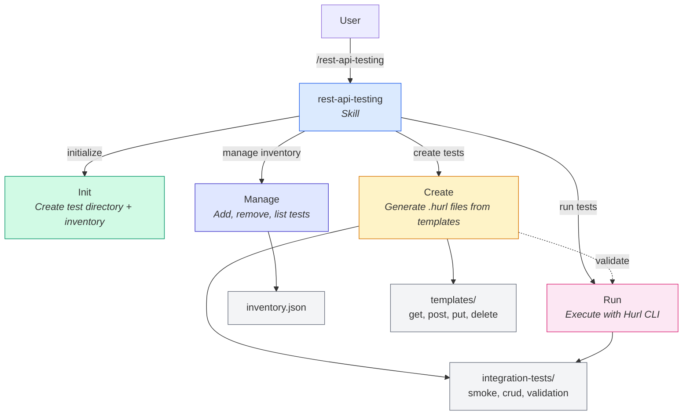

# Chapter 7: Creating Reusable Skills and Simple Agents

## From L2 to L3

In Chapter 6, you reached L2 — daily use of AI tools with instruction files and the plan-build-validate workflow. Every task used the same cycle: enter plan mode, review the plan, build step by step, validate with tests, commit. Your development process is already much faster. And even when it isn't faster, your quality is much better. You have time to play with your ideas, experiment with two or three approaches before committing to one. You're not afraid to throw away a first attempt and rebuild — because rebuilding is cheap now.

The next step is to extend your reach beyond writing code. In this chapter, you'll learn how to create **custom skills** — reusable instruction sets that encode your team's patterns — and understand **custom agents** — orchestrators that combine multiple skills into a single workflow.

To make it concrete, we'll build a REST API testing skill that generates, manages, and runs HTTP integration tests through natural language.

Here's where we are on the maturity ladder:

| Level | What it looks like |
|-------|-------------------|
| L0 | No AI tools. No awareness. |
| L1 | Tools installed. First supervised attempts. Copy-paste prompting. |
| L2 | Daily individual use. Instruction files. Basic workflows: plan → build → test. |
| **L3** | **Team-level shared practices. Reusable skills and custom instructions. Automation discovery begins.** |
| L4 | Structured workflows: spec → plan → implement → test → review. Human is PM and reviewer. |
| L5 | Full SDLC automated. Multi-agent orchestration. |
| L6 | Dark Factory — fully automated. Theoretical horizon. |

This chapter takes you from L2 to L3. By the end, you'll have built a complete skill with templates, tooling, and a Python CLI — all working, all reusable, all shareable with your team.

---

## Skills and Agents — Recap and Reference

Chapters 3 and 4 covered the theory behind skills, agents, and how they fit into the agent's architecture. This section recaps the key ideas and adds practical detail you'll need while building.

### Why Skills and Agents Exist

At L2, you work with instruction files (CLAUDE.md) and the plan-build-validate cycle. That works well for individual tasks. But you notice patterns:

- You give the same instructions to the agent across multiple sessions
- You explain the same conventions, the same file structure, the same workflow
- Different team members prompt the agent differently for the same task, getting inconsistent results

**Skills solve this.** A skill is reusable functionality — a set of instructions the agent can follow on demand. You write it once, and anyone on the team can invoke it. The agent produces consistent results every time, regardless of who prompted it.

**Agents go further.** An agent is an autonomous persona that decides *which* skill or behavior to use based on what you asked for. You don't invoke a specific skill — you describe what you need, and the agent routes to the right behavior.

### Skills — How They Work

A skill is a Markdown file with instructions that the agent follows within your conversation. You invoke it, the agent reads the instructions, and executes them step by step.

**Purpose:** Encode reusable functionality — testing workflows, code generation patterns, deployment steps, review checklists — so the agent does it the same way every time.

| Feature | Claude Code | Copilot |
|---------|------------|---------|
| Skill location | `.claude/skills/<name>/SKILL.md` | `.github/skills/<name>/SKILL.md` |
| Invocation | `/skill-name` or `/skill-name <args>` | `/skill-name` or `/skill-name <args>` |
| Frontmatter | `name`, `description`, `argument-hint` | `name`, `description`, `argument-hint` |
| Scope | Project (via git) or user (`~/.claude/skills/`) | Project (via git) |

#### How Skills Load — Two Stages

Skills load in two stages. This is a key design decision you need to understand.

**Stage 1 — Description at session start.** When a session begins, the agent sees the `name` and `description` from every skill's frontmatter. These are injected as annotations on conversation messages (not in the system prompt). The agent knows what skills are available and when to suggest them. The full content is *not* loaded — just the one-line descriptions.

**Stage 2 — Full content on invocation.** When you type `/skill-name`, the tool expands the full Markdown body and injects it into the conversation as if you had typed it yourself — it becomes a user message. The agent then follows those instructions using its existing session context.

```
┌───────────────────────────────────────────────────────┐
│  Session start                                        │
│  ┌─────────────────────────────────────────────────┐  │
│  │ SYSTEM message: vendor instructions + tools     │  │
│  └─────────────────────────────────────────────────┘  │
│  ┌─────────────────────────────────────────────────┐  │
│  │ USER message:                                   │  │
│  │   <system-reminder>                             │  │
│  │     CLAUDE.md, MEMORY.md, rules                 │  │
│  │   </system-reminder>                            │  │
│  │   <system-reminder>                             │  │
│  │     skill descriptions (names + one-liners)     │  │
│  │   </system-reminder>                            │  │
│  │   "Hello, let's work on the API"                │  │
│  └─────────────────────────────────────────────────┘  │
│                                                       │
│  User types: /rest-api-testing Run all tests          │
│  ┌─────────────────────────────────────────────────┐  │
│  │ USER message (injected): [full SKILL.md content]│  │
│  │ + "Run all tests"                               │  │
│  └─────────────────────────────────────────────────┘  │
│                                                       │
│  Agent follows skill instructions...                  │
└───────────────────────────────────────────────────────┘
```

**Why this matters:**

- **Descriptions are cheap.** Twenty skills with one-line descriptions cost almost nothing. The agent sees them all and can suggest the right one.
- **Full content is expensive.** A 200-line skill body consumes context. It only loads when needed — and it loads into the *conversation*, not the system prompt. That means it can get compacted in very long sessions, just like any other message.
- **Skills share your context.** Because the skill content becomes a conversation message, the agent has access to everything it already knows — files it read, conversation history, your earlier decisions. The skill doesn't start fresh; it builds on your current session.

#### Auto-Triggering

Skills can be triggered in two ways:

1. **Manual invocation.** You type `/skill-name`. This is the most common pattern.
2. **Auto-triggered by the agent.** If the agent's description matching determines that a skill is relevant to your request, it can invoke the skill automatically — you don't have to type the slash command. This depends on how the description is written. A description like *"Use when creating REST API integration tests"* tells the agent exactly when to activate.

This is why writing good descriptions matters. The description is the agent's routing table.

### Agents — How They Work

An agent is a separate persona with its own context, tools, and behavior. It goes beyond a skill — it doesn't just follow instructions, it interprets intent and decides what to do.

**Purpose:** Orchestrate multiple behaviors from a single entry point. The user describes what they need in natural language; the agent figures out which steps to take.

| Feature | Claude Code | Copilot |
|---------|------------|---------|
| Agent mechanism | Skill that orchestrates other skills | `.agent.md` file with dedicated persona |
| Agent file | `.claude/skills/<name>/SKILL.md` | `.github/agents/<name>.agent.md` |
| Invocation | `/agent-name <prompt>` | `@agent-name <prompt>` |
| Tool restrictions | Not natively supported | `tools:` field in frontmatter |

#### How Agents Load

Agents load differently depending on the platform:

**Claude Code:** An "agent" is technically a skill — same file format, same loading mechanism. The difference is in the *content*: instead of step-by-step instructions, it contains intent-parsing logic and routing to different behaviors. It loads into the conversation as a user message, just like any skill. It shares your session context.

**Copilot:** An `.agent.md` file gets its **own isolated context**. When you invoke `@agent-name`, Copilot spawns a separate context window with its own system message (the agent's instructions) and its own conversation. The agent never sees your prior conversation history — it starts fresh. When it finishes, its result comes back to your main session as a tool result.

```
┌─────────────────────────────────────────────────┐
│  Claude Code: agent as skill                    │
│  ┌────────────────────────────────────────────┐ │
│  │ Your existing conversation context         │ │
│  │ + agent skill content (user message)       │ │
│  │ → agent sees everything you've discussed   │ │
│  └────────────────────────────────────────────┘ │
│                                                 │
│  Copilot: agent as isolated persona             │
│  ┌────────────────────────────────────────────┐ │
│  │ Separate context window                    │ │
│  │ system message: agent's instructions       │ │
│  │ → agent sees ONLY its own instructions     │ │
│  │ → result returns to your session           │ │
│  └────────────────────────────────────────────┘ │
└─────────────────────────────────────────────────┘
```

### Skills vs Agents — Side by Side

| Aspect | Skill | Agent |
|--------|-------|-------|
| **Purpose** | Reusable functionality — do this task the same way every time | Orchestration — understand what the user wants, route to the right behavior |
| **Behavior** | Fixed: always follows the same steps | Dynamic: parses intent, picks different paths based on input |
| **Context** | Shares the current session (conversation, files read, history) | Claude Code: shares session. Copilot: isolated context window |
| **Where it loads** | Description: annotation on messages. Full content: user message in conversation | Claude Code: same as skill. Copilot: own system message in separate context |
| **Invocation** | Manual (`/skill-name`) or auto-triggered by description match | Manual (`/agent-name` or `@agent-name`) |
| **Tool access** | All tools the main agent has | Claude Code: all tools. Copilot: restricted via `tools:` frontmatter |
| **Composability** | Standalone — one skill, one task | Can chain multiple skills or behaviors in sequence |
| **Complexity** | Low — write instructions, done | Higher — needs intent parsing, routing logic, error handling across steps |
| **When to use** | You give the same instructions more than once | You invoke multiple skills in sequence to accomplish one goal |

**The rule of thumb:** if you find yourself giving the same instructions twice, write a skill. If you find yourself invoking three skills in sequence every time, write an agent.

### Hooks

There's a third extensibility mechanism: **hooks**. Hooks are shell commands that fire at lifecycle points — before a tool runs, after a tool runs, at session start, etc. They're useful for auto-formatting after edits, running linters after file changes, or logging tool usage.

We won't build hooks in this chapter, but know they exist. Skills, agents, and hooks are the three ways you customize an AI coding agent.

### Where Everything Lives in the Agent's Context

To tie it all together, here's where each customization mechanism lands in the agent's message flow:

| What you define | Where it lands | When the agent sees it | Survives compaction? |
|---|---|---|---|
| CLAUDE.md, MEMORY.md | `<system-reminder>` annotation on user messages | Session start, re-injected periodically | Re-injected after compaction |
| Rules (`.claude/rules/`) | `<system-reminder>` annotation on user messages | When glob pattern matches touched files | Re-injected after compaction |
| Skill descriptions | `<system-reminder>` annotation on user messages | Session start, re-injected periodically | Re-injected after compaction |
| Skill full content | New user message in conversation | Only when invoked | No (compacted like any message) |
| Skill with `context: fork` | Subagent's prompt (isolated context) | Only when invoked | N/A (isolated context) |
| Agent persona (Copilot) | Separate system message (isolated context) | Only the agent sees it | Yes (within its own context) |
| Agent result | Tool result (main conversation) | After the agent finishes | No (compacted like any message) |

> **Note:** The official docs say CLAUDE.md is "loaded into context" without specifying the exact mechanism. If you ask the agent to introspect (e.g., *"How did you receive my CLAUDE.md?"*), you'll find it arrives as `<system-reminder>` annotations on user messages — not in the system message. See Chapter 4 for the full message model. This is an implementation detail that could change, but understanding it helps you reason about context priority and compaction.

**The practical implication:** CLAUDE.md and rules are re-injected after compaction, so they outlast anything you say in conversation. But they're not in the system message — they can briefly disappear during compaction before being re-injected. Skill content is ephemeral — it loads on demand and gets compacted when the conversation grows long. Design your skills to be self-contained: every invocation should include everything the agent needs, because it can't rely on prior invocations still being in context.

### A Skill Is a Folder, Not a File

This is easy to miss but important: a skill is a **folder** containing a `SKILL.md` file — not just the file itself. The folder is the skill's workspace. You can put anything next to `SKILL.md`:

```
.claude/skills/rest-api-testing/
├── SKILL.md                    # Instructions the agent follows
├── USAGE.md                    # Human-readable usage guide
├── code/
│   └── test_manager.py         # Python CLI the skill references
└── templates/
    ├── get.hurl                # Templates the skill uses to generate tests
    ├── post.hurl
    ├── put.hurl
    └── delete.hurl
```

The agent can read any file in the skill folder. The skill instructions in `SKILL.md` can reference templates (`"pick the matching template from templates/"`), invoke code (`"run test_manager.py init"`), or point to documentation (`"see USAGE.md for installation"`). The folder structure turns a skill from a set of instructions into a **self-contained toolkit** — instructions plus the code, templates, and data they operate on.

This is a big difference from instruction files like CLAUDE.md, which are single files with text. A skill folder can carry its own implementation.

### Anatomy of a SKILL.md

The `SKILL.md` file format is the same for Claude Code and Copilot — same frontmatter, same Markdown body, same structure. A skill written for one platform generally works on the other without changes. The only difference is where you put the folder:

| Platform | Skill location |
|----------|---------------|
| Claude Code | `.claude/skills/<name>/SKILL.md` |
| Copilot | `.github/skills/<name>/SKILL.md` |

In practice, skills are backward-compatible across platforms. The frontmatter fields (`name`, `description`, `argument-hint`) are recognized by both. The Markdown body is just instructions — any agent can follow them. If your skill references platform-specific features (like Claude Code's subagent dispatch), those parts won't work on the other platform, but the core workflow usually transfers directly.

**The file structure:**

```markdown
---
name: my-skill
description: One-line summary shown at session start
argument-hint: What the user should pass as an argument
---

# my-skill

Instructions the agent follows when this skill is invoked.
Step-by-step, imperative, specific.
```

The frontmatter is YAML. The body is Markdown. Write the body as if you're giving instructions to a capable but literal junior developer: step by step, no ambiguity, no assumptions.

### Designing a Skill — Structure and Best Practices

A skill folder can contain anything, but good skills follow a consistent structure. Here's the pattern we use for the REST API testing skill — and the reasoning behind each part.

#### The Recommended Folder Layout

```
.claude/skills/<skill-name>/
├── SKILL.md              # Instructions for the agent (loaded on invocation)
├── USAGE.md              # Instructions for humans (never loaded by the agent)
├── code/                 # Executable code the skill references
│   └── tool.py           # CLI, scripts, helpers
└── templates/            # Starting points for generated files
    ├── template-a.ext
    └── template-b.ext
```

Four parts, each with a distinct role:

| Part | Audience | Purpose |
|------|----------|---------|
| `SKILL.md` | The agent | What the agent reads and follows when the skill is invoked |
| `USAGE.md` | Humans | Setup instructions, prerequisites, example prompts — for the developer reading the repo, not for the agent |
| `code/` | The agent (via execution) | Scripts and tools the agent runs as part of the skill workflow |
| `templates/` | The agent (via reading) | Starter files the agent reads, customizes, and writes to the project |

#### Separating SKILL.md from USAGE.md

`SKILL.md` is loaded into the agent's context on invocation. Every line costs tokens. Write it for the agent — imperative instructions, quick reference tables, precise commands.

`USAGE.md` is for humans browsing the repository. It can be verbose — installation steps, troubleshooting, example prompts, platform-specific setup guides. The agent never sees it unless you explicitly tell it to read the file.

**Don't put human documentation in SKILL.md.** A 300-line SKILL.md that includes installation instructions, troubleshooting sections, and verbose examples wastes context every time the skill is invoked. Move that to USAGE.md and keep SKILL.md lean.

#### The `code/` Folder — Token Efficiency Through Tooling

This is the most important best practice: **move complexity out of SKILL.md and into code.**

Consider two approaches to the same task — running tests and reporting results:

**Approach A — Instructions in SKILL.md (expensive):**
```markdown
## Running tests

1. Find all .hurl files registered in inventory.json
2. For each file, run: hurl --test --variable base_url=<url> <file>
3. Capture stdout and stderr
4. Parse the output to extract pass/fail status
5. If multiple tests, build a summary table with columns: Test, Status, HTTP, Time
6. If single test, parse the JSON report for assertions and show each one
7. Calculate totals: passed, failed, skipped
8. Format the output as...
   [20 more lines of formatting instructions]
```

Every time the skill is invoked, these 30+ lines load into context. The agent has to interpret them, and the output quality depends on how well the agent parses raw Hurl output.

**Approach B — Code in `code/` (efficient):**
```markdown
## Running tests

- **All tests:** `test_manager.py run-all`
- **One suite:** `test_manager.py run-suite <suite>`
- **Specific tests:** `test_manager.py run <name1> <name2>`
```

Three lines. The parsing, formatting, error handling, and structured output all live in `test_manager.py` — code that runs deterministically, not instructions that the agent interprets. The agent just runs the command and gets clean output.

**The rule:** if the agent is doing the same multi-step data processing every time — parsing output, building tables, managing JSON files, resolving paths — put it in a script. The skill instruction becomes a one-line command. You save tokens, get consistent results, and make the skill easier to maintain.

What belongs in `code/`:
- **CLI tools** that the agent invokes (like `test_manager.py`)
- **Parsers** for structured output (test results, API responses, log files)
- **Generators** that produce files from templates programmatically
- **Validators** that check prerequisites, syntax, or configuration

What does *not* belong in `code/`:
- Business logic that should live in the project itself
- One-off scripts that only work for a specific project

#### The `templates/` Folder — Consistent Generation

Templates are starter files the agent reads and customizes. They enforce consistency without long lists of formatting rules in SKILL.md.

A template like `get.hurl`:
```hurl
# Test: {{test_name}}
# Suite: {{suite}}
# Endpoint: GET {{endpoint}}

GET {{base_url}}{{endpoint}}
HTTP 200
[Asserts]
header "Content-Type" contains "application/json"
```

This is more effective than writing in SKILL.md: *"Every test file must start with a comment block containing the test name, suite, and endpoint. Then write the HTTP method and URL using the base_url variable. Then add HTTP 200 for the expected status. Then add an [Asserts] section..."* The template shows the format in 8 lines. The instructions would take 20 lines to describe it and still leave room for interpretation.

**Templates teach by example.** The agent reads the template, sees the structure, and replicates it with the right values. This is how humans learn too — patterns are easier to follow than rules.

Good templates:
- Are **minimal** — show the structure, not every possible variation
- Use **placeholder values** that make the structure obvious (`{{test_name}}`, `{{endpoint}}`)
- Include **one example of each convention** (comment header, variable usage, assertion style)
- Are **real files** in the format the skill generates (`.hurl`, `.java`, `.yaml` — not pseudocode)

#### Putting It Together — The Token Budget

When the skill is invoked, the agent's context gets:

| What | Tokens (approximate) | Where it lives |
|------|---------------------|---------------|
| SKILL.md body | 200–500 | Loaded into conversation |
| Templates (when the agent reads them) | 50–100 each | Read tool results |
| CLI output (when the agent runs commands) | Varies | Tool results |
| USAGE.md | 0 | Never loaded unless explicitly read |
| Code files | 0 | Executed, not loaded into context |

The goal is to keep SKILL.md under ~500 tokens of instruction. Everything else — templates, code, documentation — lives in the folder but only enters context when the agent actively reads or runs it. This is the token efficiency advantage of the folder structure: the skill *has* 1000+ lines of code and templates, but the agent only *loads* what it needs for the current step.

---

## What We're Building

We're building a **REST API testing skill** — a single, comprehensive skill that creates, manages, and runs HTTP integration tests through natural language. The skill uses [Hurl](https://hurl.dev) for declarative HTTP test files and a Python CLI for inventory management.



### What the Skill Does

| Action | What it does | When you use it |
|--------|-------------|----------------|
| **Initialize** | Creates `integration-tests/` with inventory and suite folders | First-time setup for a new API |
| **Create** | Generates `.hurl` test files from templates, registers them in inventory | When you need tests for an endpoint |
| **Run** | Executes tests with Hurl CLI, reports structured results | After creating tests — to verify they work |
| **Manage** | List, add, remove tests from the inventory | To see what's covered or clean up |

### The Target API

All tests run against [JSONPlaceholder](https://jsonplaceholder.typicode.com) — a free fake REST API with six resources: `/posts`, `/comments`, `/albums`, `/photos`, `/todos`, and `/users`. It returns realistic JSON, supports GET/POST/PUT/DELETE, and never goes down. Perfect for testing.

### The File Structure

```
code/
├── rest-api-testing/                  # The skill
│   ├── SKILL.md                       # Skill instructions
│   ├── USAGE.md                       # Human-readable usage guide
│   ├── code/
│   │   └── test_manager.py            # Python CLI for inventory + test runner
│   └── templates/
│       ├── get.hurl                   # GET request template
│       ├── post.hurl                  # POST request template
│       ├── put.hurl                   # PUT request template
│       ├── delete.hurl                # DELETE request template
│       └── inventory.template.json    # Empty inventory template
└── integration-tests/                 # Generated test files
    ├── inventory.json                 # Test registry (managed by test_manager.py)
    ├── smoke/                         # Quick health checks
    │   ├── get-posts.hurl
    │   └── get-users.hurl
    ├── crud/                          # Full CRUD operations
    │   ├── create-post.hurl
    │   ├── update-post.hurl
    │   └── delete-post.hurl
    └── validation/                    # Error cases, edge cases
        └── get-invalid-post.hurl
```

The skill lives in `rest-api-testing/` with its instructions, templates, and tooling. The `integration-tests/` folder holds the generated test files and inventory. When deployed, the skill goes into `.claude/skills/rest-api-testing/` and the tests go into `integration-tests/` at the project root.

---

## Building the Skill — Step by Step

### The SKILL.md

This is the heart of the skill — the instructions the agent follows when you invoke `/rest-api-testing`.

**The full SKILL.md:**

```markdown
---
name: rest-api-testing
description: Use when creating, managing, or running REST API integration tests,
  or when the user asks to test HTTP endpoints, verify API behavior, or set up
  integration test suites
---

# REST API Testing

## Overview

Create, manage, and run REST API integration tests using Hurl (declarative HTTP
test files) and a Python CLI for inventory management. Tests are `.hurl` files
organized by suite in `integration-tests/`.

## Prerequisites

- **Hurl CLI** installed (`hurl --version`). Install: https://hurl.dev
- **Python 3** available

## Quick Reference

| Action | Command |
|--------|---------|
| Initialize | `python <skill>/code/test_manager.py init <base_url>` |
| Add test to inventory | `python <skill>/code/test_manager.py add <name> <suite> <method> <endpoint> "<description>"` |
| Remove test | `python <skill>/code/test_manager.py remove <name>` |
| List all tests | `python <skill>/code/test_manager.py list` |
| List by suite | `python <skill>/code/test_manager.py list --suite smoke` |
| List by method | `python <skill>/code/test_manager.py list --method GET` |
| Run all tests | `python <skill>/code/test_manager.py run-all` |
| Run a suite | `python <skill>/code/test_manager.py run-suite smoke` |
| Run specific tests | `python <skill>/code/test_manager.py run get-posts get-users` |

Replace `<skill>` with the path to `.claude/skills/rest-api-testing`.

## Workflow

### First-time setup

1. Check prerequisites: `hurl --version` and `python3 --version`
2. Run `test_manager.py init <base_url>` to create `integration-tests/` with
   inventory and default suite folders (smoke, crud, validation)

### Creating tests

1. Ask the user which endpoints or scenarios to test
2. Pick the matching template from `templates/` (get.hurl, post.hurl, put.hurl,
   delete.hurl)
3. Customize the template: set endpoint, assertions, request body as needed
4. Write the `.hurl` file to `integration-tests/<suite>/<test-name>.hurl`
5. Register in inventory: `test_manager.py add <name> <suite> <method> <endpoint>
   "<description>"`
6. Run the new test to verify: `test_manager.py run <name>`

### Running tests

- **All tests:** `test_manager.py run-all`
- **One suite:** `test_manager.py run-suite <suite>`
- **Specific tests:** `test_manager.py run <name1> <name2>`

**Output rule:** When running a single test, do not summarize or reformat
successful output — the CLI output speaks for itself. Only add commentary when
tests fail or the user asks a question.

### Handling failures

When tests fail:
1. Show the failure output to the user (status code, expected vs actual,
   response body)
2. Ask: "Would you like me to analyze the failure and suggest a fix?"
3. If yes: read relevant project source files and suggest a fix
4. If no: move on

## Hurl File Format

    # Test: get-posts
    # Suite: smoke
    # Endpoint: GET /posts

    GET {{base_url}}/posts
    HTTP 200
    [Asserts]
    header "Content-Type" contains "application/json"
    jsonpath "$" count > 0

- `{{base_url}}` is injected at runtime by test_manager.py from inventory
- Comments at the top are metadata (test name, suite, endpoint)
- `HTTP 200` is the expected status code
- `[Asserts]` section contains explicit assertions

## Common Assertions

| Assertion | Example |
|-----------|---------|
| Status code | `HTTP 200` |
| Header value | `header "Content-Type" contains "application/json"` |
| JSON field exists | `jsonpath "$.id" exists` |
| JSON field value | `jsonpath "$.title" == "foo"` |
| Array count | `jsonpath "$" count == 10` |
| Array not empty | `jsonpath "$" count > 0` |
| Regex match | `jsonpath "$.email" matches /\S+@\S+/` |
| Field is string | `jsonpath "$.name" isString` |
| Field is integer | `jsonpath "$.id" isInteger` |

## Test Organization

    integration-tests/
    ├── smoke/          # Quick health checks (GET endpoints, basic connectivity)
    ├── crud/           # Full CRUD operations (create, read, update, delete)
    ├── validation/     # Error cases, edge cases, invalid inputs
    └── inventory.json  # Test registry (managed by test_manager.py)

Create new suite folders as needed for your project's testing needs.

## Windows / Git Bash Note

Git Bash auto-converts arguments starting with `/` to Windows paths. When calling
`test_manager.py add` with endpoint arguments, prefix the command:

    MSYS_NO_PATHCONV=1 python <skill>/code/test_manager.py add get-posts smoke GET /posts "description"

This is only needed in Git Bash. PowerShell, cmd.exe, and programmatic calls
are unaffected.
```

Let's break down the key design decisions.

---

### Decision 1: One Comprehensive Skill

The listing, creating, and running behaviors are tightly coupled. They all work with the same inventory, the same file structure, the same templates. One comprehensive skill is simpler, easier to maintain, and just as effective. The agent reads one file and has everything it needs. The Quick Reference table at the top serves as the routing mechanism — the agent picks the right command based on what the user asked for.

**When to split:** If your behaviors need different tool permissions, different contexts, or will be composed by multiple agents, split them. If they all operate on the same data in the same way, keep them together.

### Decision 2: Templates as Starting Points

The skill includes four `.hurl` templates — one per HTTP method:

**GET template:**
```hurl
# Test: {{test_name}}
# Suite: {{suite}}
# Endpoint: GET {{endpoint}}

GET {{base_url}}{{endpoint}}
HTTP 200
[Asserts]
header "Content-Type" contains "application/json"
```

**POST template:**
```hurl
# Test: {{test_name}}
# Suite: {{suite}}
# Endpoint: POST {{endpoint}}

POST {{base_url}}{{endpoint}}
Content-Type: application/json
{
  "title": "test",
  "body": "test body",
  "userId": 1
}
HTTP 201
[Asserts]
header "Content-Type" contains "application/json"
jsonpath "$.id" exists
```

Templates give the agent a starting point, not a finished product. The agent reads the template, understands the structure, then customizes it with the right endpoint, assertions, and request body. The result is consistent formatting across all tests — same comment header, same assertion style — while the content varies per endpoint.

**PUT template:**
```hurl
# Test: {{test_name}}
# Suite: {{suite}}
# Endpoint: PUT {{endpoint}}

PUT {{base_url}}{{endpoint}}
Content-Type: application/json
{
  "id": 1,
  "title": "updated",
  "body": "updated body",
  "userId": 1
}
HTTP 200
[Asserts]
header "Content-Type" contains "application/json"
```

**DELETE template:**
```hurl
# Test: {{test_name}}
# Suite: {{suite}}
# Endpoint: DELETE {{endpoint}}

DELETE {{base_url}}{{endpoint}}
HTTP 200
```

### Decision 3: A Python CLI for the Agent

Inventory management — tracking which tests exist, what they cover, which suite they belong to — needs structured data. JSON files need to be read, updated, and written back consistently. A CLI tool handles this cleanly.

`test_manager.py` is a single Python file (~460 lines) with clear subcommands:

```bash
# Initialize a new test suite
python test_manager.py init https://jsonplaceholder.typicode.com

# Add a test to the inventory
python test_manager.py add get-posts smoke GET /posts "Verify GET /posts returns 100 posts"

# List all tests
python test_manager.py list

# Run all tests
python test_manager.py run-all

# Run a specific suite
python test_manager.py run-suite smoke

# Run specific tests by name
python test_manager.py run get-posts get-users
```

The CLI wraps Hurl with inventory awareness. When you run `test_manager.py run-all`, it reads `inventory.json` to find all test files, then calls Hurl with the right arguments. When you run a single test, it shows detailed output — HTTP status, response body, assertion results. When you run multiple tests, it shows a summary table.

This is a pattern worth copying: **give the agent a CLI tool, not raw commands.** The CLI encapsulates complexity (finding files, building arguments, parsing output) and gives the agent a clean interface.

### Decision 4: The Inventory File

`inventory.json` tracks every test in a structured format:

```json
{
  "base_url": "https://jsonplaceholder.typicode.com",
  "tests": [
    {
      "name": "get-posts",
      "suite": "smoke",
      "file": "smoke/get-posts.hurl",
      "method": "GET",
      "endpoint": "/posts",
      "description": "Verify GET /posts returns 100 posts with correct structure"
    },
    {
      "name": "create-post",
      "suite": "crud",
      "file": "crud/create-post.hurl",
      "method": "POST",
      "endpoint": "/posts",
      "description": "Verify POST /posts creates a new post"
    }
  ]
}
```

This gives you:

- **Fast reads.** The agent reads one JSON file instead of scanning `.hurl` files.
- **Filtering.** List by suite, by HTTP method, or by name — without parsing file contents.
- **Duplicate detection.** Before creating a test, the agent checks the inventory.
- **Cross-session persistence.** The inventory survives between sessions. A new session picks up exactly where the last one left off.
- **Base URL in one place.** All tests use `{{base_url}}` — the actual URL lives in the inventory, not scattered across test files.

### Decision 5: Suite-Based Organization

Tests are organized into suites by folder:

```
integration-tests/
├── smoke/          # Quick health checks
├── crud/           # Full CRUD operations
├── validation/     # Error cases and edge cases
└── inventory.json
```

This is deliberate. Smoke tests run in seconds — you use them for quick sanity checks. CRUD tests are more thorough — you run them after changes. Validation tests cover edge cases — you run them before releases.

The agent understands this organization. When you say "add a smoke test for GET /users," it writes the file to `smoke/get-users.hurl`. When you say "run the smoke tests," it runs `test_manager.py run-suite smoke`.

---

## Demo Walkthrough

Four demos that show the full skill lifecycle: create, run, fail, filter.

### Demo 1: Create Tests

**Prompt:**
```
/rest-api-testing Set up integration tests for https://jsonplaceholder.typicode.com. Create smoke tests for GET /posts and GET /users, plus CRUD tests for /posts.
```

**What happens:** The skill initializes the test directory, then generates five tests from templates:

```
Initialized: integration-tests/
Base URL: https://jsonplaceholder.typicode.com
Created suites: smoke, crud, validation
```

The agent reads the GET template, customizes it for each smoke endpoint, then uses the POST, PUT, and DELETE templates for CRUD:

```
Created 5 tests:
  + smoke/get-posts.hurl   — GET /posts (returns 100 posts with correct structure)
  + smoke/get-users.hurl   — GET /users (returns 10 users)
  + crud/create-post.hurl  — POST /posts (creates a new post)
  + crud/update-post.hurl  — PUT /posts/1 (updates an existing post)
  + crud/delete-post.hurl  — DELETE /posts/1 (deletes a post)

Inventory updated.
```

The generated `get-posts.hurl` shows how the agent starts from the template and adds meaningful assertions:

```hurl
# Test: get-posts
# Suite: smoke
# Endpoint: GET /posts

GET {{base_url}}/posts
HTTP 200
[Asserts]
header "Content-Type" contains "application/json"
jsonpath "$" count == 100
jsonpath "$[0].id" == 1
jsonpath "$[0].title" isString
jsonpath "$[0].body" isString
jsonpath "$[0].userId" isInteger
```

**What you learn:** The agent uses templates as a starting point, not a finished product. It keeps the consistent format (comment header, `{{base_url}}` variable, `[Asserts]` section) but adds assertions based on the API's response shape.

---

### Demo 2: Run All Tests

**Prompt:**
```
/rest-api-testing Run all tests
```

**What happens:** The skill runs `test_manager.py run-all` and shows a summary table:

```
Running 5 test(s)...

Test                                Status     HTTP       Time
---------------------------------------------------------------------------
get-posts                           PASS       HTTP/2 200 245ms
get-users                           PASS       HTTP/2 200 189ms
create-post                         PASS       HTTP/2 201 312ms
update-post                         PASS       HTTP/2 200 287ms
delete-post                         PASS       HTTP/2 200 195ms
---------------------------------------------------------------------------
Passed: 5/5  Failed: 0/5
```

**What you learn:** The CLI produces clean, structured output — the agent doesn't parse raw Hurl output. `test_manager.py` handles the formatting, timing, and status extraction.

---

### Demo 3: Handle a Failing Test

**Prompt:**
```
/rest-api-testing Add a validation test: GET /posts/99999 should return 404. Then run it.
```

**What happens:** The agent creates a minimal test and runs it. The test fails:

```
Running 1 test...

Result: FAILED

Failure output:
  error: Assert status code
    --> integration-tests/validation/get-invalid-post.hurl:6:6
     |
   6 | HTTP 404
     |      ^^^ actual value is 200
     |
```

The skill shows the failure and asks: "Would you like me to analyze the failure and suggest a fix?"

If you say yes, the agent reads the test, understands the mismatch (expected 404, got 200), and proposes updating the assertion:

```hurl
GET {{base_url}}/posts/99999
HTTP 200
[Asserts]
jsonpath "$" isEmpty
```

**What you learn:** The failure analysis workflow is built into the skill's instructions. The agent doesn't just report "test failed" — it shows expected vs actual values and offers to fix it. This is the **debug loop** pattern. It also shows that tests document how the API *actually* behaves — JSONPlaceholder returns 200 with an empty body for invalid IDs, not 404.

---

### Demo 4: Run Tests by Suite

**Prompt:**
```
/rest-api-testing Run just the smoke suite
```

**What happens:** The skill runs `test_manager.py run-suite smoke`:

```
Running 2 test(s)...

Test                                Status     HTTP       Time
---------------------------------------------------------------------------
get-posts                           PASS       HTTP/2 200 231ms
get-users                           PASS       HTTP/2 200 178ms
---------------------------------------------------------------------------
Passed: 2/2  Failed: 0/2
```

**What you learn:** Suite-based filtering lets you run a subset of tests. Smoke tests run in under a second — use them for quick sanity checks after changes. The agent translates "just the smoke suite" into `test_manager.py run-suite smoke`.

---

## Agents — The Theory

We built one skill in this chapter. A natural next question: when do you need an *agent* instead?

### When a Skill Isn't Enough

A skill always does the same thing. You invoke it, it follows its instructions, it produces output. The `rest-api-testing` skill works because all its behaviors (init, create, run, list) share the same context — same files, same inventory, same templates.

An agent is different. An agent **parses intent** and **routes to behavior**. It doesn't follow one set of steps — it decides which steps to follow based on what you asked for.

You need an agent when:

| Situation | Why a skill falls short |
|-----------|------------------------|
| Multiple skills need to be **composed** into a workflow | A skill can't invoke another skill |
| The user's intent is **ambiguous** and needs interpretation | A skill assumes a known task |
| Different inputs need **different behaviors** (not just different parameters) | A skill follows one path |
| The workflow needs **multi-phase orchestration** (discover → plan → execute → verify) | A skill is a single phase |
| You want a **dedicated persona** with its own context | A skill shares the session context |

### Anatomy of an Agent

An agent is structurally similar to a skill, but its instructions focus on **understanding intent** and **routing to behavior** rather than executing a fixed set of steps.

Here's what an agent for our REST API testing scenario might look like:

```markdown
---
name: rest-test-agent
description: Orchestrator agent for REST API test management. Understands
  natural language — list tests, create new ones, run them, or generate
  full coverage.
argument-hint: Describe what you need: list tests, create tests for an
  endpoint, run tests, or generate full coverage
---

# rest-test-agent

You are a REST API test management agent. You understand natural language
and route requests to the right behavior.

## Step 1: Parse intent from the user's prompt

Read the argument the user passed and identify their intent:

| Keywords in prompt | Intent |
|---|---|
| "list", "show", "what tests", "existing" | **list** |
| "create", "add", "generate", "new test" | **create** |
| "run", "execute", "verify", "check" | **run** |
| "full coverage", "all endpoints", "cover everything" | **full-coverage** |

If the intent is unclear, ask the user.

## Step 2: Route to the right behavior

### Intent: list
Use the rest-api-testing skill to list existing tests...

### Intent: create
Use the rest-api-testing skill to create new tests...

### Intent: run
Use the rest-api-testing skill to run tests...

### Intent: full-coverage
Chain all behaviors: list → identify gaps → create → run → fix...
```

The key elements:

1. **Intent parsing.** The agent reads the user's natural language and maps it to a known intent. This is the core difference from a skill.

2. **Routing logic.** Based on the parsed intent, the agent picks the right behavior. Different inputs lead to different paths.

3. **Chaining.** In full-coverage mode, the agent chains multiple behaviors into a multi-step workflow: list what exists, identify gaps, create missing tests, run everything, fix failures.

4. **Persona.** The opening line — "You are a REST API test management agent" — gives it a role. It's not just following steps; it's acting as a testing specialist.

### Claude Code vs Copilot

The two platforms implement agents differently:

| Feature | Claude Code | Copilot |
|---------|------------|---------|
| Agent file | `.claude/skills/<name>/SKILL.md` (a skill that acts as an orchestrator) | `.github/agents/<name>.agent.md` (dedicated format) |
| Invocation | `/agent-name <prompt>` | `@agent-name <prompt>` |
| Tool restrictions | Not natively supported | `tools:` field in frontmatter |
| Own context | Shares your session context | Yes, gets isolated context |

In Claude Code, an "agent" is really a skill that contains intent-parsing and routing logic. It doesn't get a separate context — it operates within your current session. This means it can see files you've already read and conversation history you've built up.

In Copilot, an `.agent.md` file gets its own isolated context and can restrict which tools it has access to. The `tools:` field in the frontmatter explicitly lists what the agent can do (e.g., `runCommand`, `editFile`, `readFile`). This prevents the agent from doing things you didn't intend.

### When to Build an Agent

For most teams starting with AI coding, **start with skills.** Build a few focused skills that handle your most common workflows. Only promote to an agent when you find yourself saying:

- "I keep having to invoke three skills in sequence to do one thing"
- "I wish the agent would figure out which skill to use based on my question"
- "I need a dedicated testing/deployment/review persona"

The `rest-api-testing` skill we built in this chapter covers most testing workflows without an agent. You'd only need an agent if you wanted to chain testing with other concerns — say, an agent that reads a PR diff, identifies changed endpoints, generates tests for those endpoints, runs them, and posts the results as a PR comment. That's multi-step orchestration across different domains. That's when an agent earns its complexity.

---

## Creating Skills and Agents — The Practical How

You know what skills and agents are. Now — how do you actually create one?

### Creating Agents

Both platforms have built-in commands that scaffold agents for you:

| Platform | Command | What it does |
|----------|---------|-------------|
| Claude Code | `/agents` | Lists all agents, lets you select **Create new agent**, choose scope (user/project), and **Generate with Claude** — describe what your agent should do and Claude writes the system prompt |
| Copilot | `/agents` | Same interactive flow — create, configure, and save `.agent.md` files |

This is the fastest path. Claude generates the frontmatter, intent parsing, and routing logic from your description. Review, edit, done.

### Creating Skills

Both platforms have dedicated skills that help you author new skills:

| Platform | Skill | What it does |
|----------|-------|-------------|
| Claude Code | `/writing-skills` ([Superpowers plugin](https://github.com/anthropics/claude-code-plugins)) | Walks you through the full authoring process — frontmatter, trigger conditions, SKILL.md content, and testing that agents actually follow the instructions |
| Copilot | `make-skill-template` ([awesome-copilot](https://github.com/github/awesome-copilot)) | Scaffolds a new skill folder with SKILL.md template and supporting file structure |

You can also just create the files manually — `mkdir -p .claude/skills/my-skill/` (or `.github/skills/` for Copilot), write `SKILL.md`, done. The `/` commands help when you want guidance on structure and best practices.

### Official Repositories and Templates

Browse these before writing from scratch — someone may have already built what you need:

| Repository | What it offers |
|-----------|---------------|
| [anthropics/skills](https://github.com/anthropics/skills) | Official Anthropic example skills — creative, technical, and enterprise workflows |
| [github/awesome-copilot](https://github.com/github/awesome-copilot) | GitHub's community collection of skills, agents, and configurations |
| [awesome-claude-code](https://github.com/hesreallyhim/awesome-claude-code) | Curated skills, hooks, slash commands, and plugins for Claude Code |
| [awesome-claude-skills](https://github.com/travisvn/awesome-claude-skills) | Curated Claude skills, resources, and community tools |

---

## Try It Yourself

The complete working code is in the `code/` folder alongside this chapter.

### Prerequisites

- **Python 3.8+** — [python.org](https://www.python.org/downloads/)
- **Hurl 6.0+** — [hurl.dev](https://hurl.dev/docs/installation.html)
- **Claude Code** installed (see Chapter 6 for setup)

### Setup

1. Clone this repository (if you haven't already)

2. Navigate to the code folder:
   ```bash
   cd technical/07_skills-and-agents/code/
   ```

3. Verify prerequisites:
   ```bash
   python --version    # 3.8+
   hurl --version      # 6.0+
   ```

4. Run the existing tests:
   ```bash
   python rest-api-testing/code/test_manager.py run-all
   ```
   You should see 6 tests run (some may fail if JSONPlaceholder behaves differently than expected — that's fine, it's a learning opportunity).

5. **To use as a skill:** Copy the `rest-api-testing/` folder to your project's `.claude/skills/`:
   ```bash
   mkdir -p /path/to/your/project/.claude/skills/
   cp -r rest-api-testing/ /path/to/your/project/.claude/skills/rest-api-testing/
   ```
   Then start a Claude Code session in your project: `claude`

6. Run through the demos from the previous section. Start with listing tests and work your way up to creating and running your own.

> **Tip:** You don't have to use JSONPlaceholder. Run `test_manager.py init https://your-api.com` and the skill will adapt. The test conventions and templates stay the same — only the base URL and resource names change.

---

## Lessons Learned and Patterns

### The Skill Creation Workflow

Building a skill is a development task — treat it like one. Follow the same plan-build-validate workflow from Chapter 6:

1. **Plan first if it's complex.** A quick utility skill? Just write it. A multi-step workflow with templates, CLI tooling, and inventory management? Enter plan mode. Describe what the skill should do, what files it needs, how the agent should interact with it. Review the plan before touching any files.

2. **Use the `/` commands.** Don't manually create agent boilerplate — run `/agents` and let Claude generate the system prompt. For skills, start from a template in [anthropics/skills](https://github.com/anthropics/skills) when one fits. The tooling exists to save you time. Use it.

3. **Validate by running.** After creating a skill, invoke it. Run through the core use cases. Have someone else try it cold. A skill that only works for its author isn't reusable — it's a personal note.

### Quick Anatomy Reference

Every skill follows the same structure. Keep this as a checklist:

| Part | Required? | Purpose |
|------|-----------|---------|
| **Frontmatter** (`name`, `description`, `argument-hint`) | Yes | Discovery — the agent reads this at session start to know when to suggest the skill |
| **Overview section** | Yes | What the skill does in 1-2 sentences |
| **Quick Reference table** | Recommended | Scannable lookup for common commands or behaviors |
| **Step-by-step instructions** | Yes | What the agent follows on invocation — imperative, specific, no ambiguity |
| **`code/` folder** | When complexity > ~10 steps | Move parsing, formatting, and orchestration into scripts |
| **`templates/` folder** | When generating files | Teach by example — show the format, don't describe it |
| **`USAGE.md`** | When humans need setup docs | Keep human docs out of SKILL.md — every token in SKILL.md costs context |

**The golden rule:** SKILL.md should be under ~500 tokens of instruction. Everything else lives in the folder.

### Pattern: The Inventory File

`inventory.json` tracks every generated test in a structured JSON file. This gives you:

- **Fast reads.** List tests by reading one file instead of scanning `.hurl` files.
- **Consistent format.** The CLI and the skill both read and write the same structure.
- **Cross-session persistence.** The inventory survives between sessions. A new session picks up exactly where the last one left off.
- **Duplicate detection.** Check the inventory before generating, preventing redundant tests.

Use this pattern whenever your skills generate artifacts. A JSON inventory is cheaper to read than scanning source files every time.

### Pattern: The Debug Loop

The skill's failure handling workflow — show the error, offer to analyze, suggest a fix — is the **debug loop** pattern. The agent iterates until green or escalates to the user.

Most test failures are simple: wrong status code, unexpected field value, assertion too strict. The debug loop catches these automatically. The hard failures — logic errors, API behavior changes, missing authentication — get flagged for manual review.

The debug loop is useful beyond testing. Any skill that runs code and checks results can benefit from an analyze-fix-retry cycle: linters, build scripts, deployment health checks.

### Pattern: Templates as Conventions

The Hurl templates enforce a consistent format across all generated tests:

- Same comment header (test name, suite, endpoint)
- Same assertion style (`[Asserts]` section with typed checks)
- Same variable usage (`{{base_url}}` injected at runtime)

The result: every test file looks like it was written by the same person, regardless of who prompted it or when. This is how you scale consistency across a team. Instead of code review comments like "add the comment header" or "use the base_url variable," the templates enforce it automatically.

### Pattern: CLI Wrapping

`test_manager.py` wraps Hurl with inventory management and structured output. The skill tells the agent to use the CLI, not raw Hurl commands. This gives you:

- **Abstraction.** The agent doesn't need to know Hurl's full flag syntax.
- **Structured output.** The CLI formats results for easy parsing — summary tables for multiple tests, detailed output for single tests.
- **Inventory integration.** Run by name, not by file path. The CLI resolves names to files via the inventory.

Give your skills CLI tools, not raw commands. The CLI encapsulates complexity and gives the agent a clean interface.

### When to Use a Skill vs an Agent

| Use a skill when... | Use an agent when... |
|---------------------|---------------------|
| One focused task (even with multiple sub-actions) | Multi-step workflow across different domains |
| Clear input, clear output | Natural language routing needed |
| All behaviors share the same context | Composes skills with different contexts |
| Quick to invoke | Needs its own persona |
| Steps are always the same | Steps depend on user intent |

Most of the time, start with a skill. A well-designed skill with a good Quick Reference table handles more than you'd expect. Only promote to an agent when you're composing across domains.

### Testing Your Skills

After building a skill, validate it:

1. **Run through the demo prompts.** Every prompt from the walkthrough should produce the expected output.
2. **Test edge cases.** Empty inventory. Missing prerequisites. API unreachable. Invalid user input.
3. **Have a teammate try it cold.** If they can't follow the output or get confused by a step, simplify.
4. **Check after every change.** Skills are code. A small edit can break the flow. Run the demos after any modification.

---

## What's Next

You've reached L3 — team-level shared practices with reusable skills. You've built a skill that encodes your team's testing patterns into a reusable, shareable instruction set. You understand when to use a skill vs an agent, and you know the patterns that make skills reliable: inventory files, debug loops, templates as conventions, CLI wrapping.

But skills and agents are just the building blocks. The real power comes from applying them across the full software lifecycle — not just testing. The next big shift is **L3 → L4** — moving from being an AI tool user to being a reviewer of AI-driven processes. That's where structured workflows, spec-driven development, and multi-agent orchestration come in.

Coming up:

- **Chapter 8: Using AI in the Software Lifecycle** — Design, coding, testing, documentation, code review. How to apply agent workflows at every stage.
- **Chapter 9: Spec-Driven Development** — Write the *what* as a specification. Let the agent figure out the *how* across multiple files, tests, and documentation.
- **Chapter 10: External Tools and Integrations** — MCP servers, API integrations, and connecting your agent to the outside world.

---

## Resources

- [Claude Code Custom Slash Commands](https://docs.anthropic.com/en/docs/claude-code/skills) — Official documentation for creating and using skills in Claude Code
- [Claude Code Custom Subagents](https://code.claude.com/docs/en/sub-agents) — Official documentation for creating agents with the `/agents` command
- [anthropics/skills](https://github.com/anthropics/skills) — Official Anthropic repository with example skills across creative, technical, and enterprise workflows
- [Copilot Skills (SKILL.md)](https://docs.github.com/en/copilot/customizing-copilot/extending-copilot-chat-with-skills) — GitHub's guide to creating Copilot skills
- [Copilot Agent Mode and .agent.md](https://docs.github.com/en/copilot/using-github-copilot/using-copilot-coding-agent) — Documentation on Copilot's agent file format
- [Creating Agent Skills for Copilot](https://docs.github.com/en/copilot/how-tos/use-copilot-agents/coding-agent/create-skills) — GitHub's guide for Copilot coding agent skills
- [github/awesome-copilot](https://github.com/github/awesome-copilot) — GitHub's community collection of skills, agents, and configurations
- [awesome-claude-code](https://github.com/hesreallyhim/awesome-claude-code) — Curated list of skills, hooks, slash commands, and plugins for Claude Code
- [Superpowers Plugin](https://github.com/anthropics/claude-code-plugins) — Agentic skills framework with TDD-based skill authoring methodology
- [Hurl — Run and Test HTTP Requests](https://hurl.dev) — Official Hurl documentation and installation guide
- [JSONPlaceholder](https://jsonplaceholder.typicode.com) — The free fake REST API used in all demos
- [Chapter 3: Coding with AI Agents](../03_coding-with-agents/03_coding-with-agents.md) — Theory behind skills and agent extensibility
- [Chapter 4: The Big Picture](../04_the-big-picture/04_the-big-picture.md) — How agents process instructions and manage context
- [Chapter 6: A Development Workflow](../06_a-development-workflow/06_a-development-workflow.md) — The plan-build-validate workflow this chapter builds on
