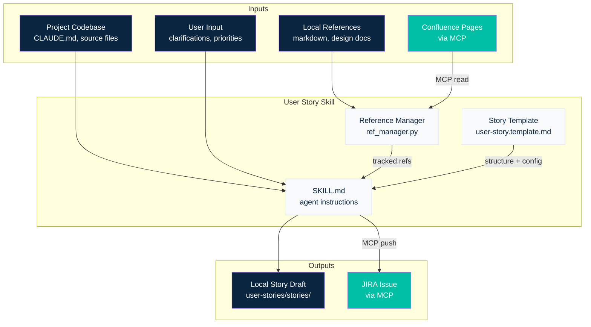

# Chapter 9: Automating User Story Creation

## Beyond Code

You've learned how to build skills (Chapter 7) and orchestrate multi-agent workflows (Chapter 8). Every example so far focused on writing code — testing, implementation, code review. But coding is only part of the development lifecycle.

Think about what else happens in a sprint:

- Writing user stories and acceptance criteria
- Gathering requirements from design specs, Confluence pages, meeting notes
- Estimating effort, linking to epics, filling out JIRA fields
- Reviewing and refining stories before they enter a sprint

These tasks are repetitive, template-driven, and context-heavy — exactly the kind of work an AI agent handles well. In this chapter, you'll see how to apply skill-building techniques to **user story creation**: a non-coding task that every development team does, and few do efficiently.

We'll walk through the design decisions behind a working skill, explore how to bring external data into the agent's context, and produce a reusable tool your team can adopt today. The complete implementation lives in this chapter's `user-stories/` folder.

---

## The Data Advantage You Already Have

Before building anything new, consider what the agent already knows.

If you followed the earlier chapters, your project has instruction files — `CLAUDE.md`, `AGENTS.md`, maybe scoped `.claude/` configs. These files describe your project's architecture, conventions, folder structure, and team practices. They're not just instructions for the agent — they *are* your project's living documentation.

When you ask the agent to create a user story, it already has:

- **Project architecture** — from `CLAUDE.md` and instruction files
- **Code structure** — it can explore the repo with Glob, Grep, and Read
- **Naming conventions and patterns** — from the code itself
- **Public knowledge** — the agent can search the web for library docs, API references, and best practices

That's a significant head start. For many simple stories, this is enough — the agent can draft a story based on what it already sees in the codebase.

But enterprise work usually needs more:

| Source | Example | How to access |
|--------|---------|---------------|
| Local docs | Requirements markdown, design specs, meeting notes | Read tool — already available |
| Confluence pages | Architecture decisions, product specs, team agreements | Needs an external connector |
| JIRA | Existing stories, epics, sprint context | Needs an external connector |
| Templates | Company story format, required fields, custom JIRA fields | A file the skill provides |

The gap is clear: **local files and code are accessible out of the box, but Confluence and JIRA need a bridge.** That bridge is an MCP server — a lightweight plugin that gives the agent new tools for external systems.

---

## MCP in 30 Seconds

**Model Context Protocol (MCP)** is a standard that lets AI agents talk to external systems through a uniform interface. An MCP server exposes tools — like "search Confluence" or "create JIRA issue" — that the agent can call the same way it calls built-in tools like Read or Grep.

For this chapter, you only need to know three things:

1. **An MCP server is a plugin.** You configure it in `.mcp.json` at your project root. The agent discovers the tools automatically.
2. **Tools have a prefix.** Atlassian MCP tools show up as `mcp__mcp-atlassian__jira_*` and `mcp__mcp-atlassian__confluence_*`. The skill checks for this prefix to know if the connector is available.
3. **Graceful degradation.** If the MCP server isn't configured, the skill still works — you just can't read Confluence or push to JIRA directly. Everything local still functions.

We'll cover MCP architecture, how to build your own servers, and advanced integration patterns in the next chapter. For now, think of it as: **the agent gets new tools, and the skill decides when to use them.**

---

## Approaching the Problem

Building a story-creation skill is no different from building a code-focused skill. You need three things:

### 1. Inputs — Where does the data come from?

The agent needs context to write a good story. That context comes from multiple sources:

- **The codebase** — already available through instruction files and file exploration
- **Local references** — markdown files, design docs, requirements — anything on disk
- **External references** — Confluence pages, wiki articles, shared documents
- **The user** — clarifications, priorities, scope decisions

The skill needs a way to **register and track** these references so it knows where to look when drafting a story.

### 2. Template — What should the output look like?

Enterprise teams don't write stories freeform. They have formats: required fields, JIRA field mappings, acceptance criteria checklists, subtask structures. The skill needs a **template** that defines the story structure and carries project-specific configuration — epic links, custom field IDs, priority defaults.

### 3. Connectivity — How do you reach external systems?

Reading Confluence and pushing to JIRA require API calls. The skill uses the Atlassian MCP server for this, but it's designed to work without it. Every operation either works fully (with MCP), partially (without MCP), or offers manual alternatives.

### How It Fits Together



The diagram shows the data flow: inputs feed into the skill's three components (reference manager, template, instructions), which produce either a local draft or a JIRA issue. Confluence and JIRA paths go through MCP — everything else is local.

---

## The User Story Skill — A Walkthrough

The complete skill lives in `user-stories/` alongside this chapter. Here we'll walk through the design decisions and key components — not every line of code, but everything you need to understand the architecture and adapt it to your own use case.

### Design Decisions

**Template-driven, not hardcoded.** The skill doesn't know anything about your project's JIRA setup. Field mappings, custom field IDs, default epics, priority values — all of it lives in the template's configuration block. Change the template, and the skill adapts. This means the same skill works across different projects with different JIRA configurations.

**Reference tracking with a simple CLI.** References are registered in a `references.json` file and managed through `ref_manager.py`. This gives you a persistent index of all data sources — local files and Confluence pages — that the agent consults when drafting stories. The CLI is intentionally simple: init, add, remove, list.

**Graceful degradation.** Every operation has a fallback. No MCP? The skill still creates stories from local files and saves them as markdown. No Confluence? Add the page manually as a local file. The skill never blocks on missing infrastructure.

### The Template

The template has two parts: a **configuration block** (an HTML comment the agent reads) and a **story body** with placeholders.

**Configuration block** — tells the agent how to map fields to JIRA:

```html
<!--
=== Template Configuration ===

Project: CYD
JIRA URL: https://your-org.atlassian.net/jira
Default epic: CYD-116

JIRA field mapping (markdown field → JIRA field):
  - "# title" heading        → summary
  - Body below metadata       → description
  - **Priority:** value       → priority
  - **Labels:** value         → labels (comma-separated → array)
  - **Story Points:** value   → story_points
  - **Epic:** value           → epic_link

Custom fields:
  - Epic Link: customfield_10001
  - AC Checklist: customfield_11100

=== End Configuration ===
-->
```

This is plain English, not a rigid schema. The agent reads it, understands the mappings, and applies them. If your project uses different custom fields or a different JIRA setup, you update this block — not the skill code.

**Story body** — uses `{{placeholder}}` markers and `{{#section}}...{{/section}}` optional blocks:

```markdown
# {{title}}

**Project:** {{project_key}}
**Epic:** {{epic_link}}
**Priority:** {{priority}}

---

## Current Situation
{{current_situation}}

## Desired Situation
{{desired_situation}}

{{#acceptance_criteria}}
## Acceptance Criteria
{{#acceptance_criteria_items}}
- [ ] {{item}}
{{/acceptance_criteria_items}}
{{/acceptance_criteria}}
```

Optional sections are wrapped in `{{#section}}...{{/section}}` blocks. If the story doesn't need a section, the agent removes the entire block. This keeps templates comprehensive without forcing every story to include every field.

### The Reference Manager

`ref_manager.py` is a small Python CLI (~430 lines) that manages the reference index. It handles:

| Command | What it does |
|---------|-------------|
| `init <project-key>` | Creates the `user-stories/` directory with `references.json`, `refs/`, and `stories/` subfolders |
| `add <type> <path\|url> "<title>"` | Registers a local file or Confluence URL as a reference |
| `list` | Shows all registered references |
| `mark-downloaded <id> <path>` | Updates a Confluence reference after local download |
| `list-stories` | Lists all local story drafts |

The agent calls these commands through Bash, then uses the Read tool to access the referenced content. For Confluence references, it fetches the page through MCP and saves a local copy for offline use.

**Why a separate CLI?** The agent could track references in memory, but a persistent file means references survive across sessions. You add your references once, and they're available every time you create a story.

### The SKILL.md — Agent Instructions

The `SKILL.md` file is the brain of the skill. It tells the agent:

1. **What tools are available** — the reference manager CLI, MCP tools (if present)
2. **How to handle each operation** — step-by-step instructions for init, add-ref, create, update
3. **How to gather context** — read all references, explore the codebase, synthesize before writing
4. **How to fill the template** — parse the config block, apply defaults, replace placeholders
5. **How to push to JIRA** — map fields using the template's configuration, handle custom fields

The key instruction for story creation (simplified):

```
1. Read the template — parse config block and body structure
2. List references — show to user
3. Gather context — read every reference, explore the codebase
4. Synthesize — extract technical details, constraints, terminology
5. Fill the template — apply defaults, replace placeholders
6. Show draft to user — ask for approval
7. Save or push — local markdown, JIRA, or both
```

Notice step 3: **read every reference**. The agent doesn't just look at one source — it reads all registered references, explores relevant parts of the codebase, and synthesizes everything before writing. This is what produces stories that reflect your actual project context rather than generic filler.

---

## Using the Skill

### Setup

```bash
# Initialize the data directory
python user-stories/code/ref_manager.py init PROJ --jira-url https://your-org.atlassian.net

# Add local references
python user-stories/code/ref_manager.py add local-md docs/requirements.md "Requirements" "Product requirements"

# Add a Confluence reference
python user-stories/code/ref_manager.py add confluence "https://org.atlassian.net/wiki/spaces/PROJ/pages/123" "Design Spec"
```

### Creating a Story

Once references are registered, you talk to the agent:

> "Create a user story for the login feature based on our references"

The agent will:
1. Read all registered references
2. Explore the codebase for relevant code
3. Fill in the template with synthesized context
4. Show you a draft for review
5. Ask whether to save locally or push to JIRA

### With and Without MCP

| Operation | With MCP | Without MCP |
|-----------|----------|-------------|
| Add local references | Full | Full |
| Add Confluence references | Fetches title automatically | Ask user for title |
| Download Confluence content | Fetches and saves locally | Manual download needed |
| Create story | Save locally or push to JIRA | Save locally only |
| Update JIRA story | Fetches, updates, and saves | Local draft only |

The skill never fails because MCP is missing — it just offers less automation.

### Example Prompts

```
"Initialize user stories for project MYPROJ with JIRA at https://myorg.atlassian.net"

"Add the requirements doc at docs/product-requirements.md as a reference"

"Create a high-priority story for the payment integration, 8 story points"

"Download all Confluence references for offline use"

"Update PROJ-42 — add error handling to acceptance criteria"
```

---

## Skill-Building Best Practices — A Recap

This skill applies every pattern from Chapter 7. Here's a quick checklist you can use when building any skill:

### Structure

| Component | Purpose | This skill's example |
|-----------|---------|---------------------|
| `SKILL.md` | Agent instructions — the brain | Step-by-step operations: init, add-ref, create, update |
| Templates | Output structure + project config | `user-story.template.md` with config block and placeholders |
| Supporting code | Persistent state, complex logic | `ref_manager.py` — CLI for reference tracking |
| Data directory | Runtime artifacts, user content | `user-stories/` with `references.json`, `refs/`, `stories/` |

### Key Patterns

**Separate configuration from logic.** The template's HTML comment block holds all project-specific details — JIRA field mappings, custom field IDs, default values. The SKILL.md instructions are generic. To use this skill on a different project, you copy the template and update the configuration block. Nothing else changes.

**Use plain English for agent instructions.** The configuration block isn't YAML or JSON — it's structured English. The agent parses it naturally. This makes templates easy for anyone on the team to read and edit, even if they've never built a skill before.

**Persistent state through files, not memory.** References live in `references.json`, not in the agent's conversation context. This means references survive across sessions and are visible to the whole team through version control.

**CLI wrapping for complex operations.** The reference manager is a Python script the agent calls through Bash. This keeps complex logic (ID generation, JSON manipulation, file management) in testable code rather than in prompt instructions. The SKILL.md tells the agent *when* to call each command — the script handles the *how*.

**Graceful degradation by design.** Every operation in the skill has a fallback path. The SKILL.md explicitly documents what works with MCP and what works without it. The agent never hits a dead end — it always has something useful to offer.

**Templates over freeform generation.** Without a template, the agent would generate stories in a different format every time. The template enforces consistency: every story has the same sections, the same metadata fields, the same structure. This matters when stories go into JIRA — the field mappings need to be predictable.

---

## Configuring the Atlassian MCP

The user story skill works locally without any MCP setup. But to read Confluence pages and push stories to JIRA, you need the Atlassian MCP server. Here's how to set it up.

### 1. Get a Token

There are two authentication options depending on your Atlassian setup.

**Option A: Atlassian Cloud (API token + username)**

For Atlassian Cloud instances (e.g., `your-org.atlassian.net`):

1. Go to [https://id.atlassian.com/manage-profile/security/api-tokens](https://id.atlassian.com/manage-profile/security/api-tokens)
2. Click **Create API token**
3. Give it a name (e.g., "Claude Code MCP")
4. Copy the token — you won't see it again

You'll use your email address as the username and this token for both JIRA and Confluence.

**Option B: Enterprise / Data Center (personal access token)**

For self-hosted Atlassian instances (JIRA Data Center, Confluence Data Center):

1. Go to your **user profile** in JIRA or Confluence
2. Navigate to **Personal Access Tokens** (usually under Profile → Personal Access Tokens)
3. Click **Create token**, give it a name, and set an expiry
4. Copy the token

Personal access tokens authenticate as your user without needing a separate username. This is the standard approach for enterprise and Data Center deployments.

### 2. Configure `.mcp.json`

Create or update `.mcp.json` in your project root. Pick the config that matches your authentication method.

**Option A: Cloud (API token + username)**

```json
{
  "mcpServers": {
    "mcp-atlassian": {
      "command": "uvx",
      "args": ["mcp-atlassian"],
      "env": {
        "JIRA_URL": "https://your-org.atlassian.net",
        "JIRA_USERNAME": "your-email@example.com",
        "JIRA_API_TOKEN": "your-api-token",
        "CONFLUENCE_URL": "https://your-org.atlassian.net/wiki",
        "CONFLUENCE_USERNAME": "your-email@example.com",
        "CONFLUENCE_API_TOKEN": "your-api-token"
      }
    }
  }
}
```

**Option B: Enterprise / Data Center (personal access token)**

```json
{
  "mcpServers": {
    "mcp-atlassian": {
      "command": "uvx",
      "args": ["mcp-atlassian"],
      "env": {
        "JIRA_URL": "https://jira.your-company.com",
        "JIRA_PERSONAL_TOKEN": "your-personal-access-token",
        "CONFLUENCE_URL": "https://confluence.your-company.com",
        "CONFLUENCE_PERSONAL_TOKEN": "your-personal-access-token"
      }
    }
  }
}
```

Notice the difference: Cloud uses `_USERNAME` + `_API_TOKEN` pairs. Enterprise uses a single `_PERSONAL_TOKEN` per service — no username needed, the token carries your identity.

This file configures the MCP server as a local process. When you start a Claude Code session, the agent discovers the server and gains access to all its tools — JIRA search, issue creation, Confluence page reads, and more.

> **Note:** `.mcp.json` contains credentials. Add it to `.gitignore` so it doesn't end up in version control. Alternatively, store tokens in environment variables and reference them in the config.

### 3. Verify

Restart Claude Code (the agent picks up MCP config at session start), then ask:

> "What Atlassian MCP tools are available?"

You should see tools like `mcp__mcp-atlassian__jira_search`, `mcp__mcp-atlassian__confluence_get_page`, and others. If the tools don't appear, check that `uvx` is installed (`pip install uv`) and that your credentials are correct.

---

## Beyond Stories — What Else the Atlassian MCP Unlocks

Once the Atlassian MCP is configured, it's not just for user stories. The agent now has full access to JIRA and Confluence as tools — and you can use them from any conversation, any skill, or any workflow.

Here are tasks that become natural once the connector is in place:

### Pull a Confluence page into context

> "Find the architecture decision record for the payment service on Confluence and summarize it"

The agent searches Confluence, reads the page, and gives you a summary — all in the conversation. No browser tab, no copy-paste. This is useful when you're about to start coding and need to check what was decided months ago.

### Generate a sprint report from JIRA

> "Show me all stories completed in the last sprint for project CYD, grouped by epic"

The agent queries JIRA, filters by sprint and status, and presents a formatted report. You can ask follow-ups: "Which ones had subtasks?", "What's still in progress?"

### Bulk-update stories

> "Add the label 'tech-debt' to all stories in epic CYD-116 that don't have it"

The agent searches for matching issues, checks labels, and updates them one by one. This would take dozens of clicks in the JIRA UI.

### Cross-reference code and tickets

> "Find all JIRA issues that mention the PaymentService class and check if any are still open"

The agent searches JIRA for the class name, filters by status, and reports back. Useful for understanding whether known issues exist before you refactor.

### Bring Confluence docs into your project

> "Download the API design spec from Confluence and save it as a local markdown file in docs/"

The agent fetches the page, converts it to markdown, and writes it to disk. Now it's a local reference — available offline, trackable in git, and always in the agent's context.

The pattern is the same every time: **you describe what you need in natural language, and the agent uses MCP tools to get it done.** The Atlassian MCP turns JIRA and Confluence from browser-based manual tools into things your agent can query, update, and integrate into any workflow.

---

## Limitations and Rough Edges

This workflow isn't perfect. Here's what you'll run into and how to deal with it.

### Confluence pages can be huge

A detailed architecture page or a requirements document with embedded diagrams can easily run to thousands of words. When the agent reads a large Confluence page through MCP, all that content goes into the conversation context — eating up tokens fast. If you load three or four large pages as references, you may hit context limits before the agent even starts writing.

**Workarounds:**
- **Download and trim.** Use `download-refs` to save pages locally, then edit the local copy to keep only the sections you actually need. The agent reads the trimmed version.
- **Be selective.** Don't add every Confluence page as a reference. Add the ones that directly inform the story you're writing. You can always add more later.
- **Summarize first.** Ask the agent to summarize a Confluence page before adding it as a reference. Save the summary as a local markdown file and use that instead of the full page.

### JIRA formatting breaks on complex content

JIRA's description field uses its own markup format (Atlassian Document Format in Cloud, wiki markup in Data Center). Simple content — paragraphs, bullet lists, headings — translates fine from markdown. But complex formatting often breaks:

- **Tables** render inconsistently or lose their structure
- **Nested lists** may flatten or misalign
- **Code blocks** sometimes lose syntax highlighting or indentation
- **Embedded images** and attachments don't transfer through the API

To be fair, this isn't just an MCP problem — JIRA's formatting is fragile even when you create content manually through the UI. Tables in particular are notorious for breaking on paste.

**Workaround: markdown file + copy-paste.** For stories with complex formatting, use the skill to generate a polished markdown file locally (`user-stories/stories/<slug>.md`), then copy-paste the content into JIRA manually. You keep the well-formatted markdown in version control, and JIRA gets whatever it can render. This sounds like a step backward, but in practice it's the most reliable approach — and you still saved all the time the agent spent gathering context, synthesizing references, and drafting the content.

### MCP availability varies

Not every team can install MCP servers. Corporate environments may restrict what processes can run locally, or security policies may block API token creation. The skill handles this through graceful degradation, but it's worth setting expectations: **the full workflow (Confluence read → draft → JIRA push) requires MCP.** Without it, you get a powerful local drafting tool — which is still valuable, just not end-to-end automated.

---

## Key Takeaways

This chapter showed a pattern that extends well beyond user stories:

1. **Non-coding tasks follow the same skill structure.** Inputs, template, connectivity — whether you're creating stories, writing test plans, or generating release notes. The patterns from Chapter 7 apply directly.
2. **Your instruction files are already a data source.** `CLAUDE.md`, `AGENTS.md`, and scoped configs already describe your project architecture. The agent starts with more context than you think.
3. **External data needs a bridge.** MCP servers connect the agent to systems like JIRA and Confluence. Design for graceful degradation — the skill should work without the bridge, just with less automation.
4. **Templates carry the configuration.** Put project-specific details (JIRA field mappings, custom fields, defaults) in the template, not the skill code. One skill serves multiple projects — just swap the template.
5. **Separate config from logic, use plain English, persist state in files.** These skill-building best practices keep skills readable, portable, and reliable across sessions and team members.
6. **MCP servers are force multipliers.** Once configured, the Atlassian MCP isn't just for story creation — it's available for any task that touches JIRA or Confluence. Sprint reports, bulk updates, pulling docs into context. One setup, many use cases.
7. **Know where the seams are.** Large Confluence pages eat context tokens. JIRA formatting breaks on complex content like tables. MCP may not be available in every environment. Design around these limits — download and trim, generate locally then copy-paste, degrade gracefully.

---

## What's Next

This skill lightly touched MCP — the Atlassian connector that lets the agent read Confluence and push to JIRA. In the next chapter, we'll go deeper: what MCP is, how it works, how to configure servers, and how to build your own. MCP is the bridge between your agent and the rest of your toolchain — CI/CD, databases, monitoring, communication platforms.

After that, we'll apply the same patterns to more tasks: UI testing, integration tests, log gathering. The skill-building techniques are the same. The templates change. The MCP servers change. But the approach stays consistent.

---

## Resources

- [User Story Skill — Complete Implementation](./user-stories/) — The full skill with SKILL.md, templates, reference manager, and usage guide
- [Model Context Protocol (MCP)](https://modelcontextprotocol.io) — Official MCP specification and documentation
- [mcp-atlassian](https://github.com/sooperset/mcp-atlassian) — Open-source Atlassian MCP server for JIRA and Confluence
- [Atlassian API Tokens](https://id.atlassian.com/manage-profile/security/api-tokens) — Generate API tokens for Atlassian Cloud authentication
- [Chapter 7: Creating Reusable Skills and Simple Agents](../07_skills-and-agents/07_skills-and-agents.md) — Skill-building foundations this chapter builds on
- [Chapter 8: Multi-Agent Workflows](../08_workflows/08_workflows.md) — Workflow orchestration patterns
