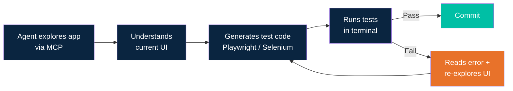
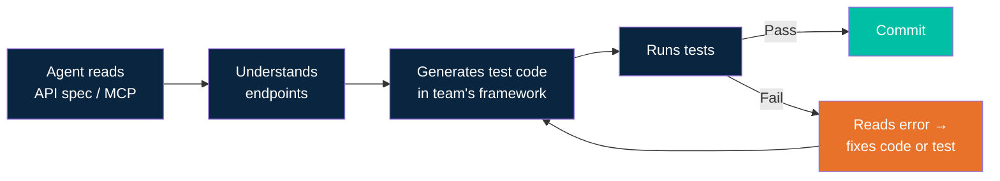

# Chapter 10: Testing with AI Agents

## The Validate Step

You've been building features with your agent — planning, writing code, reviewing. But how does the agent know the feature actually works?

Consider two developers:

**Developer A** has no test suite. She builds a checkout form and asks the agent: "Open the browser and check if this form works." The agent launches Playwright MCP, navigates to the page, fills in the fields, clicks submit, and reports: "The form submits but the confirmation message doesn't appear — there's a JavaScript error in the console." She never left her editor.

**Developer B** inherited 500 Playwright tests from his team. He adds a new API endpoint and asks the agent: "Write tests for this endpoint and make sure the existing tests still pass." The agent generates three new test files, runs the full suite, finds one regression, fixes it, and commits — all while he reviews the PR from the last sprint.

Two worlds. One chapter.

In Chapter 6, you learned the plan-build-validate cycle. This chapter upgrades the **validate** step from "you check it manually" to "the agent checks it for you" — both for UI and API, whether you have an existing test suite or not.

---

## MCP in 30 Seconds

If you haven't read Chapter 15, here's the minimum you need:

**Model Context Protocol (MCP)** is a standard that lets AI agents talk to external tools through a uniform interface. An MCP server is a plugin — you configure it, and the agent discovers new tools automatically.

For this chapter, you need to know:

1. **An MCP server is a plugin.** Configure it in your agent's settings. Tools appear automatically.
2. **Browser MCP servers** let the agent control a real browser — navigate, click, read page content.
3. **API MCP servers** let the agent call your REST endpoints as native tools.

We'll set up specific MCP servers in each section. If you want the full MCP deep dive, see Chapter 15.

---

## When You Have No UI Tests

No Playwright tests. No Selenium. No Cypress. No automation at all. You built a feature, and you need to know if it works.

The usual answer is: open a browser, click around, eyeball it. The agent can do that for you.

Here's the core idea: you connect a **browser MCP server** to your agent. The agent launches a real browser, reads the page through its accessibility tree, clicks buttons, fills forms, and reports what happened. It sees what a screen reader sees — every element, every label, every state change.

**This is ad-hoc validation, not a test suite.** Nothing gets saved. Nothing is repeatable. The agent checks your work right now, in this moment. Think of it as a colleague who opens your branch, tries the feature, and tells you what they found. If you need repeatable tests, that's Section 2.

### Browser MCP Options

Three free, open-source tools can give your agent browser access:

| Tool | What It Does | When to Use |
|------|-------------|-------------|
| **Playwright MCP** | Microsoft's official MCP server. Controls browser via accessibility tree. | Default choice — most mature, best docs |
| **Chrome DevTools MCP** | Google's MCP. Connects to a live Chrome via DevTools protocol. | When you need network inspection or performance profiling |
| **Browser MCP** | Chrome extension that exposes your browser to AI agents. | When you need the agent to use your existing logged-in session |

All three are free and open source (Apache 2.0 or equivalent).

### Setup: Claude Code

One command:

```bash
claude mcp add playwright -- npx @playwright/mcp@latest
```

Or add it to your project's `.mcp.json`:

```json
{
  "mcpServers": {
    "playwright": {
      "command": "npx",
      "args": ["@playwright/mcp@latest"]
    }
  }
}
```

The agent discovers Playwright's tools automatically on next start — `browser_navigate`, `browser_click`, `browser_type`, `browser_snapshot`, and more.

### Setup: GitHub Copilot

Config file location depends on your environment:

| Environment | Config file |
|-------------|------------|
| **VS Code** | `.vscode/mcp.json` (workspace) |
| **IntelliJ / JetBrains** | `.vscode/mcp.json` (same path, cross-IDE compat) |
| **Copilot CLI** | `~/.copilot/mcp-config.json` (global) |

Add the server:

```json
{
  "servers": {
    "playwright": {
      "command": "npx",
      "args": ["@playwright/mcp@latest"],
      "transportType": "stdio"
    }
  }
}
```

### Seeing It in Action

You built a TodoMVC app and want to know if the form works. Here's how the conversation goes:

**You:** "Check if the todo form works — add an item, verify it appears in the list."

The agent gets to work:

```
Agent: [uses browser_navigate → opens http://localhost:3000]
       Page loads. Status: 200 OK.

Agent: [uses browser_snapshot → reads accessibility tree]
       Sees: input field labeled "What needs to be done?", empty todo list.

Agent: [uses browser_type → types "Buy groceries" into the input field]
       [uses browser_press_key → presses Enter]
       Item submitted.

Agent: [uses browser_snapshot → reads updated accessibility tree]
       Sees: todo list now contains one item — "Buy groceries" with an unchecked checkbox.
```

**Agent:** "The todo form works. I typed 'Buy groceries' into the input field, pressed Enter, and the item appeared in the list with an unchecked checkbox. No errors in the console."

That's it. The agent opened a browser, interacted with your app, and told you what happened. You never left your editor.

### Trade-Offs

| Pros | Cons |
|------|------|
| Zero setup — no test framework needed | Token-heavy: ~114K tokens per validation via MCP |
| Agent sees the real app, real state | Not repeatable — no saved test artifacts |
| Good for exploratory / ad-hoc validation | Accessibility tree bloats on complex pages |
| Works with any web app | Sessions degrade after ~15 browser interactions |
| Catches visual/interaction bugs code review misses | Non-deterministic — agent may take different paths |

### Lighter Alternative: Playwright CLI

Microsoft released `@playwright/cli` in early 2026 as a lighter-weight alternative to the MCP server. Instead of streaming the full accessibility tree into context (~114K tokens), CLI saves browser state to disk as compact YAML files (~27K tokens) — a ~4x reduction.

Use CLI for longer sessions or when running many validations in sequence. Use MCP when you need deep page understanding for short workflows.

```bash
npx @playwright/cli --help
```

**Cost awareness:** at current Claude pricing, one browser validation session costs roughly $0.30–0.50 in tokens. Use browser MCP for quick validation during development — to check a form, verify a layout, or confirm a fix. It is not a test suite replacement. When you find yourself validating the same thing twice, that's your signal to write a real test (Section 2 covers that).

---

## When You Have (or Want) UI Tests

The previous section was about quick, throwaway validation — the agent opens a browser, pokes around, and tells you what it found. Nothing gets saved.

This section is different. Here the agent still uses browser MCP to **explore** your app, but the output is **real test code** — Playwright specs, Selenium tests, Cypress files — that lives in your repo and runs in CI. Two phases:

1. **Explore** — the agent navigates your app through MCP, reads the accessibility tree, and understands the current UI state.
2. **Generate** — the agent writes standard test code using the framework you already use (or want to adopt).

The result is repeatable. You commit the tests, they run on every push, and they catch regressions long after the agent has moved on.

### Tool Landscape

| Your Stack | MCP Server for Exploration | What the Agent Generates |
|------------|---------------------------|--------------------------|
| **Playwright** | Playwright MCP | `.spec.ts` files using Playwright Test |
| **Selenium** | Selenium MCP (by Angie Jones) | Selenium test code (Java/Python/JS) |
| **Cypress** | Playwright MCP (for exploration) | Cypress `.cy.ts` spec files |

**Selenium MCP setup:** The package is `@angiejones/mcp-selenium`. Add it with:

```bash
claude mcp add selenium -- npx -y @angiejones/mcp-selenium@latest
```

Or in your MCP config:

```json
{
  "mcpServers": {
    "selenium": {
      "command": "npx",
      "args": ["-y", "@angiejones/mcp-selenium@latest"]
    }
  }
}
```

See the [Selenium MCP repo](https://github.com/angiejones/mcp-selenium) for full documentation.

**Why Playwright MCP for Cypress?** Cypress doesn't have its own MCP server. But the agent only needs MCP for exploration — to see what's on the page. It generates Cypress code from what it learned. Playwright MCP works fine for that discovery step.

### Playwright's Built-in AI Agents (v1.56+)

Since version 1.56, Playwright ships three built-in AI agents that handle the explore-generate cycle without a separate coding agent:

| Agent | What It Does |
|-------|-------------|
| **Planner** | Explores the app, writes a markdown test plan describing each flow |
| **Generator** | Converts the plan into `.spec.ts` files with proper selectors and assertions |
| **Healer** | Runs existing tests, detects failures, and auto-patches broken selectors |

These agents are specialized. They know Playwright's API deeply and produce idiomatic test code.

**When to use built-in agents vs. a general-purpose coding agent (Claude Code, Copilot):**

- Use **Playwright's built-in agents** when your stack is Playwright and you want fast, focused test generation with minimal setup.
- Use a **general-purpose coding agent** when you work with multiple frameworks, need to coordinate test code with app code, or want the agent to fix the source code (not just the tests) when something breaks.

You can combine both — let Playwright's Generator create the initial specs, then use your coding agent to refine them alongside your application code.

### The Explore → Generate Workflow

This is what the agent does, regardless of which tool combination you pick:



The feedback loop (fail → re-explore → regenerate) is where agents shine. A human would alt-tab to the browser, squint at the error, and manually fix the selector. The agent reads the error, snapshots the page, and patches the test in seconds.

### Best Practices for Agent-Generated Tests

**Use stable selectors.** Prefer `getByRole`, `getByTestId`, and `getByLabel` over CSS selectors or XPath. These survive UI redesigns and are accessible by default.

**"Record then refine" pattern.** Let Playwright's codegen (or the agent) capture the raw flow first. Then ask the agent to clean it up — extract page objects, remove waits, add meaningful assertions. The first draft is never the final draft.

**One behavior per test.** Keep tests small and focused. "User can add a todo" is one test. "User can add, edit, and delete a todo" is three tests. Small tests fail with clear messages.

**Always run generated tests before committing.** The agent should execute the tests it wrote. If you're using Claude Code, tell it: "Run the tests and fix any failures before committing." The explore → generate → run → fix loop should complete before code hits your branch.

**Store tests alongside the code they test.** Put `checkout.spec.ts` next to your checkout component, not in a distant `tests/` folder. When the agent modifies a component, it sees the related tests in the same context window.

---

## When You Have No API Tests

Same situation as Section 1, but for APIs. Your agent just built or modified REST endpoints and you need to validate they work. No test suite exists yet. Several strategies can help, from lightweight throwaway scripts to reusable MCP-based approaches.

### Strategies for Ad-Hoc API Validation

| Approach | How It Works | Agent-Friendly? | Repeatable? |
|----------|-------------|-----------------|-------------|
| **OpenAPI → MCP Server** | Generate an MCP server from your OpenAPI/Swagger spec. The agent calls your API as native tools. | Highest | Semi — MCP server is reusable |
| **Inline code** (fetch/requests/curl) | Agent writes quick scripts to hit endpoints and check responses. | High | No — throwaway |
| **Postman + MCP** | Agent connects to a Postman workspace, runs saved requests. | Medium | Yes — collections persist |

The OpenAPI → MCP approach deserves special attention. It turns your API spec into something the agent can interact with natively — no manual curl commands, no copy-pasting URLs.

### Worked Example: OpenAPI → MCP

If you have an OpenAPI spec, you can auto-generate an MCP server that exposes each endpoint as a tool. The agent then calls your API the same way it calls any other MCP tool — with structured inputs and typed responses.

Here is the flow using `openapi-mcp-generator`:

**1. Start with your OpenAPI spec** (e.g., `openapi.yaml`)

**2. Generate the MCP server:**

```bash
npx openapi-mcp-generator --spec openapi.yaml --output ./api-mcp-server
```

This reads your spec and produces a Node.js MCP server with one tool per endpoint.

**3. Configure in Claude Code:**

```bash
claude mcp add my-api -- node ./api-mcp-server/index.js
```

**4. Configure in Copilot** (use the dual-config pattern from Chapter 15):

```json
{
  "servers": {
    "my-api": {
      "command": "node",
      "args": ["./api-mcp-server/index.js"],
      "transportType": "stdio"
    }
  }
}
```

**5. Agent calls endpoints as MCP tools.** It sends a request, reads the response, and validates status codes and payloads — all within the conversation.

**Alternatives worth knowing:**

- **AWS OpenAPI MCP Server** — creates tools from your endpoints at runtime. No code generation step needed. You point it at a spec URL and it builds tools on the fly.
- **FastMCP** (Python) — `FastMCP.from_openapi(url)` is a one-liner for Python teams. Minimal setup, good for quick validation.

### Challenges

| Challenge | What to Watch For | Mitigation |
|-----------|------------------|------------|
| **Authentication** | Tokens, API keys, OAuth flows | Pass via env vars or MCP server config. NEVER hardcode in prompts or MCP configs committed to git. |
| **Stateful APIs** | Create → Read → Update → Delete chains | Agent must sequence calls correctly. Prompt it with the expected order. |
| **Environment isolation** | Dev vs staging vs prod | Configure base URL per environment. Warn about prod side effects. |
| **Data setup/teardown** | Tests need seed data, cleanup after | Use factory endpoints or setup scripts. Agent should clean up what it creates. |
| **Rate limiting** | Agent may hammer endpoints rapidly | Add rate-limit awareness in agent instructions (e.g., "wait 1s between calls"). |

**Passing credentials safely.** Use environment variables in your MCP server config — never inline secrets:

```json
{
  "servers": {
    "my-api": {
      "command": "node",
      "args": ["./api-mcp-server/index.js"],
      "env": {
        "API_BASE_URL": "http://localhost:3000",
        "API_KEY": "${MY_API_KEY}"
      },
      "transportType": "stdio"
    }
  }
}
```

Set `MY_API_KEY` in your shell environment or `.env` file (which should be in `.gitignore`). The MCP config references the variable — the secret never touches version control.

---

## When You Have (or Want) API Tests

Your team has an existing API test suite — or plans to build one. The agent writes, runs, and maintains tests in your chosen framework. This mirrors the UI testing workflow from Section 2, but for APIs: the agent understands your endpoints (via specs or MCP), generates test code, runs it, and fixes failures.

### Tool Landscape

| Your Stack | MCP Integration | What the Agent Does |
|------------|----------------|-------------------|
| **Playwright API tests** | Playwright MCP | Generates `request` context tests in `.spec.ts` |
| **Postman** | Postman MCP Server | Creates/updates collections, test scripts, runs via Newman |
| **pytest + requests** | OpenAPI MCP (for understanding) | Generates Python test functions |
| **Jest + supertest** | OpenAPI MCP (for understanding) | Generates JS test files |

### Worked Example: Postman MCP

Many teams already use Postman for API testing. The Postman MCP Server lets your agent interact directly with your Postman workspace — reading existing collections, creating new requests, writing test scripts, and running everything through Newman.

**Setup: Claude Code**

```bash
claude mcp add postman \
  -e POSTMAN_API_KEY=your-api-key \
  -- npx @postmanlabs/postman-mcp-server@latest
```

**Setup: GitHub Copilot**

Config file location depends on your environment:

| Environment | Config file |
|-------------|------------|
| **VS Code** | `.vscode/mcp.json` (workspace) |
| **IntelliJ / JetBrains** | `.vscode/mcp.json` (same path, cross-IDE compat) |
| **Copilot CLI** | `~/.copilot/mcp-config.json` (global) |

```json
{
  "servers": {
    "postman": {
      "command": "npx",
      "args": ["@postmanlabs/postman-mcp-server@latest"],
      "env": {
        "POSTMAN_API_KEY": "${POSTMAN_API_KEY}"
      },
      "transportType": "stdio"
    }
  }
}
```

**The walkthrough**

You built a new `/orders` API with three endpoints: create, get by ID, and list. Your Postman workspace already has collections for `/users` and `/products`, but nothing for orders.

**You:** "Connect to my Postman workspace. See what's already tested, then add tests for the new orders endpoints."

The agent gets to work:

```
Agent: [connects to Postman workspace via MCP]
       Found workspace "ecommerce-api" with 2 collections:
       - Users API (12 requests, all with test scripts)
       - Products API (8 requests, all with test scripts)

Agent: [reads existing collections to understand patterns]
       Your team uses: status code checks, response time assertions,
       JSON schema validation, and environment variables for base URL.

Agent: [creates new collection "Orders API"]
       Adding request: POST /orders — creates an order
       Adding test script: checks 201 status, validates response schema,
       stores order ID in collection variable.

Agent: [adds GET /orders/:id request]
       Test script: checks 200 status, validates order fields match
       what was created, uses stored order ID from previous request.

Agent: [adds GET /orders request]
       Test script: checks 200 status, validates array response,
       confirms created order appears in list.

Agent: [runs collection via Newman CLI]
       ✓ POST /orders — 201 Created (142ms)
       ✓ GET /orders/:id — 200 OK (89ms)
       ✗ GET /orders — 200 OK but schema validation failed:
         "totalCount" field is integer, test expected string.

Agent: [fixes the test script to expect integer for totalCount]
       [re-runs collection]
       ✓ All 3 requests passing. Collection saved to workspace.
```

**Agent:** "Done. Created an 'Orders API' collection with 3 requests and test scripts. All tests pass. The collection follows your team's existing patterns — schema validation, environment variables, response time checks. I fixed one schema mismatch in the list endpoint test (totalCount is an integer, not a string)."

The key insight: the agent read your existing collections first. It didn't invent a testing style — it matched what your team already does.

> **Note:** Postman is freemium. The free tier is limited to 1 user and 25 collection runs/month (as of March 2026). Teams will likely need a paid plan ($19+/user/month). The Postman MCP Server code itself is open source, but requires a Postman account and API key.

### The Understand → Generate Workflow

Whether you use Postman, pytest, Jest, or Playwright's API testing, the agent follows the same loop:



The feedback loop is the same as UI testing: fail → read error → fix → retry. The difference is speed. API tests run in milliseconds, so the agent iterates faster. A typical generate-run-fix cycle completes in under a minute.

### Cross-Reference: REST API Testing Skill (Chapter 7)

The REST API testing skill from [Chapter 7](../07_skills-and-agents/07_skills-and-agents.md) is a concrete implementation of this pattern using Hurl files — declarative, lightweight HTTP tests that agents generate naturally. Teams that prefer a minimal, code-free approach to API testing can adopt that skill directly. It pairs well with the OpenAPI → MCP approach from Section 2: the agent reads the spec for understanding, then produces Hurl files instead of framework-specific test code.

---

## The Power Combo: Testing + Logging

Testing tells the agent "it failed." Logging tells the agent "it failed **and here's why**." Put them together, and the agent can find a bug, diagnose its root cause, fix the code, and verify the fix — all without asking you a single question.

This is what makes autonomous debugging loops possible. Without logs, a failing test gives the agent a symptom. With logs, the agent gets the full diagnosis. This section bridges testing (this chapter) with debugging (Chapter 11).

### Two Workflows, One Big Difference

**Without logging — you relay errors (L2):**

```
Agent runs tests → Fails → You read the error
  → You copy-paste server logs to agent → Agent guesses → Maybe fixes
```

You are the bottleneck. Every failure requires you to context-switch, read output, and ferry information back to the agent. The agent waits while you play messenger.

**With logging — autonomous loop (L4):**

```
Agent runs tests → Fails → Agent reads app logs automatically
  → Agent finds stack trace → Diagnoses root cause → Fixes → Re-runs → Pass
```

The agent closes the loop itself. It reads the test failure, checks the application logs, correlates the error, fixes the source code, and re-runs the test. You review the commit, not the process.

### Setting It Up

Three steps to unlock the autonomous loop.

**1. Give the agent access to logs.**

The simplest approach: your app logs to stdout or a file, and the agent reads it with `tail` or `cat`.

- **File-based:** app writes to `logs/app.log`, agent reads with `tail -n 50 logs/app.log`
- **Docker:** agent runs `docker logs <container> --tail 50`
- **Advanced:** connect a log aggregator MCP server so the agent can query structured logs directly

The key requirement is that the agent can read logs without your help.

**2. Create a combined instruction.**

Add this to your `CLAUDE.md` or `.github/copilot-instructions.md`:

```markdown
When a test fails:
1. Read the last 50 lines of the application log
2. Look for errors, stack traces, or warnings near the failure timestamp
3. Diagnose the root cause
4. Fix the code (not the test, unless the test is wrong)
5. Re-run the failing test to confirm the fix
```

This instruction turns a test failure from a dead end into a starting point. The agent knows what to do next without asking.

**3. See it in action — a worked example.**

You ask the agent to run the Playwright tests for your form submission flow. The agent runs them:

- **Test fails:** the submit button click doesn't produce the expected confirmation message. Playwright reports a timeout waiting for the `"Thank you"` text.
- **Agent reads the server log** (`logs/app.log`) and finds: `POST /api/submit returned 500 — TypeError: Cannot read property 'email' of undefined`
- **Agent opens the backend handler** (`routes/submit.js`). The route reads `req.body.email`, but the middleware that parses the request body was never registered for this route.
- **Agent adds the missing middleware**, saves the file.
- **Agent re-runs the failing test.** The form submits, the confirmation message appears. Test passes.

Total time: under a minute. You didn't copy a single error message.

> This is the difference between L2 and L4 maturity in practice. Instead of you being the messenger between the test output and the agent, the agent closes the loop itself. It's one of the most impactful workflow upgrades a team can adopt.

### Going Deeper

This section gives you everything you need to start using the testing + logging combo today. For more advanced strategies:

- **Chapter 11 (Debugging & Troubleshooting)** covers deeper log collection techniques, structured logging, and how agents navigate complex multi-service failures.
- **Chapter 15 (Power-Ups)** covers observability MCP servers that give agents direct access to log aggregators and monitoring tools.

You don't need those chapters to use what you learned here. Start with file-based logs and the five-step instruction above — that alone eliminates most of the back-and-forth in your debugging workflow.

---
