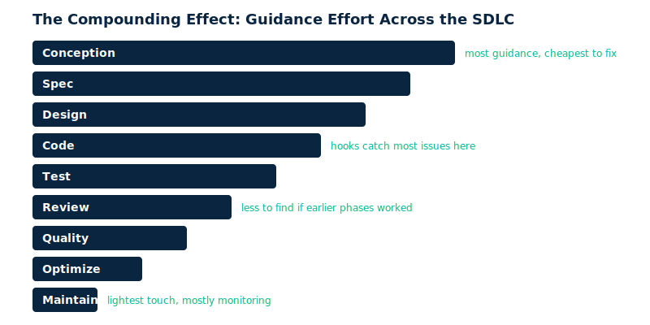
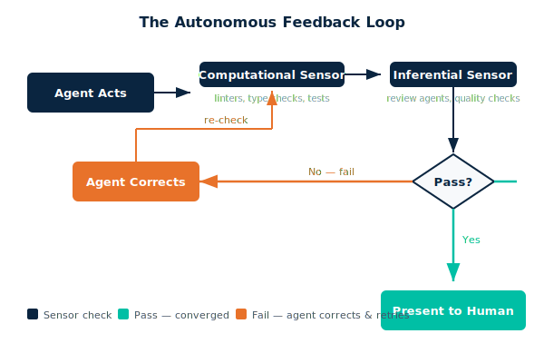
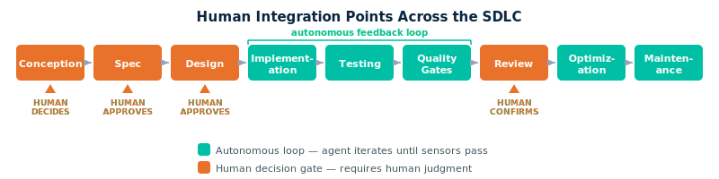

# Chapter 19: Building Your Agentic Development Harness

Two developers use Claude Code to build the same microservice. Same model, same day, same codebase.

Developer A opens a terminal, types `claude`, and starts prompting. The agent produces code that works — but uses `any` types everywhere, picks a logging library the team doesn't use, and skips error handling in three endpoints. Developer A spends two hours cleaning up what the agent got wrong.

Developer B opens the same terminal. But their project has a `CLAUDE.md` with architectural rules, a hook that runs the linter after every file edit, and a `/review` skill that checks for OWASP issues. The agent follows the rules from the start, gets corrected automatically when it drifts, and flags its own security gaps before Developer B even looks. The feature ships in half the time — and passes code review on the first try. Same model. The difference is the harness.

## What Is a Harness?

Martin Fowler puts it simply: **Agent = Model + Harness**. The model is the LLM — the part that reasons and generates code. The harness is everything else: the context it reads, the rules it follows, the checks it runs against. You don't control the model. You control the harness. That's where your leverage is.

A harness steers the agent through two types of controls:

**Guides (feedforward controls)** work like guardrails on a road. They steer the agent *before* it acts. The agent reads them and adjusts its behavior up front.

- `CLAUDE.md` rules ("All services must be stateless")
- Spec templates that define what "done" looks like
- Architectural constraints ("Use the repository pattern for data access")
- Approved library lists ("Use `zod` for validation, not `joi`")

**Sensors (feedback controls)** work like speed cameras. They check *after* the agent acts and enable self-correction.

- Linters that flag style violations
- Test runners that catch broken behavior
- Code review skills that evaluate design decisions
- Quality gates that block commits until standards are met

Both guides and sensors come in two flavors:

| Flavor | How It Works | Speed | Cost | Catches |
|--------|-------------|-------|------|---------|
| **Computational** | Deterministic rules — linters, type checkers, formatters | Fast | Free | Syntax, types, style |
| **Inferential** | AI-based judgment — review agents, LLM judges | Slower | Tokens | Semantic issues, design flaws, security gaps |

Use computational checks for everything they can cover. They're fast, free, and reliable. Reserve inferential checks for the things only an LLM can judge — "Does this API design make sense?" or "Could this input be exploited?"

## Three Approaches to Agentic Workflows

There's more than one way to structure how an agent works on your code. Here are the three main approaches:

| Approach | Philosophy | Your Interface | When Code Is Wrong | Tradeoff |
|----------|-----------|----------------|-------------------|----------|
| **Harness** (this chapter) | Build guardrails incrementally. Keep direct control. | CLAUDE.md + hooks + skills + subagents | Fix code directly or adjust the harness | Most flexible, no lock-in, but you build it yourself |
| **Spec-driven** (OpenSpec, Kiro, Spec Kit) | The spec is the source of truth. | Edit the spec, agent regenerates code | Update the spec and regenerate | Clean separation, but you become a spec editor — struggles with exploratory work |
| **Full ceremony** (BMAD) | 12+ specialized agents orchestrated by YAML workflows. | Approve at gates between phases | Roll back to the right phase and re-run | Most automated, but heavy ceremony and framework lock-in |

This chapter focuses on the harness approach. It gives you direct control over the agent's behavior. You build it incrementally — start with a few rules, add checks as you learn what goes wrong. There's no framework to adopt and no lock-in. And when you're ready, the harness composes naturally with the other approaches: you can add spec-driven generation on top, or plug harness components into a larger orchestration.

## How This Works in Claude Code

Claude Code has no workflow engine. The harness is assembled from four mechanisms:

| Mechanism | Role | Runs... | Example |
|-----------|------|---------|---------|
| **CLAUDE.md** | Guides — rules the agent reads | Automatically at session start | "All services must be stateless. Never use `any` type." |
| **Hooks** | Sensors — scripts that fire on events | Automatically on edit/commit/etc | ESLint after every file edit, block `rm -rf` |
| **Skills** | Inferential checks — reusable prompts | On invocation (manual or instructed by CLAUDE.md) | `/review` checks OWASP top 10, `/simplify` reduces complexity |
| **Subagents** | Independent workers — spawn for specific tasks | Programmatically by the agent | Spawn a code reviewer agent, spawn a test generator |

> **Hooks can't be bypassed by the agent** — they're mechanical enforcement. CLAUDE.md can be ignored (the agent might "forget"). Use hooks for hard rules, CLAUDE.md for guidance, skills for judgment calls.

## The Compounding Effect

Each phase of the SDLC is a filter. What passes through to the next phase is cleaner, more correct, and easier to work with.

A well-written `CLAUDE.md` and a solid spec template eliminate more defects than any number of post-hoc sensors. The speed gain comes not from skipping quality, but from front-loading it — fewer review cycles, fewer rework loops, fewer surprises.

Here's how guidance effort tapers across the SDLC:

```
Conception  ██████████████████  ← most guidance, cheapest to fix
Spec        █████████████████
Design      ████████████████
Code        ██████████████      ← hooks catch most issues here
Test        ████████████
Review      ████████            ← less to find if earlier phases worked
Quality     ██████
Optimize    ████
Maintain    ██                  ← lightest touch, mostly monitoring
```



Invest most in the early guides. The goal is not zero checks at the end — sensors always stay on. But the agent self-corrects less because it got better input. When CLAUDE.md is clear, the spec is tight, and the design is agreed upon, the code phase produces fewer mistakes. The test phase catches less. The review phase has less to flag. Fewer review cycles means faster delivery.

## Phase 1: Conception and Requirements

This is where you brainstorm features, explore constraints, and discuss trade-offs with the agent. You're not writing code yet — you're figuring out what to build and why. The agent becomes a thinking partner: it asks questions you forgot, surfaces edge cases you missed, and structures the mess of ideas into something actionable.

This phase has the most leverage of any in the SDLC. A wrong requirement is 100x more expensive to fix in production than to catch here. Front-load your guidance investment. Give the agent rich context about your project, your domain, and your constraints — and it will ask better questions, spot more gaps, and produce requirements that actually hold up.

### Guide

- **Project context files** — a `CLAUDE.md` with project description, domain glossary, and team conventions. The agent needs to know what this system *is* before it can reason about what it *should do*.
- **Existing documentation fed as context** — PRDs, architecture docs, prior specs. The more the agent knows about past decisions, the less it reinvents or contradicts.
- **User story templates with required fields** — persona, goal, acceptance criteria, edge cases, non-functional requirements. Templates force completeness; without them, the agent skips sections.
- **Brainstorming skills that enforce structured exploration** — a skill that walks through a checklist before letting the agent jump to implementation. Structure prevents premature solutioning.

### Sensor

- **Checklist validation** — does the output cover acceptance criteria, edge cases, non-functional requirements, security considerations? A simple completeness check catches the most common gaps.
- **Cross-reference check** — does this feature conflict with existing features or specs? The agent should verify against what's already been decided.

### Concrete Config

A `CLAUDE.md` snippet that sets project context and points the agent to the brainstorming skill:

```markdown
## Project Context
This is an e-commerce platform (Java/Spring Boot backend, React frontend).
Domain: orders, inventory, payments. Key constraint: PCI compliance for payment data.
Before implementing any feature, brainstorm requirements using /brainstorm.
```

A brainstorming skill at `.claude/skills/brainstorm.md` that enforces structured exploration:

```markdown
Ask clarifying questions one at a time. For each feature, cover:
1. Who is the user? What's their goal?
2. What are the acceptance criteria?
3. Edge cases and error scenarios?
4. Non-functional requirements (performance, security, compliance)?
5. Does this conflict with existing features?
Output a structured requirements doc in docs/requirements/.
```

### Framework Alternative

Teams wanting more structure can use BMAD's Analyst and PM agents to generate PRDs, or OpenSpec's `/opsx:propose` to formalize the idea.

## Phase 2: Specification

You've figured out *what* to build. Now you write the detailed spec: acceptance criteria, API contracts, error handling, testing strategy. The spec becomes the guide for every subsequent phase — the agent reads it before coding, tests against it, and references it during review.

A vague spec creates a vague implementation. If the spec says "handle errors appropriately," the agent will guess — and guess differently every time. Tight specs with concrete examples produce consistent, correct code. Your investment here pays off in every phase that follows.

### Guide

- **Spec templates** — a markdown structure with required sections: overview, requirements, API contract, error handling, testing strategy. The template makes missing sections visible.
- **Existing specs as few-shot examples** — show the agent what a good spec looks like in your project. One example is worth a hundred instructions.
- **Domain glossary** — enforce consistent terminology. If your team says "order," the agent shouldn't say "purchase" or "transaction."
- **Constraints doc** — approved technologies, forbidden patterns, compliance requirements. The agent should know what it *can't* use before it proposes solutions.

### Sensor

- **Spec review skill** — checks for completeness, ambiguity, contradictions, and missing error scenarios. This is an inferential sensor — it uses the LLM to judge spec quality.
- **Human review gate** — specs always need human sign-off. The agent can self-improve the spec, but you make the final call.

### Feedback Loop

Agent writes spec. The spec review skill checks for completeness and ambiguity. The agent rewrites flagged sections. The review skill re-checks. This loop converges — each pass fixes fewer issues. When it's clean, you see a polished spec, not a first draft. The agent did two or three rounds of revision before you even looked.

### Concrete Config

A spec review skill at `.claude/skills/review-spec.md`:

```markdown
Review the spec at the given path. Check for:
- Missing sections: overview, requirements, API contract, error handling, testing strategy
- Vague language: "should", "appropriately", "as needed", "etc."
- Missing error scenarios for each API endpoint
- TBD/TODO placeholders
- Contradictions between sections
Output: list of findings with severity (MUST FIX / SHOULD FIX / NOTE).
After listing findings, rewrite the flagged sections and present the updated spec.
```

A `CLAUDE.md` instruction that wires the skill into the workflow:

```markdown
## Specs
After writing any spec, run /review-spec on it before presenting to the user.
If findings are MUST FIX, rewrite and re-check until clean.
```

### Framework Alternative

OpenSpec's `/opsx:apply` formalizes this into a strict three-phase state machine (proposal, spec, archive).

## Phase 3: Architecture and Design

You know what to build and you have a tight spec. Now you decide *how* to build it — architecture decisions, data models, API design, component boundaries. This phase sets the structural constraints the agent must follow during implementation.

The agent is good at generating architecture proposals. It's bad at knowing your system's history. Without context, it'll propose patterns that contradict past decisions, introduce dependencies that violate module boundaries, or design stateful services in a stateless system. Feed it your ADRs, your existing diagrams, and your design principles — and it proposes designs that fit.

### Guide

- **Architecture Decision Records (ADRs)** — the agent reads past decisions and follows established patterns. ADRs are the institutional memory that prevents the agent from re-debating settled questions.
- **Existing diagrams and models as context** — Mermaid source files, ERDs, component diagrams. Visual context helps the agent understand system structure.
- **Design principles doc** — explicit rules like "prefer composition over inheritance" or "all services must be stateless." Without these, the agent defaults to whatever the training data suggests.
- **Module boundary rules** — which packages can depend on which. Cross-boundary imports are the most common architectural violation agents produce.

### Sensor

- **Structural validation** — does the design violate module boundaries? This can be checked mechanically against the rules in `CLAUDE.md`.
- **Pattern consistency check** — does the design match existing patterns or deviate? Deviation isn't always wrong, but it should be flagged and justified.
- **Diagram generation** — the agent produces Mermaid diagrams for review. Visual output makes architectural issues obvious that text descriptions hide.

### Feedback Loop

Agent proposes architecture. The fitness check validates against ADRs, module boundaries, and established patterns. The agent restructures any violations. The re-check passes. You review a design that already fits the system — not a raw proposal that ignores half of your constraints.

### Concrete Config

A `CLAUDE.md` section that defines architecture rules:

```markdown
## Architecture Rules
- Layered architecture: controller → service → repository. No skipping layers.
- Module boundaries: `orders` cannot import from `payments` directly — use events.
- All new services must be stateless. Session data goes in Redis.
- Before proposing new components, read docs/adrs/ for past decisions.
- After designing, run /check-architecture to validate.
```

An architecture check skill at `.claude/skills/check-architecture.md`:

```markdown
Review the proposed design against:
1. Module boundary rules in CLAUDE.md — any cross-boundary imports?
2. Existing ADRs in docs/adrs/ — does this contradict a past decision?
3. Layer violations — does any component skip a layer?
4. New dependencies — does this introduce a library not in approved-libs.md?
If violations found, restructure the design and re-check.
Generate a Mermaid diagram of the final design.
```

### Framework Alternative

BMAD's Architect agent produces formal architecture documents with orchestrator memory.

## Wiring It Together

You've defined guides and sensors for three phases — but none of them work in isolation. This section shows how the pieces connect, introduces the autonomous feedback loop pattern, and clarifies where humans stay in the loop.

### The Autonomous Feedback Loop

The core mechanism of the harness is not "agent produces draft, human fixes it." It's "agent iterates autonomously until quality criteria are met, then presents the result."

Here's the loop:

```
Agent acts → Sensor checks → Pass? → Present to human
                              ↓ Fail
                     Agent corrects → Sensor re-checks → ...
```

The loop chains two kinds of sensors. Computational sensors fire first — they're fast and free (linters, type checkers, test runners). Inferential sensors fire second — they're slower and cost tokens, but catch semantic problems (review agents, quality checks). The agent converges through multiple passes. Each pass fixes fewer issues. By the time the developer sees the output, it's already survived every automated check you've configured.

This is the shift: the human reviews converged output, not first drafts.



### Human Integration Points

Not everything should be autonomous. Some decisions need a human — not because the agent can't generate an answer, but because the answer has consequences the agent can't own.

Four types of human integration:

- **Decision gates** — Architecture choices, spec approval, scope changes. These shape everything downstream. Always human.
- **Review gates** — Final code review after the agent loop converges. The human confirms intent and correctness — they don't discover formatting issues or missing tests. The sensors already caught those.
- **Override points** — The developer can interrupt any loop at any time. Adjust guides, reject output, redirect the agent. You're never locked out.
- **Diminishing interaction** — As the harness improves, reviews get faster. Humans spend less time on things sensors can catch and more time on intent, business logic, and design judgment.



### Calibrating the Human-Automation Balance

Three concepts govern how much human attention each change gets.

**1. Risk-based review depth**

| Change Type | Risk | Human Review Level |
|---|---|---|
| Rename, formatting, import cleanup | Low | Glance at diff, trust sensors |
| New utility function, test additions | Medium | Read the code, verify intent |
| Payment flow, auth logic, data migration | High | Line-by-line review, test manually |
| Architecture change, new external dependency | Critical | Design discussion before agent starts |

The harness treats all changes equally — every sensor fires on every change. But the human calibrates attention based on risk. A renamed variable that passes all sensors gets a five-second scan. A payment flow change gets a careful read, even if sensors are green.

**2. Escalation paths**

Sometimes the loop doesn't converge. The agent fixes one thing, breaks another, fixes that, breaks the first. Three escalation rules prevent infinite loops:

- **Max iterations** — after 3 failed attempts on the same issue, the agent stops and presents its findings to the developer. It explains what it tried and what failed.
- **Scope escalation** — if a sensor failure points to a design problem (not a code problem), the agent escalates instead of band-aiding.
- **Manual takeover** — the developer can interrupt at any point and fix the issue manually, then hand back to the agent.

Encode escalation rules in `CLAUDE.md` so the agent knows when to stop:

```markdown
## Escalation Rules
- If a sensor fails 3 times on the same issue, stop and report to user.
- If a fix requires changes outside the current module, ask before proceeding.
- If quality gate findings point to an architectural issue, escalate — don't band-aid.
```

**3. The trust dial**

Trust is not a switch — it's a dial you turn over time as evidence accumulates:

- **Week 1** — Review everything. You're calibrating the harness and learning what the agent gets right.
- **Month 1** — Review by exception. Low-risk changes get a quick scan. You focus review time on medium and high-risk changes.
- **Month 3** — Review high-risk only. The harness catches everything else reliably. You've built confidence through evidence.
- **Ongoing** — Every mistake turns the dial back slightly. Each mistake becomes a new guide or sensor, so the same mistake can't happen twice.

This is NOT about reducing vigilance — it's about redirecting human attention from things sensors can catch to things only humans can judge.

### Achieving Quality with Fewer Interactions

Four strategies compound to reduce the number of human-agent round trips:

1. **Front-loading guides** — Better input produces fewer corrections. A clear `CLAUDE.md` and a tight spec eliminate more defects than any number of post-hoc reviews.
2. **Chaining sensors** — Computational sensors fire first (fast, cheap). Inferential sensors fire second (slower, smarter). Humans review last (slowest, most expensive). Each layer catches what the previous layer missed.
3. **Evolving the harness** — Every mistake becomes a new guide or sensor. Mechanical enforcement instead of hope. The harness gets better every week.
4. **Convergence criteria** — Each phase has a clear "done" condition. The agent knows when to stop iterating and present results. No ambiguity, no over-polishing.

### Parallel Execution with Worktrees

For larger features, you can run multiple agent sessions in parallel. Each session gets its own git worktree — an isolated copy of the repo with its own branch and the full harness active. Split a feature into three independent tasks, launch three agents, and merge the results. This works well for tasks that don't touch the same files: one agent builds the API endpoints, another writes the frontend components, a third sets up the database migrations. Don't use it for tightly coupled work where one agent's output depends on another's — the merge conflicts aren't worth it.

```bash
# Create three worktrees for parallel development
git worktree add ../feature-api   feature/api-endpoints
git worktree add ../feature-ui    feature/ui-components
git worktree add ../feature-db    feature/db-migrations

# Launch an agent in each (each gets its own CLAUDE.md, hooks, skills)
cd ../feature-api && claude "Implement the order API endpoints per spec"
cd ../feature-ui  && claude "Build the order form components per spec"
cd ../feature-db  && claude "Create the order tables migration per spec"
```

### Sample Configuration

Here's a complete `CLAUDE.md` that encodes conventions from phases 1 through 3. It combines project context, coding conventions, module boundaries, testing rules, and the autonomous loop instruction:

```markdown
## Project Context
E-commerce platform. Java/Spring Boot backend, React frontend.
Domain: orders, inventory, payments.

## Coding Conventions
- Use TypeScript strict mode. No `any` types.
- Error handling: throw typed errors from src/common/errors.ts
- Naming: camelCase for variables, PascalCase for classes, kebab-case for files

## Module Boundaries
- orders/ cannot import from payments/ — use events
- All services must be stateless

## Testing
- TDD required. Write tests before implementation.
- Coverage threshold: 80% branch coverage
- No mocking the database in integration tests

## Before Presenting Code
1. All hooks must pass
2. Run /review
3. Run /simplify
4. Run tests one final time
```

## Phase 4: Implementation

This is where the agent writes code. Most developers start here — open a terminal, prompt, and go. That works, but it's the hard way. If you've done phases 1-3, the agent already knows the requirements, the spec, and the architecture. It writes code that fits the system on the first pass instead of guessing and getting corrected.

Implementation is where sensors earn their keep. Guides tell the agent what to write; sensors tell it what it got wrong — instantly, automatically, and without your involvement. Pre-commit hooks fire after every edit: linter, formatter, type checker. Fast unit tests run in under 30 seconds. The agent reads the output, fixes the issues, and moves on. By the time you see the code, it's already survived multiple rounds of automated correction.

### Guide

- **CLAUDE.md coding conventions** — naming rules, file structure, error handling patterns, forbidden patterns. The agent follows what's written; what's not written gets improvised.
- **Code templates and scaffolding** — starter files for new services, controllers, repositories. Templates enforce structure so the agent doesn't invent its own.
- **Module boundaries** — explicit rules about where code belongs. Without them, the agent puts things wherever seems convenient.
- **Approved libraries list** — which dependencies are allowed. The agent will reach for whatever it's seen in training data unless you constrain it.

### Sensor

- **Pre-commit hooks** — linter (ESLint, Pylint, Checkstyle), formatter (Prettier, Black), type checker (TypeScript, mypy). These fire after every edit and catch syntax, style, and type errors mechanically.
- **Fast unit tests** — run after every change, under 30 seconds. They catch broken behavior before it compounds.
- **Agent reads hook output and self-corrects automatically** — the agent doesn't just run the checks. It reads the failure messages, understands what went wrong, and fixes the code without asking you.

### Feedback Loop

Agent writes code. Computational sensors fire — linter, type checker, fast tests. Failures feed back into the agent. It self-corrects. Sensors re-run. Once computational checks pass, a quality agent reviews for business logic alignment, pattern adherence, and unnecessary complexity. The agent rewrites what the quality agent flags. The quality agent re-checks. When everything passes, the developer sees clean code — not a first draft with linter warnings and type errors.

### Concrete Config

Hooks in `.claude/settings.json` that fire after every edit and block dangerous commands:

```json
{
  "hooks": {
    "PostToolUse": [
      {
        "matcher": "Edit|Write",
        "command": "npx eslint --fix $CLAUDE_FILE_PATH && npx tsc --noEmit",
        "description": "Lint and type-check after every edit"
      }
    ],
    "PreToolUse": [
      {
        "matcher": "Bash",
        "command": "echo $CLAUDE_TOOL_INPUT | grep -qE 'rm -rf|--force|--no-verify' && echo 'BLOCKED: dangerous command' && exit 1 || exit 0",
        "description": "Block destructive commands"
      }
    ]
  }
}
```

A `CLAUDE.md` instruction that wires the quality check into the workflow:

```markdown
## Implementation Rules
After completing a feature implementation (not after every small edit):
1. Run all hooks (they fire automatically)
2. Run /quality-check to verify business logic alignment and pattern adherence
3. Only present to user after /quality-check passes
```

A quality check skill at `.claude/skills/quality-check.md`:

```markdown
Review the changed files. For each:
1. Does the error handling follow the project pattern? (see src/common/errors.ts)
2. Are there N+1 query patterns?
3. Is there unnecessary complexity that could be simplified?
4. Does it follow the naming conventions in CLAUDE.md?
Fix any issues found, then re-check. Present only when clean.
```

## Phase 5: Testing

The agent doesn't just write code — it writes tests alongside the code. Unit tests validate individual functions. Integration tests verify that components work together against real dependencies. E2E tests confirm the system behaves correctly from the user's perspective. Each type catches different problems at different costs.

Sensors turn testing from a manual chore into a continuous feedback loop. The test runner fires after every change. The coverage report tells the agent which lines aren't covered — and the agent adds tests until the threshold is met. Mutation testing goes further: it introduces small changes to the code and checks whether the tests catch them. Tests that pass aren't necessarily good — mutation testing reveals tests that pass only because they don't actually check anything.

### Guide

- **Testing conventions doc** — what to test, naming patterns, directory structure. Without this, the agent invents its own conventions for each test file.
- **Test templates** — arrange-act-assert for unit tests, given-when-then for behavior tests. Templates enforce consistency and make tests readable.
- **Coverage thresholds** — 80% branch coverage for new code. A concrete number gives the agent a clear stopping condition.
- **Explicit rules** — "no mocking the database in integration tests," "use testcontainers for real database instances." The agent follows explicit constraints; without them, it defaults to mocking everything.

### Sensor

- **Test runner as immediate feedback loop** — the agent runs tests after every change and reads the output. Failures get fixed before they compound.
- **Coverage report** — the agent reads uncovered lines and adds tests targeting those specific paths. No guessing about what's missing.
- **Mutation testing (post-integration)** — tools like Stryker or PIT introduce small code mutations and check whether tests catch them. Run this after integration, not on every edit — it's slow but reveals weak tests.

### Feedback Loop

Agent generates tests. Runner executes them. Failures feed back. The agent fixes the tests or the code — whichever is wrong. Re-runs. All pass. Coverage check runs. Finds gaps — three functions in the service layer have no branch coverage. The agent adds tests targeting those branches. Coverage meets the threshold. The developer sees a passing, well-covered test suite — not a first draft with red tests and 40% coverage.

### Concrete Config

A TDD gate hook that blocks production code edits when no corresponding test file exists:

```json
{
  "PreToolUse": [
    {
      "matcher": "Edit",
      "command": "echo $CLAUDE_FILE_PATH | grep -q 'src/' && ! echo $CLAUDE_FILE_PATH | grep -q 'test' && [ ! -f \"$(echo $CLAUDE_FILE_PATH | sed 's/src/test/' | sed 's/.ts/.test.ts/')\" ] && echo 'BLOCKED: Write tests first' && exit 1 || exit 0",
      "description": "Block production code edits without corresponding test file"
    }
  ]
}
```

A `CLAUDE.md` section with testing rules for both unit and integration tests:

```markdown
## Testing
- Write tests before implementation (TDD). Hook enforces this.
- Naming: `describe('ClassName')` → `it('should <behavior>')`
- Coverage threshold: 80% branch coverage for new code.
- After writing tests, run `npm test` and check coverage. Add tests until threshold met.

### Unit Tests
- Fast (< 30s total). Run after every change.
- Mock external dependencies (HTTP, file system), but not the database.

### Integration Tests
- Use testcontainers for real database instances.
- Run with: `npm run test:integration` (separate from unit tests)
- Timeout guard: 120 seconds max per test.
- Run integration tests before presenting code to user, not on every edit.
- For Java/Spring Boot: use @SpringBootTest with @Testcontainers.
```

An integration test hook that runs before commit:

```json
{
  "PreToolUse": [
    {
      "matcher": "Bash(git commit)",
      "command": "npm run test:integration --timeout 120000 || (echo 'BLOCKED: Integration tests failing' && exit 1)",
      "description": "Run integration tests before commit"
    }
  ]
}
```

## Phase 6: Code Review

Before a human reviews the code, the agent reviews its own output. This isn't vanity — it catches issues that sensors missed. Linters catch syntax and style. Type checkers catch type errors. But neither catches "this function does three things and should be split" or "this query will be slow at scale." A review skill with a structured checklist fills the gap.

The review phase chains two inferential checks. First, a review agent scans for security, performance, readability, and consistency issues using a structured checklist. The coding agent fixes everything flagged as high severity. Then a simplification agent asks "can this be simpler?" — it extracts helpers, reduces nesting, and removes dead code. Tests run after every simplification to make sure nothing breaks. The developer receives polished code, not code that works but is hard to read.

### Guide

- **Review checklist** — security (OWASP top 10), performance (N+1 queries, unbounded loops), readability (naming, complexity), consistency with existing codebase. A checklist makes the review systematic instead of ad hoc.
- **Team style guide as context** — the agent reads the style guide and evaluates code against it. Consistency across the codebase matters more than any individual preference.
- **"What to look for" doc tuned to common team mistakes** — every team has patterns that go wrong repeatedly. Document them. The agent checks for them every time.

### Sensor

- **Review skill that posts structured findings** — file, line, issue, severity, suggestion. Structured output makes findings actionable instead of vague.
- **Simplification agent that rewrites for simplicity** — a separate pass focused only on "can this be simpler?" Simplification after correctness, not instead of it.
- **Human review — always the final gate** — the agent loop reduces what the human needs to find, but never replaces human judgment on intent, business logic, and design.

### Feedback Loop

Review agent scans all changed files. Posts structured findings — file, line, severity, issue, fix. The coding agent applies all high-severity fixes. The review agent re-scans. Clean. Then the simplification agent checks: "Can this be simpler without changing behavior?" It extracts helpers, reduces nesting, removes dead code. Tests run after every simplification — if any test fails, that simplification gets reverted. The review agent confirms no regressions. The developer receives polished code that passed security, performance, readability, simplicity, and correctness checks before they opened the diff.

### Concrete Config

A review skill at `.claude/skills/review.md`:

```markdown
Review all changed files. For each file, check:
- Security: SQL injection, XSS, hardcoded secrets, insecure deserialization
- Performance: N+1 queries, unbounded loops, missing pagination
- Readability: functions >30 lines, cyclomatic complexity >10, unclear naming
- Consistency: follows patterns in existing codebase

Output format per finding:
  FILE:LINE | SEVERITY | ISSUE | FIX
Apply all HIGH severity fixes. Re-review after fixes. Present to user only when clean.
```

A simplification skill at `.claude/skills/simplify.md`:

```markdown
Re-read the changed files asking: "Can this be simpler without changing behavior?"
- Extract repeated patterns into helpers (only if used 3+ times)
- Reduce nested conditionals with early returns
- Remove dead code and unused imports
Run tests after every change. If any test fails, revert that simplification.
```

A `CLAUDE.md` instruction that orchestrates the full pre-presentation pipeline:

```markdown
## Before Presenting Code to the User
1. All hooks must pass (automatic)
2. Run /review — fix until clean
3. Run /simplify — simplify where possible
4. Run tests one final time
5. Then present the result
```

## Phase 7: Quality Gates

Quality gates are external, deterministic checks that don't rely on the agent's judgment. The agent might convince itself that the code is fine — a quality gate doesn't care about opinions. It runs static analysis, checks vulnerability databases, and returns a pass/fail verdict based on rules your team defined. This is the difference between "the agent thinks it's secure" and "SonarQube confirms it meets your security policy."

Quality gates are the last automated checkpoint before human review. Everything that passed through phases 4-6 was checked by the agent's own sensors. Phase 7 adds an independent opinion — tools that evaluate the code without knowing (or caring) what the agent intended.

### Guide

- **Quality profiles** — SonarQube rule sets configured per language, with severity thresholds. Define what matters: blocker and critical issues must be zero; major issues under a threshold you choose.
- **Quality gate definition** — the concrete conditions that must pass before a task is done. Example: zero new blocker issues, zero new critical issues, code coverage on new code above 80%, duplication below 3%.
- **Security scan policies** — SAST rules (SonarQube security hotspots, Semgrep), dependency vulnerability thresholds (no critical CVEs, high CVEs must have a remediation plan).
- **SonarQube Context Augmentation** — SonarQube 2026.1 can inject quality rules *before* code generation via native Agentic Analysis. Instead of catching issues after the agent writes code, it prevents them. The agent receives the rules as context and writes compliant code on the first pass.

### Sensor

- **SonarQube via MCP** — the agent triggers a scan, queries results, reads individual findings, fixes the code, and re-triggers. Full programmatic access to the quality gate.
- **SonarQube Agentic Analysis** — native Generate-Verify-Loop built into SonarQube 2026.1+. The agent writes code, SonarQube analyzes it, the agent fixes findings, and the cycle repeats until the gate passes. No MCP needed.
- **Dependency vulnerability scanners** — `npm audit`, OWASP Dependency-Check, `pip-audit`, Trivy. These check your dependency tree for known vulnerabilities independently of code quality.

### Feedback Loop

Agent triggers SonarQube scan via MCP. Reads quality gate status. If failed: reads each finding — file, line, rule, severity, explanation. Fixes the code. Re-triggers the scan. Repeats until the gate passes. Max 3 attempts — if the gate still fails after three rounds, the agent escalates to the user with a summary of what it tried and what's still failing.

### Path A: Native Agentic Analysis (Recommended)

SonarQube 2026.1 introduced Context Augmentation — the server injects its quality rules into the agent's context *before* code generation begins. The agent reads the rules and writes compliant code from the start. Then SonarQube runs its Generate-Verify-Loop: analyze the output, feed findings back, let the agent fix, re-analyze. This is the tightest integration — issues are prevented, not just caught.

Available for Claude Code, Cursor, and Windsurf. No MCP server needed — the integration is native. If you're on SonarQube 2026.1 or later, use this path.

### Path B: MCP Integration (Fallback)

For older SonarQube versions or setups where native integration isn't available. The agent queries SonarQube results via MCP after writing code — a traditional scan-fix-rescan loop.

MCP server config:

```json
{
  "mcpServers": {
    "sonarqube": {
      "command": "npx",
      "args": ["@sonarsource/sonarqube-mcp-server"],
      "env": { "SONAR_URL": "http://localhost:9000", "SONAR_TOKEN": "${SONAR_TOKEN}" }
    }
  }
}
```

`CLAUDE.md` quality gate instruction:

```markdown
## Quality Gates
After /review and /simplify pass, run the SonarQube quality gate:
1. Call sonarqube.analyze() on changed files
2. Read the quality gate status
3. If FAILED: read each finding, fix the code, re-analyze
4. Repeat until quality gate passes (max 3 attempts — escalate to user if stuck)
5. Report: "Quality gate passed. Fixed: [list of issues]"
Do not present code to user until quality gate is GREEN.
```

## Phase 8: Optimization

Not every change needs optimization. Most code that passes phases 4-7 is good enough. This phase triggers on demand — when a performance budget is exceeded, when a complexity threshold is crossed, or when you explicitly ask the agent to optimize. It reuses the `/simplify` skill from Phase 6 and adds performance-specific checks.

### Guide

- **Performance budgets** — API response time < 200ms, bundle size < 500KB, database queries < 50ms. Concrete numbers give the agent a target, not a vague "make it fast."
- **Complexity thresholds** — cyclomatic complexity < 10 per function, file length < 300 lines. These trigger the optimization phase automatically when `/review` flags violations.
- **Simplification skill instructions** — the `/simplify` skill from Phase 6 handles structural simplification. This phase adds performance-aware optimization on top.

### Sensor

- **Benchmarks** — the agent runs performance benchmarks before and after optimization. Only changes that improve metrics are kept.
- **Complexity metrics** — cyclomatic complexity, cognitive complexity, lines per function. Measured mechanically, not by opinion.
- **Test suite still passes** — every optimization must preserve behavior. Tests are the safety net.

### Concrete Config

```markdown
## Optimization (run on request or when complexity exceeds thresholds)
When asked to optimize, or when /review flags complexity issues:
1. Run /simplify on flagged files
2. Check cyclomatic complexity: functions must be < 10
3. Run benchmarks if performance-sensitive code changed
4. Compare before/after metrics. Only keep changes that improve metrics without breaking tests.
```

## Phase 9: Maintenance

Ongoing health monitoring — log analysis, documentation drift, dependency updates. This is the lightest phase because earlier phases prevented most issues. The harness doesn't stop when the feature ships. It keeps watching for the slow decay that turns clean code into legacy code: logs filling with new error patterns, docs drifting from reality, dependencies accumulating vulnerabilities.

### Guide

- **Log format docs** — standard log levels, structured logging format, what to log at each level. Without this, every service logs differently and analysis becomes archaeology.
- **Documentation structure** — where docs live, what each doc covers, update expectations. The agent needs to know which docs might need updating when code changes.
- **Dependency update policies** — how often to check, what severity triggers immediate action, who approves major version bumps.

### Sensor

- **Log analysis** — the agent reads log files and identifies repeated error patterns, frequency trends, and root cause candidates. Patterns that appear after a deployment point to regressions.
- **Doc-code sync** — a hook that reminds the agent to check documentation when source files change. Prevents the slow drift where docs describe last quarter's code.
- **Dependency vulnerability alerts** — scheduled scans that flag new CVEs in your dependency tree. The agent proposes updates with test verification.

### Concrete Config

A log analysis skill at `.claude/skills/analyze-logs.md`:

```markdown
Read the provided log file. Identify:
1. Repeated error patterns (same exception > 3 times)
2. Error frequency trends (increasing/decreasing)
3. Root cause candidates (trace back from exception to likely code location)
For each root cause: propose a fix with a test that reproduces the issue.
```

A doc-sync hook that reminds about documentation after source edits:

```json
{
  "PostToolUse": [
    {
      "matcher": "Edit",
      "command": "echo $CLAUDE_FILE_PATH | grep -q 'src/' && echo 'REMINDER: Check if docs/ need updating for this change' || exit 0",
      "description": "Remind about doc-code sync after source edits"
    }
  ]
}
```

## Quick-Reference Table

The entire harness, compressed into one table.

| Phase | Guides | Sensors | Example Tools |
|-------|--------|---------|---------------|
| **Conception** | Context files, templates, brainstorm skills | Checklist validation | Brainstorming skill |
| **Specification** | Spec templates, domain glossary | Spec review skill, completeness check | Review skill |
| **Design** | ADRs, design principles, module boundaries | Structural validation, diagram review | Mermaid, CLAUDE.md |
| **Implementation** | Coding conventions, code templates | Linter, formatter, type checker, fast tests | ESLint, Prettier, hooks |
| **Testing** | Test templates, coverage thresholds, test rules | Test runner, coverage report, mutation testing | JUnit, pytest, Stryker |
| **Review** | Review checklist, style guide | Review skill, simplification loop | /review skill |
| **Quality Gates** | Quality profiles, security policies | SonarQube MCP, dependency scanner | SonarQube, npm audit |
| **Optimization** | Performance budgets, complexity thresholds | Benchmarks, complexity metrics | Profiler, static analysis |
| **Maintenance** | Log format docs, doc structure | Log analysis, doc-code sync | Log analysis skill |

## Cost Awareness

Agent feedback loops burn tokens. Every time a sensor calls back into the LLM — to review, simplify, or fix — that's a paid inference. Computational sensors (linters, type checkers, test runners) are free. Inferential sensors (review skills, simplification loops, quality analysis) cost money.

### Token Cost Tiers

| Sensor Type | Cost | Speed | When to Use |
|-------------|------|-------|-------------|
| Hooks (linter, formatter, type checker) | Free | Milliseconds | Always — every edit |
| Test runner | Free | Seconds | Always — every change |
| Single-pass skill (/review, /simplify) | ~$0.02-0.10 per run | 10-30 seconds | Every feature — skip for trivial edits |
| Multi-pass feedback loop (review → fix → re-review) | ~$0.10-0.50 per cycle | 1-3 minutes | Feature work, not one-line fixes |
| SonarQube MCP round-trip | Free (tool) + ~$0.05 (agent reads/fixes) | 30-60 seconds | Before presenting code to user |
| Full pipeline (all inferential sensors) | ~$0.50-2.00 per feature | 5-10 minutes | Complex features, high-risk changes |

### Rules of Thumb

- Run computational sensors on every change (hooks) — free and fast.
- Run inferential sensors on feature-level work, not every small edit.
- Skip the simplification loop on trivial changes — a rename doesn't need `/simplify`.
- Monitor token usage weekly. Most teams are surprised by which loops cost the most.
- If costs spike, check which loops run most often. A feedback loop that fires on every edit instead of every feature is the usual culprit.

### CLAUDE.md Cost Control Example

```markdown
## Feedback Loop Rules
- Hooks (lint, type check, fast tests): run on EVERY edit — non-negotiable
- /review and /simplify: run once per feature, not per edit
- SonarQube quality gate: run once before presenting final code
- Full pipeline (all sensors): only for HIGH risk changes (auth, payments, data migration)
- For LOW risk changes (rename, docs, formatting): hooks only, skip inferential loops
```

## Start Here — The 3-Step Starter Kit

Nine phases is a lot. Don't build them all on day 1 — start with the three steps that catch 80% of issues, then expand as you see the value.

### Step 1: Hooks + CLAUDE.md (30 minutes to set up)

Start with Phase 4 only. Add a `CLAUDE.md` with project context and coding conventions. Then add three hooks: auto-format on edit, lint on edit, and block dangerous commands. That's it.

Result: the agent self-corrects on lint and format issues automatically. No more cleaning up style violations by hand.

### Step 2: Add /review Skill (15 minutes)

Add the review skill from Phase 6. Put one line in `CLAUDE.md`: "After completing a feature, run /review before presenting to user."

Result: the agent catches its own mistakes before you see the code. Security issues, N+1 queries, unnecessary complexity — flagged and fixed without your involvement.

### Step 3: Add Testing Rules (15 minutes)

Add testing conventions to `CLAUDE.md` (Phase 5). Optionally add the TDD gate hook that blocks production code edits when no test file exists.

Result: the agent writes tests alongside code and verifies coverage. No more "I'll add tests later" — tests are part of the workflow from the start.

### After Step 3, You Have a Working Harness

It covers the phases where 80% of issues are caught. Then expand:

- **Week 2:** Add spec template and spec review skill (Phases 2-3)
- **Week 3:** Add SonarQube MCP for independent quality verification (Phase 7)
- **Month 2:** Add simplification loop and optimization triggers (Phases 8-9)
- **Month 3:** Add brainstorming skill and architecture checks (Phases 1, 3)

Start where the pain is highest (code quality), expand toward earlier phases (spec, design) and later phases (optimization, maintenance) as you see the value.

## Team Adoption

The harness lives in the repo. This makes it shareable.

1. **Commit the harness.** Push `.claude/settings.json`, `.claude/skills/`, and `CLAUDE.md` to the repo. Any teammate using Claude Code gets the same guides, hooks, and skills automatically.
2. **Document the harness.** Add a "Development Harness" section to your README or contributing guide. Explain what hooks fire, what skills are available, and how feedback loops work.
3. **Onboard incrementally.** Don't mandate the full harness on day 1. Start by sharing `CLAUDE.md`. Then hooks. Then skills. Let people see the value at each step before adding more.
4. **Harness as team contract.** Over time, the harness encodes team standards — what "done" means, what quality looks like, how code is reviewed. It becomes a living style guide that's enforced, not just documented.

This directly addresses what the old Chapter 19 was going to cover — the harness IS the onboarding tool.

## Measuring the Harness

How do you know the harness is working?

| Metric | What It Tells You | Target Trend |
|--------|-------------------|--------------|
| Defects found in human review | Are sensors catching issues before you? | ↓ Decreasing |
| Agent self-correction cycles per change | Is the agent getting it right faster? | ↓ Decreasing (guides improving) |
| Time from task start to PR-ready | Is the overall workflow faster? | ↓ Decreasing |
| Review turnaround time | Are human reviews faster? | ↓ Decreasing |
| Quality gate first-pass rate | Does code pass SonarQube on first try? | ↑ Increasing |
| Token cost per feature | Are feedback loops efficient? | → Stable or ↓ Decreasing |

How to track:

- Most are observable from your workflow — git log timestamps, PR review comments, SonarQube dashboard.
- For self-correction cycles: count how many times hooks fire before passing. If you see the lint hook firing 8 times per edit, your `CLAUDE.md` conventions need clarification.
- Review monthly. If defects in human review aren't decreasing, your guides need improvement.

The harness improves itself: every defect found in human review that could have been caught by a sensor becomes a new guide or sensor. This is Fowler's "mechanical enforcement instead of hope" — the measurement loop closes the circle.

## Debugging the Harness

The harness itself can break. Hooks can fail silently, skills can conflict with CLAUDE.md, and a misconfigured sensor can block legitimate work or let bad code through.

| Symptom | Likely Cause | Fix |
|---------|-------------|-----|
| Hook runs but agent ignores output | Hook exits 0 on failure (should exit 1) | Check exit codes — non-zero blocks the agent |
| Agent skips a skill it should run | CLAUDE.md instruction is vague | Make it imperative: "Run /review. Do not present code until it passes." |
| Skill and CLAUDE.md contradict | Different rules in each | Single source of truth — CLAUDE.md wins, update skill to reference it |
| Hook blocks legitimate actions | Overly broad regex matcher | Narrow the matcher pattern, add exceptions |
| Agent loops endlessly | No max iteration limit | Add circuit breaker: "max 3 attempts, then escalate" |
| Hook works locally but fails in worktree | Hardcoded paths | Use `$CLAUDE_FILE_PATH` and project-relative paths |

**How to test a harness change:**

1. Make the change to `settings.json` or skill file
2. Start a new Claude Code session (hooks reload on session start)
3. Give the agent a small task that should trigger the change
4. Watch output — use `--verbose` for hook execution details
5. If it works, commit. If not, revert and iterate.

> Treat the harness like code. Version it in git, review changes, test before deploying.

## Progress Monitoring

When an agent runs a multi-phase feedback loop, you need visibility. Staring at scrolling terminal output isn't enough.

**Status line.** Claude Code has a built-in status line — a customizable bar at the bottom of the terminal. Community plugins like claude-dashboard add context progress bars, cost tracking, rate limits, and cache hit rates.

**Task-based progress.** Claude Code's task system can report progress inside skills. Define phases up front and let the agent mark them complete as it goes:

```markdown
# In your /build-feature skill:
When starting work, create tasks for each phase:
- [ ] Spec review
- [ ] Implementation
- [ ] Tests passing
- [ ] Code review clean
- [ ] Quality gate passed
Mark each complete as you finish it. User sees progress in real-time.
```

**Agent monitoring.** For multi-agent workflows, Claude HUD shows which agents are running, their current task, and elapsed time. When you have three agents working in parallel worktrees, this tells you which one is stuck and which one is done.

> You don't need a UI. The terminal is the interface. But you DO need visibility into where the loop is and what's blocking it.

## Quick Restart Loops

One of the biggest advantages of a harness: go from idea to working code in an hour. Don't like it? Modify the statement and retry.

The pattern:

```
State intent → Agent runs full harness → Review result → Not happy?
    → Refine intent → Agent reruns → Review → ... → Ship
```

This is NOT debugging. It's intent iteration — refining what you asked for, not fixing bugs. The harness ensures each attempt is clean because every retry goes through the same guides and sensors.

**What makes this fast:**

1. **Front-loaded harness** — each retry is quality-checked automatically. No manual cleanup between attempts.
2. **Spec as input** — modify the spec and rerun. The agent reads fresh instructions, not patched context.
3. **Git worktrees** — retry in a fresh worktree, keep the previous attempt for comparison. No branch juggling.
4. **Cheap failures** — a 1-hour agent run costs $0.50-2.00. That's cheaper than 4 hours of manual rework.

**CLAUDE.md restart protocol:**

```markdown
## Restart Protocol
When the user says "retry" or "start over with different approach":
1. Read the updated spec/instructions
2. Start fresh — do not patch the previous attempt
3. Run the full harness (tests, review, quality gate)
4. Present the new result alongside a brief diff from the previous attempt
```

> The harness makes restarts safe. Without it, a restart risks introducing new issues. With it, every attempt goes through the same quality gates.

## Challenges

The harness works for local development. But some scenarios break the local model.

### Cloud Infrastructure Testing

Local sensors can't fully validate cloud-dependent code. You need a strategy for testing Lambda functions, managed databases, and third-party APIs.

| Approach | Tradeoff |
|----------|----------|
| Local emulation (SAM local, LocalStack, Azurite) | Fast, free, but not 100% parity. Good for 80% of cases. |
| Ephemeral cloud environments | Real infrastructure, spun up per test run. Accurate but costs money. |
| Contract testing | Test against API contracts. Fast but doesn't catch runtime issues. |
| Cloud-connected agents | Agent deploys to dev environment. AWS Agent Plugin for Serverless handles this. |

CLAUDE.md guidance for integration testing:

```markdown
## Integration Testing
- For database tests: use testcontainers (local Docker)
- For Lambda/serverless: use SAM local for unit-level, deploy to dev for integration
- For external APIs: contract tests locally, real integration in CI
- Always set timeouts: 120s max per integration test
```

### Credential Management

Agents need API keys to call external services, run deployments, or query quality gates. Don't hardcode them. Use environment variables, vault references, or scoped tokens with minimal permissions. The agent should never see raw credentials in `CLAUDE.md` or skill files — reference them through `$ENV_VARS` that are set outside the repo.

### Large Monorepos

Hooks that scan the entire repo slow down on 50k+ files. Scope hooks to changed files only using `$CLAUDE_FILE_PATH` instead of running linters or tests across the whole codebase. If a hook takes more than 5 seconds, it's too slow for a feedback loop — developers will start ignoring it, and the harness loses its teeth.

### Flaky Tests

Flaky tests poison the feedback loop. The agent sees a failure, tries to fix code that isn't broken, introduces a real bug, and the loop spirals. Fix flaky tests first. A flaky test is worse than no test in an automated loop — it generates false signals that waste tokens and time.

## Lightweight Telemetry

You can't improve what you don't measure. But heavy observability is overkill for a local harness — you need just enough data to spot patterns and adjust.

| Event | How | What It Tells You |
|-------|-----|-------------------|
| Phase start/end | Hook logs timestamp + phase to `.claude/metrics.log` | Where bottlenecks are |
| Sensor pass/fail | Hook appends result to log | Which sensors fail most |
| Self-correction count | Skill increments counter on retry | Passes before convergence |
| Token usage per session | Status line plugin or dashboard | Cost per feature |
| Quality gate results | SonarQube MCP response logged | First-pass rate |

**Telemetry hook:**

```json
{
  "PostToolUse": [
    {
      "matcher": "Edit|Write|Bash",
      "command": "echo \"$(date +%Y-%m-%dT%H:%M:%S) | $CLAUDE_TOOL_NAME | $CLAUDE_FILE_PATH\" >> .claude/metrics.log",
      "description": "Log tool usage for telemetry"
    }
  ]
}
```

**Weekly review skill** (`.claude/skills/weekly-metrics.md`):

```markdown
Read .claude/metrics.log. Summarize:
1. Total tool calls this week (by type: Edit, Write, Bash)
2. Most edited files (hotspots)
3. Average session duration (first to last entry per day)
4. Sensor failure count (grep for BLOCKED or FAILED in log)
Present a brief report: what's improving, what's getting worse, what to adjust.
```

> The goal is not dashboards — it's feedback. Review the log weekly, spot patterns, adjust the harness.
